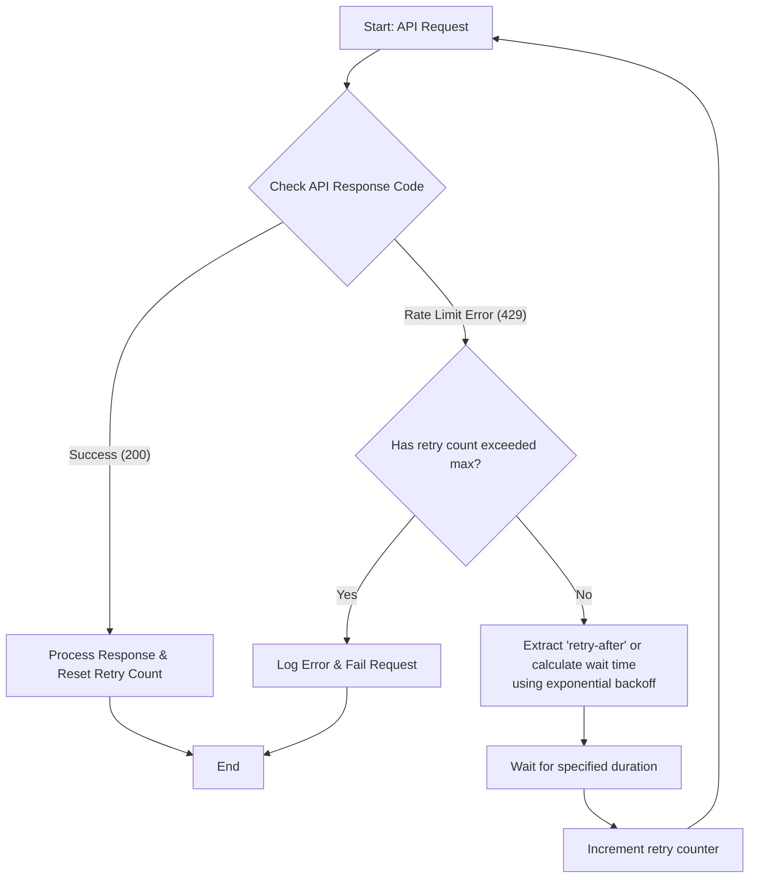

This section provides a comprehensive breakdown of the fundamental concepts needed to effectively and reliably use AI APIs.

---

## 1.1 API Basics

### 1.1.1 Provider Setup

The first step is getting access to the AI models. Each provider requires an account and a unique API key.

#### OpenAI API Setup
1.  **Create an account**: Navigate to `platform.openai.com` and sign up for a new account. Some platforms may require you to add billing information in `Settings → Billing` before you can generate a key.
2.  **Generate your API Key**: Go to the dashboard, select "API Keys" from the navigation menu, and click on **"Create new secret key"**.
3.  **Secure your key**: Give your key a descriptive name, create it, and **immediately copy and save it** in a secure location. For security reasons, it will not be shown again after you leave the page.

#### Anthropic API Setup
1.  **Create an account**: Sign up for an account on the Anthropic website. Navigate to the "API Keys" section within your account dashboard.
2.  **Generate your API Key**: Click on the **"Create Key"** button to generate a new secret API key.
3.  **Environment variable**: It is a best practice to store this key as an environment variable (e.g., `ANTHROPIC_API_KEY`) in your development environment.

#### Google Gemini API Setup
1.  **Access Google AI Studio**: Go to [aistudio.google.com](https://aistudio.google.com) and sign in with your Google account.
2.  **Get your API key**: In Google AI Studio, navigate to the "API Keys" page via the left sidebar. Click the **"Get API key"** or **"Create API key"** button.
3.  **Select a project**: You can choose an existing Google Cloud project or create a new one for your AI work.
4.  **Environment variable**: For security, set your API key as an environment variable named `GEMINI_API_KEY` or `GOOGLE_API_KEY`.

#### LiteLLM for Unified Access
LiteLLM is an open-source library that provides a single, unified interface for calling dozens of LLM providers.

- **How it works**: You use the familiar OpenAI API format to make all requests. LiteLLM then handles the translation and routing to the specific provider you want, such as Anthropic, Cohere, or Hugging Face.
- **Setup**: Install the LiteLLM Python library and set up a configuration file (e.g., `config.yaml`) to define your models and their respective API keys.
- **Simplified workflow**: This unified approach allows you to switch between different AI models, like `claude-sonnet-4-6` and GPT, with minimal code changes, making your application more flexible and resilient.

---

### 1.1.2 Rate Limits & Headers

Rate limits are restrictions API providers place on the number of requests you can make in a given time frame to ensure platform stability and fair usage.

- **Reading Headers**: Every API response includes HTTP headers that carry crucial rate limit information. By reading these, your application can be "rate-limit aware".
- **Key Headers**:
    - `x-ratelimit-limit-requests`: The total number of requests you are allowed in the period.
    - `x-ratelimit-remaining-requests`: The number of requests you still can make.
    - `x-ratelimit-remaining-tokens`: The number of tokens you can use in your remaining requests.
    - `retry-after` (or `x-ratelimit-reset`): This header (often in seconds) tells you exactly when your rate limit will reset, which is critical for implementing backoff logic.

#### Flowchart: Handling API Rate Limit (429) Errors



- **Handling 429 Errors (Rate Limiting)**: This is the most common API error when you exceed your limits. Your code must handle these gracefully:
    1.  **Inspect Headers**: When a 429 occurs, read the `x-ratelimit-remaining-*` and `retry-after` headers from the response.
    2.  **Exponential Backoff & Jitter**: The `retry-after` header is the most reliable source. If it's not present, implement exponential backoff: start with a small wait (e.g., 1 second) and double it after each subsequent failure. Adding random "jitter" (a few hundred milliseconds) prevents a "thundering herd" of retry requests.
    3.  **Retry Limit**: Always implement a maximum retry limit to prevent infinite loops in case of a persistent failure.

---

### 1.1.3 Token Counting

- **What is a token?** Tokens are the basic units of text that LLMs process. They are not exactly words (which can be large) or characters (which are too small). A good rule of thumb is that **1 token is roughly 0.75 words for English**.

- **How `tiktoken` Works (`tiktoken` is OpenAI's tokenizer, but the concept applies to most providers)**: It uses a technique called Byte-Pair Encoding (BPE) to convert text into tokens. The library has a core function, `encoding_for_model()` that loads the specific tokenizer for the model you are using (e.g., GPT-4, GPT-5). You then call `encode()` on your text, which returns an array, and the length of that array is the token count.

- **Counting Messages vs. Text**: Counting tokens for a conversation (the `messages` array) is more complex than just counting the text in each `content` field. The API internally adds tokens for formatting, role identifiers (`user`, `assistant`, `system`), and other metadata. While the final token count reported by the API is the exact number you'll be billed for, using `tiktoken` on the entire message structure will give you a near-perfect estimate before you even make a request, which is essential for budgeting and staying within context limits.

- **Budgeting Tokens per Request**: The total number of tokens per request is the sum of the **prompt tokens** (your input) + the **completion tokens** (the model's output). You can control this with the `max_tokens` or `max_completion_tokens` parameter, which limits the output length.
    - **Perform a safety check**: Before every API call, calculate the prompt's token count. Ensure you have enough room left in your total context window for the model's response.
    - **Plan for safety**: A common, safe safety margin is to set `max_tokens` to roughly 10-15% of the total context window, adjusted for your specific use case.

---

### 1.1.4 Cost Management

- **Per-Model Pricing Tables**: Every provider publishes pricing tables listing the cost per 1 million input (prompt) and output (completion) tokens for each model. For example, a model might cost `$2.50` per million input tokens and `$10.00` per million output tokens.

- **Calculating Cost Per Request**:
    - **Step 1**: Find the per-token price for your model from the provider's pricing table.
    - **Step 2**: Calculate (or get from the API response) the number of tokens used in your request: `total_prompt_tokens` + `total_completion_tokens`. The API's `usage` object provides these exact numbers.
    - **Step 3**: Calculate final cost using the metric you prefer:

| Calculation (per request) | Formula | Use Case |
| :--- | :--- | :--- |
| **Cost per million tokens** | `total_tokens * (price_per_million / 1_000_000)` | When you have clear per-million pricing benchmarks. |
| **Cost per thousand tokens** | `total_tokens * (price_per_million / 1_000)` | A simpler way to estimate costs without dealing with millions. |

- **Cost Per Session Tracking**: For any application with user interactions, tracking cost per session is vital.
    - **Implementation logic**: In your backend, create a unique identifier for each user session (e.g., a combination of `userId` and `sessionId`). Every time you receive a token usage report from the API for a request during that session, use a dictionary to log and accumulate the total tokens. This allows you to monitor spending for specific user interactions.

---

### 1.1.5 Streaming Responses (SSE)

Streaming avoids the delay of waiting for the entire response before displaying anything. It delivers the output token by token (or in small chunks) as it is generated.

#### Flowchart: Streaming Token-by-Token Delivery

```mermaid
sequenceDiagram
    participant Client (e.g., Browser)
    participant Server (Your Backend)
    participant LLM (e.g., OpenAI)

    Client->>Server: New HTTP Request (stream: true)
    Server->>LLM: API Call with stream=true
    Note over LLM: Model starts generating the response
    loop Throughout Generation
        LLM-->>Server: Stream Data Chunk (SSE formatted)
        Server-->>Client: Send chunk via WebSocket/SSE
        Client->>Client: Append chunk to UI
    end
    LLM-->>Server: Stream End Message
    Server-->>Client: End-of-Stream Signal
```

- **Server-Sent Events Architecture**: Streaming is implemented using Server-Sent Events (SSE) over HTTP. Your application sends a standard `POST` request to the API (e.g., `https://api.openai.com/v1/chat/completions`) but includes the `"stream": true` parameter.

- **Token-by-Token Delivery**: The API keeps the connection open and sends back the response as a stream of data. The response uses `Content-Type: text/event-stream`. Each data packet contains a chunk of the response (often a token or a few tokens). The browser or client library can parse this stream and add each new token to the user interface in real-time, creating a typewriter-like effect.

- **Connection Management**:
    - **Client (`fetch` API & `ReadableStream`)**: In modern JavaScript, you can use the `fetch` API with a `ReadableStream`. As each chunk arrives, you parse the SSE data, extract the text, and update the UI.
    - **Server (Keep-Alive)**: Your backend, if acting as a proxy, must ensure it does not prematurely close the connection. It should forward the streaming headers and chunks directly to the client.
    - **Abort Controller**: It is crucial to implement an **Abort Controller** on the client side. If a user navigates away from a page or cancels an operation, the controller can be used to close the open network connection, preventing unnecessary background processing.

---

### 1.1.6 System Prompts vs User Prompts

2026's best practices draw a very clear line between the role of the system prompt and the user prompt for building reliable and powerful agents.

- **System Prompt: The Persistent Foundation**
    - **Role**: The system prompt is the "developer's message" or "always-on" set of instructions for the model. It defines the AI's persistent persona, behavior, and guiding rules for the entire conversation. It's like giving an employee their core job description.
    - **Use Cases**:
        - **Define a persona**: `"You are an expert software developer specializing in Python."`
        - **Set invariants**: `"Always respond in a professional and respectful tone."`
        - **Provide a governance framework**: `"You are a medical AI assistant. Never make a diagnosis. Always recommend consultation with a real doctor."`
    - **Managing the connection**: In modern multi-turn conversations, the system prompt is typically set and sent with the very first API call to establish the conversation's context and then included in subsequent calls to maintain consistency.

- **User Prompt: The Dynamic Input**
    - **Role**: The user prompt contains the immediate, specific instruction, question, or data provided by the end-user for the current turn.
    - **Use Cases**:
        - **Ask a spontaneous question**: `"What's the weather in Tokyo?"`
        - **Give a task**: `"Summarize the following meeting transcript: [transcript text]."`
        - **Provide user data**: The user's raw input or uploaded file content.
    - **Dynamic System Prompts (Inject User Context)**: After the first turn, the model naturally sees the conversation history. However, you can also dynamically change the system prompt in the middle of a conversation to adapt to new information. For example, `previous_system_prompt + "The user has now revealed they are a student. Be encouraging and educational."`

- **System Prompt Caching (Dedicated Prompt Caching)**: Many providers now have a dedicated "prompt caching" feature. When you send a long system prompt repeatedly, the provider temporarily stores it (caches it) on their infrastructure. For subsequent requests within the cache's lifetime, you are charged significantly less (e.g., for the cached content only). This is a huge cost-saver for applications with large, persistent personas or instruction sets.

---

### 1.1.7 Conversation History Pattern

A standard conversation history is represented by a **messages array** that contains the structured log of every interaction in the conversation, in chronological order. Your backend (or client, but backend is preferred for security) must be responsible for storing and managing this array across turns.

- **Message Array Structure**:
    The array is a list of objects, each with a `role` and `content`. The core roles for a standard interaction are:
    - `system`: **(Optional)** The initial set of instructions for the AI. Often only present at the start.
    - `user`: The message or question from the end-user.
    - `assistant`: The AI's generated response from a previous turn.

- **Trimming Old Messages (Sliding Window)**: The simplest way to stay under the context limit window.
    - **Logic**: When your prompt token count is about to exceed a high threshold (e.g., 80-90% of the model's context window), you can implement a sliding window. This means you remove the oldest user/assistant pairs from your messages array before making a new API call, effectively keeping only the most recent `N` interactions.

- **Summarization when Over Token Limit**: A more sophisticated approach is to **summarize** the early part of the conversation instead of just truncating it. By asking a cheap, fast model to generate very concise summaries of the initial conversation turns, you retain vital context. You would then **replace the truncated conversation turns with a single system message** containing this summary.
    - **Example Flow**:
        1.  You detect your prompt's token count is too high.
        2.  Extract the first few user/assistant pairs from your conversation.
        3.  Call a fast, cheap model (like `gpt-3.5-turbo`) with the instruction: `"Summarize the key points and user's stated preferences from the following conversation excerpt."`
        4.  Take the generated summary and insert it as a new `system` message at the front of your messages array (e.g., `{"role": "system", "content": "Previous conversation context: " + summary}`).

- **Safety Buffer Allocation**: Always build in a safety margin when handling tokens.
    - **Keep tabs on the total and make decisions**: Keep real-time track of your total token count for the prompt and compare it against the model's maximum context window allowance (e.g., 128,000 for GPT-4o).
    - **Act before you hit the brink**: Set a threshold, like 90% of the total window. If this threshold is reached, immediately trigger your trimming or summarization logic. This helps you avoid unexpected API errors.

This suite of foundational skills—from acquiring and securing API keys to implementing sophisticated conversation and cost-saving measures—is the bedrock of building robust, scalable, and professional-grade AI applications.
