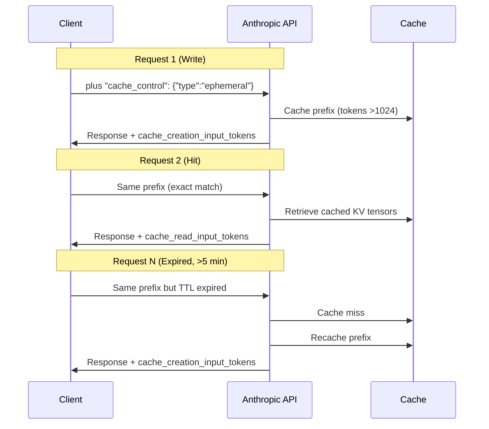
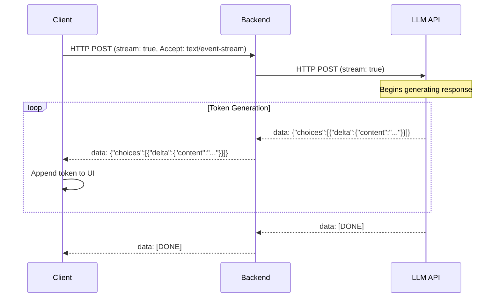

# 📘 Cost & Performance Optimization — Complete Guide

Building AI applications that don't drain your budget requires a strategic approach. This guide covers three essential optimization techniques: **prompt caching**, **model tiering**, and **streaming for perceived speed**.


## 1.3.1 Prompt Caching

Without caching, every API call that includes a large system prompt processes the same tokens repeatedly from scratch. Production AI systems routinely carry 10K–30K token system prompts (tool definitions, reference docs, few-shot examples). At standard rates, redundant prefix processing across hundreds of thousands of daily requests can easily run $500–$3,000+/day. Prompt caching eliminates this waste.

### How Prompt Caching Works

When you send a request with a large prompt, the API computes key‑value (KV) tensors for all input tokens and routes the request to a server that already has that prefix in cache. A subsequent request with an identical prefix reuses the cached tensors, skipping recomputation entirely.

**The technical insight**: In the transformer attention mechanism, each token generates a query (Q), a key (K), and a value (V). The KV cache stores the key and value tensors for the prefix across all layers and heads. When a new request arrives with the same prefix, the model reuses the cached tensors and only computes attention for the new tokens. This bypasses the expensive prefill computation—the forward pass through transformer layers that normally drives inference cost and latency.

**Benefits**:
- Reduces **Time to First Token (TTFT)** by up to 80%
- Reduces input token costs by up to 90%
- Works automatically for requests with 1024+ tokens

### Anthropic (Claude) Caching

Anthropic's prompt caching uses explicit `cache_control` markers you place in your prompt.

**Pricing (2026)**:

| Operation | Price per Million Tokens | Relative to Base |
|-----------|-------------------------|------------------|
| Standard input | $3.00 | 1× |
| Cache write (first use) | $3.75 | 1.25× |
| Cache read (hit) | $0.30 | 0.1× |

**TTL**: 5 minutes by default, automatically refreshed on each hit; optional 1‑hour TTL available for 2× the write price.

---

#### Diagram: Anthropic Cache Request Lifecycle



**Constraints**:
- **Minimum prefix**: 1024–4096 tokens depending on model
- **Maximum 4 `cache_control` markers per request**
- **Cache matching requires 100% identical byte‑for‑byte prefix**
- `system` must be passed as an **array of content blocks**, not a plain string

**Implementation (Anthropic SDK)**:

```javascript
const response = await client.messages.create({
  model: "claude-sonnet-4-5",
  max_tokens: 1024,
  system: [{
    type: "text",
    text: LONG_SYSTEM_PROMPT,
    cache_control: { type: "ephemeral" }
  }],
  tools: [{
    name: "search_docs",
    input_schema: {...},
    cache_control: { type: "ephemeral" }  // tool definitions also cacheable
  }],
  messages: [{
    role: "user",
    content: [
      {
        type: "text",
        text: retrieved_context,
        cache_control: { type: "ephemeral" }  // session-scoped RAG chunks
      },
      {
        type: "text",
        text: `User question: ${user_input}`  // no cache marker — changes every request
      }
    ]
  }]
});

// Check cache metrics
console.log(response.usage.cache_creation_input_tokens);
console.log(response.usage.cache_read_input_tokens);
```

---

### OpenAI Caching

OpenAI takes a different approach: **automatic caching with no configuration required**.

**Key features**:
- Works automatically on all API requests, no opt‑in needed
- Cache hits require an **exact, repeated prefix match** for prompts containing 1024+ tokens, with hits occurring in 128‑token increments
- **In‑memory** caching works automatically; extended caching extends TTL to 24 hours
- Discount can reach up to **90%**
- Take advantage of the optional `prompt_cache_key` parameter for traffic sharing common prefixes to improve routing
- Everything in the prefix is cacheable: messages, images, audio, tool definitions, and structured output schemas

**Implementation (Automatic)**:
```javascript
const response = await openai.chat.completions.create({
  model: "gpt-4o-mini",
  messages: messages,  // caching works automatically if prefix >= 1024 tokens
  tools: tools
});
// No cache_control markers needed — OpenAI handles it
```

---

### Cache Hit Measurement and Optimization

To track cache effectiveness, inspect the `usage` object in API responses:

| Field | What It Indicates |
|-------|-------------------|
| `cache_creation_input_tokens` | Tokens written to cache (first request) |
| `cache_read_input_tokens` | Tokens read from cache (subsequent requests) |
| `input_tokens` | Uncached tokens processed normally |

Anthropic's usage fields reveal precisely how many tokens are written vs. read from cache.

#### Optimization Rules for High Cache Hit Rates

| Strategy | Implementation | Impact |
|----------|---------------|--------|
| **Group stable prefixes** | Put system prompt, tool schemas, and few‑shot examples at the beginning of requests | Maximizes cacheable length |
| **Use `prompt_cache_key`** | Assign same key to requests sharing common prefixes | Improves routing to cached servers |
| **Keep cached prefixes identical** | Avoid any whitespace or order changes | Prevents cache misses |
| **Keep TTL in mind** | Claude: 5 minutes; OpenAI: 5–10 minutes | Design session length accordingly |
| **Structure prompts for prefix reuse** | Place dynamic content (user inputs) at the end of messages | Keeps cacheable prefix stable |

#### Real‑World Impact: 78% Cost Reduction

One team with a RAG‑backed customer support assistant processing ~12K tokens of context per query reduced their monthly Claude bill from $4,200 to $920—a **78% reduction**—by implementing prompt caching.

#### Priority ROI Guide: What to Cache

| Priority | Cache These | Avoid Caching These |
|----------|-------------|---------------------|
| 🔴 **High ROI** | System prompts, tool schemas, RAG context reused within session, few‑shot examples | — |
| 🟡 **Medium ROI** | Early user conversation history, document chunks appearing frequently | — |
| 🔵 **Low/Anti‑ROI** | — | Per‑request user input, anything that changes every call, caches smaller than minimum token requirement |


## 1.3.2 Model Tiering

Model tiering means using different AI models for different types of tasks based on complexity, cost, and performance requirements.

### Why Model Tiering Matters

By early 2026, enterprise AI budgets more than doubled compared with two years prior, with LLM budgets often averaging **$10 million per year** for larger organizations. The cost of inference now outstrips training, because every interaction with an LLM burns GPU cycles. To manage costs, teams increasingly adopt **tiering**—routing simple queries to cheaper models and reserving premium models for complex tasks.

### Market Tiering — Model Classification

#### 🟢 **Cheap / Fast Tier** (Volume tasks, high throughput)
| Model | Input Price ($/M) | Output Price ($/M) | Context | Best For |
|-------|------------------|-------------------|---------|----------|
| DeepSeek V3.2 | $0.14 | $0.28 | 128K | High‑volume simple tasks |
| GPT‑4o‑mini | $0.15 | $0.60 | 128K | General purpose, cheap |
| Claude Haiku 4.5 | $0.25 | $1.25 | 200K | Fast responses, classification |
| Gemini 2.5 Flash | $0.30 | $2.50 | 1M | Long context, multimodal |

> **Key insight**: Output tokens cost 3–5× more than input tokens. This matters for chatbots and agents generating long responses.

#### 🟡 **Standard Tier** (Most tasks)
| Model | Input Price ($/M) | Output Price ($/M) | Context | Best For |
|-------|------------------|-------------------|---------|----------|
| GPT‑5.4 | $2.50 | $7.50 | 128K | Balanced performance/cost |
| Claude Sonnet 4.5 | $3.00 | $15.00 | 200K | Writing, code, analysis |

#### 🔴 **Complex Tier** (Difficult reasoning)
| Model | Input Price ($/M) | Output Price ($/M) | Context | Best For |
|-------|------------------|-------------------|---------|----------|
| Gemini 2.5 Pro | $1.25 | $10.00 | 2M | Complex reasoning, long docs |
| GPT‑5 | $10.00 | $30.00 | 128K | Maximum capability tasks |

#### 🧠 **Reasoning Tier** (Deep reasoning, planning)
Claude Opus 4.6 ($5.00/$25.00) excels at complex reasoning and agents. OpenAI's o1 series and DeepSeek‑R1 are optimized for step‑by‑step reasoning.

### Routing Logic by Query Complexity

A complexity‑based router routes simple queries to cheap models, medium‑complexity queries to standard models, and complex reasoning tasks to premium models.

#### Implementation: Basic Complexity Router

```javascript
async function routeQuery(userQuery) {
  // STEP 1: Quick complexity check (use a tiny model or heuristic)
  const complexity = await assessComplexity(userQuery);
  
  // STEP 2: Route to appropriate model tier
  if (complexity === 'simple') {
    return callModel('gpt-4o-mini', userQuery);
  } else if (complexity === 'medium') {
    return callModel('claude-sonnet-4-5', userQuery);
  } else {
    return callModel('gpt-5', userQuery);
  }
}

// Heuristic complexity assessment
function assessComplexity(query) {
  if (query.length < 30 && !query.includes('?')) return 'simple';
  if (query.match(/\b(calculate|compare|analyze|why|how)\b/i)) return 'medium';
  if (query.match(/\b(trace|design|debug|cause|effect)\b/i)) return 'complex';
  return 'medium';
}
```

#### Smart Model Tiering: Cheap Chunks + Premium Merge

One advanced pattern uses cheap models for parallel processing and expensive models only for final merge:

```javascript
async function processWithTiering(documents, question) {
  // Cheap model processes each chunk in parallel
  const cheapInsights = await Promise.all(
    documents.map(async chunk => ({
      chunk,
      insight: await callModel('gpt-4o-mini', `Summarize key point: ${chunk}`)
    }))
  );
  
  // Premium model merges the insights
  const finalAnswer = await callModel('claude-sonnet-4-5',
    `Based on these insights: ${JSON.stringify(cheapInsights)}\nQuestion: ${question}`
  );
  
  return finalAnswer;
}
```

**Cost impact**: For a support chatbot (500 conversations/day), monthly costs range from $2.10 (DeepSeek) to $90 (Claude Sonnet). By routing simple queries to cheap models, you can achieve near‑premium quality at a fraction of the cost.


## 1.3.3 Streaming for Perceived Speed

Streaming delivers tokens to the client as they're generated rather than waiting for the entire response, dramatically improving perceived performance.

### How Streaming Works

LLMs are autoregressive: they generate one token at a time, with each new token depending on everything before it. Since generation is already sequential, the server can emit each token immediately rather than buffering the whole sequence.

When you set `stream: true` in an API call, the server uses **Server‑Sent Events (SSE)** over the same HTTP connection to push tokens as soon as they're available.

---

#### Diagram: Streaming Flow (Corrected)



### The Metrics That Matter

| Metric | What It Measures | User Experience |
|--------|-----------------|-----------------|
| **TTFT** (Time to First Token) | Time between submitting request and seeing first output | "The wait" before anything appears |
| **TPOT** (Time Per Output Token) | Average time between subsequent tokens | How fast the rest of the response flows |

Without streaming, users stare at a blank screen for several seconds while the full response generates. With streaming, the first tokens appear within a second or two, making the app feel responsive even when the underlying generation time hasn't changed.

### Perceived vs. Actual Latency

The "progress bar effect" explains why streaming feels so much faster: a well‑designed streaming interface makes users **underestimate** elapsed time. People start reading before the response is finished, engaging their attention while the model continues generating.

**Implementation (Express.js)**:

```javascript
import { OpenAI } from "openai";
import { Router } from "express";

const openai = new OpenAI();
const router = Router();

router.post("/chat", async (req, res) => {
  const { messages } = req.body;
  
  // Set SSE headers
  res.setHeader("Content-Type", "text/event-stream");
  res.setHeader("Cache-Control", "no-cache");
  res.setHeader("Connection", "keep-alive");
  
  const stream = await openai.chat.completions.create({
    model: "gpt-4o-mini",
    messages,
    stream: true,  // ✅ Enable streaming
  });
  
  for await (const chunk of stream) {
    const content = chunk.choices[0]?.delta?.content;
    if (content) {
      res.write(`data: ${JSON.stringify({ content })}\n\n`);
    }
  }
  
  res.write("data: [DONE]\n\n");
  res.end();
});
```

### Progressive Rendering Techniques

| Technique | Implementation | UX Benefit |
|-----------|----------------|------------|
| **Typing indicators** | Show "..." while TTFT in progress | Reassures users the app is working |
| **Markdown streaming** | Render markdown incrementally | Users see structure as it builds |
| **Smooth scrolling** | Auto‑scroll as new content arrives | Keeps latest content visible |
| **Connection timeout** | Set 30‑second timeout with AbortController | Prevents hanging connections |

### Connection Management

- **Client side**: Use `fetch` API with a `ReadableStream` reader. Set up an AbortController to close the connection if the user navigates away.
- **Server side**: Set a timeout on the SSE connection—LLM providers occasionally have outages; without a timeout, your connection could hang indefinitely.
- **Proxy**: If your backend forwards the stream, ensure it does not buffer; pipe the response directly to the client with appropriate headers.

**Why not WebSocket?** Standard LLM streaming uses SSE over the same HTTP connection that initiated the request—no upgrade to WebSocket is needed or performed.


## Summary Table

| Technique | Primary Benefit | Key Metric | Implementation Complexity |
|-----------|----------------|------------|--------------------------|
| **Prompt caching** | Reduce cost (up to 90%) | Cache hit rate, input token reduction | Low (OpenAI automatic; Anthropic markers) |
| **Model tiering** | Balance cost per query | Cost per resolved query, accuracy per tier | Medium (complexity detection + routing) |
| **Streaming** | Improve perceived speed | TTFT (Time to First Token) | Low (single parameter + SSE headers) |

---

## 📝 Hands‑On Exercise

1. **Implement prompt caching**: Take an application using Claude with a 2000‑token system prompt. Add `cache_control` markers and monitor the `cache_read_input_tokens` vs `cache_creation_input_tokens` across multiple calls. Calculate your effective cost reduction.

2. **Build a simple model router**: Write a function that routes queries based on keyword heuristics: simple classification → `gpt-4o-mini`, code generation → `claude-sonnet-4-5`, complex reasoning → `gpt-5`. Test with 10 different queries and compare output quality vs cost.

3. **Measure streaming impact**: Implement both streaming and non‑streaming versions of a chat endpoint. Use browser DevTools to measure:
   - Full response time (non‑streaming)
   - TTFT and TPOT (streaming)
   - Ask 5 users which feels faster

---

## 🔗 Next Steps

- Combine **caching + tiering**: Cache the complexity router's decisions to avoid repeated classification overhead
- Implement **semantic caching** (Redis) for exact query matches across users
- Build an **automatic model router** using a small classifier LLM to predict query complexity
- Explore **agent cascades** – cheap model attempts first, escalates to premium if confidence is low
