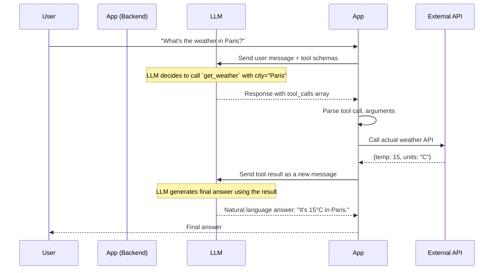

# 📘 Tool Calling / Function Calling — Complete Union Guide

**Function calling** (or tool calling) is the ability of large language models to invoke external tools or functions based on a user’s request. It is the mechanism that turns an LLM from a text generator into an **action‑taking agent** that can fetch live data, run computations, and interact with the world.

This guide merges two detailed sets of notes—covering fundamentals, implementation, schema design, multi‑tool execution, error handling, and integration with LangChain. Every concept, diagram, code snippet, table, and best practice has been preserved.

---

## 1. What Is Function Calling & Why Is It Important?

Function calling allows an LLM to:

- Understand that certain actions can be performed via external functions.
- Generate a structured request (usually JSON) containing the function name and arguments.
- Hand that request back to your application, which executes the actual function and returns the result to the LLM.

**The LLM does not execute code** – it only describes which function to call and with what parameters. Your application is responsible for running the function and feeding the result back.

### Simple Example

User asks: *“What’s the weather in Paris?”*

Without function calling, the LLM might say: *“I don’t have real‑time weather data.”*

With function calling:

1. You define a function `get_weather(city: string)`.
2. The LLM recognises the need and outputs:
   ```json
   { "function": "get_weather", "arguments": { "city": "Paris" } }
   ```
3. Your app calls a weather API, gets the result, and sends it back to the LLM.
4. The LLM then produces a natural‑language answer: *“The weather in Paris is 15°C and sunny.”*

### Importance

- **Real‑time data** – Access live information (weather, stocks, news).
- **External actions** – Send emails, book appointments, control devices.
- **Computation** – Perform calculations, run code, query databases.
- **Grounding** – Reduce hallucinations by fetching verified facts.
- **Agentic workflows** – Build multi‑step agents that plan and execute actions.

---

## 2. How It Works: The Tool Calling Cycle

The tool calling cycle is a multi‑step loop between the LLM and your application. The following sequence diagram illustrates the exact flow.



### Step‑by‑Step Explanation

1. **User query** – The user asks a question that may require external data.
2. **App sends message + tool schemas** – The application includes a list of available tools (functions) with their names, descriptions, and parameter schemas.
3. **LLM decides to call a tool** – If the query matches a tool’s description, the LLM outputs a `tool_calls` array instead of a normal text response.
4. **App extracts and executes** – The application parses the function name and arguments, executes the actual function (e.g., calling an API, querying a database).
5. **App returns result to LLM** – The result is appended as a `tool` message with a `tool_call_id` linking it to the original call.
6. **LLM generates final answer** – The LLM uses the tool result to produce a natural language response.
7. **App delivers answer** – The final answer is returned to the user.

---

## 3. Defining Tools / Function Schemas

You need to provide the LLM with a **tool schema** that describes each function. OpenAI’s format (widely used) is:

```json
{
  "type": "function",
  "function": {
    "name": "get_weather",
    "description": "Get the current weather in a given city",
    "parameters": {
      "type": "object",
      "properties": {
        "city": { "type": "string", "description": "The city name, e.g., Paris" },
        "unit": { "type": "string", "enum": ["celsius", "fahrenheit"], "description": "Temperature unit" }
      },
      "required": ["city"]
    }
  }
}
```

- **`name`** – The identifier your code will use to call the function.
- **`description`** – Tells the LLM when to use this function. **Descriptions are prompts** – write them as clearly as you would any other prompt.
- **`parameters`** – A JSON Schema object describing the expected arguments.

### Description Writing Best Practices

| Bad Description | Good Description |
|----------------|------------------|
| “Gets weather” | “Get current weather in a city. Use this when the user asks about temperature, conditions, or forecasts. Accepts 'celsius' or 'fahrenheit'.” |
| “Searches database” | “Search product database by keyword. Use when user asks about specific items, prices, or availability. Returns up to 5 results.” |

Be explicit about **when** to use the tool, mention units, formats, and edge cases. Keep descriptions concise but informative (1–3 sentences).

### Parameter Types

Use JSON Schema to define parameters. Common types:

| Type | Description | Example |
|------|-------------|---------|
| `string` | Text values | `"Paris"` |
| `number` | Integers or floats | `42` or `3.14` |
| `boolean` | True/false | `true` |
| `array` | List of items | `["apple", "banana"]` |
| `object` | Nested structure | `{"lat": 48.86, "lon": 2.35}` |

**Advanced constraints**:
- `enum` – Restrict to a set of allowed values.
- `format` – For strings, use `date-time`, `email`, `uuid`, etc.
- `minimum` / `maximum` – Numeric bounds.
- `minItems` / `maxItems` – Array length.

### Required vs Optional Fields

Mark mandatory parameters as `required`. Optional parameters should have defaults or be left out.

```json
{
  "type": "object",
  "properties": {
    "city": { "type": "string" },
    "unit": { "type": "string", "enum": ["celsius", "fahrenheit"], "default": "celsius" },
    "days": { "type": "integer", "minimum": 1, "maximum": 7 }
  },
  "required": ["city"]
}
```

In this example, `city` is required; `unit` and `days` are optional.

### Full Tool Schema Example (Flight Search)

```json
{
  "type": "function",
  "function": {
    "name": "search_flights",
    "description": "Search for available flights. Use when user asks about flight options, prices, or schedules.",
    "parameters": {
      "type": "object",
      "properties": {
        "origin": { "type": "string", "description": "Departure airport code (IATA)" },
        "destination": { "type": "string", "description": "Arrival airport code (IATA)" },
        "date": { "type": "string", "format": "date", "description": "Travel date YYYY-MM-DD" },
        "passengers": { "type": "integer", "minimum": 1, "maximum": 9, "default": 1 },
        "cabin": { "type": "string", "enum": ["economy", "business", "first"], "default": "economy" }
      },
      "required": ["origin", "destination", "date"]
    }
  }
}
```

---

## 4. Implementing Function Calling with OpenAI

### 4.1 Basic Single‑Tool Flow

```typescript
import OpenAI from 'openai';

const openai = new OpenAI({ apiKey: process.env.OPENAI_API_KEY });

const tools = [{
  type: "function",
  function: {
    name: "get_weather",
    description: "Get current weather in a city",
    parameters: {
      type: "object",
      properties: {
        city: { type: "string", description: "City name" },
        unit: { type: "string", enum: ["celsius", "fahrenheit"] }
      },
      required: ["city"]
    }
  }
}];

async function runConversation(userMessage: string) {
  const messages: any[] = [{ role: "user", content: userMessage }];

  // Step 1 – Call LLM with tools
  let response = await openai.chat.completions.create({
    model: "gpt-4o-mini",
    messages,
    tools,
    tool_choice: "auto"  // model decides
  });

  let responseMsg = response.choices[0].message;
  messages.push(responseMsg);

  // Step 2 – Loop while there are tool calls
  while (responseMsg.tool_calls?.length) {
    for (const toolCall of responseMsg.tool_calls) {
      const funcName = toolCall.function.name;
      const args = JSON.parse(toolCall.function.arguments);

      let result;
      if (funcName === "get_weather") {
        result = await getWeather(args.city, args.unit);
      }

      messages.push({
        role: "tool",
        tool_call_id: toolCall.id,
        content: result  // string result of the function
      });
    }

    // Call LLM again with the tool results
    response = await openai.chat.completions.create({
      model: "gpt-4o-mini",
      messages
    });
    responseMsg = response.choices[0].message;
    messages.push(responseMsg);
  }

  return responseMsg.content;
}

// Tool implementation
async function getWeather(city: string, unit = 'celsius') {
  // In real life, call a weather API
  const mockData: any = {
    Paris: { celsius: 15, fahrenheit: 59 },
    London: { celsius: 12, fahrenheit: 54 },
  };
  const temp = mockData[city]?.[unit] || 'unknown';
  return `The weather in ${city} is ${temp}°${unit === 'celsius' ? 'C' : 'F'}.`;
}
```

### 4.2 Multi‑Tool Calls and Execution Strategies

The LLM can request multiple tool calls in a single response. You can execute them in **parallel** (most common) or **sequentially** (when one depends on another).

#### Parallel Execution

Execute all tool calls concurrently and return all results at once.

```typescript
if (responseMsg.tool_calls) {
  const results = await Promise.all(
    responseMsg.tool_calls.map(async (toolCall) => {
      const result = await executeTool(toolCall);
      return { tool_call_id: toolCall.id, result };
    })
  );

  for (const { tool_call_id, result } of results) {
    messages.push({
      role: "tool",
      tool_call_id,
      content: result
    });
  }
}
```

#### Sequential Execution (for Dependencies)

If a later tool call depends on the result of an earlier one, process them one by one, sending intermediate results back to the LLM after each tool.

```typescript
for (const toolCall of responseMsg.tool_calls) {
  const result = await executeTool(toolCall);
  messages.push({
    role: "tool",
    tool_call_id: toolCall.id,
    content: JSON.stringify(result)
  });
  // Optionally call the LLM again to decide next steps
}
```

#### Result Aggregation

After all tool results are obtained, the LLM receives them and produces a final answer. Example: *“What’s the weather in Paris and the cheapest flight from London?”* might trigger `get_weather({ city: "Paris" })` and `search_flights({ origin: "LHR", destination: "CDG" })` in parallel. The final answer will synthesise both results.

---

## 5. Error Handling and Resilience

Tool calls can fail for many reasons: network errors, invalid arguments, API limits, or exceptions in the function itself. A robust system plans for such failures.

### Tool Failure Recovery

Always wrap tool execution in a try/catch. Return a meaningful error message **to the LLM** so it can decide how to inform the user.

```typescript
async function safeExecuteTool(toolCall: any) {
  try {
    const result = await actualToolFunction(toolCall);
    return { success: true, data: result };
  } catch (error: any) {
    console.error(`Tool ${toolCall.function.name} failed:`, error);
    return {
      success: false,
      error: `Tool execution failed: ${error.message}. Please ask the user to rephrase or try again later.`
    };
  }
}
```

### Graceful Degradation

If a critical tool fails, your application can fall back to:

- **Cached data** – Serve stale but acceptable data if available.
- **Alternative tool** – Use a different tool that provides similar information.
- **Static response** – *“I’m sorry, the weather service is unavailable. Please try again later.”*

### User Notification

When a tool fails, the LLM should inform the user in a friendly manner. Always pass the error information back to the LLM; do **not** catch errors silently.

### Retry Strategies

For transient failures (rate limits, timeouts), implement retries with exponential backoff.

```typescript
async function callToolWithRetry(toolCall: any, maxRetries = 3) {
  for (let attempt = 1; attempt <= maxRetries; attempt++) {
    try {
      return await executeTool(toolCall);
    } catch (error) {
      if (attempt === maxRetries) throw error;
      const delay = Math.pow(2, attempt) * 1000; // 2s, 4s, 8s
      await new Promise(res => setTimeout(res, delay));
    }
  }
}
```

---

## 6. Integration with LangChain.js

LangChain simplifies tool calling with its `Tool` interface and agent frameworks.

### Defining a Tool with Zod Schema

```javascript
import { DynamicStructuredTool } from '@langchain/core/tools';
import { z } from 'zod';

const weatherTool = new DynamicStructuredTool({
  name: 'get_weather',
  description: 'Get current weather for a city',
  schema: z.object({
    city: z.string().describe('City name'),
    unit: z.enum(['celsius', 'fahrenheit']).optional().default('celsius')
  }),
  func: async ({ city, unit }) => {
    // your implementation
    return `Weather in ${city} is ...`;
  }
});
```

### Using with a ReAct Agent

```javascript
import { ChatOpenAI } from '@langchain/openai';
import { createReactAgent } from '@langchain/langgraph/prebuilt';

const llm = new ChatOpenAI({ model: 'gpt-4o-mini' });
const agent = await createReactAgent({ llm, tools: [weatherTool] });

const result = await agent.invoke({
  messages: [{ role: 'user', content: "What's the weather in Paris?" }]
});
console.log(result.messages[result.messages.length - 1].content);
```

LangChain handles the entire loop: model calls tool, executes it, feeds back, and returns final answer.

---

## 7. Best Practices

- **Write clear descriptions** – Treat them as prompts. Describe **when** the tool should be used, mention units, formats, and edge cases.
- **Use enums and constraints** – Limit parameter values with `enum`, `minimum`, `maximum`, and `format`.
- **Validate arguments server‑side** – Even with a schema, use Zod or manual checks before execution (defensive programming).
- **Keep tool outputs concise** – Return only what the LLM needs; long outputs waste tokens and may confuse the model.
- **Choose `tool_choice` carefully**:
  - `"auto"` – model decides (default).
  - `"none"` – force no tool calls.
  - `{ type: "function", function: { name: "..." } }` – force a specific tool.
- **Parallel execution** – When multiple independent tools are called, run them concurrently to reduce latency.
- **Handle errors gracefully** – Return error strings to the LLM so it can explain the situation to the user.
- **Minimise token usage** – Keep schemas and results concise.
- **Security** – Never expose dangerous functions (e.g., delete database). Sanitise all inputs.

---

## 8. Complete Example: Multi‑Tool Assistant

Let’s build an assistant with two tools: `get_weather` and `calculator`.

```javascript
import OpenAI from 'openai';

const openai = new OpenAI();

const tools = [
  {
    type: "function",
    function: {
      name: "get_weather",
      description: "Get current weather in a city. Use when user asks about temperature, conditions, or forecasts.",
      parameters: {
        type: "object",
        properties: { city: { type: "string" } },
        required: ["city"]
      }
    }
  },
  {
    type: "function",
    function: {
      name: "calculator",
      description: "Perform basic arithmetic. Use for math calculations.",
      parameters: {
        type: "object",
        properties: {
          a: { type: "number" },
          b: { type: "number" },
          op: { type: "string", enum: ["+", "-", "*", "/"] }
        },
        required: ["a", "b", "op"]
      }
    }
  }
];

async function run(query) {
  const messages = [{ role: "user", content: query }];

  let response = await openai.chat.completions.create({
    model: "gpt-4o-mini",
    messages,
    tools
  });

  let message = response.choices[0].message;
  messages.push(message);

  while (message.tool_calls?.length) {
    for (const toolCall of message.tool_calls) {
      const { name, arguments: args } = toolCall.function;
      const parsed = JSON.parse(args);
      let result;

      if (name === "get_weather") {
        result = await getWeather(parsed.city);
      } else if (name === "calculator") {
        result = await calculator(parsed.a, parsed.b, parsed.op);
      }

      messages.push({
        role: "tool",
        tool_call_id: toolCall.id,
        content: result
      });
    }

    response = await openai.chat.completions.create({
      model: "gpt-4o-mini",
      messages
    });
    message = response.choices[0].message;
    messages.push(message);
  }

  return message.content;
}

// Implementations
async function getWeather(city) { /* ... mock or real API */ }
async function calculator(a, b, op) {
  switch(op) {
    case '+': return (a + b).toString();
    case '-': return (a - b).toString();
    case '*': return (a * b).toString();
    case '/': return (a / b).toString();
    default: return "Invalid operator";
  }
}
```

---

## 9. Function Calling with Other Providers

- **Anthropic Claude** – Supports tool use via the `tools` parameter (beta).
- **Google Gemini** – Function calling via `tools` and `tool_config`.
- **Mistral / Cohere** – Also offer tool‑calling capabilities.

The concepts are identical; only the API shape differs slightly.

---

## 10. Limitations and Considerations

- **Token usage** – Tool definitions and results consume tokens; keep schemas concise.
- **Latency** – Multiple round trips increase response time; use parallel execution where possible.
- **Model may misuse tools** – Clear descriptions and examples in the prompt help.
- **Security** – Never expose dangerous functions; validate all inputs.
- **Parallel function calls** – Ensure your implementation can handle multiple `tool_calls` in a single response.

---

## 11. Summary Table

| Concept | Key Points |
|---------|------------|
| **Tool calling cycle** | LLM → tool schema → execute → result → LLM final answer |
| **Schema design** | Descriptions are prompts; be clear about when to use the tool. Mark required vs optional fields. |
| **Parameter types** | JSON Schema: `string`, `number`, `boolean`, `array`, `object`, plus `enum`, `format`, bounds. |
| **Multi‑tool calls** | Parallel execution for independent calls; sequential for dependencies. |
| **Error handling** | Return errors to LLM for user‑friendly explanation; implement retries with backoff; graceful degradation. |
| **LangChain integration** | `DynamicStructuredTool` with Zod schemas; agents handle the call‑execute‑loop automatically. |
| **Best practices** | Concise outputs, `tool_choice` control, server‑side validation, security. |

---

## 12. Hands‑On Exercises

1. **Create a time tool** – Write a tool that fetches the current time for a given timezone (use a real API like WorldTime).
2. **Build an assistant** – Combine `get_weather` and `timezone_time` tools. Ask: *“What’s the weather in Tokyo and the current time there?”*
3. **Multi‑step question** – Add a `calculator` tool and ask: *“What’s the weather in New York and then add 5 to the temperature in Celsius?”* Observe how the LLM chains the calls.
4. **Experiment with `tool_choice`** – Force the use of the weather tool even for a query that doesn’t obviously need it; then test with `auto`.
5. **Add error handling** – Simulate a tool failure (e.g., throw an exception) and verify that the LLM receives the error message and explains it to the user.
6. **LangChain version** – Rebuild the multi‑tool assistant using LangChain’s `DynamicStructuredTool` and a ReAct agent.

---

## 13. Next Steps

- **Build agentic workflows** – Combine multiple tools, planning, and memory.
- **Integrate with LangGraph** for stateful, multi‑step agents.
- **Add Zod validation** on tool inputs for extra safety (see the Structured Outputs guide).
- **Explore Advanced RAG** with tool calling (e.g., an agent that searches documents and performs calculations).
- **Deploy** your assistant as an API with proper authentication and monitoring.

**Function calling transforms LLMs from static knowledge bases into dynamic, action‑taking systems. Master it, and you’re ready to build the next generation of AI applications.**
