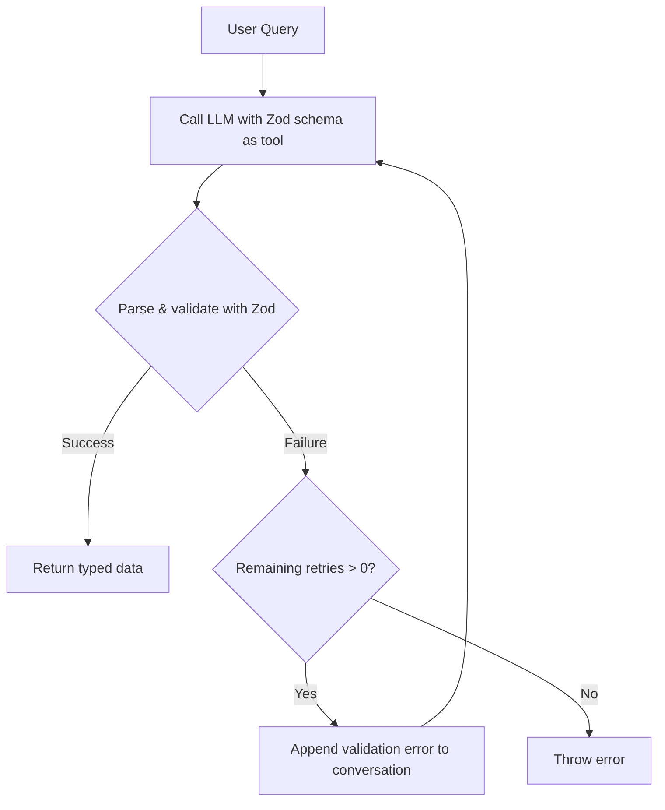

# 📘 Structured Outputs with Zod Validation — Complete Guide

Structured outputs turn free‑text LLM responses into **type‑safe, predictable data** that your application can consume reliably. This guide merges two detailed sets of notes, covering every concept: why Zod, how to force structure with JSON mode / function calling / native structured outputs, schema validation with Zod and Instructor.js, and robust retry strategies. No concept is missing.

---

## 1. What Are Structured Outputs?

When you ask an LLM a question, the default answer is natural language. For many use cases—extracting information, configuring systems, populating forms—you need **structured data**: JSON objects with known keys, types, and constraints.

**Examples**:
- `{ "name": "John", "age": 30, "city": "New York" }`
- `{ "ingredients": ["flour", "eggs"], "steps": ["mix", "bake"] }`

Structured outputs provide:

- **Predictability** – You know exactly what fields and types to expect.
- **Type safety** – Use the data directly in your code without extra parsing.
- **Reduced hallucinations** – The output format constraint guides the model’s reasoning.
- **Easy integration** – Feed validated data into databases, UIs, or other APIs.

---

## 2. Why Zod?

[Zod](https://zod.dev/) is a TypeScript‑first schema library that validates data at runtime and automatically infers TypeScript types.

**Core benefits**:
- **Runtime validation** – TypeScript only checks at compile time; Zod catches malformed LLM responses before they crash your app.
- **Type inference** – `z.infer<typeof schema>` gives you the exact TypeScript type.
- **Composable** – Build complex schemas from simple primitives.
- **Clear error messages** – Zod tells you exactly which field failed and why.

---

## 3. Methods for Generating Structured Outputs from LLMs

There are three main approaches, each with different guarantees.

### 3.1 JSON Mode

OpenAI’s Chat Completions API supports `response_format: { type: "json_object" }`, forcing the model to output valid JSON.

```javascript
const response = await openai.chat.completions.create({
  model: "gpt-4o-mini",
  messages: [
    { role: "system", content: "You are a helpful assistant. Always respond in JSON." },
    { role: "user", content: 'Extract name, age, and city from: "John is 30 and lives in Paris."' }
  ],
  response_format: { type: "json_object" }
});

const raw = response.choices[0].message.content; // e.g. '{"name":"John","age":30,"city":"Paris"}'
```

**Limitations**:
- The output is valid JSON, but **not guaranteed to match your schema**.
- The model might return `{"person": "John", "info": "30"}` instead of `{"name": "John", "age": 30}`.
- You still need client‑side validation (Zod) to check the shape.

### 3.2 Function Calling (Tools)

Function calling (also called “Tools”) is the most portable method. You define a schema as a tool, and the model returns a structured `tool_calls` object with arguments that match that schema.

```javascript
const tools = [
  {
    type: "function",
    function: {
      name: "extract_person",
      description: "Extract person details",
      parameters: {
        type: "object",
        properties: {
          name: { type: "string" },
          age: { type: "number" },
          city: { type: "string" }
        },
        required: ["name", "age", "city"]
      }
    }
  }
];

const response = await openai.chat.completions.create({
  model: "gpt-4o-mini",
  messages: [{ role: "user", content: "John is 30 and lives in Paris." }],
  tools,
  tool_choice: { type: "function", function: { name: "extract_person" } }
});

const toolCall = response.choices[0].message.tool_calls[0];
const args = JSON.parse(toolCall.function.arguments); // { name: 'John', age: 30, city: 'Paris' }
```

**Why it’s more reliable**:
- The provider verifies the output against the tool’s schema.
- The output is returned as a structured `tool_calls` array, not raw text.
- Works consistently across major providers (OpenAI, Anthropic, Google Gemini, Mistral, Cohere).

**Fine‑grained control**: Set `tool_choice` to `"auto"` (model decides), `"none"` (no tool), or `"required"` (force tool call) for multi‑step workflows.

### 3.3 Native Structured Outputs (`json_schema`)

On supported models, native structured outputs **guarantee 100% schema adherence** by validating the response on the provider side.

```typescript
import OpenAI from 'openai';
import { z } from 'zod';
import { zodToJsonSchema } from 'zod-to-json-schema';

const PersonSchema = z.object({
  name: z.string(),
  age: z.number(),
  city: z.string()
});

const response = await openai.chat.completions.create({
  model: "gpt-4o-mini",
  messages: [{ role: "user", content: "Extract person info from: 'John is 30 and lives in Paris.'" }],
  response_format: {
    type: "json_schema",
    json_schema: {
      name: "person_extraction",
      schema: zodToJsonSchema(PersonSchema),
      strict: true   // all fields become required
    }
  }
});
```

**Restrictions**: All fields must be required (strict mode), no `anyOf` at the root, and parallel function calls with structured outputs are not supported.

### 3.4 Comparison Table & Provider Recommendations

| Feature | JSON Mode | Function Calling (Tools) | Native Structured Outputs |
|---------|-----------|--------------------------|---------------------------|
| **Output guarantee** | Valid JSON (no schema enforcement) | Arguments conform to tool schema | 100% schema adherence |
| **Provider support** | Most providers | Most providers | Limited (OpenAI newer models) |
| **Schema validation** | Client‑side only | Provider enforces schema | Provider enforces schema |
| **Portability** | High (works with older models) | High | Low (newer models only) |
| **Best for** | Simple extraction with robust prompts + client‑side Zod | Cross‑provider portable schemas | Production‑critical reliability |

**Recommendation by provider**:

| Provider | Recommended Method | Notes |
|----------|-------------------|-------|
| **OpenAI** | Native Structured (`json_schema`) on supported models | JSON mode for older models |
| **Anthropic** | Function calling only | No native structured outputs |
| **Google Gemini** | Function calling or JSON mode | Consistent across models |
| **Cross‑provider apps** | Function calling | Most portable |

**General guidance**:
- Prefer **native structured outputs** when supported, for the strongest guarantee.
- Use **function calling** for portability or if you need fine‑grained tool control.
- Reserve **JSON mode** for situations where you already have robust client‑side Zod parsing and well‑engineered prompts.

### 3.5 Integrating with LangChain

LangChain’s `StructuredOutputParser` can use a Zod schema to inject format instructions and parse the LLM output automatically.

```typescript
import { StructuredOutputParser } from 'langchain/output_parsers';
import { ChatPromptTemplate } from '@langchain/core/prompts';
import { ChatOpenAI } from '@langchain/openai';
import { z } from 'zod';

const schema = z.object({
  name: z.string(),
  age: z.number(),
  city: z.string()
});

const parser = StructuredOutputParser.fromZodSchema(schema);

const prompt = ChatPromptTemplate.fromTemplate(
  `Extract information from the following text:
{input}
{format_instructions}`
);

const chain = prompt.pipe(new ChatOpenAI({ model: 'gpt-4o-mini' })).pipe(parser);

const result = await chain.invoke({
  input: 'John is 30 and lives in Paris.',
  format_instructions: parser.getFormatInstructions()
});
// result: { name: 'John', age: 30, city: 'Paris' }
```

This pattern works with any LLM that supports JSON/function output.

---

## 4. Zod Schemas in Depth

### 4.1 Basic Schema Types

Zod provides schemas for all primitives. Use `.parse()` (throws on failure) or `.safeParse()` (returns a result object).

```typescript
import { z } from 'zod';

const stringSchema = z.string();
const numberSchema = z.number();
const booleanSchema = z.boolean();
const dateSchema = z.date();
const arraySchema = z.array(z.string());
const enumSchema = z.enum(['red', 'green', 'blue']);

// Throws on invalid data
stringSchema.parse("hello"); // OK
stringSchema.parse(42); // ❌ throws ZodError

// Safe parsing
const result = numberSchema.safeParse("not a number");
if (!result.success) {
  console.log(result.error); // detailed error
}
```

### 4.2 Complex Nested Schemas

Compose objects, arrays, and records to match your data.

```typescript
const AddressSchema = z.object({
  street: z.string(),
  city: z.string(),
  zipCode: z.string().regex(/^\d{5}$/),
  country: z.string().default('US'),
  apartmentNumber: z.number().optional()
});

const UserSchema = z.object({
  id: z.string().uuid(),
  name: z.string().min(2).max(100),
  email: z.string().email(),
  age: z.number().int().positive().max(120),
  addresses: z.array(AddressSchema),          // array of nested objects
  preferences: z.object({
    theme: z.enum(['light', 'dark']).default('light'),
    notifications: z.boolean().default(true)
  }).optional(),
  metadata: z.record(z.unknown())             // flexible key‑value pairs
});
```

### 4.3 Schema Composition and Reusability

Derive subsets easily with `.partial()`, `.omit()`, and `.pick()`.

```typescript
// All fields optional
const PartialUserSchema = UserSchema.partial();

// Omit sensitive fields
const PublicUserSchema = UserSchema.omit({ email: true, age: true });

// Pick only certain fields
const UserNameSchema = UserSchema.pick({ name: true, id: true });
```

### 4.4 Type Inference

One of Zod’s most powerful features: the TypeScript type is inferred from the schema—no manual interfaces needed.

```typescript
const ProductSchema = z.object({
  id: z.string(),
  name: z.string(),
  price: z.number().positive(),
  tags: z.array(z.string())
});

type Product = z.infer<typeof ProductSchema>;
// Product = { id: string; name: string; price: number; tags: string[] }
```

### 4.5 Custom Validations

Use `.refine()` or `.superRefine()` for field‑level and cross‑field validation.

```typescript
// Field‑level validation
const PasswordSchema = z.string()
  .min(8, "Password must be at least 8 characters")
  .refine(pwd => /[A-Z]/.test(pwd), "Must contain uppercase letter")
  .refine(pwd => /[0-9]/.test(pwd), "Must contain number");

// Cross‑field validation
const DateRangeSchema = z.object({
  startDate: z.date(),
  endDate: z.date()
}).refine(data => data.endDate > data.startDate, {
  message: "End date must be after start date",
  path: ["endDate"]  // attach error to the endDate field
});
```

**Asynchronous validation**: Use `.refineAsync` and call `.parseAsync()` / `.safeParseAsync()` for checks that require a database lookup or API call.

### 4.6 Advanced Features

**Transformations** – modify data during parsing:
```typescript
const UserSchema = z.object({
  name: z.string(),
  email: z.string().email().transform(email => email.toLowerCase())
});
```

**Default values** – supply fallback values when fields are missing:
```typescript
const SettingsSchema = z.object({
  theme: z.enum(['light', 'dark']).default('light'),
  notifications: z.boolean().default(true)
});
```

---

## 5. Instructor.js: Automatic Structured Extraction

[Instructor.js](https://github.com/jxnl/instructor-js) wraps the OpenAI client and guarantees that API responses conform to your Zod schema. It automates prompt construction, conversion to tool calling, and retry on validation failure.

### How It Works

Instructor translates your Zod schema into an OpenAI tool definition and sets `tool_choice` appropriately. The LLM is forced to call that tool, returning arguments that match your schema. If validation fails, Instructor feeds the Zod error back to the LLM and retries automatically.

**Setup and basic usage**:

```typescript
import OpenAI from "openai";
import Instructor from "instructor-js";
import { z } from "zod";

const openai = new OpenAI({ apiKey: process.env.OPENAI_API_KEY });
const instructor = Instructor({ client: openai, mode: "TOOLS" });
```

**Practical example – extracting a list of onsen (hot springs)**:

```typescript
const OnsenSchema = z.object({
  name: z.string().describe("The name of the hot spring"),
  prefecture: z.string().describe("The prefecture where the hot spring is located"),
  features: z.array(z.string()).describe("Array of short keywords describing features"),
  rating: z.number().min(1).max(5).describe("Recommendation rating from 1 to 5")
});

const OnsenResponseSchema = z.object({
  onsenList: z.array(OnsenSchema).describe("List of recommended hot springs")
});

type OnsenResponse = z.infer<typeof OnsenResponseSchema>;

const response = await instructor.chat.completions.create({
  model: "gpt-4o-mini",
  messages: [{ role: "user", content: "Give me three recommendations for hot springs in Japan." }],
  response_model: { schema: OnsenResponseSchema, name: "OnsenRecommendations" },
  max_retries: 2   // auto‑retry on validation failure
});

// response.onsenList is fully typed – access it directly
console.log(response.onsenList[0].name);
```

### Auto‑Retry on Validation Failure

Instructor implements a **validation retry loop**:



This looping feedback dramatically improves reliability, because the LLM receives precise error messages (e.g., “Field ‘age’ must be a number”) and can correct itself.

**Key features** of Instructor.js:
- Uses OpenAI’s tool calling under the hood.
- Supports `TOOLS`, `JSON`, `MD_JSON`, and `JSON_SCHEMA` modes.
- Eliminates manual retry logic in your application.
- Custom validators can return descriptive error messages that also feed into the loop.

---

## 6. Error Handling and Retry Strategies

Even with strict schemas, validation can fail due to malformed JSON, missing fields, or type mismatches. A robust retry layer is essential.

### 6.1 Manual Retry Loop with Feedback

When not using Instructor, you can implement the loop yourself. Append the validation error to the conversation so the LLM can self‑correct.

```typescript
async function retryOnValidationFailure<T>(
  zodSchema: z.ZodSchema<T>,
  messages: Array<{role: string, content: string}>,
  maxRetries = 3
): Promise<T> {
  let attempt = 0;
  while (attempt <= maxRetries) {
    try {
      const response = await openai.chat.completions.create({
        model: "gpt-4o-mini",
        messages,
        response_format: { type: "json_object" }
      });
      const parsed = JSON.parse(response.choices[0].message.content!);
      return zodSchema.parse(parsed);
    } catch (error) {
      if (attempt === maxRetries) throw error;
      messages.push({
        role: "user",
        content: `Your previous response failed validation. Error: ${error.message}. Please correct the format and try again.`
      });
      attempt++;
    }
  }
  throw new Error("Max retries exceeded");
}
```

**Key principle**: Provide **natural language error messages** (not just error codes) so the model understands what went wrong.

### 6.2 Exponential Backoff

For transient failures (network issues, rate limits) use exponential backoff to avoid overwhelming the API.

```typescript
async function callWithRetry<T>(
  callLLM: () => Promise<T>,
  maxRetries = 3
): Promise<T> {
  for (let attempt = 1; attempt <= maxRetries; attempt++) {
    try {
      return await callLLM();
    } catch (error) {
      if (attempt === maxRetries) throw error;
      const delay = Math.pow(2, attempt - 1) * 1000; // 1s, 2s, 4s
      await new Promise(resolve => setTimeout(resolve, delay));
    }
  }
  throw new Error("All retries failed");
}
```

### 6.3 Fallback Schemas

When a complex schema repeatedly fails, use a simpler fallback to salvage partial data.

```typescript
const ComplexSchema = z.object({
  items: z.array(z.object({
    id: z.number(),
    name: z.string(),
    metadata: z.object({ created: z.string(), tags: z.array(z.string()) })
  }))
});

const FallbackSchema = z.object({
  items: z.array(z.object({ name: z.string() }))
});

async function getWithFallback(prompt: string) {
  try {
    return await extractStructured(prompt, ComplexSchema);
  } catch {
    console.warn("Falling back to simpler schema");
    return await extractStructured(prompt, FallbackSchema);
  }
}
```

### 6.4 Implementation Patterns

- **Validation Loop** – The core retry‑with‑feedback pattern described above.
- **Circuit Breaker** – After consecutive transient failures, stop calling the API for a cooldown period to protect quota.
- **Idempotency Keys** – Prevent duplicate processing on retried requests by attaching a unique key, a common practice in payment and form processing.

### 6.5 Retry Flowchart (Detailed)

The full retry‑on‑parse‑failure flow, including fallback logic:

```mermaid
flowchart TD
    A[Start: User Query] --> B[Call LLM with Schema]
    B --> C{Parse and Validate Response}
    C -- Success --> D[Return Typed Data]
    C -- Failure --> E{Remaining Retries > 0?}
    E -- Yes --> F[Append Validation Error to Conversation]
    F --> G[Increment Retry Counter<br>(with exponential backoff)]
    G --> B
    E -- No --> H{Has Fallback Schema?}
    H -- Yes --> I[Call LLM with Fallback Schema]
    I --> C
    H -- No --> J[Graceful Failure: Log + Default Response]
```

---

## 7. Best Practices & Common Pitfalls

- **Always validate** – Never trust raw LLM output; run it through Zod.
- **Prefer function calling or native structured outputs** over JSON mode for reliability.
- **Keep schemas simple** – Deeply nested structures increase failure chances.
- **Provide examples** in the prompt (few‑shot) to guide the model.
- **Handle partial failures** – Make non‑critical fields optional or use `.partial()`.
- **Log validation errors** to refine prompts over time.
- **Beware of top‑level arrays in JSON mode** – OpenAI’s `json_object` requires a root object. If you need an array, wrap it: `{ "items": [...] }`.
- **Mind the token limit** – Keep the schema and instructions concise.
- **Use Instructor.js** for a zero‑boilerplate solution with built‑in retry.

---

## 8. Hands‑On Exercises

1. **Movie extractor**: Write a Zod schema for a `Movie` with fields: `title` (string), `year` (number), `director` (string), `genres` (array of strings), `rating` (optional number 0‑10). Use OpenAI JSON mode to extract movie details from:
   > “Inception, directed by Christopher Nolan, came out in 2010. It’s a sci‑fi thriller with a rating of 8.8.”

   Validate the output and log any errors.

2. **Add a refinement** to ensure that `year` is between 1888 and the current year.

3. **Retry with correction**: If validation fails, append the error to the prompt and retry up to 3 times. Observe whether the LLM self‑corrects.

4. **Instructor.js experiment**: Repeat the movie extraction using Instructor.js and an equivalent Zod schema. Compare the code complexity and error handling.

5. **Hybrid schema exercise**: Design a complex nested schema (e.g., `Order` with `items`, each having `productId`, `quantity`, `price`). Implement a fallback schema that only requires `items[].productId` and `items[].quantity`. Test what happens when the primary schema fails.

6. **Build a retry function** that incorporates exponential backoff for transient errors and feedback loops for validation errors. Combine it with a fallback schema.

---

## 9. Summary Table

| Concept | Purpose | Key Benefit |
|---------|---------|-------------|
| **Zod schemas** | Runtime validation + TypeScript inference | Type‑safe data from LLMs |
| **JSON mode** | Basic valid JSON output | Simple, widely supported |
| **Function calling** | Schema‑enforced tool arguments | Portable, reliable structure |
| **Native structured outputs** | Provider‑side schema validation | 100% format guarantee |
| **LangChain StructuredOutputParser** | Automates prompt formatting and parsing | Reduces boilerplate |
| **Instructor.js** | Automatic structured extraction with auto‑retry | Zero‑code retry loop |
| **Retry on failure** | Self‑correcting extraction | Handles edge cases gracefully |
| **Exponential backoff** | Resilient API calls | Prevents rate‑limit floods |
| **Fallback schemas** | Graceful degradation | Returns partial data instead of failing |

---

## 10. Next Steps

- Implement Zod validation for **all** LLM‑generated data in your projects.
- Use **Instructor.js** for complex extraction tasks to avoid manual retry logic.
- Choose the right structured output method based on your model and reliability needs – refer to the comparison table and provider recommendations.
- Build a **robust retry layer** with exponential backoff, feedback loops, and fallback schemas.
- Combine structured outputs with **RAG** – retrieve documents, extract structured data, then answer.
- Use structured outputs to **populate databases** or **generate API requests** automatically.

**Structured outputs + Zod = reliable, type‑safe data from any LLM.** This pattern is essential for production‑grade AI applications that must integrate seamlessly with your codebase.
