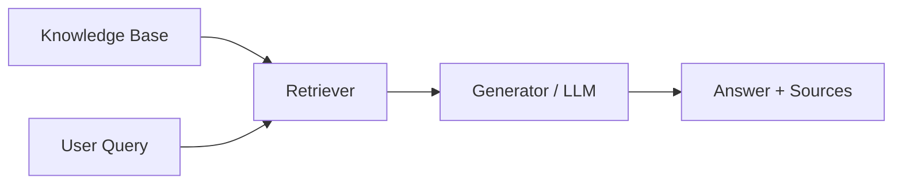
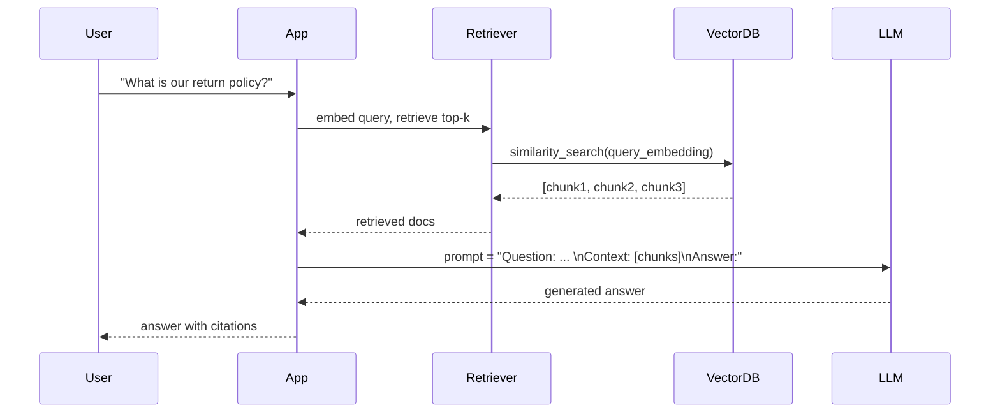
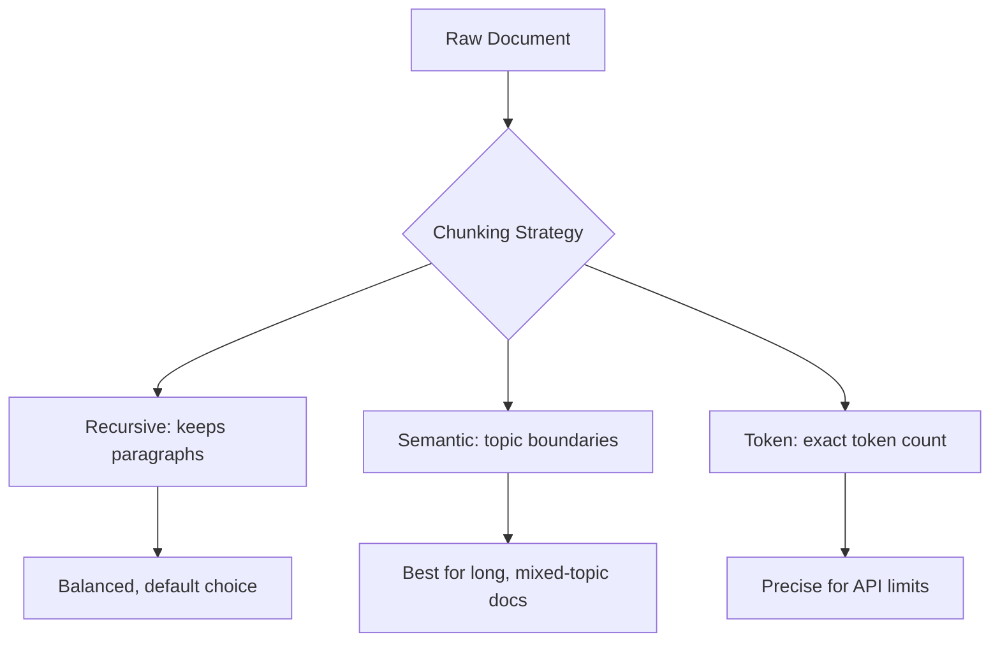
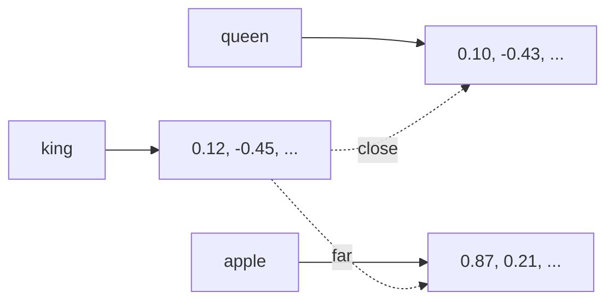
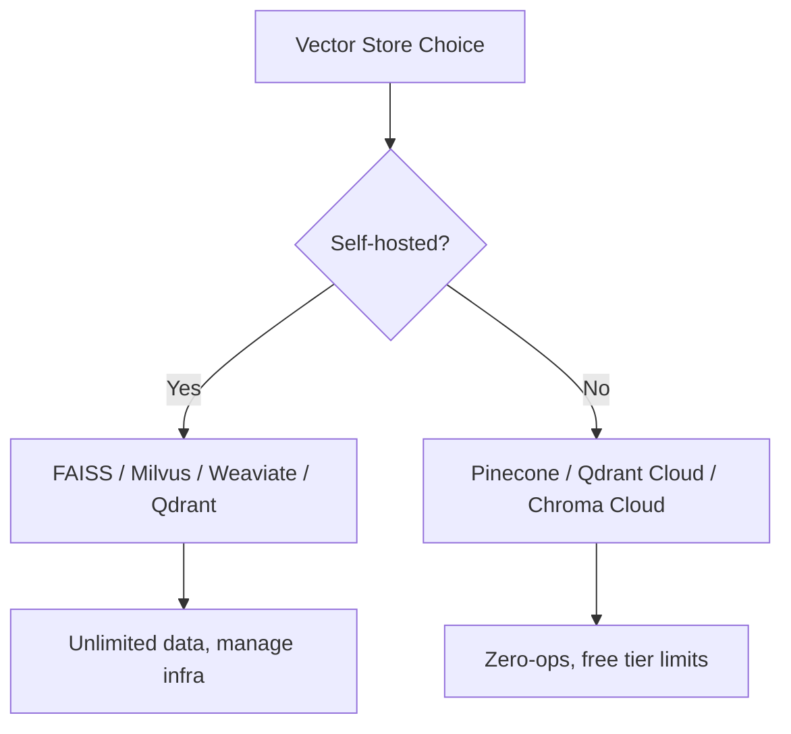
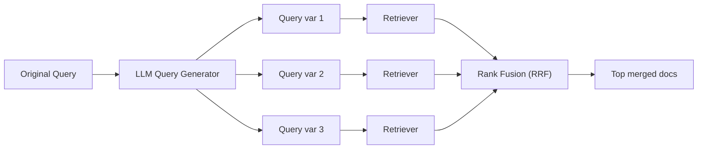
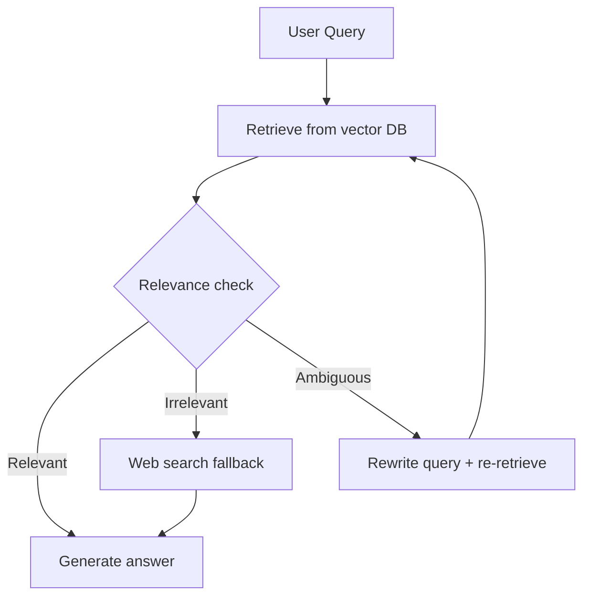
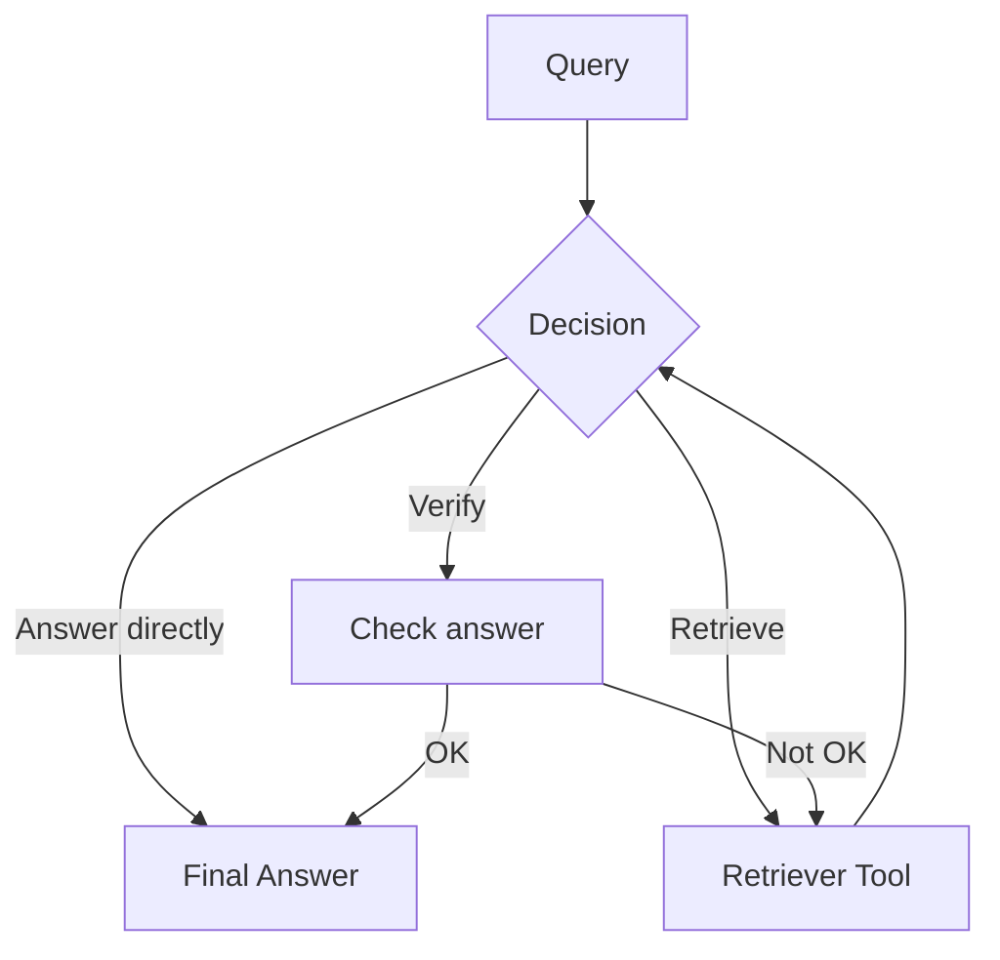
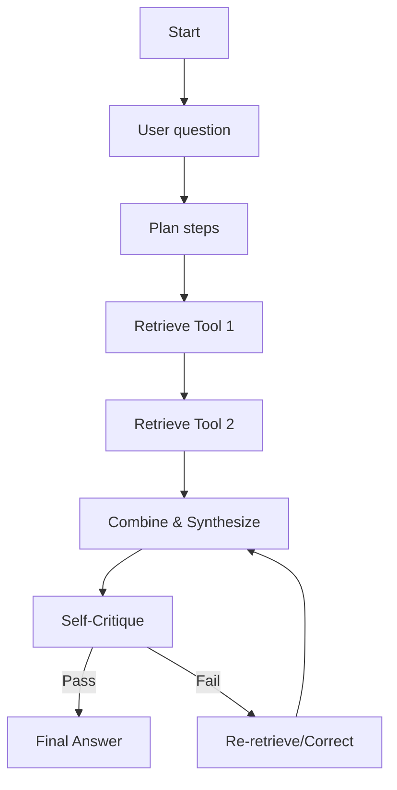

# Retrieval-Augmented Generation (RAG) – Comprehensive Study Notes

*From Fundamentals to Production-Ready Agentic RAG Systems*

---

## Module Map


---

## Prerequisites
- Python fundamentals (functions, classes, virtual environments)
- GenAI fundamentals (LLMs, prompts, tokens, temperature)
- LangChain basics (chains, LLM wrappers, output parsers)
- LangGraph basics (state graphs, nodes, edges)

---

# Module 1: RAG Fundamentals and Architecture

## 1.1 Introduction to RAG

### What is RAG?
RAG (Retrieval-Augmented Generation) is an architecture that enhances Large Language Models by giving them access to an external knowledge base. Instead of relying solely on the model's internal parameters (which are frozen after training), RAG retrieves relevant documents at query time and feeds them into the prompt.

### The Problems RAG Solves
| Problem | How RAG Helps |
|---------|---------------|
| **Hallucination** | Grounds the answer in retrieved real documents; the LLM can cite sources. |
| **Knowledge cutoff** | External knowledge base can be updated independently of the model. |
| **Domain-specific injection** | Upload your own company manuals, research papers, legal documents. |
| **Transparency** | Retrieved chunks provide source attribution; users can verify answers. |

### Core Components

- **Knowledge Base**: A collection of documents, stored as chunks and indexed (vector DB + optional keyword index).
- **Retriever**: Receives the user query, searches the knowledge base, returns the most relevant chunks.
- **Generator**: An LLM that receives the query + retrieved chunks (as context) and synthesizes a final answer.

### RAG Data Flow – End-to-End


**Example – Prompt Template:**
```text
Use the following pieces of context to answer the question at the end.
If you don't know the answer, just say that you don't know, don't try to make up an answer.

Context:
---
{context}
---
Question: {question}
Helpful Answer:
```

## 1.2 RAG vs Fine-Tuning vs Prompt Engineering

| Aspect | Prompt Engineering | RAG | Fine-Tuning |
|--------|-------------------|-----|-------------|
| **Cost** | Minimal (prompt tweaks) | Medium (embedding + search infra) | High (GPU hours, data prep) |
| **Latency** | Lowest | Medium (retrieval step) | Lowest after training |
| **Accuracy on private data** | Poor (no access to private data) | High (real-time retrieval) | High (model memorizes patterns) |
| **Maintenance** | None | Update documents easily | Re-train when data changes |
| **Knowledge update** | N/A | Real-time | Requires new training run |
| **Hallucination control** | No structural control | Strong (factual grounding) | Partial (model learns style, not facts) |

**Decision Framework:**
- Need up‑to‑date information / access to many documents → **RAG**.
- Want to change model behavior/style/vocabulary for a specific task → **Fine‑tuning**.
- Both can be combined: fine‑tuned model in a RAG pipeline.

---

# Module 2: Document Processing and Chunking

## 2.1 Document Loaders in LangChain

LangChain offers loaders for nearly every format. Loader returns a list of `Document` objects with `page_content` and `metadata`.

```python
from langchain_community.document_loaders import PyPDFLoader, WebBaseLoader, CSVLoader, TextLoader

# PDF
loader = PyPDFLoader("handbook.pdf")
pages = loader.load()

# Web
web_loader = WebBaseLoader("https://example.com/terms")
web_docs = web_loader.load()

# CSV
csv_loader = CSVLoader("products.csv")
csv_docs = csv_loader.load()

# Plain text
text_loader = TextLoader("notes.txt")
text_docs = text_loader.load()
```

> **Hands‑on:** Load a PDF, a web page, a CSV, a JSON, and a text file. Inspect each document’s `metadata` (source, page, etc.).

## 2.2 Text Splitting Strategies

LLMs have a context window limit, and smaller chunks improve retrieval precision. LangChain provides several text splitters.

### RecursiveCharacterTextSplitter (Recommended Default)
Splits text by a hierarchy of separators: `["\n\n", "\n", " ", ""]`. It tries to keep paragraphs/sentences intact.

```python
from langchain_text_splitters import RecursiveCharacterTextSplitter

splitter = RecursiveCharacterTextSplitter(
    chunk_size=500,    # max characters per chunk
    chunk_overlap=50,  # overlap between chunks
    separators=["\n\n", "\n", ".", " ", ""]
)
chunks = splitter.split_documents(docs)
```

**Parameter tuning:**
- `chunk_size`: measured in characters or tokens. For token‑aware splitting use `from_tiktoken_encoder`.
- `chunk_overlap`: 10–20% of chunk size preserves context across boundaries.

### Other Splitters
- **CharacterTextSplitter**: splits on a single character.
- **TokenTextSplitter**: splits based on token count (useful for strict token limits).
- **MarkdownTextSplitter**: respects Markdown headers (`#`, `##`…) to keep sections together.
- **Code Splitters**: `PythonCodeTextSplitter`, `LatexTextSplitter`, etc.
- **SemanticChunker**: uses embeddings to find natural breakpoints where semantic similarity drops.
  - `breakpoint_threshold_type="percentile"` / `"standard_deviation"` / `"gradient"`.
- **LLM‑based splitting**: ask an LLM to identify logical chunk boundaries (expensive but high‑quality).

### Comparing Strategies (Visual)


### Chunking Best Practices
| Use Case | Recommended Chunk Size | Overlap |
|----------|------------------------|---------|
| Short factoid Q&A (e.g., policy lookup) | 128–256 tokens | 10% |
| General RAG (manuals, reports) | 256–512 tokens | 10–15% |
| Complex analysis / summarization | 512–1024 tokens | 20% |

- **Tables & structured data**: use `Unstructured` loader with `strategy="hi_res"` to preserve table structure; consider separate table‑specific retrieval.
- **Preserving context**: Use `parent_document_retriever` (Module 6) or add `chunk_id` metadata that links chunks from the same source.

> **Lab:** Take a technical PDF, try chunk sizes `[256, 512, 1024]`, and evaluate the number of chunks, semantic coherence, and retrieval hit rate.

## 2.4 Metadata Management

Enrich documents with metadata to enable filtering and source tracking.

```python
from langchain.schema import Document

doc = Document(
    page_content="...",
    metadata={
        "source": "handbook_v2.pdf",
        "page": 14,
        "section": "Return Policy",
        "last_updated": "2025-10-01",
        "version": 2
    }
)
```

**Metadata filtering in retrieval:**
```python
vectorstore.similarity_search(
    query,
    k=4,
    filter={"section": "HR Policies"}  # only HR section
)
```

**Benefits:**
- Faster, more relevant retrieval (filter by date, department, document type).
- Source citation: display metadata to the user.
- Document lineage: track versions and updates.

> **Hands‑on:** Build a pipeline that loads, splits, and attaches custom metadata (file name, chunk index, date). Store in a dummy list and print filtered results.

---

# Module 3: Embeddings and Vector Representations

## 3.1 How Embeddings Work

Embeddings convert text into a fixed‑length numerical vector. Semantically similar texts are close in the vector space.



**Distance Metrics:**
- **Cosine similarity**: angle between vectors (most common, range -1 to 1).
- **Euclidean distance**: straight‑line distance.
- **Dot product**: unnormalized similarity.

**Embedding dimensions trade‑offs:**
Higher dimension = more expressiveness but larger storage and slower search.  
384‑dim (MiniLM) vs 1536‑dim (OpenAI) vs 3072‑dim (text-embedding-3-large).

## 3.2 Embedding Models Overview

| Model | Dimension | Cost (per 1M tokens) | Use Case |
|-------|-----------|----------------------|----------|
| OpenAI text-embedding-3-small | 512/1536 | $0.02 | Best value, good quality |
| OpenAI text-embedding-3-large | 256/1024/3072 | $0.13 | Highest quality |
| Ollama + Gemma (e.g., nomic-embed-text) | 768 | Free (local) | Offline, privacy |

**Ollama + LangChain:**
```python
from langchain_ollama import OllamaEmbeddings

embeddings = OllamaEmbeddings(model="nomic-embed-text")
```

**OpenAI:**
```python
from langchain_openai import OpenAIEmbeddings

emb = OpenAIEmbeddings(model="text-embedding-3-small")
```

## 3.3 Choosing the Right Embedding Model

**MTEB Leaderboard (Massive Text Embedding Benchmark):** Look for models with high retrieval/sts scores.  
**Dimension trade‑off:** Start with 768–1536 dimensions. Too small loses nuance, too large adds cost.  
**Cost vs Quality:** For prototypes, use free/open models. For production, small OpenAI model often offers the best balance.

> **Hands‑on:** Embed the same query with two models, compute cosine similarity with a known relevant document, compare.

## 3.4 LangChain Embeddings Implementation

Two key methods:
```python
# embed documents (for indexing)
doc_vectors = embeddings.embed_documents(["doc1 text", "doc2 text"])

# embed a query (for retrieval)
query_vector = embeddings.embed_query("How to return an item?")
```
The `embed_query` often appends a prefix like "search_query:" to optimize retrieval (model‑dependent).

---

# Module 4: Vector Stores

## 4.1 Comparison and Selection



| Store | Type | Best For | Free Tier |
|-------|------|----------|-----------|
| Chroma | Embedded | Learning, prototyping, single-user apps | Unlimited (local) |
| FAISS | Library | High‑speed local search, no server | Unlimited |
| Qdrant | Server (or embedded) | Production with rich filtering | 1 GB cloud forever |
| Pinecone | Managed | Seamless scaling | 100K vectors |
| Milvus | Server | Billion‑scale, GPU acceleration | Unlimited self‑hosted |

**Recommendation:** Start with Chroma for experimentation, move to Qdrant or Pinecone for production.

## 4.2 Vector Store CRUD Operations

Example using Chroma:

```python
from langchain_chroma import Chroma
from langchain_openai import OpenAIEmbeddings

embeddings = OpenAIEmbeddings()
vectorstore = Chroma(collection_name="my_docs", embedding_function=embeddings)

# CREATE: add documents
vectorstore.add_documents(documents)

# READ: similarity search
results = vectorstore.similarity_search("return policy", k=3)
results_with_scores = vectorstore.similarity_search_with_score("return policy", k=3)

# UPDATE: update a document by ID (if supported)
# Often: delete + re-add

# DELETE: by ID
vectorstore.delete(ids=["doc_id_1"])

# DELETE by filter
vectorstore.delete(filter={"source": "old_handbook.pdf"})
```

> **Lab:** Build a small CRUD application that ingests a directory of text files, lets users search, and deletes by source.

---

# Module 5: Basic Retrieval Techniques

## 5.1 Similarity Search Fundamentals

```python
# Retrieve documents most similar to the query embedding.
docs = vectorstore.similarity_search("company holidays", k=4)
```

**With relevance scores:**
```python
docs_scores = vectorstore.similarity_search_with_score(query, k=4)
for doc, score in docs_scores:
    print(f"Score: {score:.3f} | Content: {doc.page_content[:100]}")
```
Scores depend on distance metric: L2 distance (lower is better), cosine similarity (higher is better). Normalize when comparing.

## 5.2 Similarity Score Threshold

Avoid returning irrelevant chunks by setting a threshold.

```python
retriever = vectorstore.as_retriever(
    search_type="similarity_score_threshold",
    search_kwargs={"score_threshold": 0.75}  # only above 0.75 cosine similarity
)
```
> **Hands‑on:** Retrieves question‑answer pairs from a dataset, experiment with thresholds from 0.5 to 0.9. Observe how many irrelevant results are filtered out.

## 5.3 MMR (Maximal Marginal Relevance)

MMR selects documents that are both relevant *and* diverse, reducing redundancy.

**Parameters:**
- `lambda_mult`: 0 = max diversity, 1 = pure relevance (default 0.5).
- `fetch_k`: number of docs initially fetched before applying diversity.

```python
retriever = vectorstore.as_retriever(
    search_type="mmr",
    search_kwargs={"k": 3, "fetch_k": 10, "lambda_mult": 0.7}
)
```
- **Use case:** Summarization of a long article where you want distinct facets.

## 5.4 Hybrid Search (Dense + Sparse)

Semantic (dense) search excels at meaning; keyword (sparse) search excels at exact terms (product codes, names). Hybrid search combines both.

- **BM25Retriever** (sparse):
  ```python
  from langchain_community.retrievers import BM25Retriever
  bm25_retriever = BM25Retriever.from_documents(docs)
  bm25_retriever.k = 3
  ```

- **EnsembleRetriever** (combine with weights):
  ```python
  from langchain.retrievers import EnsembleRetriever

  ensemble = EnsembleRetriever(
      retrievers=[bm25_retriever, vector_retriever],
      weights=[0.4, 0.6]  # weighting dense higher
  )
  ```
- **Alternate:** Use vector DBs that natively support hybrid search (e.g., Weaviate, Pinecone).

> **Lab:** Build three retrievers: semantic only, BM25 only, and ensemble. Compare results on a query like "error code E-101" (keyword needed) vs "how to troubleshoot connectivity issues" (semantic).

---

# Module 6: Advanced Retrieval Techniques

## 6.1 Contextual Compression

Compress returned chunks to keep only the most relevant sentences, reducing noise and token usage.

**LLMChainExtractor** uses an LLM to extract the relevant parts.
```python
from langchain.retrievers import ContextualCompressionRetriever
from langchain.retrievers.document_compressors import LLMChainExtractor

compressor = LLMChainExtractor.from_llm(llm)
compression_retriever = ContextualCompressionRetriever(
    base_compressor=compressor,
    base_retriever=base_retriever
)
```

**EmbeddingsFilter** keeps only documents above a similarity threshold to the query.
```python
from langchain.retrievers.document_compressors import EmbeddingsFilter

filter = EmbeddingsFilter(embeddings=embeddings, similarity_threshold=0.76)
compression_retriever = ContextualCompressionRetriever(
    base_compressor=filter,
    base_retriever=base_retriever
)
```

**Pipeline compressor:**
```python
from langchain.retrievers.document_compressors import DocumentCompressorPipeline
pipeline = DocumentCompressorPipeline(transformers=[splitter, filter, extractor])
```

> **Hands‑on:** Implement a pipeline that splits results into sentences, filters by embedding similarity, then extracts key sentences.

## 6.2 Parent Document Retriever

**Problem:** Large chunks provide rich context for the LLM, but small chunks are better for precise matching.  
**Solution:** Index small “child” chunks, but return the larger “parent” document (or chunk) at query time.

```python
from langchain.retrievers import ParentDocumentRetriever
from langchain.storage import InMemoryStore

# parent splitter creates big chunks, child splitter small ones
parent_splitter = RecursiveCharacterTextSplitter(chunk_size=1000)
child_splitter = RecursiveCharacterTextSplitter(chunk_size=200)

store = InMemoryStore()  # can be a persistent store
retriever = ParentDocumentRetriever(
    vectorstore=vectorstore,
    docstore=store,
    child_splitter=child_splitter,
    parent_splitter=parent_splitter
)
retriever.add_documents(docs)

# When searched, it returns the parent docs (1000‑chars) not the tiny ones.
```

> **Hands‑on:** Use a set of long articles, build child chunks for indexing, return parent chunks. Compare answer quality vs plain small chunks.

## 6.3 Self‑Query Retriever

Translates a natural language query into two parts: a semantic query string + metadata filters.

```python
from langchain.retrievers.self_query.base import SelfQueryRetriever
from langchain.chains.query_constructor.base import AttributeInfo

metadata_field_info = [
    AttributeInfo(name="genre", description="music genre", type="string"),
    AttributeInfo(name="year", description="release year", type="integer"),
    AttributeInfo(name="rating", description="user rating out of 5", type="float"),
]
retriever = SelfQueryRetriever.from_llm(
    llm, vectorstore, "Songs", metadata_field_info
)

# Query: "rock songs from the 90s with rating above 4.5"
# -> filter: genre='rock', year >= 1990, year <= 1999, rating > 4.5
# -> search string: "rock songs"
```

> **Hands‑on:** Build a product catalog with attributes (category, price, brand). Enable natural language filtering.

## 6.4 Multi‑Query Retriever

Uses an LLM to generate multiple rephrased versions of the original query to improve recall.

```python
from langchain.retrievers.multi_query import MultiQueryRetriever
from langchain.chat_models import ChatOpenAI

retriever = MultiQueryRetriever.from_llm(
    retriever=base_retriever, llm=ChatOpenAI(temperature=0)
)
# Unique union of results from all generated queries.
```
**Example:** "How to fix a leaky faucet?" → also retrieves with "faucet repair guide", "stop water dripping from tap".

## 6.5 Re‑ranking Strategies

Two‑stage: retrieve many candidates (e.g., 20), then apply a more accurate cross‑encoder to re‑order them.

**Cohere Rerank:**
```python
from langchain_cohere import CohereRerank
from langchain.retrievers import ContextualCompressionRetriever

compressor = CohereRerank()
retriever = ContextualCompressionRetriever(
    base_compressor=compressor,
    base_retriever=base_retriever
)
```
- The reranker scores each (query, document) pair and returns top‑k.
- Typically improves answer quality significantly at a small latency cost.

> **Hands‑on:** Compare retrieval without and with re‑ranking on a Q&A dataset. Measure hit‑rate@5.

---

# Module 7: Advanced RAG Patterns

## 7.1 RAG Fusion

Generates multiple query variants, retrieves for each, then merges results using **Reciprocal Rank Fusion (RRF)**.



**Reciprocal Rank Fusion formula:**  
`score(d) = Σ 1 / (k + rank_i(d))`  
Where k is a constant (often 60).

**Trade‑offs:** Higher recall, but more API calls and latency.

> **Hands‑on:** Build a RAG Fusion pipeline with 3 LLM‑generated queries, fuse with RRF, and evaluate recall against a single‑query baseline.

## 7.2 HyDE (Hypothetical Document Embeddings)

Instead of directly embedding the user question, the LLM first generates a hypothetical perfect answer, then embeds that answer and uses it to retrieve real documents. This bridges the gap between short query and document style.

```python
# 1. Generate hypothetical document
hypothetical_prompt = "Write a paragraph that answers the question: {question}"
hypothetical_answer = llm.invoke(hypothetical_prompt)

# 2. Embed the hypothetical answer
query_embedding = embeddings.embed_query(hypothetical_answer)

# 3. Retrieve using that embedding
docs = vectorstore.similarity_search_by_vector(query_embedding)
```

> **Hands‑on:** Compare HyDE retrieval vs direct query embedding on ambiguous questions like “What is the best way to prepare for an interview?”

## 7.3 Corrective RAG (CRAG)

CRAG adds a **self‑grading step**: retrieved documents are evaluated for relevance. If they're not good enough, it performs a web search fallback (or rewrites the query).



**Implementation with LangGraph (Module 8) provides clean state management.**

> **Hands‑on:** Build a simple CRAG flow using LangGraph: retrieve → grade (LLM gives a confidence score) → if confidence < threshold, call Tavily web search.

## 7.4 Self‑RAG

Self‑RAG uses special **reflection tokens** (e.g., `<Retrieve>`, `<Relevant>`, `<Supported>`, `<PartiallySupported>`) to decide *when* to retrieve and to critique its own generations. The model can decide to retrieve multiple times.

- **Query complexity classification:** Is the task simple (no retrieval) or complex (multi‑step)?
- **Self‑correction:** If the output isn't fully supported by retrieved docs, rewrite or supplement.

**Implementation note:** Requires a fine‑tuned LM that outputs these tokens; conceptually similar to CRAG but model‑driven.

## 7.5 Graph RAG (Knowledge Graph + RAG)

When relationships matter more than text similarity (e.g., “Who reported to whom?”, “Find all suppliers of X in Europe”), Knowledge Graphs outperform pure vector search.

**Neo4j GraphRAG approach:**
1. Extract entities and relations from documents (LLM + NER).
2. Build a knowledge graph in Neo4j.
3. Query using Cypher; use LLM to translate natural language into Cypher.
4. Multi‑hop queries: “Which companies did Alice invest in that are in biotech?” – requires graph traversal.

```python
# Example: adding documents to a graph
from langchain_community.graphs import Neo4jGraph
from langchain_experimental.graph_transformers import LLMGraphTransformer

graph = Neo4jGraph(url="bolt://localhost:7687", username="neo4j", password="password")
transformer = LLMGraphTransformer(llm=llm)
graph_docs = transformer.convert_to_graph_documents(documents)
graph.add_graph_documents(graph_docs)
```
- **Multi‑hop:** Chain two retrievals: vector search → node ID → graph traversal.

> **When Graph RAG wins:** highly interconnected data, structured queries, relational reasoning, multi‑hop fact checking.

## 7.6 Multi‑Modal RAG (Coming Soon)

Extends RAG to images, tables, and mixed documents.  
- **Examples:** Retrieve the chart image that answers a question, then ask a multimodal LLM to describe it.
- **Implementations:** Use `Unstructured` for layout parsing, image captioning models, and multimodal embedding models like CLIP.

---

# Module 8: Agentic RAG with LangGraph

## 8.1 What is Agentic RAG?
Agentic RAG gives the LLM **agency** – it can decide *if* to retrieve, *which* tools to use, and whether to iterate, rewrite queries, or validate answers.  
- **Traditional RAG:** fixed pipeline: query → retrieve → answer.  
- **Agentic RAG:** dynamic decision‑making loop.

**Key capabilities:** reasoning, tool use, memory, self‑correction.



## 8.2 RAG as a Tool for Agents

Wrap a retriever into a tool for an LLM agent.

```python
from langchain.tools import create_retriever_tool

retriever_tool = create_retriever_tool(
    retriever=vectorstore.as_retriever(),
    name="KnowledgeBase",
    description="Search the company knowledge base for answers to HR and policy questions."
)
```
Then you can have multiple tools (different knowledge bases, calculators, web search), and the agent chooses.

> **Hands‑on:** Build a simple ReAct agent with one retriever tool using `create_openai_tools_agent`.

## 8.3 LangGraph Fundamentals for RAG

LangGraph models a workflow as a stateful graph.

```python
from typing import TypedDict, List
from langgraph.graph import StateGraph, END

class RAGState(TypedDict):
    question: str
    documents: List[str]
    answer: str

graph = StateGraph(RAGState)

def retrieve(state):
    docs = retriever_tool.invoke(state["question"])
    return {"documents": docs}

def generate(state):
    context = "\n".join(state["documents"])
    prompt = f"Context: {context}\nQuestion: {state['question']}\nAnswer:"
    answer = llm.invoke(prompt)
    return {"answer": answer}

graph.add_node("retrieve", retrieve)
graph.add_node("generate", generate)
graph.set_entry_point("retrieve")
graph.add_edge("retrieve", "generate")
graph.add_edge("generate", END)

app = graph.compile()
result = app.invoke({"question": "What is our remote work policy?"})
```

**Conditional routing:** Instead of a fixed edge, use `add_conditional_edges` to branch based on state.

## 8.4 Agentic RAG Design Patterns

**ReAct Pattern with RAG:**
- Agent thinks, acts (retrieve/search), observes, then answers.

**Plan‑and‑execute:** LLM first devises a multi‑step plan: step1 = retrieve about X, step2 = retrieve about Y, step3 = compare and answer.

**Reflection / Self‑Correction:** After generating an answer, the agent checks its own answer against retrieved facts; if unsupported, it retrieves again or adjusts.


> **Hands‑on:** Implement a ReAct RAG agent using LangGraph with retriever tool, optional web search, and a final checker node.

---

# Module 9: RAG Evaluation using RAGAS

RAGAS (RAG Assessment) provides metrics tailored to RAG pipelines.

**Installation:** `pip install ragas`

**Key Metrics:**
- **Faithfulness:** Is the answer factually grounded in the provided context? (1..0)
- **Answer Relevancy:** How relevant is the answer to the question?
- **Context Precision:** Among retrieved chunks, which fraction is relevant?
- **Context Recall:** Did we retrieve all the necessary information?
- **Noise Sensitivity:** How prone is the answer to be influenced by irrelevant info?

**Creating an evaluation dataset:**
Prepare a set of (question, answer, contexts, ground_truth) samples.

**Running evaluation:**

```python
from ragas import evaluate
from ragas.metrics import faithfulness, answer_relevancy, context_precision, context_recall

eval_dataset = Dataset.from_dict({
    "question": ["What is our remote work policy?"],
    "answer": ["Employees may work remotely 2 days per week."],
    "contexts": [["All employees are eligible for remote work..."]],
    "ground_truth": ["Employees may work remotely up to 2 days per week with manager approval."]
})

result = evaluate(eval_dataset, metrics=[faithfulness, answer_relevancy, context_precision, context_recall])
print(result)
```

> **Lab:** Evaluate each metric individually on your RAG pipeline. Create a test set of 20 question‑context‑answer triples and compute scores. Analyze where retrieval or generation fails.

---

# Module 10: Capstone Project with Deployment *(Outline, to be added soon)*

### 10.1 Capstone Project: Build a Production‑Ready RAG System

**Components you will build:**
- Multi‑document ingestion (PDF, web, CSV).
- Hybrid retrieval (dense + sparse) with re‑ranking.
- Agentic workflow using LangGraph (query rewriting, self‑check, multi‑tool).
- Evaluation suite with RAGAS.
- Monitoring with LangSmith (traces, latency, feedback).
- Deployment containerization (Docker) on a cloud service.

### 10.2 Production Good Practices

- **Pipeline Optimization:** Use async retrievers, batch embedding, caching of frequent queries.
- **Caching Strategies:** Cache embeddings and final answers for identical queries (e.g., Redis).
- **Cost Optimization:** Use small embedding models where quality allows, minimize chunk size, use compression.
- **Monitoring & Debugging:** Track retrieval precision over time, log feedback, set up alerts.
- **Common Pitfalls:**
  - Chunks too large → irrelevant context and wasted tokens.
  - No threshold → irrelevant results polluting answer.
  - Ignoring metadata → cannot scope search to a subset.
  - Over‑retrieving → high latency and token cost.
- **Security & Compliance:** Mask PII in logs, access control on knowledge bases, encryption at rest, audit trails.

---

# Summary of Key Takeaways
- **RAG is a flexible pattern** that grounds LLMs in external data.
- **Chunking strategy directly impacts quality** – treat chunk size, overlap, and splitting method as hyperparameters.
- **Hybrid search + re‑ranking** often beats pure semantic search.
- **Agentic RAG** introduces dynamic decision‑making, making the system resilient and capable.
- **Evaluation is not optional** – use RAGAS early to catch retrieval and generation failures.
- **Production requires monitoring, caching, and security** – plan for these from the start.

---

These notes provide a comprehensive walkthrough, with diagrams, code examples, and actionable labs. For the most up‑to‑date details, always refer to the official LangChain and RAGAS documentation. Happy building!
