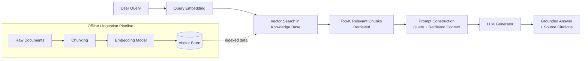
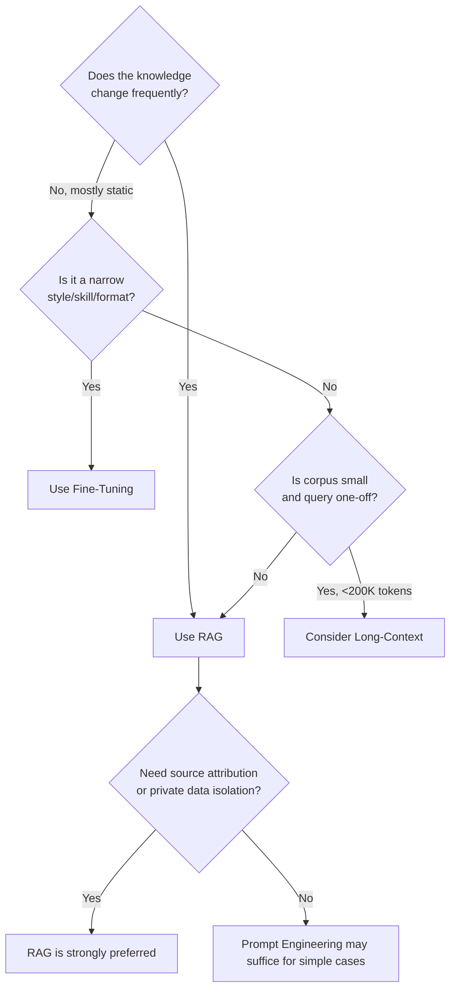

# Module 1: RAG Fundamentals and Architecture

> **Goal of this module:** Understand *why* RAG exists, what its core components are, how data flows through a RAG system end-to-end, and when to choose RAG over fine-tuning, prompt engineering, or long-context models.

---

## 1. Why RAG Exists — The Problems It Solves

LLMs are powerful but have four structural weaknesses. RAG is an architectural patch for all four:

| Problem | What happens without RAG | How RAG fixes it |
|---|---|---|
| **Hallucination** | Model confidently generates plausible-sounding but false facts | Grounds generation in retrieved, verifiable source text |
| **Knowledge cutoff** | Model has no idea about events/data after training | Retrieval pulls in fresh, up-to-date documents at query time |
| **Domain-specific knowledge gap** | Model was never trained on your company's internal docs, product catalog, legal contracts, etc. | Injects your private knowledge base into the context at inference time |
| **No source attribution** | Model can't tell you *where* an answer came from | Retrieved chunks carry metadata (source, page, URL) → answers become citable |

**Mental model:** RAG turns a *closed-book exam* (LLM relying only on memorized weights) into an *open-book exam* (LLM allowed to consult specific pages before answering).

---

## 2. Core Components

Every RAG system — no matter how advanced — boils down to three building blocks:

```
Knowledge Base  →  Retriever  →  Generator
```

| Component | Role | Examples |
|---|---|---|
| **Knowledge Base** | Where your domain knowledge lives, usually as vectorized chunks | Vector DB (pgvector, Pinecone, Qdrant), plus raw docs/metadata store |
| **Retriever** | Finds the most relevant pieces of knowledge for a given query | Similarity search, hybrid search (dense + BM25), rerankers |
| **Generator** | The LLM that synthesizes a final answer using retrieved context | GPT-4/5 class models, Claude, Gemini, open-weight LLMs |

---

## 3. RAG Data Flow (End-to-End)



**Two distinct pipelines to always keep separate in your head:**
1. **Ingestion (offline/batch)** — load → chunk → embed → store.
2. **Query (online/real-time)** — embed query → retrieve → augment prompt → generate.

---

## 4. RAG vs Fine-Tuning vs Prompt Engineering vs Long Context

| Approach | Best for | Cost | Latency | Maintenance | Weakness |
|---|---|---|---|---|---|
| **Prompt Engineering** | Quick behavior/style changes | Lowest | Lowest | Very low | Can't inject large/private knowledge |
| **RAG** | Dynamic, frequently-updated, large knowledge bases; need attribution | Medium (embedding + retrieval infra) | Medium (retrieval step adds latency) | Medium (index freshness) | Retrieval quality bottlenecks everything |
| **Fine-Tuning** | Teaching a *style*, *format*, or *narrow skill* deeply | High (training runs) | Low at inference | High (retrain on new data) | Poor at injecting fast-changing facts; can still hallucinate |
| **Long-Context (200K–2M tokens)** | Small-to-medium corpora, one-shot deep analysis | High (cost/latency scale with tokens) | Highest for large contexts | Low (no indexing pipeline) | **"Context rot"** — retrieval quality degrades as context grows, even in models built for long windows |

### Key 2026 insight: "RAG is dead" claims were wrong
Frontier models now handle 200K–2M+ token windows, which triggered "RAG is dead" narratives in 2025. Reality check:
- Cost and latency still scale with context length.
- Independent research (e.g., Chroma's "context rot" study) shows **retrieval quality degrades as context grows** — even in long-context-native models.
- **2026 consensus:** Use chunked retrieval to control cost/latency/faithfulness. Treat long-context as a *fallback* for hard queries or corpora under ~200K tokens — not a universal RAG replacement.

### Decision Framework



In practice, production systems **combine** these: RAG for knowledge injection + light fine-tuning for tone/format + prompt engineering for instructions + long-context as an escape hatch for hard multi-document queries.

---

## 5. Quick-Reference Summary

- RAG = Knowledge Base + Retriever + Generator.
- Two pipelines: ingestion (offline) and query (online).
- RAG solves hallucination, knowledge cutoff, domain gaps, and attribution.
- Long context ≠ RAG replacement — "context rot" is real even at huge windows.
- Real production systems mix RAG + fine-tuning + prompt engineering, not one vs. the other.

---

## 6. Knowledge Check — Q&A

**Q1. What are the three core components of a RAG system, and what does each do?**
> **A:** Knowledge Base (stores vectorized domain knowledge), Retriever (finds relevant chunks for a query via similarity/hybrid search), and Generator (the LLM that synthesizes a grounded answer from the retrieved context).

**Q2. Explain "context rot" and why it matters even for models with 1M+ token windows.**
> **A:** Context rot is the phenomenon where retrieval/reasoning quality degrades as the amount of context fed to the model grows — this happens even in models explicitly built for long context. It means simply dumping an entire corpus into the prompt is not a reliable substitute for retrieving only the most relevant, tightly-scoped chunks. It's a core reason RAG remains relevant in 2026.

**Q3. A company's internal wiki changes daily and has 5 million pages. Would you recommend fine-tuning, RAG, or long-context? Justify your answer.**
> **A:** RAG. The knowledge changes daily (fine-tuning would require constant retraining, which is expensive and slow) and the corpus is far too large for any long-context window. RAG lets you re-index changed pages incrementally without touching the model itself, and gives source attribution back to specific wiki pages.

**Q4. What's the difference between the ingestion pipeline and the query pipeline in RAG? Why is it important to design them separately?**
> **A:** Ingestion is an offline/batch process (load documents → chunk → embed → store in a vector DB) that prepares the knowledge base. Query is a real-time process (embed the user's query → retrieve top-k chunks → construct an augmented prompt → generate an answer). Separating them matters because ingestion can be optimized for throughput/cost (batch embedding, deduplication) while query must be optimized for latency — conflating the two designs leads to slow, expensive query-time systems.

**Q5. Why might source attribution (citing where an answer came from) matter more in an enterprise RAG deployment than in a general chatbot?**
> **A:** Enterprise use cases (legal, medical, financial, compliance) often require auditability — users and regulators need to verify claims against source documents. RAG naturally supports this because retrieved chunks carry metadata (source, page, timestamp), unlike a fine-tuned model's opaque parametric memory, which cannot point to a specific origin for a fact.

---

## 7. Interview-Style Scenario Questions

**Q6 (System Design Interview).** *"We have a customer support chatbot built purely on prompt engineering with a large system prompt containing FAQs. Support tickets are increasing because answers are stale. How would you redesign this, and what would you tell the team about the trade-offs?"*
> **A (sample strong answer):** Move from a static prompt-stuffed FAQ to a RAG architecture: ingest the FAQ/knowledge base docs into a vector store, retrieve the top-k relevant FAQ chunks per query, and inject only those into the prompt. This decouples the *frequency of knowledge updates* from *code/prompt deployments* — support can update the KB without an engineering release. Trade-offs to flag: added retrieval latency (typically 50–200ms), infra cost of an embedding pipeline + vector DB, and the need for evaluation to ensure retrieval doesn't silently miss the right FAQ (retrieval quality becomes the new bottleneck, not the LLM).

**Q7 (Architecture Interview).** *"A client insists that since GPT-5-class models now support 1M-token context, they want to just paste their entire 400-page policy manual into every prompt instead of building RAG. How do you respond?"*
> **A (sample strong answer):** Explain the "context rot" finding — even long-context-native models show degraded retrieval accuracy as more tokens are stuffed in, so pasting the whole manual risks the model missing or misweighting the relevant clause, especially for policy manuals where a single sentence can matter legally. Also flag the cost/latency: every query would pay for processing 400 pages of tokens, even if the answer depends on one paragraph. Recommend RAG (chunk + embed + retrieve relevant sections), reserving long-context as a fallback only for genuinely cross-cutting queries that need broad synthesis across the whole document.

**Q8 (Practical/Debugging Interview).** *"Your RAG chatbot is hallucinating answers even though the correct document IS in the knowledge base. Walk me through how you'd debug this, tying it back to the three core RAG components."*
> **A (sample strong answer):** Debug layer by layer: (1) **Retriever** — check if the correct chunk is actually being returned in the top-k (log retrieved chunks per query; if the chunk isn't retrieved, it's a chunking/embedding/retrieval problem, not a generation problem). (2) **Knowledge Base** — verify the document was actually ingested and indexed correctly (no failed ingestion, no stale index). (3) **Generator/prompt construction** — even if the right chunk is retrieved, check whether the prompt template actually includes it, and whether the LLM is instructed to *only* answer from provided context (missing grounding instructions is a very common failure mode). This systematic elimination pinpoints whether it's a retrieval failure or a generation/prompting failure — they require completely different fixes.
