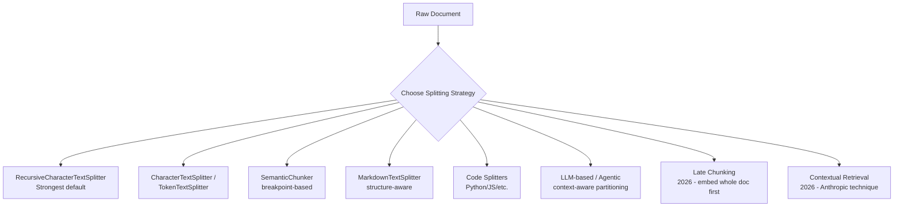
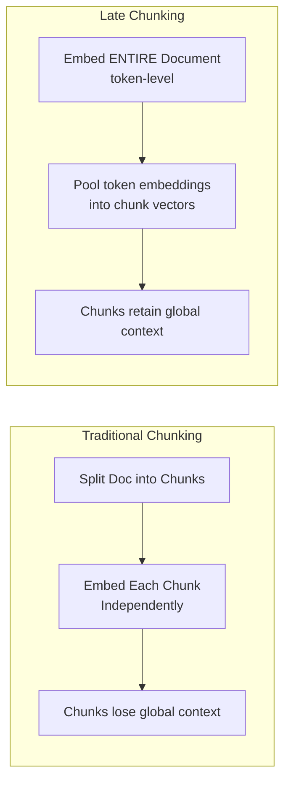
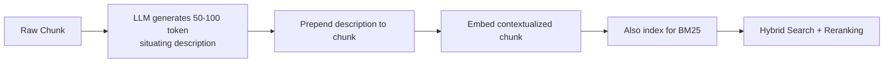

# Module 2: Document Processing and Chunking

> **Goal of this module:** Master document loading, every major chunking strategy (including 2026's late chunking and contextual retrieval), and the practical rules for choosing chunk size, overlap, and metadata design.

---

## 1. Document Loaders in LangChain

| Source Type | Loader(s) | Notes |
|---|---|---|
| PDF | `PyPDFLoader`, `PDFMiner`, `PDFPlumber`, `Unstructured` | `Unstructured` handles messy/scanned layouts best |
| Web | `WebBaseLoader`, `RecursiveUrlLoader` | `RecursiveUrlLoader` crawls linked pages |
| Structured data | CSV, JSON loaders | Preserve row/field structure as metadata |
| Text | `TextLoader` | Simplest case — plain `.txt` files |

**Hands-on takeaway:** Practice loading from 5 different source types — this exposes you to the real-world mess of encoding issues, broken PDFs, and inconsistent HTML that production RAG systems must handle.

---

## 2. Text Splitting Strategies — The Full Landscape

| Strategy | How it works | Strength | Weakness |
|---|---|---|---|
| **RecursiveCharacterTextSplitter** | Splits on hierarchy of separators (paragraph → sentence → word) | Still the strongest default; benchmarks put recursive 512-token splitting near the top of end-to-end accuracy | Ignores semantic meaning of boundaries |
| **CharacterTextSplitter / TokenTextSplitter** | Fixed-size splits by char or token count | Simple, predictable | Can cut mid-sentence/mid-idea |
| **SemanticChunker** | Splits at points where embedding similarity drops (breakpoint thresholds: percentile, standard_deviation, gradient) | Strong precision — chunks align with topic shifts | Can over-fragment into sub-50-token chunks if thresholds too aggressive |
| **MarkdownTextSplitter** | Respects markdown structure (headers, lists) | Great for structured docs | Only works well on markdown-native sources |
| **Code Splitters** | Language-aware (functions, classes) | Preserves code semantics | Language-specific tuning needed |
| **LLM-based / Agentic Splitting** | An LLM decides logical partition boundaries | Highest semantic fidelity | Most expensive, slowest |
| **Late Chunking (NEW 2026)** | Embed the *entire document* first with a long-context embedding model, THEN pool token-level embeddings into chunk vectors | Preserves cross-chunk relationships that naive splitting destroys; best on long, cohesive documents | Requires a long-context embedding model |
| **Contextual Retrieval (NEW 2026, Anthropic)** | Prepend a short (50–100 token) LLM-generated description of where a chunk sits in the document, before embedding | Cuts top-20 retrieval failures substantially when combined with BM25 + reranking; widely adopted because it's a *preprocessing* step, not an architecture rewrite | Adds LLM call cost per chunk during ingestion |

### Late Chunking vs Traditional Chunking (Visual)

### Contextual Retrieval (Visual)

---

## 3. Chunking Best Practices

### 3.1 Optimal Chunk Sizes by Use Case

| Use Case | Chunk Size | Notes |
|---|---|---|
| Factoid / short Q&A | 128–256 tokens | Precise, narrow matches |
| **General RAG** | **256–512 tokens** | **512 is the most common production default in 2026** |
| Complex analysis / legal / technical | 512–1024 tokens | Needs more surrounding context to preserve meaning |

> ⚠️ These are **starting points** — always validate against your own corpus and eval set.

### 3.2 Overlap Strategy
- Traditional rule of thumb: **10–20% overlap** between consecutive chunks.
- **2026 update:** Recent studies (Jan 2026, SPLADE + sparse retrieval) found **no measurable benefit from overlap in some hybrid setups**.
- **Takeaway:** Treat overlap as a *tunable hyperparameter*, not a default you apply blindly — A/B test it.

### 3.3 The "Context Cliff"
- Research identifies a **quality drop-off around ~2,500 tokens** of retrieved context, regardless of model size.
- **Implication:** Keep chunks tight, and rely on **reranking** to select the best few chunks — don't just dump large context windows into the prompt hoping the model figures it out.

### 3.4 Impact of Chunking on Recall
- Chunking strategy alone can swing **recall by up to ~9 points** on identical corpora — this is *not* a minor implementation detail, it's one of the highest-leverage tuning knobs in a RAG pipeline.

### 3.5 Handling Tables & Structured Data
- Naive text splitters destroy tables (rows get separated from headers).
- Preserve table structure explicitly (e.g., convert to markdown tables or JSON before chunking) and keep header context attached to every row-chunk.

---

## 4. Metadata Management

| Metadata Practice | Why it matters |
|---|---|
| Adding metadata to documents (source, date, author, section) | Enables filtering at retrieval time (e.g., "only search docs from Legal team") |
| Source tracking & document lineage | Supports attribution and auditability |
| Document versioning | Prevents stale/duplicate chunks from old doc versions polluting retrieval |

---

## 5. Quick-Reference Cheat Sheet

- **Default chunking in 2026 production:** Recursive character splitting, ~512 tokens, + Contextual Retrieval preprocessing layered on top when quality matters more than cost.
- **Overlap:** test it — don't assume 10–20% helps.
- **Context cliff:** ~2,500 tokens is where quality starts dropping — favor reranking over dumping more context.
- **Chunking choice alone** can shift recall by ~9 points — treat it as a first-class experiment, not an afterthought.

---

## 6. Knowledge Check — Q&A

**Q1. Why is RecursiveCharacterTextSplitter still considered the strongest default in 2026 despite newer techniques existing?**
> **A:** Benchmarks show recursive splitting at ~512 tokens performs near the top of end-to-end accuracy comparisons. It's simple, predictable, cheap, and respects natural document hierarchy (paragraphs → sentences → words) without requiring extra LLM calls, making it the best cost/quality baseline before layering more advanced techniques on top.

**Q2. Explain the difference between Late Chunking and Contextual Retrieval. Can they be used together?**
> **A:** Late Chunking embeds the *entire document first* with a long-context embedding model, then pools token-level embeddings into chunk vectors — this preserves cross-chunk relationships at the embedding level. Contextual Retrieval instead prepends an LLM-generated situating description to each chunk *before* embedding, so the chunk text itself carries context. They operate at different layers (embedding-time pooling vs. text-preprocessing) and can, in principle, be combined, though most 2026 production stacks favor Contextual Retrieval because it's a lighter-weight preprocessing step that doesn't require a specialized long-context embedding model.

**Q3. What is the "context cliff" and how should it change how you design a retrieval pipeline?**
> **A:** The context cliff is the observed quality drop-off around ~2,500 tokens of retrieved context, regardless of model size. It means retrieval pipelines should prioritize *precision* (fewer, more relevant chunks via reranking) over *recall-maximizing volume* (dumping many chunks). Design implication: invest in a reranking stage rather than increasing top-k blindly.

**Q4. A team assumes 20% chunk overlap is "best practice" and hardcodes it without testing. What's wrong with this, based on 2026 research?**
> **A:** Recent (Jan 2026) studies combining SPLADE + sparse retrieval found no measurable benefit from overlap in some hybrid setups. Overlap should be treated as a tunable hyperparameter validated via A/B testing on your own corpus and retrieval architecture (especially if you're using hybrid dense+sparse search), not applied as a universal default.

**Q5. You're chunking a corpus of financial contracts full of tables. What's the risk of using a naive fixed-size character splitter, and how would you fix it?**
> **A:** Naive fixed-size splitting can cut a table apart from its header row, or split a row mid-cell, destroying the semantic meaning (e.g., a number with no label). Fix: preprocess tables into a structure-preserving format (e.g., markdown or JSON per table), and ensure each table-chunk retains its header/column-label context explicitly, rather than relying on positional proximity in raw text.

---

## 7. Interview-Style Scenario Questions

**Q6 (Debugging Interview).** *"Recall@k dropped noticeably after your team switched embedding models but kept the same chunking pipeline. Where would you look first, and how does chunk size interact with this?"*
> **A (sample strong answer):** First isolate variables: re-run the same chunking output through the old embedding model to confirm the regression is embedding-related, not a chunking pipeline bug that shipped at the same time. Then check chunk-size compatibility with the new embedding model's effective context window — if chunks are near or above the model's optimal input length, quality can silently degrade. Also verify dimensionality/normalization assumptions in the vector store didn't change. Given that chunking strategy alone can swing recall by ~9 points, I'd also re-validate chunk size (128–1024 token range) specifically against the new embedding model rather than assuming the old 512-token default still holds.

**Q7 (System Design Interview).** *"You're building RAG over a 50,000-document legal contract repository where terms like 'Section 4.2(b)' need exact retrieval. How does your chunking design change compared to a general FAQ chatbot?"*
> **A (sample strong answer):** Move toward the larger end of the chunk-size range (512–1024 tokens) since legal/technical content needs more surrounding context to remain meaningful, and add Contextual Retrieval preprocessing so each chunk carries an LLM-generated description of its position (e.g., "This is Section 4.2(b) of the Master Services Agreement, under Indemnification"). Critically, exact clause references like "Section 4.2(b)" are exact-match lookups — pure semantic/dense retrieval is weak here, so I'd pair this with hybrid search (BM25/sparse) so exact section numbers are reliably matched, not just paraphrased matched.

**Q8 (Practical/Cost Trade-off Interview).** *"Your CFO says the Contextual Retrieval preprocessing step is too expensive because it calls an LLM for every chunk during ingestion. How do you respond, and what alternatives would you propose?"*
> **A (sample strong answer):** Acknowledge the real cost — Contextual Retrieval does add one LLM call per chunk at ingestion time, but it's a *one-time* ingestion cost, not a per-query cost, and it's been reported to substantially cut top-20 retrieval failures when combined with BM25 and reranking. I'd propose: (1) apply it selectively — only to high-value/high-traffic document collections rather than the entire corpus, (2) use a cheaper/smaller LLM for the situating-description generation since it's a short, templated task, and (3) benchmark actual recall improvement on our eval set before committing org-wide, since the value depends on how ambiguous our chunks are out of context.
