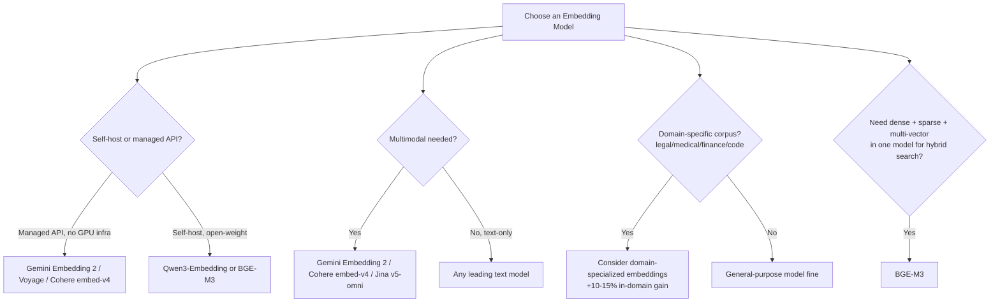

# Module 3: Embeddings and Vector Representations (2026 Model Landscape)

> **Goal of this module:** Understand how embeddings encode meaning as vectors, know the current (2026) embedding model landscape, and build a framework for choosing the right model for a given RAG use case.

---

## 1. How Embeddings Work

- **Embeddings** convert text (or images/audio/video) into dense numeric vectors such that *semantically similar* content ends up *close together* in vector space.
- **Distance metrics** used to measure closeness:

| Metric | Formula intuition | When used |
|---|---|---|
| **Cosine similarity** | Angle between vectors | Most common for text embeddings — ignores magnitude |
| **Euclidean distance** | Straight-line distance | Sensitive to magnitude; used in some clustering setups |
| **Dot product** | Magnitude-weighted similarity | Used when embeddings are trained to encode "relevance strength" via magnitude |

- **Embedding dimensions:** more dimensions can capture more nuance, but cost more storage/compute. Trade-off is central to model selection.
- **Matryoshka Representation Learning (MRL):** trains embeddings so that *truncating* the vector (e.g., 3072 → 256 dims) still yields a usable, if slightly less accurate, representation. This lets one model serve multiple cost/quality tiers.

```mermaid
flowchart LR
    A[Text: 'The cat sat on the mat'] --> B[Embedding Model]
    B --> C[Dense Vector<br/>e.g. 1536 dimensions]
    D[Text: 'A feline rested on the rug'] --> B
    B --> E[Dense Vector<br/>close to C in vector space]
    C -.cosine similarity ~0.9.-> E
```

---

## 2. The 2026 Embedding Model Landscape

### Closed / API Models

| Model | Provider | Standout feature |
|---|---|---|
| **Gemini Embedding 2** | Google | Natively multimodal (text, image, video, audio, PDF); 100+ languages; MRL down to 256 dims; **current multilingual MTEB leader** |
| **voyage-3-large / voyage-4** | Voyage AI | Strong English retrieval; long-context variants |
| **Cohere embed-v4** | Cohere | Multimodal; handles up to 128K tokens without chunking; strong for visual documents (PDFs, catalogs, slides) |
| **text-embedding-3-small/large** | OpenAI | Reasonable defaults, but **no longer state-of-the-art** |

### Open-Weight Models

| Model | Standout feature |
|---|---|
| **Qwen3-Embedding (0.6B–8B)** | Apache 2.0 license; the 8B variant now **outperforms several API models on MTEB**; strong multilingual support |
| **BGE-M3** | Dense + sparse + multi-vector retrieval from **one model** — underrated pragmatic pick for hybrid search |
| **Jina v5-omni** | Universal embeddings spanning text, image, video, and audio |
| **Domain-specialized embeddings** (legal, medical, finance, code) | Outperform generic models by **10–15% in-domain** |

### Decision Framework



---

## 3. Choosing the Right Embedding Model

### 3.1 MTEB / MMTEB Leaderboards — and Their Limits
- MTEB (Massive Text Embedding Benchmark) and MMTEB (multilingual) are the standard reference leaderboards.
- **Limitations:**
  - **Benchmark overfitting** — some models are tuned to score well on MTEB tasks specifically.
  - **English-centric test sets** historically bias results toward English performance.
  - **Public scores don't always transfer to your domain** — this is the single most important caveat.

### 3.2 Dimension Trade-offs

| Dimension | Storage/Compute Cost | Typical Use |
|---|---|---|
| 256 (MRL-compressed) | Lowest | High-volume, cost-sensitive, coarse retrieval |
| 768 | Low-medium | Balanced default for many use cases |
| 1536 | Medium | Higher-fidelity general retrieval |
| 3072 | Highest | Maximum fidelity, complex/nuanced domains |

### 3.3 Cost vs. Quality Framework
- Managed API: no infra to run, pay-per-call, easiest to start.
- Self-hosted (open-weight): higher upfront/ops cost, but better economics at high volume + full data control.
- **Always benchmark on your own data** — a small internal eval set beats trusting a public leaderboard blindly.

---

## 4. LangChain Embeddings Implementation

- `Embeddings` class is the standard interface.
- `embed_documents()` — batch-embeds a list of documents (used during ingestion).
- `embed_query()` — embeds a single query string (used at query time; some models use asymmetric encoding for queries vs. documents, so these are *not* always interchangeable).
- Multimodal embedding APIs in LangChain let you embed image/PDF/audio content alongside text in a shared LangChain-compatible interface.

---

## 5. Quick-Reference Cheat Sheet

- **Best multilingual model (2026):** Gemini Embedding 2.
- **Best open-weight all-rounder:** Qwen3-Embedding (8B variant competitive with API models).
- **Best for hybrid dense+sparse in one model:** BGE-M3.
- **Domain-specialized models** beat generic ones by 10–15% in-domain — always check if one exists for your field.
- **Never trust MTEB blindly** — build your own eval set.

---

## 6. Knowledge Check — Q&A

**Q1. What is Matryoshka Representation Learning (MRL) and why is it useful in production?**
> **A:** MRL trains an embedding model so its vectors can be truncated (e.g., from 3072 to 256 dimensions) while remaining usable, with a graceful quality/size trade-off rather than a cliff. This lets one model serve multiple cost/latency tiers — e.g., use 256-dim for a cheap first-pass filter and full-dim for final precision — without maintaining separate models.

**Q2. Why can't you always trust MTEB leaderboard rankings when picking an embedding model for your RAG system?**
> **A:** MTEB scores can suffer from benchmark overfitting (models tuned specifically to do well on MTEB tasks) and historically skewed toward English-centric test sets. More importantly, public benchmark performance doesn't always transfer to your specific domain and query patterns — the recommended practice is to build a small internal eval set from your own corpus and benchmark candidate models against it.

**Q3. When would you choose BGE-M3 over a single-purpose dense embedding model like text-embedding-3-large?**
> **A:** BGE-M3 produces dense, sparse, and multi-vector representations from a single model, making it a pragmatic choice when you want to build hybrid (dense + sparse/BM25-style) retrieval without maintaining two separate embedding pipelines/models. If you only need pure dense semantic search with no hybrid component, a dedicated dense model may still be simpler.

**Q4. Explain the difference between embed_documents() and embed_query() in LangChain, and why they might not be interchangeable.**
> **A:** `embed_documents()` batch-embeds content for ingestion into the knowledge base, while `embed_query()` embeds a single user query at retrieval time. Some embedding models use asymmetric encoding — queries and documents are embedded with slightly different instructions/prefixes internally (since a short question and a long passage have different structural characteristics) — so using the wrong method for the wrong input type can silently degrade retrieval quality.

**Q5. Your company processes medical records and general customer support tickets in the same RAG system. Would you use one embedding model for both? Why or why not?**
> **A:** Generally no — domain-specialized embeddings (e.g., medical) outperform generic models by 10–15% in-domain, so medical records would likely retrieve better with a medical-specialized embedding model, while general support tickets are fine with a general-purpose model. In practice, you'd likely run two separate embedding pipelines/indices, or at minimum validate via an internal eval set whether a single general model is "good enough" for the medical use case before compromising.

---

## 7. Interview-Style Scenario Questions

**Q6 (Trade-off/Cost Interview).** *"Your startup is cost-constrained and processes 50M documents monthly. The CTO wants to switch from a managed embedding API to self-hosted open-weight embeddings. Walk through your evaluation process."*
> **A (sample strong answer):** First quantify current API cost per million tokens vs. estimated self-hosting cost (GPU instances, ops overhead, on-call burden) at 50M docs/month scale — self-hosting usually wins economically only past a certain volume threshold. Then shortlist open-weight candidates (Qwen3-Embedding 8B, BGE-M3) and benchmark them against the current managed model on an internal eval set built from our own corpus, not public MTEB scores. Check multilingual/domain coverage matches our data. Finally, pilot a shadow deployment (dual-write embeddings from both models) to compare retrieval quality in production before fully cutting over — an 8B model outperforming some API models on MTEB doesn't guarantee it outperforms on *our* specific query distribution.

**Q7 (Architecture Interview).** *"We want to add image and PDF search alongside our existing text RAG system. What embedding-model decisions do you need to make, and what are the trade-offs?"*
> **A (sample strong answer):** Core decision: single multimodal embedding model (e.g., Gemini Embedding 2, Cohere embed-v4, Jina v5-omni) embedding everything into one shared vector space, vs. separate text/image pipelines with a manual alignment step. A unified multimodal model simplifies architecture (one index, one similarity search) and enables true cross-modal search (text query finding relevant images), but may sacrifice some text-only retrieval quality compared to a specialized text embedding model. I'd benchmark both approaches on our actual mixed-content corpus (e.g., product catalogs with charts/tables) before committing, given the modality gap can vary significantly by model.

**Q8 (Debugging Interview).** *"After switching embedding dimensions from 1536 to 256 (via MRL) to cut storage costs, recall@10 dropped by 8 points on legal documents but barely moved on FAQ content. How do you explain this and what would you recommend?"*
> **A (sample strong answer):** Legal documents typically require finer semantic distinctions (precise clause differences, nuanced terminology) that benefit from higher-dimensional representations, while FAQ content tends to have simpler, more distinct semantic clusters that survive compression well. This is a textbook case for a **tiered strategy**: keep higher dimensions (768–1536) for high-stakes, nuance-sensitive corpora like legal, and use the cost-saving 256-dim MRL truncation only for simpler, high-volume content like FAQs — rather than applying one dimension setting uniformly across a heterogeneous corpus.
