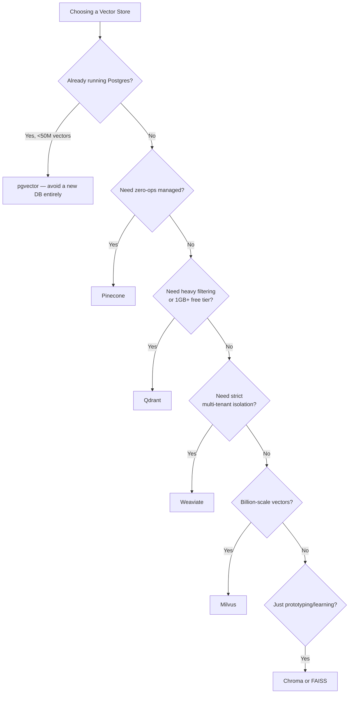
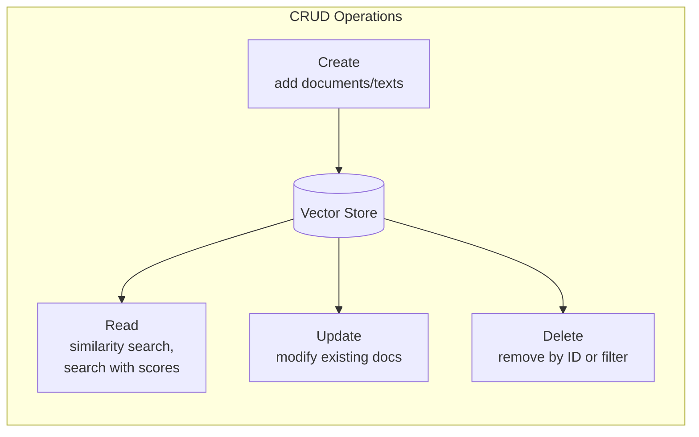

# Module 4: Vector Stores and Retrieval Infrastructure

> **Goal of this module:** Know the 2026 vector store landscape, understand the industry-wide shift toward Postgres/pgvector and hybrid retrieval, and master core CRUD operations for vector stores.

---

## 1. The 2026 Vector Store Landscape

| Store | Type | Best For | Notes |
|---|---|---|---|
| **pgvector (Postgres)** | Embedded/relational | Teams already on Postgres, up to ~50M vectors | **Emerging as the *default* production choice** — avoids running a separate database |
| Chroma | Embedded | Learning, prototyping | Unlimited self-hosted |
| FAISS | Library | High-performance in-process search | Unlimited (library, not a server) |
| Qdrant | Server | Production, filtering-heavy workloads | 1 GB free cloud tier |
| Pinecone | Managed | Zero-ops, sub-50ms p99 at scale | 100K vectors free |
| Weaviate | Server | Multi-tenancy isolation | — |
| Milvus | Server | Billion-scale | Unlimited self-hosted |

### 1.1 Two Major 2026 Trends

**Trend 1 — Consolidation pressure on standalone vector DBs.**
2026 survey data shows adoption share moving **from dedicated vector databases toward Postgres/pgvector and provider-native retrieval** (e.g., Bedrock Knowledge Bases, Azure AI Search) as teams consolidate infrastructure and avoid operating yet another specialized database.

**Trend 2 — Hybrid retrieval is now the consensus default, not an "advanced" feature.**
Intent to adopt hybrid retrieval **roughly tripled in a single quarter** in early-2026 survey data — driven by teams hitting quality limits with vector-only search at agentic scale (agents making many retrieval calls amplify the cost of weak retrieval).

> **Why this matters for interviews:** If asked "what vector DB would you pick," the *strong* 2026 answer isn't just naming a tool — it's reasoning about whether you even need a dedicated vector DB versus extending your existing Postgres instance.

---

## 2. Vector Store Operations (CRUD)

| Operation | What it does | Common pitfalls |
|---|---|---|
| **Create** | Add new documents/texts (and their embeddings) to the store | Forgetting to attach metadata at creation time — retrofitting metadata later is painful |
| **Read** | `similarity_search()`, search with relevance scores | Not checking relevance scores — a "top result" can still be a bad match if the score is low |
| **Update** | Modify existing documents (e.g., re-embed after doc changes) | Stale embeddings if the underlying doc changes but isn't re-indexed — a major cause of silent quality drift |
| **Delete** | Remove documents by ID or by metadata filter | Orphaned vectors left behind if delete-by-filter doesn't match your intended metadata schema |

**Lab takeaway:** Build a full CRUD app on pgvector or Qdrant — this is the single most common "hands-on" ask in interviews and take-home assignments, because it proves you understand the vector store isn't just a black box for `similarity_search()`.

---

## 3. Quick-Reference Cheat Sheet

- **Default 2026 pick for most teams:** pgvector (if already on Postgres).
- **Zero-ops managed:** Pinecone.
- **Heavy filtering / good free tier:** Qdrant.
- **Multi-tenancy isolation:** Weaviate.
- **Billion-scale:** Milvus.
- **Prototyping:** Chroma or FAISS.
- **Macro trend:** consolidation toward Postgres-native + provider-native retrieval; hybrid search adoption intent tripled in early 2026.

---

## 4. Knowledge Check — Q&A

**Q1. Why is pgvector becoming the "default" production vector store choice in 2026 rather than a dedicated vector database?**
> **A:** Most teams already run Postgres for their application data. pgvector lets them add vector search capability without standing up, operating, and paying for an entirely separate specialized database — reducing infrastructure complexity, operational surface area, and cost, while still scaling to roughly 50M vectors, which covers a large share of real-world use cases.

**Q2. What's the difference between Create and Update operations in a vector store CRUD workflow, and why does skipping proper Update handling cause silent bugs?**
> **A:** Create adds new documents/embeddings; Update modifies existing ones (typically re-embedding after the source document changes). If a team only implements Create/Delete but not proper Update, then edited source documents leave stale, outdated embeddings in the index — the system will keep confidently retrieving outdated content, which is a hard-to-detect quality regression since nothing "errors out."

**Q3. Explain why "hybrid retrieval adoption intent tripled in early 2026" according to survey data. What was driving this shift?**
> **A:** Teams were hitting quality limits with vector-only (pure dense/semantic) search, especially as retrieval scaled up in **agentic** systems where agents make many retrieval calls — any weakness in retrieval (e.g., missing exact-match terms like product codes or names that dense embeddings handle poorly) gets amplified across many agent steps. This pushed hybrid dense+sparse retrieval from an "advanced/optional" technique to the consensus default.

**Q4. You need strict data isolation between multiple enterprise customers sharing one RAG deployment. Which vector store from the landscape would you lean toward, and why?**
> **A:** Weaviate, since it's specifically noted as best-for multi-tenancy isolation among the listed stores. That said, in a real interview you'd also want to confirm the isolation *pattern* (Silo/Pool/Bridge — covered in Module 11) required by the compliance requirements, since even a multi-tenancy-capable store can be configured with weaker (Pool) or stronger (Silo) isolation guarantees.

**Q5. What's a key risk of relying purely on `similarity_search()`'s top result without checking relevance scores?**
> **A:** The top result is only the *best available* match among what's indexed — if nothing in the knowledge base is actually relevant to the query, `similarity_search()` will still return *something*, just with a low relevance score. Ignoring scores means your system can confidently present irrelevant content as if it were a good match, driving hallucination downstream in the generator. Production systems should apply a similarity/relevance threshold (Module 5.2) rather than blindly trusting top-k.

---

## 5. Interview-Style Scenario Questions

**Q6 (Architecture/Cost Interview).** *"Your team runs a Postgres-based SaaS app and wants to add RAG search over user-uploaded documents (~10M vectors expected). A vendor is pushing you toward Pinecone. How do you evaluate this decision?"*
> **A (sample strong answer):** At ~10M vectors, well within pgvector's comfortable range (up to ~50M), I'd seriously question the need for a new managed vector DB. I'd compare: (1) operational cost of running yet another external service (Pinecone) vs. extending the existing Postgres infrastructure the team already operates and monitors, (2) latency requirements — if we need guaranteed sub-50ms p99 at high scale, Pinecone's managed infra has an edge, but pgvector with proper indexing (HNSW) is often sufficient for most SaaS query volumes, (3) data residency/compliance — keeping vectors in the same DB as the rest of user data can simplify compliance stories. Given the 2026 industry trend toward consolidation onto Postgres-native retrieval, I'd lean pgvector unless we have a specific, measured latency/scale requirement that pgvector can't meet.

**Q7 (Debugging Interview).** *"Users report that after editing their uploaded documents, the chatbot still answers using the old, outdated version of the content. Diagnose this using CRUD concepts."*
> **A (sample strong answer):** This is a classic missing-Update bug. The edit flow likely only writes the new document to the source-of-truth store but never triggers a re-embed + Update (or delete-and-recreate) of the corresponding vectors in the vector store — so stale embeddings from the original version remain indexed and keep getting retrieved. Fix: the document edit pipeline needs to trigger re-chunking + re-embedding + an Update (or Delete-then-Create) operation against the vector store as part of the same transaction/workflow, ideally with a versioning scheme so partial failures don't leave orphaned old vectors.

**Q8 (Scaling Interview).** *"Your agentic RAG system is now making 5-10 retrieval calls per user query (multi-step reasoning), and vector-only search quality is becoming the bottleneck at scale. What infrastructure and retrieval-strategy changes would you recommend?"*
> **A (sample strong answer):** This matches the exact pattern driving the 2026 shift toward hybrid retrieval as the consensus default — agentic systems amplify any weakness in a single retrieval call across many steps. I'd recommend moving from vector-only similarity search to hybrid dense+sparse (BM25) retrieval with Reciprocal Rank Fusion, plus adding a reranking stage so each of the 5-10 agent retrieval calls returns higher-precision results rather than more noise. On the infra side, I'd evaluate whether the current vector store supports efficient hybrid queries natively (e.g., Qdrant, Weaviate, or pgvector + a Postgres full-text search extension) rather than bolting BM25 on as a separate uncoordinated system.
