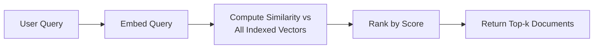
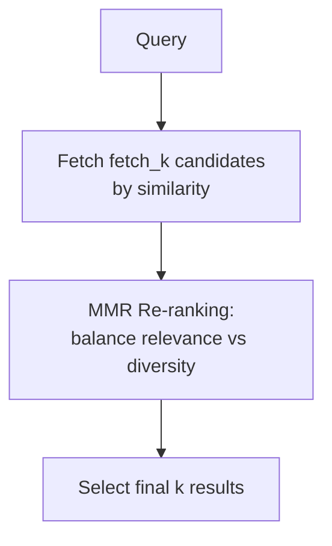
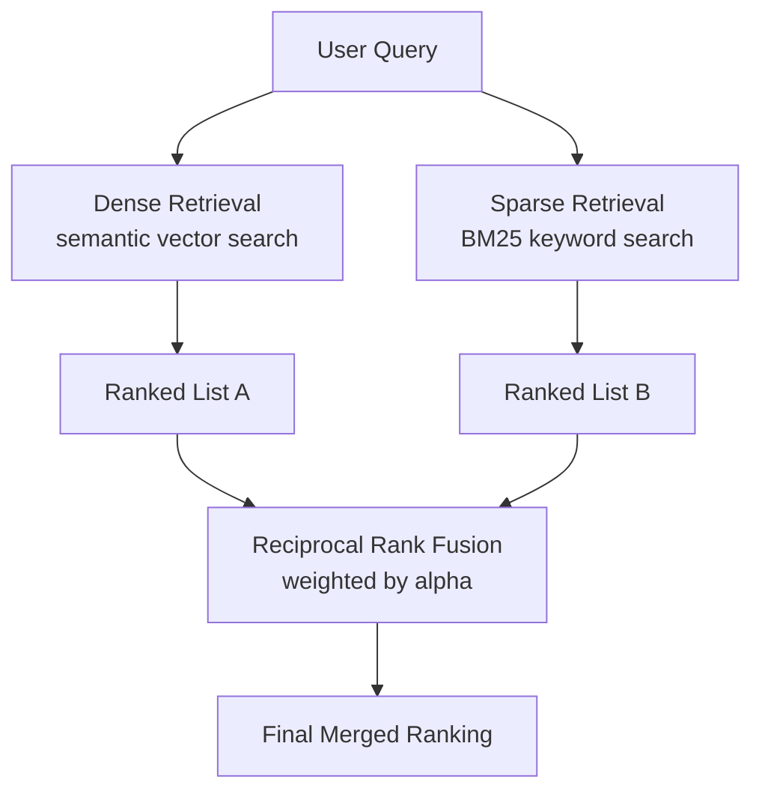

# Module 5: Basic Retrieval Techniques

> **Goal of this module:** Master the foundational retrieval mechanisms every RAG system builds on — similarity search, thresholds, MMR for diversity, and hybrid search (the new 2026 baseline).

---

## 1. Similarity Search Fundamentals

- **How it works:** embed the query → compute distance (cosine/dot/Euclidean) between query vector and all indexed chunk vectors → return the `k` closest.
- **Key API:** `similarity_search()` — returns top-k documents.
- **Search with relevance scores:** returns documents *with* their similarity score attached, so you can inspect/filter on confidence.
- **Configuring `k`:** too small → miss relevant context; too large → noise dilutes the prompt (and worsens context-cliff effects from Module 2).

---

## 2. Similarity Score Threshold

- **Why it matters:** without a threshold, `similarity_search()` always returns *something* — even irrelevant results — which can feed hallucination downstream.
- **LangChain search type:** `similarity_score_threshold` — only returns documents above a minimum score.
- **Use case:** "If nothing scores above 0.75, tell the user we don't have relevant information" instead of forcing a low-confidence answer.

---

## 3. MMR (Maximal Marginal Relevance)

- **Purpose:** balances **relevance** to the query against **diversity** among results — prevents returning 5 near-duplicate chunks that all say the same thing.
- **Lambda (λ) parameter:**

| λ value | Behavior |
|---|---|
| λ = 1 | Pure relevance (behaves like standard similarity search) |
| λ = 0 | Pure diversity (maximizes spread, may sacrifice relevance) |
| λ ≈ 0.5–0.7 | Typical balanced setting |

- **`fetch_k` vs `k`:** `fetch_k` is the larger candidate pool pulled initially (e.g., top 20), from which MMR then selects a diverse `k` (e.g., top 5) — this two-stage design is what lets MMR balance relevance and diversity.
- **Use cases:** summarization tasks (want broad coverage, not 5 copies of the same fact), complex/multi-faceted queries.

---

## 4. Hybrid Search

### Why hybrid beats pure semantic search
Dense (semantic) vectors are great at capturing *meaning* but weak at **exact-match terms**: product codes, error messages, legal citations, proper names. Sparse retrieval (BM25/keyword) excels precisely where dense fails.

| Retrieval type | Strength | Weakness |
|---|---|---|
| **Dense (semantic)** | Understands paraphrase, meaning, concepts | Misses exact tokens (SKU-1234, "§4.2(b)", error codes) |
| **Sparse (BM25/keyword)** | Nails exact-match terms | Misses semantic paraphrase, synonyms |
| **Hybrid (dense + sparse)** | Best of both — now the **2026 industry baseline** | Slightly higher complexity/cost to run two retrieval systems |

### How to combine: Reciprocal Rank Fusion (RRF)
- Merges two ranked lists (dense results + sparse results) into one final ranking, without needing score normalization between fundamentally different scoring systems.
- **Alpha parameter:** controls the weighting between dense and sparse contributions when blending scores.

**LangChain implementation:** `BM25Retriever` + `EnsembleRetriever` (combines multiple retrievers with configurable weights).

> **2026 framing:** Hybrid search is no longer an "advanced technique" — it's the **baseline every production system should clear** before adding anything fancier (reranking, GraphRAG, etc.).

---

## 5. Quick-Reference Cheat Sheet

| Technique | Solves | Key knob |
|---|---|---|
| Similarity search | Basic retrieval | `k` |
| Score threshold | Filtering out irrelevant/low-confidence results | Threshold value |
| MMR | Redundant/duplicate results | λ (lambda), `fetch_k` |
| Hybrid search | Missing exact-match terms | alpha (dense/sparse weight), RRF |

---

## 6. Knowledge Check — Q&A

**Q1. Why does pure semantic (dense) search struggle with queries like "find document mentioning error code E-4021"?**
> **A:** Dense embeddings encode overall semantic meaning, not precise token-level exact matches. An error code is essentially an arbitrary identifier with no inherent "meaning" for the embedding model to latch onto — the embedding might place semantically similar troubleshooting docs nearby but won't reliably prioritize the one document containing that literal string. Sparse/keyword retrieval (BM25) handles this natively because it directly matches tokens.

**Q2. Explain MMR's lambda parameter and describe a scenario where you'd set it close to 0 vs. close to 1.**
> **A:** Lambda controls the trade-off between relevance and diversity: λ=1 behaves like pure similarity search (max relevance, possible redundancy); λ=0 maximizes diversity (may include less-relevant-but-different results). Set λ close to 1 for precise factoid lookups where you want the single best answer repeated confirmation isn't useful. Set λ closer to 0 (or a balanced 0.5–0.7) for summarization or broad research queries where you want to cover multiple distinct facets of a topic rather than five chunks repeating the same point.

**Q3. What problem does the `similarity_score_threshold` search type solve that plain `similarity_search()` does not?**
> **A:** Plain `similarity_search()` always returns the top-k results regardless of how relevant they actually are — if the knowledge base has nothing relevant, it will still return the "least irrelevant" documents, which can mislead the generator into hallucinating an answer from weak context. `similarity_score_threshold` filters out results below a minimum confidence score, allowing the system to explicitly detect "no good match found" and respond accordingly (e.g., "I don't have information on that").

**Q4. Describe how Reciprocal Rank Fusion (RRF) combines dense and sparse retrieval results, and why it's preferred over simply averaging raw scores.**
> **A:** RRF merges two independently ranked lists (e.g., dense semantic ranking and BM25 sparse ranking) by combining each document's *rank position* across both lists into a fused score, rather than combining raw similarity scores directly. This matters because dense cosine-similarity scores and BM25 keyword scores are on completely different, non-comparable scales — averaging them directly would be meaningless without careful normalization. Rank-based fusion sidesteps that scale-mismatch problem.

**Q5. What is the relationship between `fetch_k` and `k` in MMR, and why does MMR need both instead of just `k`?**
> **A:** `fetch_k` is the larger initial candidate pool retrieved by similarity (e.g., top 20 by relevance), from which MMR then selects a smaller, diversity-optimized final set of `k` results (e.g., top 5). MMR needs a larger candidate pool to have enough options to choose a genuinely diverse subset from — if you only fetched exactly `k` candidates by similarity first, there'd be nothing left to diversify against.

---

## 7. Interview-Style Scenario Questions

**Q6 (Practical Debugging Interview).** *"Users searching for 'invoice #INV-2024-8837' get irrelevant results even though that exact invoice document exists in the knowledge base. What's likely wrong, and how do you fix it?"*
> **A (sample strong answer):** This is the textbook failure mode of pure dense/semantic retrieval on exact-match identifiers — the embedding model has no strong signal to prioritize an arbitrary alphanumeric string like "INV-2024-8837," so it may retrieve semantically similar invoice documents instead of the exact one. Fix: implement hybrid search combining dense retrieval with BM25/sparse keyword retrieval via an `EnsembleRetriever`, and combine results with Reciprocal Rank Fusion. The sparse/BM25 component will reliably surface exact token matches like the invoice number, while dense retrieval still handles conceptual queries. I'd also consider adding metadata filtering (e.g., extracting invoice numbers as structured metadata at ingestion) as a more surgical exact-match solution if this query pattern is common.

**Q7 (System Design Interview).** *"You're building a RAG system for research paper summarization, where users ask broad questions like 'what are the main approaches to X in this literature?' How would you configure retrieval differently than for a customer-support FAQ bot?"*
> **A (sample strong answer):** For broad, multi-faceted research questions, I'd favor MMR over plain similarity search, with a lower lambda (~0.5) to intentionally surface diverse papers/approaches rather than five chunks all describing the same dominant approach — this directly matches MMR's stated use case for summarization and complex queries. I'd also increase `fetch_k` to pull a wider candidate pool before MMR re-ranks for diversity. In contrast, a FAQ bot answering "what's your return policy" wants the single most relevant, precise chunk — plain similarity search or MMR with λ close to 1 is more appropriate there, since redundancy isn't a real problem for narrow factoid queries.

**Q8 (Trade-off/Architecture Interview).** *"Your team currently only uses dense vector search. Leadership wants to know if adding hybrid search is worth the added complexity. Make the case, and mention any risk/cost you'd flag."*
> **A (sample strong answer):** The case for hybrid: dense-only retrieval systematically misses exact-match content (product codes, names, citations, error messages) that's often exactly what enterprise users search for — and 2026 industry survey data shows hybrid retrieval intent roughly tripling in a single quarter as teams hit this exact quality ceiling, especially in agentic systems that make many retrieval calls. I'd frame hybrid search as the new industry *baseline*, not a nice-to-have. Costs/risks to flag: running two retrieval systems (vector index + BM25 index) adds infra complexity and requires tuning the alpha/fusion weighting (RRF) — I'd propose a scoped pilot (`EnsembleRetriever` + RRF) measured against our own eval set (recall@k, precision@k) before a full rollout, so we quantify the actual lift rather than adopting it purely because it's trendy.
