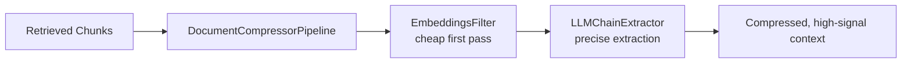
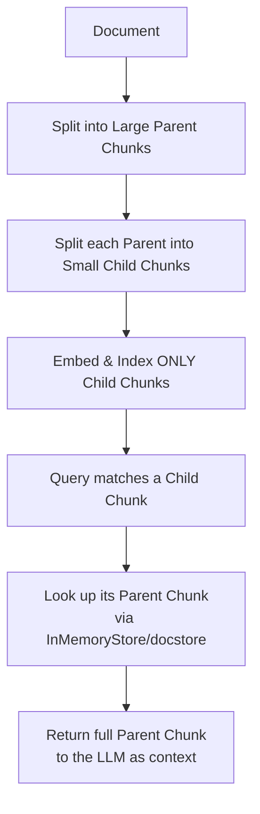
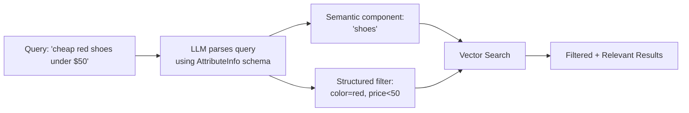
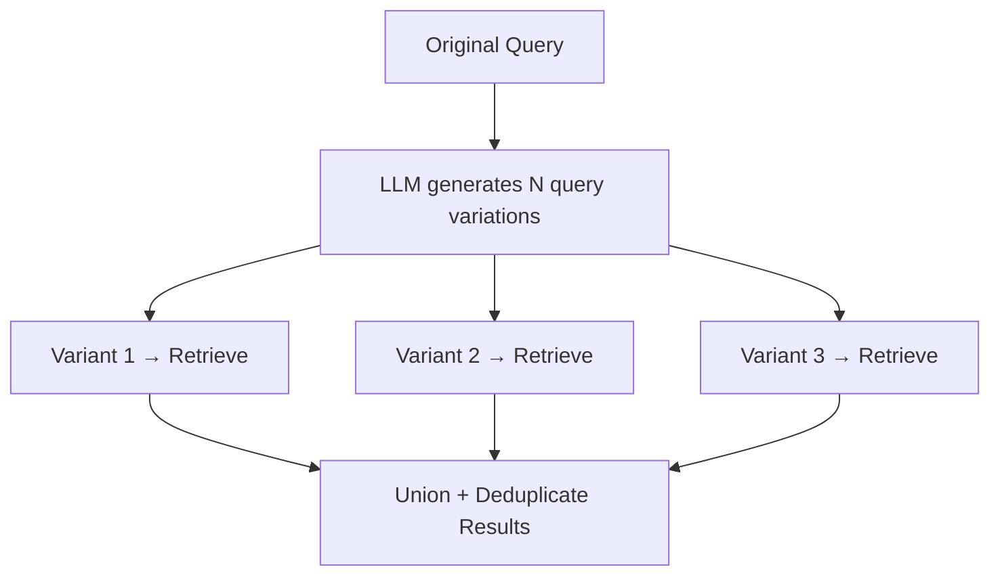
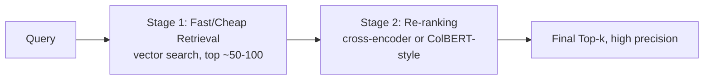

# Module 6: Advanced Retrieval Techniques

> **Goal of this module:** Go beyond basic similarity search — compression, parent-child retrieval, self-query, multi-query expansion, and late-interaction/reranking.

---

## 1. Contextual Compression

- **Problem it solves:** raw retrieved chunks often contain irrelevant filler alongside the useful sentence(s) — wasting context budget and diluting signal.
- **Key tools:**

| Tool | What it does |
|---|---|
| `LLMChainExtractor` | Uses an LLM to extract only the relevant portion of each retrieved doc |
| `EmbeddingsFilter` | Filters out retrieved docs below an embedding-similarity threshold, cheaper than an LLM call |
| `DocumentCompressorPipeline` | Chains multiple compressors/filters together (e.g., embeddings filter → LLM extractor) |

---

## 2. Parent Document Retriever

### The Chunk-Size Dilemma
- **Small chunks** → precise matching during retrieval, but lack surrounding context for the LLM to generate a good answer.
- **Large chunks** → good context for generation, but dilute the embedding signal, hurting match precision.

### The Solution: Retrieve Small, Serve Large

- **Child chunks** are what get embedded and searched — small and precise.
- **Parent chunks** are what get returned to the LLM — large and context-rich.
- Implementation: `InMemoryStore` (or another docstore) maps child-chunk IDs back to their parent document/chunk.

---

## 3. Self-Query Retriever

- **Purpose:** convert a natural-language query containing implicit filters into a **structured query** (semantic search + metadata filter) automatically.
- Example: *"cheap red running shoes under $50"* → semantic search on "running shoes" + structured filters `{color: red, price: <50}`.
- **`AttributeInfo`:** defines the metadata schema (field names, types, descriptions) the LLM uses to know which filters are extractable.
- **Automatic filter extraction:** the LLM parses the query and outputs both a semantic search string and a structured filter object.

**Use case:** product catalog search — the classic example for this technique.

---

## 4. Multi-Query Retriever

- **Purpose:** improve **recall** by generating multiple *reformulations* of the user's query via an LLM, running retrieval for each, and merging/deduplicating results.
- Example: "What causes inflation?" → LLM generates variants like "factors driving rising prices," "causes of currency devaluation," "why does inflation happen" — each retrieves slightly different relevant chunks.
- **Trade-off:** more LLM calls (one per query variant) + more retrieval calls = higher latency/cost, in exchange for better recall on ambiguous or narrowly-phrased queries.

---

## 5. Late-Interaction and Re-ranking

### Two-Stage Retrieval Pattern

| Technique | How it works | Trade-off |
|---|---|---|
| **Late-interaction (ColBERT-style)** | Preserves **token-level** representations instead of collapsing to a single vector per chunk; compares query and doc tokens directly at search time | Better accuracy, but higher storage/compute cost — increasingly used as a **re-ranking layer**, not primary retrieval |
| **Cross-encoder re-rankers** | Jointly encode query+document pair through a transformer to produce a precise relevance score | Much more accurate than bi-encoder similarity, but too slow/expensive to run over the *entire* corpus — only applied to a small candidate set (top 50-100) |
| **Cohere Rerank** | Managed API implementing cross-encoder-style reranking | Easy to integrate as a second-stage filter |

**Why two-stage retrieval?** Bi-encoder vector search (Stage 1) is fast enough to scan millions of documents but less accurate. Cross-encoders/late-interaction (Stage 2) are far more accurate but too slow to run on the whole corpus — so you use fast retrieval to narrow the field, then expensive reranking to pick the best few.

---

## 6. Quick-Reference Cheat Sheet

| Technique | Solves | Cost trade-off |
|---|---|---|
| Contextual Compression | Noisy/bloated retrieved chunks | Extra LLM/filter call |
| Parent Document Retriever | Small-chunk precision vs. large-chunk context conflict | Slight storage/lookup overhead |
| Self-Query Retriever | Queries with implicit structured filters | Requires well-defined metadata schema |
| Multi-Query Retriever | Low recall from a single narrow query phrasing | N extra LLM + retrieval calls |
| Reranking (cross-encoder/ColBERT) | Bi-encoder search's precision ceiling | Latency of reranking step |

---

## 7. Knowledge Check — Q&A

**Q1. Explain the "chunk-size dilemma" and how the Parent Document Retriever resolves it.**
> **A:** Small chunks embed precisely (better search matching) but lack context for good generation; large chunks give the LLM good context but dilute the embedding signal, hurting match precision. The Parent Document Retriever resolves this by decoupling what's *searched* from what's *served*: small child chunks are embedded and matched during retrieval, but once a child chunk matches, its larger parent chunk (stored in a docstore like `InMemoryStore`) is what's actually returned to the LLM — getting precision and context simultaneously.

**Q2. When would you use Multi-Query Retriever, and what's the main cost of using it?**
> **A:** Use it when a single query phrasing is likely too narrow to capture all relevant documents — e.g., ambiguous or broadly-scoped questions where users phrase things differently than the source documents. The LLM generates several reformulations, each retrieved separately, then results are merged/deduplicated to improve recall. The main cost is latency and expense: N query variants mean N LLM calls to generate them plus N retrieval calls, compared to a single retrieval pass.

**Q3. What's the difference between a bi-encoder (used in standard vector search) and a cross-encoder (used in reranking), and why can't you just use a cross-encoder for all retrieval?**
> **A:** A bi-encoder embeds the query and each document *independently* into vectors, then compares them via a cheap similarity metric (cosine, dot product) — this allows pre-computing document embeddings once and searching millions of them fast. A cross-encoder jointly processes the query and document *together* through a transformer, producing a much more accurate relevance score, but this can't be precomputed (it requires the specific query) and is too slow to run over an entire large corpus. That's why cross-encoders are used only as a second-stage reranker over a small candidate set already narrowed down by fast bi-encoder retrieval.

**Q4. Describe how Self-Query Retriever would handle the query "affordable legal contracts about NDAs signed after 2023" in a document management system.**
> **A:** Self-Query Retriever would use an LLM (guided by an `AttributeInfo` schema defining fields like `document_type`, `price_tier`, `date_signed`) to split this into a semantic component ("legal contracts about NDAs") and a structured filter (`date_signed > 2023`, possibly `price_tier = affordable` if such metadata exists). It then runs a combined vector search + metadata filter query, rather than relying purely on semantic similarity to interpret "after 2023," which vector embeddings handle poorly since dates aren't well-represented by semantic similarity.

**Q5. What's the purpose of `EmbeddingsFilter` in a `DocumentCompressorPipeline`, and why put it before an `LLMChainExtractor`?**
> **A:** `EmbeddingsFilter` removes retrieved documents that fall below a similarity threshold using a cheap embedding-based comparison, before the more expensive `LLMChainExtractor` step runs. Ordering it first acts as a cost-efficient pre-filter — no point paying for an LLM call to extract relevant content from a document that's already clearly irrelevant by embedding similarity.

---

## 8. Interview-Style Scenario Questions

**Q6 (System Design Interview).** *"Your RAG system retrieves technically-relevant chunks, but the LLM's answers feel thin/lacking context, because you use small 150-token chunks for precision. How do you fix this without hurting retrieval precision?"*
> **A (sample strong answer):** This is the exact chunk-size dilemma the Parent Document Retriever is designed for. I'd keep the current small (150-token) chunks as *child* chunks for embedding/search precision, but wrap them with larger parent chunks (e.g., full paragraphs or sections) stored in a docstore. At query time, matches happen against the precise small child chunks, but the system resolves each match to its parent chunk before passing context to the LLM — giving the generator much richer surrounding context without sacrificing the retrieval precision that small chunks provide.

**Q7 (Latency/Cost Trade-off Interview).** *"Product wants to add Multi-Query Retriever to improve recall on ambiguous user questions, but engineering is worried about latency in a real-time chat UI. How do you balance this?"*
> **A (sample strong answer):** Multi-Query trades latency/cost for recall — each additional query variant means another LLM generation call plus another retrieval call, which compounds in a synchronous request path. I'd propose: (1) limit variant generation to 2-3 reformulations instead of, say, 5+, (2) run the retrieval calls for each variant in *parallel* rather than sequentially to minimize wall-clock latency impact, (3) use a cheaper/faster LLM for the query-reformulation step since it's a simple templated task, not requiring frontier-model reasoning, and (4) measure with our eval set whether the recall gain is even necessary for this specific query pattern — if most user queries are already well-formed, multi-query may add cost without meaningful benefit, so consider scoping it to only trigger when initial retrieval confidence is low.

**Q8 (Production Debugging Interview).** *"After adding a cross-encoder reranking stage, end-to-end latency roughly doubled, and the team wants to know if it's worth keeping. How do you evaluate that decision?"*
> **A (sample strong answer):** I'd quantify the actual quality lift from reranking using retrieval-specific metrics (recall@k / precision@k delta, as the hands-on lab suggests) — if reranking meaningfully improves precision on our eval set (e.g., moving the truly-relevant chunk from position 8 to position 1 within the returned context), that's a real quality win worth the latency cost, especially since generation quality is highly sensitive to *which* chunks make it into the limited context window (recall the context-cliff effect from Module 2). To recover latency, I'd explore: reducing the Stage 1 candidate pool size fed into the reranker (e.g., rerank top 20 instead of top 100), using a lighter-weight reranker for latency-sensitive paths, or reserving the expensive reranking stage only for queries where Stage 1 confidence scores are ambiguous/low, rather than applying it universally.
