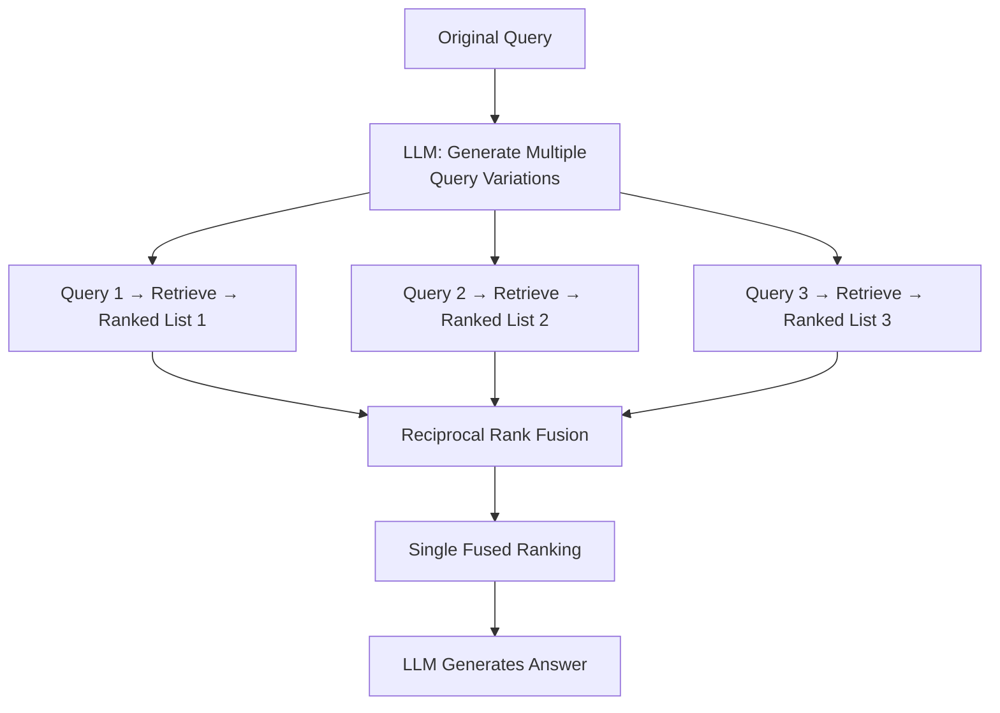
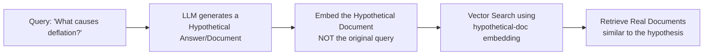
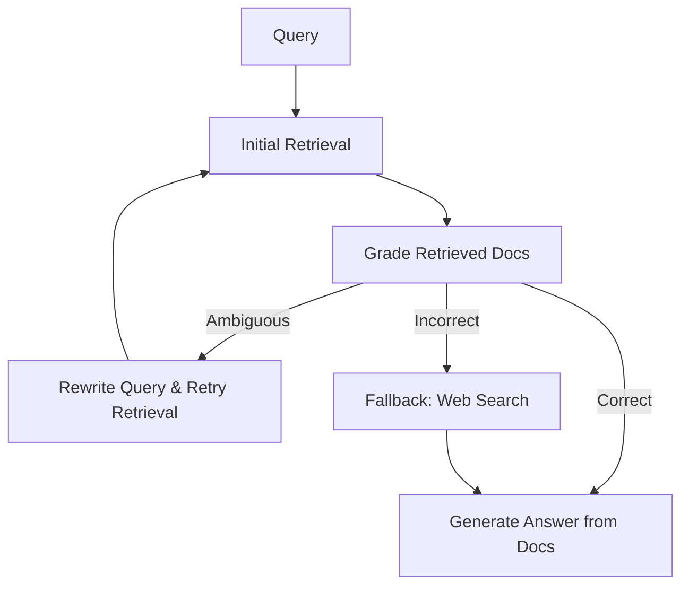
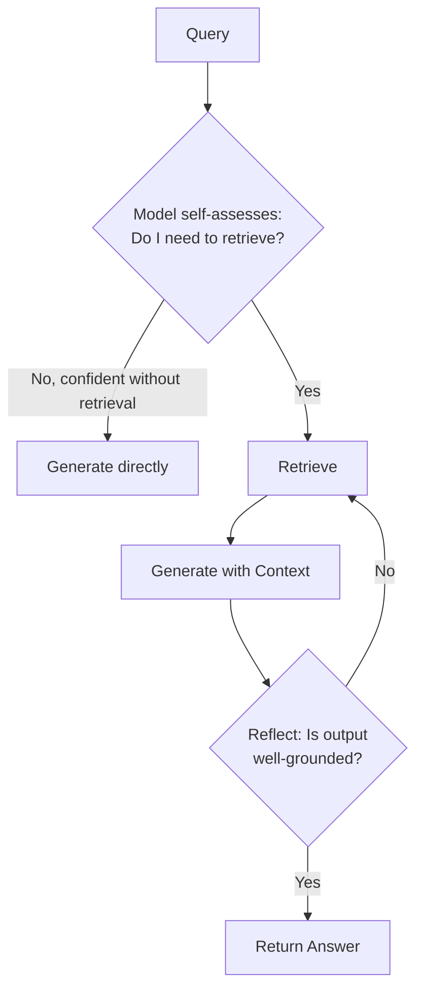
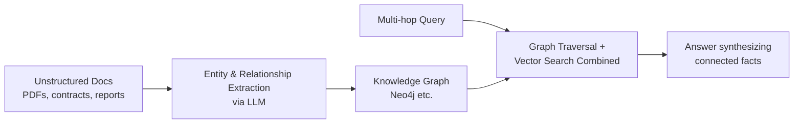

# Module 7: Advanced RAG Patterns

> **Goal of this module:** Learn the named architectural patterns that go beyond simple retrieve-then-generate: RAG Fusion, HyDE, Corrective RAG, Self-RAG, and GraphRAG.

---

## 1. RAG Fusion

- **What it is:** Generate multiple query variations (like Multi-Query Retriever) → retrieve for each → merge with **Reciprocal Rank Fusion (RRF)** into one ranked list.
- **Difference from plain Multi-Query Retriever:** RAG Fusion specifically uses RRF to intelligently merge/rank the multiple result sets, rather than a simple union/deduplication.

**Trade-off:** comprehensiveness (better coverage of relevant docs) vs. latency (multiple LLM + retrieval round trips before generation even starts).

---

## 2. HyDE (Hypothetical Document Embeddings)

### The Core Idea
Queries and documents are often phrased very differently (a question vs. an answer/statement) — this is the **query-document semantic gap**. HyDE bridges it by having an LLM *hallucinate* a plausible answer first, then embedding *that* hypothetical answer to search — because a hypothetical answer looks structurally more like the real answer documents than the raw question does.

> **Key insight:** The hypothetical document doesn't need to be factually correct — it just needs to be *stylistically/structurally similar* to what a real answer document would look like, so its embedding lands in the right neighborhood of vector space.

---

## 3. Corrective RAG (CRAG)

**Purpose:** add a self-correcting feedback loop when initial retrieval fails or is low-quality.

### Components
1. **Document relevance grading** — an LLM (or classifier) scores each retrieved doc as Correct / Ambiguous / Incorrect.
2. **Web search fallback** — if retrieved docs are graded poor, fall back to a live web search instead of forcing an answer from bad context.
3. **Query rewriting** — if retrieval fails, rewrite the query and retry before falling back further.

**Built with:** LangGraph (explicit state machine with conditional branches maps naturally onto CRAG's grade → branch → retry logic).

---

## 4. Self-RAG

- **Core idea:** the model uses **reflection tokens** to decide, at each step, whether it even *needs* to retrieve, and whether its own generated output is well-supported by retrieved evidence.
- **Query complexity classification:** simple factual/opinion queries the model already "knows" confidently don't need retrieval at all — this **reduces unnecessary retrieval calls**, saving latency/cost.
- **Self-correction:** after generating, the model can reflect and flag/revise if its output isn't well grounded in retrieved context.

**Contrast with CRAG:** CRAG grades the *retrieved documents*; Self-RAG reflects on *whether to retrieve at all* and on the *generated output's* grounding.

---

## 5. Graph RAG

### Why GraphRAG?
Vector-only RAG treats each chunk independently — great for "what does X say," weak for **multi-hop** questions like *"How is Company A connected to Company B through their board members?"* GraphRAG builds a knowledge graph of entities and relationships, letting the system traverse connections that pure vector similarity can't represent.

| Aspect | Vector-only RAG | GraphRAG |
|---|---|---|
| Best at | Direct factual lookup, semantic similarity | Multi-hop relationship queries ("how are X and Y connected") |
| Cost | Lower — just embed & index | Higher — requires entity/relationship extraction and graph indexing |
| When it's overkill | — | Corpora with weak entity structure (e.g., loosely-related FAQs) |

**Graph-aware agents:** Coupling GraphRAG with planning agents for program-level questions and root-cause analysis — increasingly common in **finance, legal, and operations** use cases (e.g., "trace how this compliance failure propagated across departments").

**When to use vs. skip:** Use GraphRAG when questions inherently require connecting multiple entities/relationships. Skip it (extra indexing cost/latency isn't worth it) when the corpus has weak entity structure or questions are simple lookups.

---

## 6. Quick-Reference Comparison Table

| Pattern | Core Mechanism | Solves | Cost |
|---|---|---|---|
| **RAG Fusion** | Multi-query + RRF merge | Query phrasing narrowness | Multiple LLM+retrieval calls |
| **HyDE** | Embed a hypothetical answer, not the query | Query–document semantic gap | One extra LLM call |
| **Corrective RAG (CRAG)** | Grade retrieved docs → fallback to web search / rewrite | Bad/irrelevant retrieval | Conditional extra calls (grading + fallback) |
| **Self-RAG** | Reflection tokens decide when to retrieve/self-correct | Unnecessary retrieval calls, ungrounded output | Model needs reflection-token training/prompting |
| **GraphRAG** | Knowledge graph + traversal | Multi-hop relationship questions | Graph extraction & indexing overhead |

---

## 7. Knowledge Check — Q&A

**Q1. Explain the "query-document semantic gap" that HyDE is designed to solve, with an example.**
> **A:** Questions and their answers are often phrased very differently — e.g., the query "What causes deflation?" is structurally a question, while the actual answer document is a declarative explanation ("Deflation occurs when..."). Dense embeddings can struggle to match these different structures even when they're topically related. HyDE bridges this by having an LLM first generate a *hypothetical* declarative answer, then embedding that hypothetical answer (which structurally resembles real answer documents) to perform the search — rather than embedding the raw question.

**Q2. What's the difference between Corrective RAG's document grading and Self-RAG's reflection tokens?**
> **A:** CRAG grades the *retrieved documents themselves* (Correct/Ambiguous/Incorrect) and branches into query rewriting or web-search fallback based on that grade — it's a correction mechanism applied *after* retrieval happens. Self-RAG uses reflection tokens to let the model decide, *before* retrieving, whether retrieval is even necessary for a given query (query complexity classification), and can also reflect on whether its *generated output* is well-grounded, potentially triggering re-retrieval. CRAG corrects bad retrieval; Self-RAG decides whether to retrieve at all and checks its own output.

**Q3. When is GraphRAG a better choice than vector-only RAG, and when is it "overkill"?**
> **A:** GraphRAG is better for multi-hop questions requiring connecting multiple entities and relationships (e.g., "how are X and Y connected"), which vector-only RAG handles poorly since it treats chunks independently. It's overkill for corpora with weak entity structure (e.g., a loosely related FAQ collection) where the added indexing cost/latency of building and maintaining a knowledge graph isn't justified by the query patterns actually being asked.

**Q4. How does RAG Fusion differ from a simple Multi-Query Retriever, given both generate multiple query variations?**
> **A:** Both generate multiple query reformulations and retrieve for each, but RAG Fusion specifically applies Reciprocal Rank Fusion to intelligently merge the multiple ranked result lists into a single fused ranking (accounting for documents that appear across multiple variant result sets), rather than a simpler union/deduplication approach. This makes the final ranking more robust to noise in any single query variant.

**Q5. Why does Self-RAG's ability to skip unnecessary retrieval matter for production systems?**
> **A:** Retrieval adds latency and cost on every call. Many queries (simple greetings, general knowledge the model is confident about, opinion questions) don't actually benefit from retrieval — forcing retrieval on every query wastes resources and can even hurt quality if irrelevant retrieved context gets stuffed into the prompt. Self-RAG's query complexity classification lets the system reserve retrieval (and its cost) for queries that genuinely need grounding in the knowledge base.

---

## 8. Interview-Style Scenario Questions

**Q6 (System Design Interview).** *"Users ask short, vague questions like 'why did our revenue drop?' and retrieval consistently returns weak/irrelevant chunks because the vague question doesn't semantically match detailed financial report language. What pattern would you apply?"*
> **A (sample strong answer):** This is a textbook query-document semantic gap — the vague question doesn't structurally resemble the detailed financial report content it should retrieve. I'd apply HyDE: have the LLM generate a hypothetical detailed answer to "why did revenue drop" (even if not factually correct yet), embed that hypothetical answer, and use it to search. Since the hypothetical answer would be phrased more like an actual financial analysis (mentioning terms like "market conditions," "churn," "pricing changes"), it should land closer in vector space to the real relevant report sections than the vague original question would.

**Q7 (Architecture/Reliability Interview).** *"Your RAG system occasionally hallucinates because the retrieved documents are stale or simply don't cover the user's question, but the system still forces an answer from whatever was retrieved. How would you redesign this for reliability?"*
> **A (sample strong answer):** I'd implement Corrective RAG (CRAG): add a document-relevance grading step immediately after retrieval that classifies retrieved docs as Correct/Ambiguous/Incorrect using an LLM or classifier. If graded Correct, proceed to generate normally. If Ambiguous, rewrite the query and retry retrieval before generating. If Incorrect (nothing relevant found), fall back to a live web search rather than forcing the generator to answer from irrelevant context — this directly prevents the exact hallucination failure mode described, by refusing to generate confidently from bad context. I'd build this as a LangGraph state machine since the grade→branch→retry logic maps naturally onto conditional graph edges.

**Q8 (Domain-Specific Interview — Finance/Legal).** *"A compliance team wants to trace how a policy violation in one department led to downstream issues in three other departments, based on thousands of internal reports and emails. Which advanced RAG pattern is most appropriate, and why would simpler approaches fail?"*
> **A (sample strong answer):** GraphRAG is the right fit here — this is fundamentally a multi-hop relationship question ("how did X in department A propagate to departments B, C, D"), which is exactly GraphRAG's core advantage over vector-only RAG. A simpler vector-only or even hybrid retrieval approach would retrieve individual relevant chunks about the violation and about each department's issues separately, but wouldn't inherently understand or surface the *causal/relational chain* connecting them — that requires an explicit knowledge graph of entities (departments, people, policies, incidents) and their relationships, built via entity/relationship extraction from the unstructured reports/emails, then traversed to answer the root-cause question. I'd also note this fits the "graph-aware agents" pattern — coupling GraphRAG with a planning agent for genuine root-cause analysis, which is increasingly standard in finance/legal/operations use cases.
