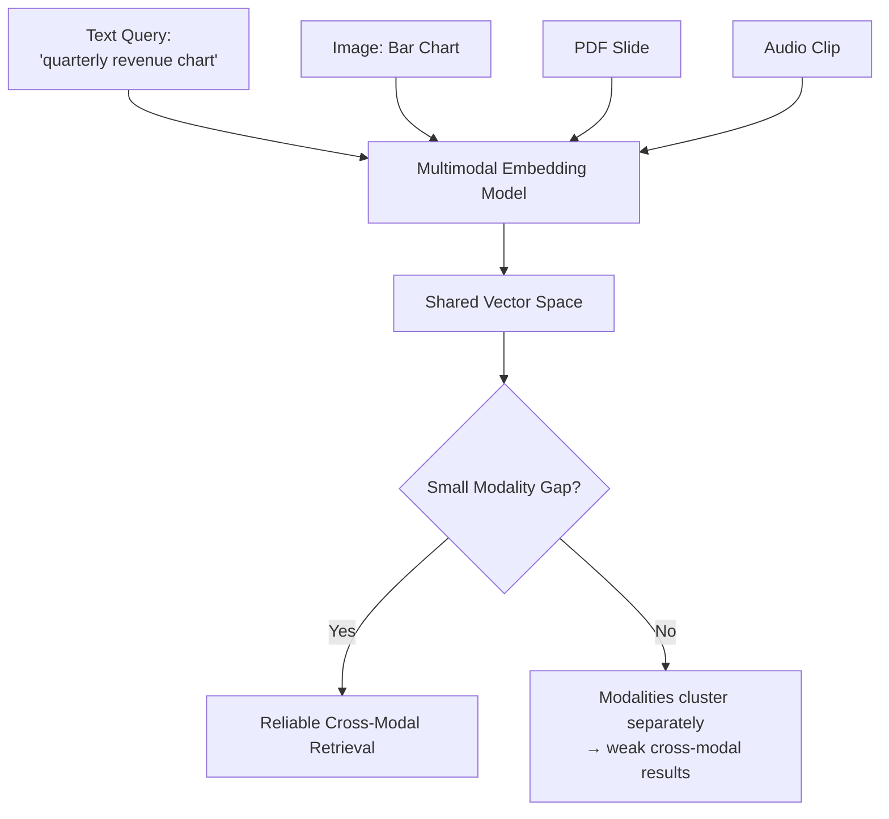
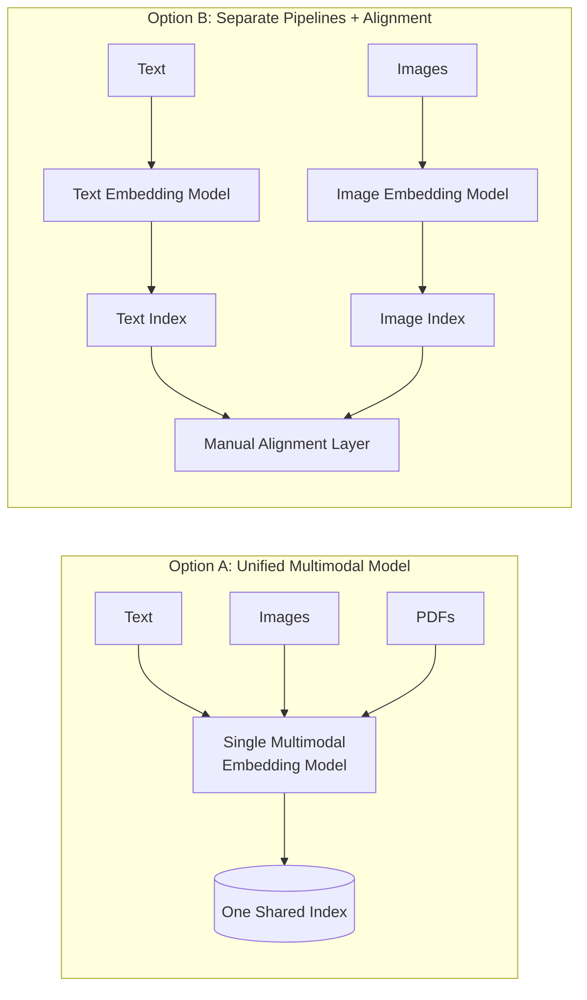
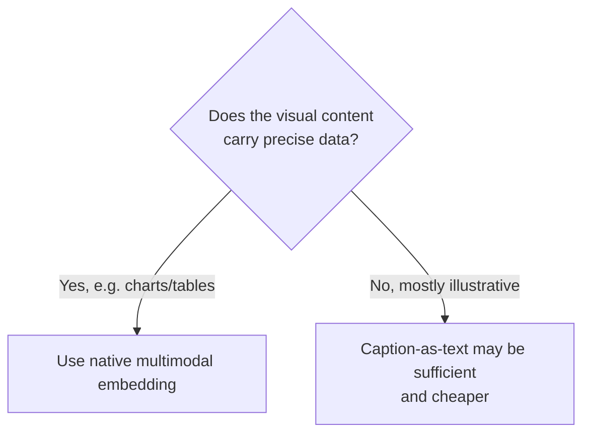

# Module 8: Multimodal RAG

> **Goal of this module:** Understand why multimodal RAG matters in 2026, how to build a pipeline over mixed-content documents, and the cost/quality trade-offs vs. text-only approaches.

---

## 1. Why Multimodal RAG Matters Now

- **2026 embedding models** (Gemini Embedding 2, Cohere embed-v4, Jina v5-omni, Qwen3-VL) natively embed **text, images, video, audio, and PDFs** into a **shared vector space** — meaning a text query can directly retrieve a relevant image or chart without any manual bridging step.
- **The "modality gap":** a measure of how well text and image embeddings cluster together in the shared vector space. A small modality gap means cross-modal search (text query → image result) works reliably; a large gap means the modalities stay clustered separately, and cross-modal retrieval quality suffers even though everything is technically in "one" vector space.

---

## 2. Building a Multimodal Pipeline

### 2.1 Ingesting Mixed-Content Documents
Real-world documents are rarely pure text:
- Slides (text + images + diagrams)
- Scanned PDFs (image-only, needs OCR or vision-native embedding)
- Product catalogs (images + structured text)
- Charts and tables (visual data that pure text extraction destroys)

### 2.2 Architecture Choice: Unified vs. Separate Pipelines

| Approach | Pros | Cons |
|---|---|---|
| **Single multimodal embedding model** | One index, simpler architecture, true cross-modal search | May sacrifice some per-modality quality vs. specialized models |
| **Separate text/image pipelines + alignment** | Best-in-class quality per modality | More complex, harder to maintain, alignment step can introduce errors |

### 2.3 Retrieval and Generation over Image+Text Context
- Retrieved results can be a mix of image and text chunks — the generator (a multimodal-capable LLM) needs to reason jointly over both to answer questions like *"what does the Q3 chart show?"*

---

## 3. Trade-offs

| Approach | Cost | Latency | Quality on visual content |
|---|---|---|---|
| **Multimodal embedding** (native image/chart understanding) | Higher (specialized models, larger embeddings) | Higher | Best — captures visual details text can't describe |
| **Caption images, embed as text** (simpler pipeline: generate a text caption for each image, then run standard text RAG) | Lower | Lower | "Good enough" for simple images, but **loses detail** in complex charts/tables where the exact data matters |

### When is "caption + text-only RAG" good enough?
- Simple images where a one-sentence caption captures the essential meaning (e.g., a photo used for illustration).
- **Not** good enough when: precise data must be read off a chart (e.g., "what was the exact revenue in Q3?"), since a caption is a lossy compression of visual information.

---

## 4. Quick-Reference Cheat Sheet

- **2026 default multimodal embedding models:** Gemini Embedding 2, Cohere embed-v4, Jina v5-omni, Qwen3-VL.
- **Modality gap** = how well different modalities cluster together — small gap = reliable cross-modal search.
- **Rule of thumb:** if precise visual data matters (charts, tables), use native multimodal embeddings; if images are just illustrative, caption-as-text is cheaper and often sufficient.

---

## 5. Knowledge Check — Q&A

**Q1. What is the "modality gap" in multimodal embeddings, and why does it matter for RAG?**
> **A:** The modality gap measures how well embeddings from different modalities (text vs. image, etc.) cluster together in a shared vector space. Even if a model technically embeds text and images into "the same" space, a large modality gap means text and image embeddings still tend to cluster separately by modality rather than by meaning — which would make cross-modal search (e.g., a text query retrieving a relevant image) unreliable, even though single-modality search (text→text) still works fine.

**Q2. Compare the two architectural choices for building a multimodal RAG pipeline. When would you choose separate pipelines with alignment over a single unified multimodal model?**
> **A:** A single unified multimodal model embeds everything into one shared space — simpler, enables true cross-modal search, but may sacrifice some per-modality quality compared to specialized models. Separate text/image pipelines with an alignment layer can achieve best-in-class quality per modality (e.g., a top-tier text embedding model plus a top-tier image embedding model) but add architectural complexity and introduce a manual alignment step that can itself be a source of error. You'd choose separate pipelines when per-modality retrieval quality is critical and you have the engineering resources to maintain the added complexity — e.g., a high-stakes domain where marginal quality gains matter more than simplicity.

**Q3. Why is "caption the image, then embed as text" sometimes NOT good enough for a product analytics dashboard use case?**
> **A:** Captioning an image is a lossy compression step — a one-sentence caption like "a bar chart showing quarterly revenue" discards the actual precise numbers, trends, and relationships visible in the chart. For a use case where users ask questions requiring exact data ("what was the exact Q3 revenue figure?" or "which quarter had the steepest drop?"), a caption-based pipeline cannot answer accurately because that information was never captured in text form. Native multimodal embedding (or vision-capable extraction) is needed to preserve and query the actual visual data.

**Q4. List three types of documents where a purely text-based ingestion pipeline (with OCR only) would likely lose important information.**
> **A:** (1) Scanned PDFs with complex layouts (multi-column, embedded diagrams) where OCR loses spatial/structural relationships. (2) Product catalogs where images convey product appearance/features that text descriptions don't fully capture. (3) Charts and tables where the visual encoding (bar heights, trend lines, table structure) carries precise quantitative information that flat OCR text extraction garbles or loses entirely.

**Q5. Name the four 2026 multimodal embedding models mentioned in this module and one distinguishing feature each.**
> **A:** Gemini Embedding 2 (natively multimodal across text/image/video/audio/PDF, current multilingual MTEB leader), Cohere embed-v4 (handles up to 128K tokens without chunking, strong for visual documents), Jina v5-omni (universal embeddings spanning text/image/video/audio), Qwen3-VL (open-weight vision-language embedding model).

---

## 6. Interview-Style Scenario Questions

**Q6 (System Design Interview).** *"You're building RAG over a repository of 10,000 investor pitch decks (PDF slides with charts, images, and bullet text). Users ask questions like 'which companies showed declining CAC in their unit economics slide?' Design the ingestion and retrieval approach."*
> **A (sample strong answer):** Given that the question requires reading precise data off charts (CAC trend), I'd rule out the "caption images as text" shortcut — it would lose the exact trend data needed to answer accurately. I'd use a native multimodal embedding model (e.g., Gemini Embedding 2 or Cohere embed-v4, both noted as strong for visual documents/PDFs) to embed each slide (or slide region) preserving chart/table structure in the shared vector space. At query time, the question embeds into the same space and retrieves relevant chart-containing slides directly. For generation, I'd use a vision-capable LLM that can actually "read" the retrieved chart images to extract the CAC trend and answer precisely — text-only generation over a caption would risk hallucinating the trend direction.

**Q7 (Cost/Trade-off Interview).** *"Leadership wants multimodal RAG over millions of customer-uploaded product photos with simple captions, but the multimodal embedding API cost is 5x the text-only cost. How do you decide whether it's worth it?"*
> **A (sample strong answer):** I'd first ask what the actual query patterns need: if users primarily search by product name/category/description (already captured well in text), and images are mostly illustrative rather than carrying unique searchable information, a "caption images as text, then run standard text-only RAG" pipeline is likely good enough and 5x cheaper — this matches the module's guidance that captioning suffices when visual content doesn't carry precise, otherwise-uncapturable data. However, if users actually search by *visual similarity* (e.g., "find shoes that look like this") or the captions are low-quality/generic, then the cost is justified since text-only can't serve that use case at all. I'd pilot both approaches on a sample and measure retrieval quality against real user query logs before committing to the 5x cost increase org-wide.

**Q8 (Debugging Interview).** *"Your multimodal RAG system retrieves great results for text-to-text queries but poor results when users search with a text query expecting an image result (e.g., 'show me a diagram of X'). What's the likely cause and how do you investigate it?"*
> **A (sample strong answer):** This points directly to a modality gap problem — the embedding model may technically place text and images in "the same" vector space, but if that space has a large gap between modalities (images clustering separately from text regardless of semantic content), cross-modal queries will underperform even though same-modality search works fine. I'd investigate by directly measuring: embed a set of known text-image pairs that *should* match, and check their similarity scores/rank relative to same-modality pairs — if cross-modal similarity scores are systematically much lower even for genuinely matching content, that confirms a modality gap issue with the current embedding model, and I'd evaluate switching to a model reported to handle cross-modal retrieval well (e.g., testing Gemini Embedding 2 or Jina v5-omni against our own eval set) rather than assuming any "multimodal" model performs equally on cross-modal tasks.
