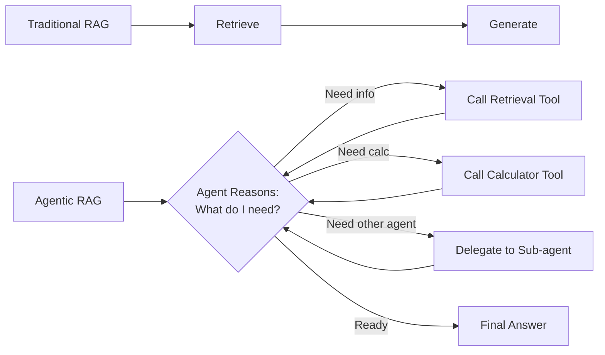
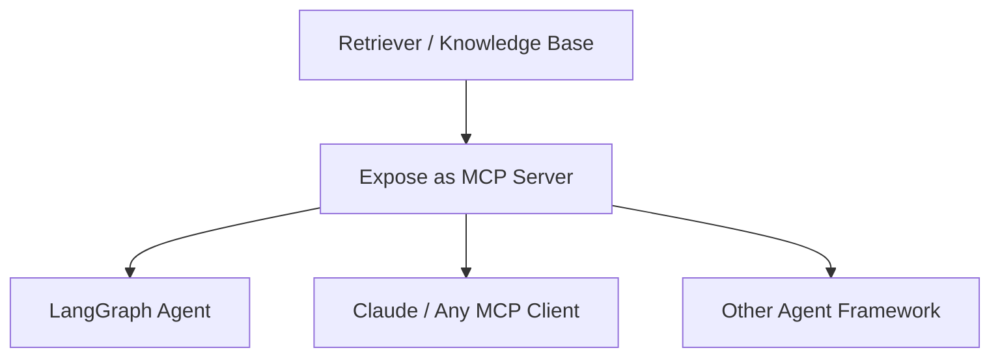
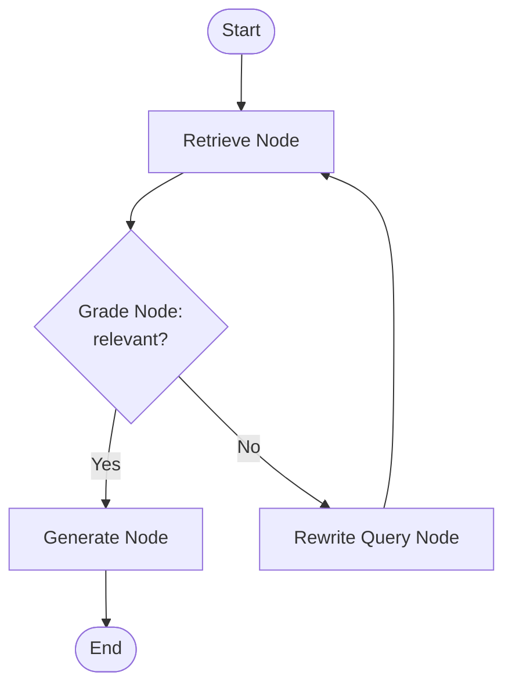
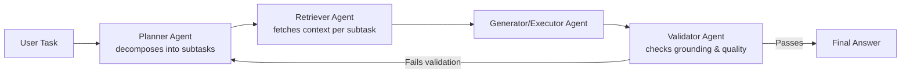

# Module 9: Agentic RAG with LangGraph and MCP

> **Goal of this module:** Understand how RAG transforms when retrieval becomes a *tool* an agent chooses to call, master LangGraph fundamentals for building RAG graphs, expose retrieval via MCP, and learn multi-agent RAG design patterns.

---

## 1. Introduction to Agentic RAG

### Traditional RAG vs. Agentic RAG

| Aspect | Traditional RAG | Agentic RAG |
|---|---|---|
| Retrieval trigger | Always retrieves before generating | Agent **decides** whether/when to retrieve |
| Number of retrieval steps | One retrieval pass | Can retrieve multiple times, refine queries |
| Tools | Retrieval only | Retrieval is **one tool among many** (calculators, APIs, other agents) |
| Control flow | Linear: retrieve → generate | Reasoning loop: think → act (retrieve/tool call) → observe → repeat |

- **Market context:** agentic RAG underlies most AI agent deployments in 2026 — retrieval has become just one capability an agent invokes as needed, not the entire pipeline.

---

## 2. RAG as a Tool for Agents

- **`create_retriever_tool`:** wraps a retriever as a callable tool an agent can invoke — the agent decides *if* and *when* to call it based on the query.
- **When agents should retrieve vs. respond directly:** simple/general questions the agent is confident about don't need a retrieval call (echoes Self-RAG's query complexity classification from Module 7); specific/factual/domain questions should trigger retrieval.
- **Multiple knowledge base tools + routing:** an agent might have separate retriever tools for "HR policies," "engineering docs," "sales playbooks" — and must route to the correct one based on the query.

### New in 2026: Retrieval via MCP (Model Context Protocol)
- **What it is:** exposing retrievers, knowledge bases, and search tools as **MCP servers**, so *any* MCP-compatible agent framework can call them — not just the framework you originally built the retriever in.
- **Why it matters:** replaces framework-specific retriever wrappers (e.g., a LangChain-only retriever tool) with a **standardized, interoperable interface**. An MCP-exposed retriever can be called by LangGraph agents, Claude, or any other MCP client without custom integration code per framework.

---

## 3. LangGraph Fundamentals for RAG

| Concept | Description |
|---|---|
| **State** | Shared data structure passed between nodes (e.g., query, retrieved docs, generation so far) — typically defined with `TypedDict` |
| **Nodes** | Individual steps/functions (retrieve, grade, generate, etc.) |
| **Edges** | Connections between nodes, defining flow |
| **Conditional routing** | Edges that branch based on state (e.g., "if retrieval confidence is low, go to fallback node") |

This is the same conditional-branching skeleton used for CRAG (Module 7) — LangGraph is the standard implementation tool for these advanced RAG patterns because its explicit state machine model maps naturally onto "retrieve → grade → branch → retry/generate" logic.

---

## 4. Agentic RAG Design Patterns

| Pattern | Description |
|---|---|
| **ReAct + RAG** | Reason → Act (retrieve/tool call) → Observe → repeat, until ready to answer |
| **Plan-and-execute + retrieval** | Agent first plans a multi-step approach, then executes each step (some steps involving retrieval) |
| **Reflection/self-correction** | Agent reviews its own draft answer against retrieved evidence and revises if ungrounded (echoes Self-RAG) |

### Multi-Agent RAG Teams
- **Pattern:** specialized agents — **planner**, **retriever**, **validator** — collaborate via event-driven frameworks.
- **Frameworks:** LangGraph, CrewAI, Microsoft Agent Framework/AutoGen.
- **Why it's become common:** complex enterprise workflows benefit from separation of concerns — a planner agent decomposes the task, a retriever agent focuses purely on fetching accurate context, and a validator agent checks the final output's grounding/quality before it's returned.

---

## 5. Quick-Reference Cheat Sheet

- **Agentic RAG = retrieval as a tool**, not a mandatory pipeline step.
- **`create_retriever_tool`** wraps a retriever for agent use.
- **MCP** = standardized protocol so any agent framework can call the same retriever without custom wrappers.
- **LangGraph primitives:** State (`TypedDict`), Nodes, Edges, Conditional routing.
- **Multi-agent RAG teams** (planner/retriever/validator) are now common for complex enterprise workflows.

---

## 6. Knowledge Check — Q&A

**Q1. What is the fundamental difference between traditional RAG and agentic RAG in terms of control flow?**
> **A:** Traditional RAG follows a fixed linear pipeline: always retrieve, then always generate. Agentic RAG treats retrieval as one tool among potentially many that an agent reasons about and *decides* whether/when/how many times to call, as part of a broader reasoning loop (think → act → observe → repeat) that may also involve other tools (calculators, APIs, sub-agents).

**Q2. Explain what MCP (Model Context Protocol) enables for retrieval tools that framework-specific retriever wrappers (like LangChain's `create_retriever_tool`) do not.**
> **A:** A framework-specific retriever wrapper only works within that specific framework (e.g., a LangChain retriever tool only callable by LangChain agents). Exposing the same retriever as an MCP server makes it callable by *any* MCP-compatible agent framework or client (LangGraph, Claude, other agent frameworks) through a standardized interface — eliminating the need to write custom integration code for each framework that wants to use the retriever.

**Q3. In LangGraph, what are State, Nodes, and Edges, and how do they combine to implement something like Corrective RAG?**
> **A:** State (typically a `TypedDict`) is the shared data structure (e.g., query, retrieved docs, grade result) passed between steps. Nodes are individual processing functions (retrieve, grade, generate, rewrite). Edges connect nodes and define flow, including **conditional edges** that branch based on state values (e.g., grade result). For CRAG, you'd have a Retrieve node → Grade node → conditional edge routing to either a Generate node (if graded relevant) or a Rewrite/fallback node (if not) — LangGraph's explicit graph structure maps directly onto this branching logic.

**Q4. Describe the roles of planner, retriever, and validator agents in a multi-agent RAG team, and why this separation of concerns is useful.**
> **A:** The planner agent decomposes a complex task into subtasks; the retriever agent focuses specifically on fetching accurate, relevant context for each subtask; the validator agent checks the final generated output's grounding and quality before returning it to the user. Separating these concerns lets each agent be optimized/prompted for its specific job (planning requires different reasoning than retrieval or validation), improves debuggability (you can inspect which agent's output caused a failure), and allows validator feedback to loop back to the planner for correction — a pattern well-suited to complex enterprise workflows where a single monolithic agent would struggle to do all three jobs well simultaneously.

**Q5. Why would an agent choose NOT to call its retrieval tool for a given query, even though retrieval is available?**
> **A:** If the agent is confident it already knows the answer (a general knowledge question, a simple greeting, or something clearly outside the scope of the knowledge base), calling retrieval adds unnecessary latency and cost, and risks introducing irrelevant context that could confuse the final answer. This mirrors Self-RAG's query complexity classification — well-designed agentic RAG systems reserve retrieval calls for queries that genuinely benefit from grounding in the knowledge base.

---

## 7. Interview-Style Scenario Questions

**Q6 (System Design Interview).** *"Design an agentic RAG system for an internal tool where employees ask questions that might require pulling from HR docs, engineering wikis, OR a live Jira API — and sometimes a combination of all three. Walk through the architecture."*
> **A (sample strong answer):** I'd build this as a LangGraph agent with multiple tools registered: a `create_retriever_tool`-wrapped retriever for HR docs, another for the engineering wiki, and a Jira API tool (potentially exposed via MCP so it's reusable across other agent contexts too). The agent's reasoning loop (ReAct-style: reason → act → observe) lets it decide per-query which tool(s) to call — for a question spanning multiple domains ("what's our HR policy on this Jira-tracked incident?"), the agent could call both the HR retriever and the Jira tool, then synthesize. State would track which tools have been called and their results (`TypedDict`), with the graph looping back to the reasoning node after each tool call until the agent determines it has enough information to answer. I'd also add a routing/classification step so the agent doesn't waste calls on tools clearly irrelevant to the query's topic.

**Q7 (Architecture/Interoperability Interview).** *"Your company built a retriever tool for a LangChain-based agent last year, and now a different team wants to reuse it in their CrewAI-based multi-agent system. What would you recommend to avoid duplicating the retrieval logic?"*
> **A (sample strong answer):** Rather than re-implementing the retriever as a CrewAI-specific tool (creating duplicated logic and maintenance burden across frameworks), I'd recommend exposing the existing retriever as an MCP server. This makes it callable by any MCP-compatible framework — both the original LangChain agent and the new CrewAI system — through a standardized protocol, without framework-specific wrapper code. This is exactly the shift the module describes: retrieval-via-MCP has become the common 2026 integration pattern precisely to solve this reuse-across-frameworks problem.

**Q8 (Reliability/Debugging Interview).** *"A multi-agent RAG team (planner/retriever/validator) occasionally produces answers that pass validation but are still subtly wrong. Walk through how you'd debug this, and what you'd check in each agent."*
> **A (sample strong answer):** I'd start by tracing individual agent outputs for failing cases: (1) **Planner** — check if it decomposed the task correctly; a flawed decomposition can cause the retriever to fetch the "right answer to the wrong sub-question." (2) **Retriever agent** — verify it fetched genuinely relevant, correct context for each subtask (this ties back to standard retrieval debugging: check recall/precision on the sub-queries it generated). (3) **Validator agent** — this is the most suspicious link if wrong answers are passing: check whether its grounding criteria are too lenient (e.g., checking that *some* retrieved text loosely relates to the answer, rather than verifying the specific claims in the answer are actually supported). A common root cause is the validator using weak or generic grounding checks rather than claim-level verification — I'd tighten its evaluation criteria (potentially borrowing from RAG evaluation frameworks like RAGAS's faithfulness metric, covered in Module 12) rather than assuming the failure is purely in planning or retrieval.
