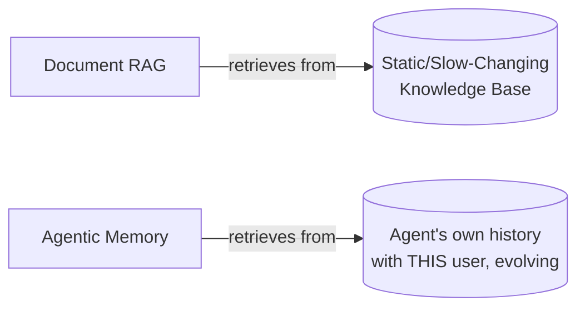
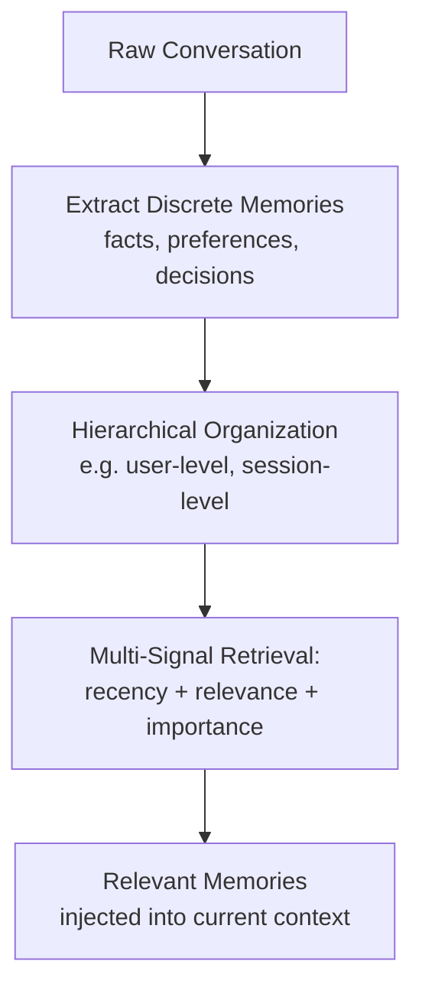
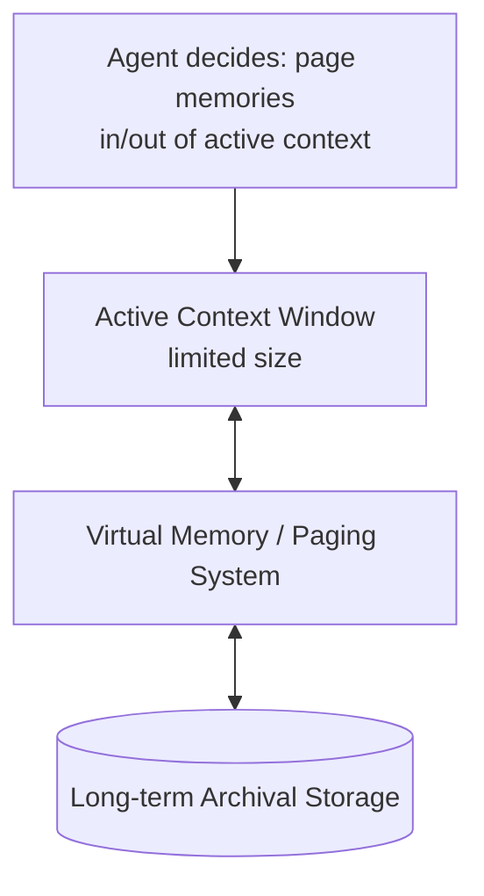
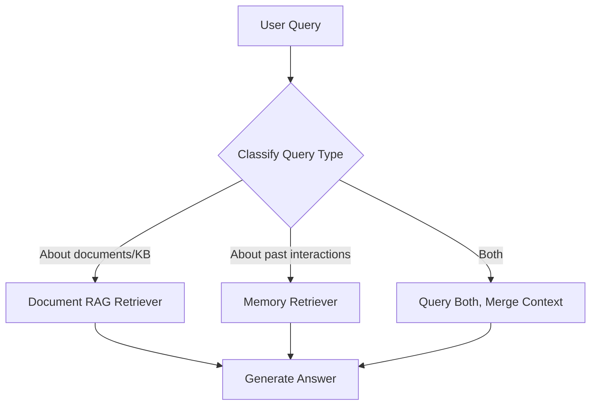

# Module 10: Agentic and Long-Term Memory

> RAG's companion discipline — for agents that operate over many sessions, not a replacement for document RAG.
> **Goal of this module:** Understand why memory ≠ RAG, learn the two dominant memory architectures (Mem0-style, MemGPT-style), and how to combine memory with document RAG in one system.

---

## 1. Why Memory Is Not Just RAG

### The Core Distinction

| | RAG | Agentic Memory |
|---|---|---|
| **Source of knowledge** | Relatively static external knowledge base (documents) | The agent's **own interaction history** with a specific user — conversations, decisions, preferences |
| **Update frequency** | Updated when the knowledge base changes (batch/periodic) | Updated continuously, every interaction |
| **Typical query type** | "What does the documentation say about X?" | "What did I tell you last week about my preferences?" / "What decision did we make earlier?" |
| **Temporal reasoning** | Usually not central | Central — needs to reason about *when* things happened, in what order |

### Failure Mode: Treating Memory as "Just Another Vector Store"
- **Temporal queries** ("what did we decide *last*?", "what changed *since* our last conversation?") need more than similarity search — a vector store has no inherent notion of *time* or *event ordering* unless deliberately modeled.
- **Multi-hop reasoning about past events** ("why did I choose X over Y three conversations ago?") requires connecting multiple past interactions causally, not just retrieving the single most semantically similar past message.
- **Naive fix that doesn't work:** dumping all past conversation turns into a vector store and doing similarity search treats memory like static documents — losing the *sequence*, *recency*, and *causal structure* that makes memory useful.

---

## 2. Memory Architectures

### 2.1 Hierarchical Extraction & Multi-Signal Retrieval (Mem0-style)

- Extracts discrete, structured "memory units" from raw conversation (not just raw chunk-and-embed).
- Retrieval combines **multiple signals** — not just semantic similarity, but also recency (how recent) and importance/salience (how significant was this fact) — to decide what to surface.

### 2.2 Virtual Context Management / Paging (MemGPT-style)

- Borrows the **OS virtual memory / paging** metaphor: the LLM's limited context window is treated like limited RAM, with a paging system moving relevant memories in and out of "active context" from a larger "archival" long-term store as needed.
- The agent itself can trigger memory operations (like an OS process requesting a page swap), deciding what to keep active vs. archive.

### 2.3 Token-Efficient Retrieval vs. Full-Context Replay

| Approach | Description | Trade-off |
|---|---|---|
| **Full-context replay** | Stuff the entire conversation history into every prompt | Simple, but hits context-window limits fast and suffers the context-cliff quality degradation (Module 2) |
| **Token-efficient memory retrieval** | Extract/retrieve only the relevant memory units for the current query (like RAG, but over the agent's own history) | More complex to build, but scales indefinitely and avoids diluting the context window |

> **Production reality:** Token-efficient retrieval is the only approach that scales — full-context replay works for short demos but breaks down the moment conversations span many sessions.

---

## 3. Combining RAG and Memory

### Routing Architecture

- Real assistants need to route between "retrieve from documents" (e.g., "what's our refund policy?") and "retrieve from memory" (e.g., "what did I say my order number was?") depending on query type.
- Some queries need **both** simultaneously — e.g., "given what I told you about my allergy last week, is this product on the menu safe for me?" requires memory (the allergy) + document RAG (the menu/ingredient list).

---

## 4. Quick-Reference Cheat Sheet

| Concept | Key takeaway |
|---|---|
| RAG vs. Memory | RAG = static external KB; Memory = agent's own evolving interaction history |
| Mem0-style | Hierarchical extraction + multi-signal (recency/relevance/importance) retrieval |
| MemGPT-style | Virtual context paging — OS-like memory management for LLM context windows |
| Full-context replay | Doesn't scale — breaks down over many sessions |
| Combining RAG + Memory | Route by query type; some queries need both simultaneously |

---

## 5. Knowledge Check — Q&A

**Q1. Why is treating agentic memory as "just another vector store" a failure mode? Give a concrete example.**
> **A:** Plain vector-store similarity search has no inherent notion of time, sequence, or causal relationships between events — it just finds semantically similar text. A temporal query like "what was the *last* decision we made about the budget?" requires knowing *event ordering*, not just semantic similarity — a naive vector store might return an earlier, superseded budget decision that happens to be more semantically similar in wording to the current query, giving a wrong/stale answer.

**Q2. Explain the MemGPT-style "virtual context management" approach using the OS paging analogy.**
> **A:** MemGPT-style memory treats the LLM's limited context window like limited RAM in an operating system, and a larger long-term archival store like disk storage. A paging system decides what memories to keep "active" (in the context window, immediately usable) vs. what to "page out" to archival storage, retrieving them back into active context only when needed — mirroring how an OS swaps memory pages in/out based on what a process currently needs, rather than trying to keep everything in RAM at once.

**Q3. What are the two main signals combined in Mem0-style multi-signal retrieval, beyond plain semantic relevance?**
> **A:** Recency (how recently the memory was formed/relevant) and importance/salience (how significant the fact or decision was) are combined with semantic relevance to decide which memories to surface — rather than relying purely on embedding similarity, which alone can't distinguish an old, stale, but semantically-similar memory from a recent, highly relevant one.

**Q4. Why does full-context replay fail as a memory strategy for long-running agent deployments?**
> **A:** Full-context replay stuffs the entire conversation history into every prompt, which quickly hits context-window token limits as conversations accumulate across many sessions, and also suffers from the context-cliff quality degradation described in Module 2 (quality drops as context grows, even within a technically-supported window). It doesn't scale — token-efficient retrieval of only relevant memory units is necessary for agents that operate over many sessions long-term.

**Q5. Describe a scenario where an agent needs to query BOTH document RAG and memory simultaneously to answer a single question.**
> **A:** Example: a healthcare assistant where a user previously mentioned (in an earlier session) "I'm allergic to shellfish," and now asks "is the seafood pasta on today's menu safe for me?" Answering requires memory retrieval (recalling the shellfish allergy from a past interaction) *and* document RAG (retrieving the current menu/ingredient list to check if the seafood pasta contains shellfish) — neither source alone is sufficient.

---

## 6. Interview-Style Scenario Questions

**Q6 (System Design Interview).** *"You're building a long-running AI coding assistant that should remember a developer's coding style preferences, past architectural decisions, and project context across weeks of sessions, while also answering questions from the project's technical documentation. How do you architect memory + RAG together?"*
> **A (sample strong answer):** I'd build two separate but coordinated systems: a document RAG pipeline over the technical documentation (static-ish knowledge base, standard chunk/embed/retrieve), and a separate agentic memory system (Mem0-style hierarchical extraction) that extracts discrete memory units from past sessions — coding style preferences, architectural decisions, rationale — tagged with recency and importance signals rather than just embedded as raw transcript chunks. At query time, I'd add a routing/classification step: purely documentation questions hit the RAG retriever; questions referencing past context ("like we discussed for the auth module") hit the memory retriever; ambiguous or compound questions query both and merge context before generation. I'd explicitly avoid full-context replay of the entire session history given weeks of accumulated conversations would blow past context limits and trigger context-cliff quality degradation.

**Q7 (Debugging Interview).** *"Your agent's memory system correctly retrieves relevant past facts by semantic similarity, but users complain it keeps referencing outdated preferences they've since changed (e.g., 'I don't eat meat anymore' from months ago, when they updated this last week). Diagnose and fix."*
> **A (sample strong answer):** This is the classic failure of treating memory as 'just a vector store' — pure semantic similarity retrieval has no built-in mechanism to prioritize the *most recent* version of a fact over an older, semantically-identical or superseded one; both the old and new dietary statements are semantically similar to a query about food preferences, so a vector-only system might retrieve either (or worse, both, causing contradictory context). Fix: move to a Mem0-style multi-signal retrieval approach that explicitly weights recency alongside relevance, and ideally implement conflict resolution/supersession logic at the memory-extraction stage — when a new fact contradicts an old one (e.g., "I eat meat now" vs. an earlier "I'm vegetarian"), the system should mark the old memory as superseded rather than leaving both indexed as equally valid facts.

**Q8 (Product/Architecture Interview).** *"Product wants the AI assistant to 'never forget anything' across a user's entire multi-year history with the app. What technical concerns would you raise, and how would MemGPT-style paging help?"*
> **A (sample strong answer):** I'd flag that "never forget anything" as literally full-context replay is a non-starter — years of interaction history would vastly exceed any context window, and even if it somehow fit, context-cliff research shows quality degrades well before hitting hard token limits. I'd propose a MemGPT-style virtual context management approach instead: maintain a small, highly relevant "active" memory set in the context window at any time, with the vast majority of historical interactions "paged out" to long-term archival storage, retrieved back into active context only when a query's topic/recency signals indicate they're relevant. This gives the *effect* of "never forgetting" (nothing is permanently deleted, everything is retrievable) while keeping actual per-query context usage efficient and high-quality — I'd also push back on "never forget" from a privacy/data-retention policy angle, since indefinite retention of all user interactions raises its own compliance questions (tying into Module 11's data residency concerns).
