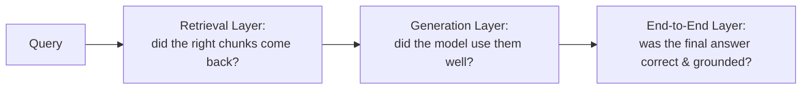
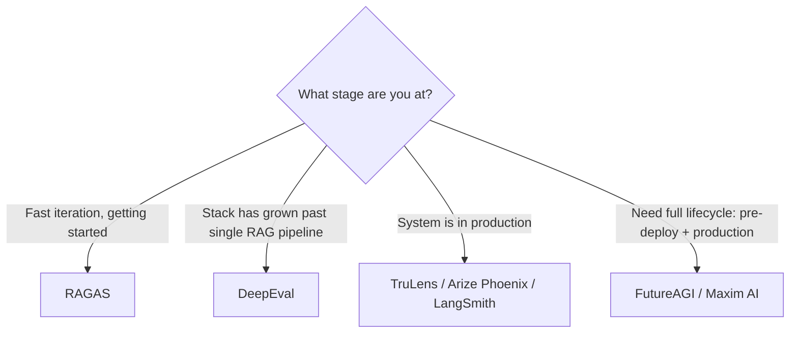
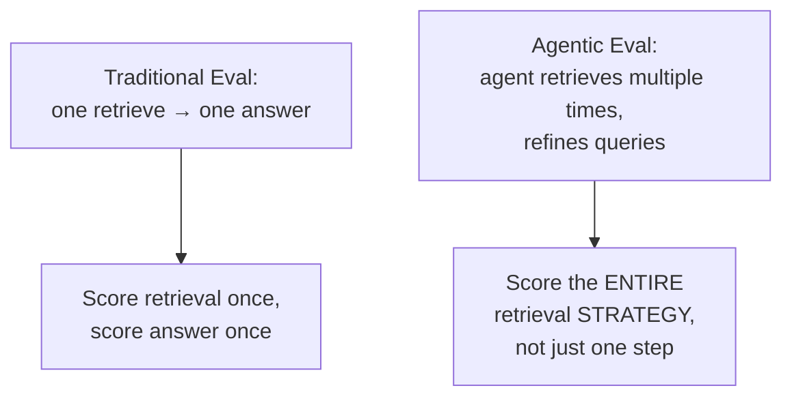
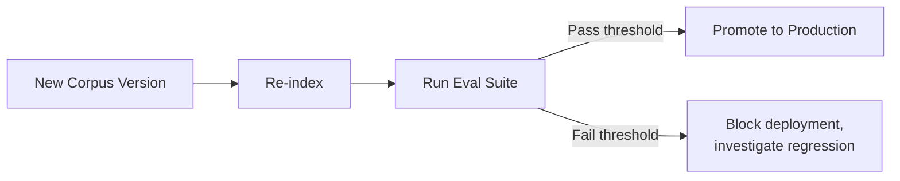

# Module 12: Evaluating and Observing RAG Systems

> **Goal of this module:** Master the three-layer evaluation model, know the 2026 evaluation toolchain and when to use each tool, and understand agentic/trajectory evaluation for retrieval-as-a-tool systems.

---

## 1. RAG Evaluation Fundamentals

### The Three Layers to Evaluate Separately

| Layer | Question it answers | Metrics |
|---|---|---|
| **Retrieval** | Did the right chunks come back? | Recall@K, Precision@K, NDCG@K, MRR, Hit Rate |
| **Generation** | Did the model use retrieved context well? | Faithfulness, answer relevance |
| **End-to-End** | Was the final answer correct and grounded? | Context precision, context recall, noise sensitivity |

> **Why separate them?** If you only measure end-to-end answer quality, you can't tell *whether* a failure was a retrieval problem (wrong chunks) or a generation problem (right chunks, model ignored/misused them) — exactly the debugging logic from Module 1, Q8.

### Key Metric Definitions

| Metric | Meaning |
|---|---|
| **Faithfulness** | Is the generated answer actually supported by the retrieved context (no hallucinated claims)? |
| **Answer relevance** | Does the answer actually address the user's question? |
| **Context precision** | Of the retrieved chunks, what fraction were actually relevant/useful? |
| **Context recall** | Of all the truly relevant chunks in the corpus, what fraction did retrieval find? |
| **Noise sensitivity** | How much does irrelevant retrieved content degrade the final answer's quality? |
| **Recall@K** | Of the relevant docs that exist, what fraction appear in the top-K retrieved? |
| **Precision@K** | Of the top-K retrieved docs, what fraction are actually relevant? |
| **NDCG@K** | Ranking-quality metric — rewards relevant docs appearing *higher* in the top-K, not just present |
| **MRR (Mean Reciprocal Rank)** | Average of 1/(rank of first relevant result) across queries — rewards getting a relevant result early |
| **Hit Rate** | Fraction of queries where at least one relevant doc appeared in top-K |

---

## 2. The 2026 Evaluation Toolchain

| Tool | Type | Strength | Limitation |
|---|---|---|---|
| **RAGAS** | Reference-free, LLM-as-judge claim verification | Fastest way to get started | Just a metrics library — no dashboard or production monitoring |
| **DeepEval** | Pytest-native | Broadest metric library (50+ metrics spanning RAG, agents, multi-turn, MCP tool use, multimodal) | Best once your stack has grown past a single RAG pipeline |
| **TruLens, Arize Phoenix, LangSmith** | Tracing and observability-first | Useful once a system is in production | Less focused on pre-deployment metric scoring |
| **FutureAGI, Maxim AI** | Full-lifecycle platforms | Connect pre-deployment evaluation to production monitoring with shared eval configs | Heavier to adopt/integrate |

### Critical Limitation to Remember
> Inference-layer eval tools measure whether outputs are grounded in **what was retrieved** — they **cannot** tell you if the retrieved content itself was **stale or wrong**. A well-governed, freshness-monitored index is a *precondition* for any of these scores to mean anything.

This is a frequently-tested interview concept: a perfect faithfulness score just means the model didn't hallucinate *beyond* what it retrieved — it says nothing about whether the retrieved content was itself outdated or incorrect.

---

## 3. Agentic and Trajectory Evaluation

### The Shift from Single-Shot to Trajectory Evaluation

- When retrieval is a tool an agent calls (sometimes multiple times with refined queries — Module 9), evaluation has to score the **retrieval strategy** as a whole trajectory, not just a single retrieve-and-answer step.
- This **blends RAG evaluation with agent trajectory evaluation** — you're now asking "was this sequence of retrieval decisions reasonable and effective?" not just "was this one retrieval good?"

### Retrieval Drift Detection
- As corpora age and embedding models get updated, retrieval quality **drifts** over time — a system that scored well at launch can silently degrade.
- **Best practice:** track **rolling precision per retrieval route** (i.e., monitor precision continuously over time, segmented by which retriever/knowledge base is being used) and **gate re-indexing behind eval pass rates** (don't push a re-indexed corpus to production unless it passes your eval suite).

---

## 4. Quick-Reference Cheat Sheet

| Concept | Key takeaway |
|---|---|
| Three eval layers | Retrieval / Generation / End-to-End — always separate them for debugging |
| Faithfulness | Is the answer supported by retrieved context? (doesn't check if context itself is correct) |
| RAGAS | Fast-start metrics library, no production monitoring |
| DeepEval | Broadest metric library, pytest-native, good for grown-up stacks |
| TruLens/Phoenix/LangSmith | Observability-first, for production |
| Trajectory evaluation | Score the whole agentic retrieval *strategy*, not one retrieve-answer step |
| Retrieval drift | Track rolling precision over time; gate re-indexing behind eval pass rates |

---

## 5. Knowledge Check — Q&A

**Q1. Why is it important to evaluate retrieval, generation, and end-to-end quality as three separate layers rather than just measuring final answer correctness?**
> **A:** If you only measure end-to-end correctness, a failing answer could be caused by either bad retrieval (wrong/missing chunks) or bad generation (right chunks retrieved, but the model ignored or misused them) — these require completely different fixes. Separating the layers lets you pinpoint exactly where in the pipeline a failure occurred (e.g., checking Recall@K in isolation tells you if retrieval found the right content, independent of whether generation used it well), enabling targeted debugging instead of guessing.

**Q2. Explain why a high "faithfulness" score does NOT guarantee your RAG system is giving correct answers.**
> **A:** Faithfulness only measures whether the generated answer is supported by/grounded in the retrieved context — it says nothing about whether that retrieved context was itself accurate, current, or correct. If the knowledge base contains stale or wrong information, a perfectly faithful answer (one that accurately reflects what was retrieved) can still be factually wrong. This is why a well-governed, freshness-monitored index is described as a precondition for these scores to mean anything.

**Q3. When would you choose RAGAS over DeepEval, and vice versa?**
> **A:** Choose RAGAS when you're early-stage and want the fastest way to get reference-free, LLM-as-judge evaluation running on a RAG pipeline — it's lightweight but just a metrics library with no dashboard/production monitoring. Choose DeepEval once your stack has grown past a single RAG pipeline — e.g., you now have agents, multi-turn conversations, MCP tool use, or multimodal components — since DeepEval's broader metric library (50+ metrics) and pytest-native design fits testing a more complex, heterogeneous system as part of a CI/CD workflow.

**Q4. What is "retrieval drift" and what are the two recommended practices to catch it before it causes production issues?**
> **A:** Retrieval drift is the gradual degradation of retrieval quality over time as the corpus ages or embedding models get updated — a system that performed well at launch can silently worsen without anyone noticing, since nothing "breaks" in an obvious way. The two recommended practices are: (1) tracking rolling precision per retrieval route continuously over time (not just at launch), and (2) gating re-indexing behind eval pass rates — i.e., never promote a newly re-indexed corpus to production unless it passes the evaluation suite, catching regressions before they reach users.

**Q5. Why does agentic RAG require "trajectory evaluation" rather than the traditional single retrieve-and-answer evaluation approach?**
> **A:** In agentic RAG, the agent may retrieve multiple times with refined queries as part of a reasoning loop (Module 9), so evaluating just the final answer or a single retrieval step misses whether the overall *sequence of retrieval decisions* was sound — e.g., did the agent waste calls on irrelevant retrievals, did it correctly recognize when to refine its query, did it stop retrieving at the right point? Trajectory evaluation scores the whole retrieval *strategy* as a sequence, blending RAG evaluation with agent trajectory evaluation, which single-shot metrics like a single Recall@K score cannot capture.

---

## 6. Interview-Style Scenario Questions

**Q6 (Debugging/Evaluation Interview).** *"Your RAG chatbot's faithfulness score is 95% (excellent) but customer complaints about factually wrong answers are increasing. How do you reconcile this and what would you investigate?"*
> **A (sample strong answer):** This is a direct illustration of faithfulness's key limitation — a 95% faithfulness score means the model is accurately reflecting what it retrieved 95% of the time, but says nothing about whether the *retrieved content itself* is correct or current. I'd investigate the knowledge base's freshness and correctness directly: check when the corpus was last updated, whether recently-changed source-of-truth information (e.g., updated policies, pricing, product specs) has been re-ingested, and whether there's any re-indexing/freshness monitoring in place at all. I'd also spot-check a sample of the "faithful but wrong" complaints against the actual retrieved chunks to confirm the pattern is stale content rather than, say, ambiguous queries retrieving genuinely outdated-but-still-indexed documents. The fix here is almost certainly in the ingestion/freshness pipeline, not the generation/faithfulness layer, which is already performing well.

**Q7 (System Design/CI-CD Interview).** *"Your team wants to prevent retrieval quality regressions when engineers make changes to the chunking strategy or swap embedding models. Design an evaluation gate for this."*
> **A (sample strong answer):** I'd build a CI/CD quality gate using an eval dataset (built with RAGAS initially, potentially extended with DeepEval for broader coverage) that runs automatically whenever chunking strategy or embedding model changes are proposed. The gate would check retrieval-layer metrics specifically (Recall@K, Precision@K, NDCG@K, MRR) against a held-out set of query-relevant-document pairs representative of real usage, with a required pass threshold before the change can merge/deploy. This directly implements the "gate re-indexing behind eval pass rates" best practice for catching retrieval drift, and importantly evaluates retrieval in isolation from generation, so a regression is caught precisely at the layer it was introduced (chunking/embedding) rather than being conflated with unrelated generation-layer issues.

**Q8 (Agentic Systems Interview).** *"Your agentic RAG system sometimes makes 8 retrieval calls to answer a question that should only need 2, driving up cost and latency, even though the final answers are usually correct. How would you evaluate and fix this, given that answer-accuracy metrics alone won't catch it?"*
> **A (sample strong answer):** Since the final answers are correct, standard end-to-end accuracy/faithfulness metrics won't flag this as a problem at all — this is exactly why trajectory evaluation is needed. I'd build an evaluation that scores the retrieval *strategy* itself: log each agent's full sequence of retrieval calls (queries issued, results returned, whether each call actually contributed new relevant information to the final answer), then measure efficiency metrics like "number of retrieval calls per resolved query" and "fraction of retrieval calls that returned information not already covered by prior calls" against a baseline/target. For a query needing 2 calls but taking 8, I'd inspect the trajectory logs to find where the agent is looping unnecessarily (e.g., poor confidence calibration causing it to keep re-retrieving instead of recognizing it has enough information) — this likely points to the agent's stopping/decision logic (similar to Self-RAG's reflection mechanism from Module 7) needing better tuning, not a retrieval-quality problem per se, since the actual retrieved content is apparently good enough to produce correct answers.
