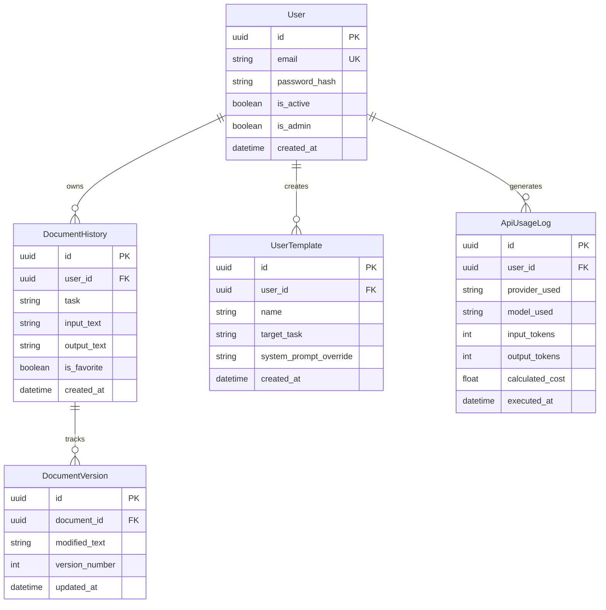

To ensure nothing gets lost, here is your definitive, end-to-end **Blueprint Specification Matrix**. This acts as a comprehensive checklist and structural map containing **every single feature, endpoint, data property, and operational configuration** you outlined, mapped directly into a production-grade backend architecture.

Save this document as `SPECIFICATION.md` in the root of your project directory to track your progress.

---

## 🏛️ System Architecture Component Architecture

The backend will be structured around a single, clean core runtime feeding into specific functional domains.

```text
ai-writing-assistant/
├── app/
│   ├── main.py                     # App Bootstrap & Global Middleware (CORS, Trusted Hosts)
│   ├── core/                       # Global System Configuration
│   │   ├── config.py               # Pydantic BaseSettings (.env mapping)
│   │   ├── security.py             # JWT Token Hashing, API Key generation
│   │   └── dependencies.py         # Shared Dependency Injections (get_db, get_current_user)
│   ├── services/                   # Heavyweight Third-Party Engineering Layers
│   │   ├── llm_provider.py         # Polymorphic Gateway (OpenAI, Gemini, Claude, Ollama, Groq)
│   │   ├── prompt_registry.py      # Prompt templates for every single generation task
│   │   └── plagiarism.py           # External API handler for text originality validation
│   ├── api/v1/endpoints/           # HTTP Interface Layers
│   │   ├── auth.py                 # Authorization entry points
│   │   ├── workflow.py             # Unified Generation engine & Streaming logic
│   │   ├── documents.py            # CRUDS for History, Templates, Favorites
│   │   ├── analysis.py             # Highly structured parsing endpoints (SEO, AI Detection)
│   │   └── admin.py                # Admin dashboard management tools
│   ├── models/                     # SQLAlchemy/SQLModel Relational Layouts
│   └── schemas/                    # Pydantic Structural Request/Response Guards

```

---

## 📋 Complete Master Feature & Mapping Matrix

Every capability you detailed is mapped here to its specific architectural location, input schema structure, and production delivery phase.

### 1. Core Workflow Engine (`POST /api/v1/workflow/generate`)

*This single polymorphically driven endpoint handles all standard text tasks through the central system prompt registry.*

| Category | Specific Features Included | Required Input Properties | Delivery Phase |
| --- | --- | --- | --- |
| **🟢 Writing** | Email, Letter, Essay, Blog, Article, Report, Story, Product Description, Ad Copy | `task`, `text`, `tone`, `target_length`, `provider` | Phase 1 (MVP) |
| **🟢 Social Media** | LinkedIn Post, Tweet, Instagram Caption | `task`, `text`, `tone`, `provider` | Phase 1 (MVP) |
| **🟢 Editing** | Grammar Checker, Spell Checker, Punctuation Fixer, Sentence Rewriter, Improve Writing, Humanize AI Text, Simplify Text, Rewrite Paragraph, Remove Repetition, Improve Readability | `task`, `text`, `provider` | Phase 1 (MVP) |
| **🟢 Length Control** | Summarize, Expand, Shorten, Condense Paragraph, One-Line Summary, Detailed Version, Executive Summary, TL;DR Generator | `task`, `text`, `provider` | Phase 1 (MVP) |
| **🟢 Email Tools** | Reply Generator, Follow-up, Cold Email, Thank You, Apology, Complaint, Meeting Request, Leave Application, Resignation, Recommendation Request, Subject Generator, Bullet → Email, Email Improver | `task`, `text`, `tone`, `provider` | Phase 1 (MVP) |
| **🟡 Styles** | Shakespeare, Pirate, News, Legal, Scientific, Child Friendly, CEO Style, Startup Pitch, Journalistic | `task`, `text`, `style`, `provider` | Phase 2 (Intermediate) |
| **🟡 Formatting** | Bullet Points, Numbered List, Table, Markdown, HTML, Plain Text, JSON, CSV | `task`, `text`, `output_format` | Phase 2 (Intermediate) |
| **🟡 Career Tools** | Resume Summary, Resume Improvement, Resume Bullet Generator, ATS Optimization, Cover Letter Generator | `task`, `text`, `job_description` | Phase 2 (Intermediate) |
| **🟡 Academic** | Thesis Generator, Research Summary, Abstract Generator, Literature Review Summary, Citation Helper, Assignment Helper, Explanation Generator | `task`, `text`, `citation_style` | Phase 2 (Intermediate) |
| **🟡 Corporate** | Meeting Summary, Action Items, Minutes of Meeting, Key Decisions, Next Steps, Business Proposal, SWOT Analysis, Mission/Vision Statements, Elevator Pitch, Business Plan Summary | `task`, `text`, `context_metadata` | Phase 2 (Intermediate) |

### 2. Deep Content & Analytics Engine (`POST /api/v1/analysis/...`)

*These features bypass raw text returns and utilize structured schemas or external network APIs.*

| Route Target | Features Included | Return Format Shape | Delivery Phase |
| --- | --- | --- | --- |
| `/analyze-writing` | **🟠 Analysis:** Scoring metrics for grammar, clarity, engagement, overall reading level | Dict JSON matching your exact score profile structure | Phase 2 |
| `/extract` | **🟠 Extraction:** Keyword mapping, key topic clustering, named entity extraction, structural action items | Lists of parsed structural string keys | Phase 2 |
| `/suggestions` | **🟠 Smart Suggestions:** Alternate word mappings, contextual phrases, vocabulary simplification | Nested dictionary of offsets and text patches | Phase 2 |
| `/metadata` | **🟠 Metrics:** Sentiment profiling, reading time calculations, word/character/paragraph tallies | Numeric indices map | Phase 2 |
| `/detect-ai` | **🟠 Verification:** Algorithmic probability indexing (AI % vs Human %) | Confidence interval floating decimals | Phase 3 (Advanced) |
| `/plagiarism` | **🟠 Originality:** Integration with premium third-party lookup endpoints | External response arrays matching API keys | Phase 3 (Advanced) |

### 3. Identity, Operations & Data Management

*The operational framework required to make this an industrial-ready SaaS engine.*

| Module Layer | Concrete Operational Specs | DB Tables Impacted | Delivery Phase |
| --- | --- | --- | --- |
| **🟤 Security** | Sign-up, Login execution via high-performance hashed encryption, stateless JWT authentication keys, robust token refresh routines, secured forgot-password hooks, active verification codes via automated mail pipelines | `users`, `refresh_tokens` | Phase 3 |
| **🔵 Productivity** | Custom pre-mapped multi-field templates, global persistent prompt libraries, document draft caching, persistent favorite bookmarks, active version history tables tracking client updates, generic cross-format asset export drivers (PDF/DOCX/TXT/MD engines) | `templates`, `prompts`, `saved_documents`, `versions` | Phase 3 |
| **🟢 Model Core** | Multi-vendor fallback architecture supporting dynamic integration with OpenAI, Gemini, Anthropic, Groq, OpenRouter, and local deployments via Ollama frameworks | None (Handled dynamically via system environment keys) | Phase 3 |
| **📊 Diagnostics** | Full operational logging tracking overall word counts produced, actual structural tokens processed, financial costs accrued per user invocation, comprehensive user usage analytics timelines | `api_usage_logs` | Phase 3 |
| **🔴 Management** | Administrative interfaces tracking platform-wide user lists, complete system query logs, global server runtime analytic graphs, dynamic software API keys provisioning, custom rate limit rules, automated platform expense trackers | All system tracking indices | Phase 3 |
| **⚡ Infrastructure** | Highly optimized query layer using Redis memory caches, non-blocking asynchronous streaming text hooks, fast detached background processing loops using Celery or native FastAPI BackgroundTasks, automated API call retry logic with exponential delay curves | Cache stores, task tracking states | Phase 3 |
| **🧪 Validation** | Industrial testing infrastructure mapping isolated unit assertions, deep integration routing validations, automated black-box API validation scripts, and high-concurrency load benchmark scripts via Locust engines | System testing suite | Phase 3 |

---

## 🗄️ Relational Database Blueprint (SQLModel/SQLAlchemy)

Your persistence layer must match the multi-tenant architecture tracking every item listed above.



---

## 📈 Technical Execution Checklist

When starting to build, follow this checklist step by step to ensure your system architecture remains modular as your FastAPI skills grow:

* [ ] Initialize Python Virtual Environment & create the modular directory layout exactly as described.
* [ ] Code the global configuration service managing all external API keys via Pydantic settings.
* [ ] Implement the prompt database registry mapping your initial Phase 1 tasks.
* [ ] Build the unified asynchronous execution controller route mapping standard task requests.
* [ ] Wire up the first dynamic client abstraction layer using an SDK (e.g., OpenAI or Gemini).
* [ ] Introduce automated exception middleware catching structural execution timeouts or missing API keys cleanly.


The AI engineering landscape is currently heavily polarized around two paradigms: the **Split-Stack Architecture** (combining Node.js and Python) and the **Pure Python** approach. If you are looking to build a structured, production-ready system in 2026, combining Node.js for the gateway with FastAPI and Pydantic for the intelligence layer is the industry standard.

Here is a comprehensive overview of the components and operational specifications.

### 1. The Core Application Architecture

| Component | Responsibility | Technical Implementation | Delivery Phase |
| --- | --- | --- | --- |
| **API Gateway** | Client-facing routing and UI delivery | Node.js / Express | Phase 1 |
| **Intelligence Engine** | High-performance inference and agent orchestration | Python / FastAPI | Phase 1 |
| **Data Validation** | Enforcing strict JSON outputs from LLMs | Pydantic / Pydantic AI | Phase 1 |
| **State Persistence** | Relational mapping for multi-tenant data | PostgreSQL / SQLModel | Phase 3 |
| **Caching Layer** | Memorizing duplicate queries and fast retrievals | Redis | Phase 3 |
| **Background Processing** | Detached heavy-compute analytics | Celery / FastAPI BackgroundTasks | Phase 3 |

### 2. Operational Specifications & Modules

**🟤 Security**

* Sign-up and Login execution via high-performance hashed encryption
* Stateless JWT authentication keys
* Robust token refresh routines
* Secured forgot-password hooks
* Active verification codes via automated mail pipelines

**🔵 Productivity**

* Custom pre-mapped multi-field templates
* Global persistent prompt libraries
* Document draft caching
* Persistent favorite bookmarks
* Active version history tables tracking client updates
* Generic cross-format asset export drivers (PDF, DOCX, TXT, MD engines)

**🟢 Model Core**

* Multi-vendor fallback architecture supporting dynamic integration with OpenAI, Gemini, Anthropic, Groq, OpenRouter, and local deployments via Ollama frameworks.

**📊 Diagnostics**

* Full operational logging tracking overall word counts produced
* Tracking of actual structural tokens processed
* Financial costs accrued per user invocation
* Comprehensive user usage analytics timelines

**🔴 Management**

* Administrative interfaces tracking platform-wide user lists
* Complete system query logs
* Global server runtime analytic graphs
* Dynamic software API keys provisioning
* Custom rate limit rules
* Automated platform expense trackers

**⚡ Infrastructure**

* Highly optimized query layer using Redis memory caches
* Non-blocking asynchronous streaming text hooks
* Fast detached background processing loops using Celery or native FastAPI BackgroundTasks
* Automated API call retry logic with exponential delay curves

**🧪 Validation**

* Industrial testing infrastructure mapping isolated unit assertions
* Deep integration routing validations
* Automated black-box API validation scripts
* High-concurrency load benchmark scripts via Locust engines

### 3. Essential AI Agent Frameworks (2026 Landscape)

As of mid-2026, the agentic framework ecosystem has rapidly matured. While LangGraph remains dominant for stateful workflows, Pydantic AI has surged as the standard for developers prioritizing type safety and the FastAPI developer experience.

| Framework | Best For | Key Differentiators |
| --- | --- | --- |
| **LangGraph 1.0** | Complex, stateful production agents. | Built on graph state; features durable execution, checkpoints, and time-travel debugging. Ideal for multi-agent loops. |
| **Pydantic AI V2** | Type-safe, FastAPI-style development. | Uses Pydantic BaseModels for strictly validated outputs. Offers dependency injection for highly testable code. |
| **Microsoft Agent Framework 1.0** | Enterprise .NET and Python environments. | Replaces AutoGen/Semantic Kernel; standard for Microsoft-heavy infrastructures. |
| **Claude Agent SDK** | Native Anthropic deployments. | First-class computer use and deep Model Context Protocol (MCP) integrations. |


Here is the complete blueprint of features and operational specifications, reorganized into a flat, scannable list format for easy reference.

### Writing & Content Generation

* **General Writing:** Generation tools for Emails, Letters, Essays, Blogs, Articles, Reports, Stories, Product Descriptions, and Ad Copy.
* **Social Media:** Dedicated generators for LinkedIn Posts, Tweets, and Instagram Captions.
* **Editing & Refinement:** Grammar checking, Spell checking, Punctuation fixing, Sentence rewriting, Text humanizing, Simplifying, Repetition removal, and Readability improvement.
* **Length Control:** Summarizing, Expanding, Shortening, Condensing paragraphs, One-Line summaries, Detailed versions, Executive summaries, and TL;DR generation.
* **Email Tools:** Reply generation, Follow-ups, Cold emails, Thank you notes, Apologies, Complaints, Meeting requests, Leave applications, Resignations, Recommendation requests, Subject generation, and converting Bullet points to Emails.
* **Styles & Formatting:** Text conversions into Shakespeare, Pirate, News, Legal, Scientific, Child Friendly, CEO, Startup Pitch, or Journalistic styles, outputting in Markdown, HTML, JSON, CSV, Plain Text, Tables, or Lists.
* **Career & Academic:** Resume summaries, ATS optimization, Cover Letters, Thesis generation, Research summaries, Citation helpers, and concept Explanations.
* **Corporate & Business:** Meeting summaries, Action items, Key decisions, SWOT Analysis, Mission/Vision Statements, Elevator Pitches, and Business Proposals.

### Deep Content & Analytics

* **Writing Analysis:** Returns structured JSON scoring metrics for grammar, clarity, engagement, and reading level.
* **Keyword Extraction:** Identifies and maps core topics, named entities, and actionable structural items from large texts.
* **Smart Suggestions:** Recommends alternate vocabulary, simpler wording, and contextual phrase replacements.
* **Content Metadata:** Calculates sentiment profiles, reading time estimates, and exact word, character, and paragraph tallies.
* **AI Detection:** Provides algorithmic probability indexing to estimate AI versus human generation percentages.
* **Plagiarism Checking:** Integrates with external premium APIs to validate content originality.

### Identity & Security Operations

* **Authentication:** Sign-up and Login execution utilizing high-performance password hashing.
* **Session Management:** Stateless JWT authentication keys paired with robust token refresh routines.
* **Account Recovery:** Secured forgot-password hooks and active verification codes via automated mail pipelines.

### Productivity & Data Persistence

* **Templates & Prompts:** Custom multi-field templates for common requests and a global persistent prompt library.
* **Document Management:** Database caching for document drafts, persistent favorite bookmarks, and full version history tracking for edits.
* **Export Engine:** Generic cross-format asset export drivers supporting direct downloads for PDF, DOCX, TXT, and Markdown files.

### Infrastructure & LLM Core

* **Multi-Model Routing:** Dynamic integration supporting fallback routing between OpenAI, Google Gemini, Anthropic Claude, Groq, OpenRouter, and local Ollama deployments.
* **Caching & Streaming:** Redis memory caches to intercept duplicate requests and non-blocking asynchronous streaming to deliver text chunks to the frontend in real time.
* **Background Processing:** Fast detached background loops (using Celery or native FastAPI BackgroundTasks) for heavy analytics jobs.
* **Resilience & Rate Limiting:** Automated API call retry logic with exponential delay curves, plus strict rate limiting to protect against DDoS or token-draining attacks.

### Diagnostics & Administration

* **User Analytics:** Full operational logging to track total words produced, structural tokens processed, and historical usage timelines per user.
* **Cost Tracking:** Financial calculation engine mapping exact upstream API costs accrued per user invocation.
* **Admin Controls:** Dashboards for platform-wide user management, system query logs, dynamic API key provisioning, and custom rate-limiting overrides.
* **Validation & Testing:** Industrial infrastructure for isolated unit assertions, deep API integration validations, and high-concurrency load testing.
