# Production AI & Agent Systems Engineering

## Complete roadmap • revised edition • 27 September 2026

46 modules · 12 domains · progressive subdivisions · complete original topic coverage

### How to use this roadmap

This is both a complete reference and a selective learning path for developers entering production AI. Read the learning path first, complete the core demonstrations, and choose specialties according to a real application. Module numbers are stable addresses, not a command to study every module sequentially.

The hierarchy is **Domain → Module → Section → Subsection → Subdivision → Concepts**. Numbered subdivisions are used when they clarify stages, responsibilities or categories. Framework names and individual terms remain leaf concepts.

### Priority and depth

| Priority | Meaning |
|---|---|
| Core | Foundational knowledge and practical skills used across the main application path. |
| Production extension | Implement when the project needs this capability; learn its purpose first. |
| Specialization | Choose a track; implementations are not universal graduation requirements. |
| Awareness | Recognize the concept and tradeoffs; implementation is optional. |

| Depth | Evidence |
|---|---|
| L1 — Awareness | Explain the purpose, boundaries and alternatives. |
| L2 — Working capability | Build and debug a small implementation. |
| L3 — Production capability | Demonstrate quality, security, recovery, deployment and operating cost on a real workload. |
| L4 — Specialization | Benchmark internals and design substantial improvements in a chosen specialty. |

Target L2 across relevant core modules, L3 for the capabilities demonstrated by your projects, and L4 in one or two specialties. Depth labels apply to the module's main path; advanced named methods remain L1 until a measured need justifies implementation.

### Entry assessment

- Read and modify an existing service; use Git; write and run tests.
- Explain HTTP requests and failures; query a relational database.
- If these are unfamiliar, complete M01–M03 at a comfortable pace before using the intensive schedule.
- Product discovery (M41), a domain choice (M43) and basic source literacy (M45) begin immediately.

### Practices that run through every phase

- Define the user outcome and a non-AI or simpler baseline.
- Create tests and a small representative evaluation set before adding complexity.
- Apply identity, permissions, data handling and secret protection before exposing capabilities.
- Record traces, failures, latency and cost from the first integration.
- Deploy incrementally, preserve a known-good version and practice recovery.
- Convert observed failures into regression cases and user-facing improvements.

### Recommended core learning sequence

| Phase | Study and build | Exit evidence |
|---|---|---|
| 1. Problem and foundations | M41, M43, M01–M03; basics of M38 and M40 | A scoped problem, tested backend and reproducible deployment. |
| 2. First AI application | M04–M05, initial M07, M11, M27, M29 | Typed model integration, small eval set, traces and cost measurements. |
| 3. Knowledge application | M34 ingestion basics, M06, M07; relevant M25–M26 | Evaluated retrieval, grounded answers, permission checks and update/delete behavior. |
| 4. Controlled actions | M08–M09, M11, M35; M25 controls | A bounded workflow with verified actions and user control. |
| 5. State and recovery | M37, M13–M14; M12 memory only if useful; M10 framework after concepts | Resume after interruption and avoid duplicate side effects. |
| 6. Production operation | M25–M29, M38–M40; M42 when multi-tenant | Release gates, deployment, security tests, recovery drills and accepted unit economics. |
| 7. Selected integrations | M15–M18, M30, M36 as required | Versioned integration contracts and tested trust boundaries. |
| 8. Chosen specialty | Select from M19–M24, M31–M33, M44 | A task-specific benchmark and a demonstrated useful capability. |

Security, testing, evaluation, UX and operations start early and deepen with each phase. Phase 6 consolidates them; it is not their first introduction. Prerequisite references mean relevant fundamentals, not completion of every advanced subsection. Co-developed modules such as evaluation and model integration are intentionally learned together.

### Distinguish architectural roles

| Concept | Responsibility |
|---|---|
| Context | Information supplied to the model now. |
| Memory | Information that may be retrieved in a future interaction. |
| State | Application facts needed to continue correctly. |
| Tool | Executable capability with a defined contract. |
| Skill | Reusable procedure and supporting resources. |
| Runtime | Hosts and controls execution. |
| Durable workflow | Persists coordination and supports recovery across interruptions. |
| MCP / A2A | Optional integration boundaries for tools/data and remote agents. |
| Evaluation | Evidence of task quality and acceptable behavior. |
| Observability | Evidence of what happened during execution. |

### Shared topic ownership

| Shared topic | Main explanation | Applied sections |
|---|---|---|
| Evaluation methods | M07 | M06 retrieval, M19 teams, M22 code, M24 voice, M40 tests |
| Context | M11 | M06 RAG, M12 memory, M13 runtime |
| Distributed correctness | M03 | M08 actions, M14 durable workflows, M37 workers |
| Identity and authorization | M25 | M16–M18 protocols, M42 tenancy |
| Data ingestion and lineage | M34 | M06 indexing, M33 training datasets |
| Recovery objectives | M28 | M38 infrastructure, M39 release, M40 testing |
| User outcomes | M41 | M35 UX, M29 economics, M43 domain |

The detailed syllabus retains applied checklists so no original topic is lost. Read the main explanation once and use the applied lists as implementation reminders.

# Flowcharts and complete domain map

The HTML companion renders these diagrams and links every module. The Markdown edition includes editable Mermaid source.

## Core learning path and continuous quality

Arrows show the core progression and application choices. Security, evaluation, tests, observability, cost and UX apply from the first implementation. Full module references below retain every specialty.

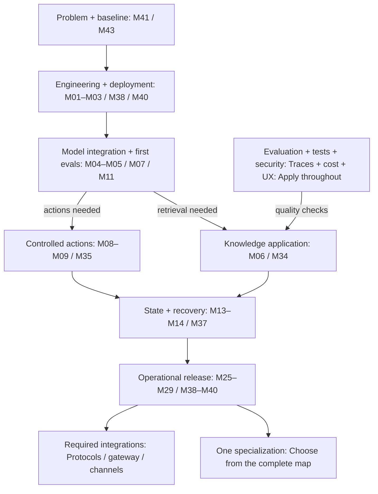

## Complete 46-module learning flowchart

The top flow shows learning order and choices. The domain cards below retain all 46 modules and show their priority. Module numbers are addresses, not a required sequence. Each card links to the full syllabus. The editable Mermaid diagram below provides an alternative entry-relationship view; the HTML and standalone SVG use the cleaner grouped domain layout.

```mermaid
flowchart TD
  MN40["M41: Product Engineering"]
  MN0["M01: Engineering Foundations for Agentic AI"]
  MN42["M43: Domain Specialization"]
  MN45["M46: Business / Career Layer"]
  MN1["M02: FastAPI Production Backend"]
  MN3["M04: LLM & Foundation Model Fundamentals"]
  MN43["M44: Specialized AI Opportunities"]
  MN44["M45: Research Literacy"]
  MN2["M03: Databases & Distributed Systems"]
  MN4["M05: LLM Application Fundamentals"]
  MN24["M25: AI Security"]
  MN31["M32: Inference Engineering & Local Models"]
  MN37["M38: Cloud & Infrastructure"]
  MN39["M40: Testing Strategy"]
  MN5["M06: Embeddings, Search & RAG"]
  MN6["M07: Evaluation-First AI Engineering"]
  MN7["M08: Tool Calling & Action Systems"]
  MN10["M11: Context Engineering"]
  MN22["M23: Multimodal AI"]
  MN25["M26: AI Governance, Privacy & Enterprise Controls"]
  MN26["M27: Observability for AI Systems"]
  MN29["M30: AI Gateway / Model Gateway"]
  MN32["M33: Fine-Tuning & Custom Models"]
  MN33["M34: AI Data Engineering & Document Intelligence"]
  MN34["M35: AI UX / Generative UI"]
  MN36["M37: Background Jobs & Automation"]
  MN38["M39: CI/CD for AI"]
  MN41["M42: SaaS & Multi-Tenancy"]
  MN8["M09: Agent Fundamentals"]
  MN11["M12: Agent Memory"]
  MN15["M16: MCP: Model Context Protocol"]
  MN19["M20: Browser Automation"]
  MN23["M24: Voice & Real-Time AI"]
  MN27["M28: Reliability Engineering for AI"]
  MN28["M29: AI Cost & Unit Economics"]
  MN30["M31: AI Platform Engineering"]
  MN35["M36: Bots, Messaging & Integrations"]
  MN9["M10: Agent Frameworks & Orchestration"]
  MN12["M13: Agent Runtime / Harness Engineering"]
  MN14["M15: Agent Skills"]
  MN16["M17: A2A: Agent-to-Agent Interoperability"]
  MN17["M18: Agent Protocol Landscape"]
  MN18["M19: Multi-Agent Systems"]
  MN20["M21: Computer-Use Agents"]
  MN13["M14: Durable Execution & Long-Running Agents"]
  MN21["M22: AI Software Engineering / Coding Agents"]
  MN40 --> MN0
  MN0 --> MN1
  MN1 --> MN2
  MN0 --> MN3
  MN3 --> MN4
  MN4 --> MN5
  MN4 --> MN6
  MN4 --> MN7
  MN7 --> MN8
  MN8 --> MN9
  MN4 --> MN10
  MN10 --> MN11
  MN8 --> MN12
  MN12 --> MN13
  MN8 --> MN14
  MN7 --> MN15
  MN15 --> MN16
  MN15 --> MN17
  MN8 --> MN18
  MN7 --> MN19
  MN19 --> MN20
  MN12 --> MN21
  MN4 --> MN22
  MN22 --> MN23
  MN1 --> MN24
  MN24 --> MN25
  MN4 --> MN26
  MN26 --> MN27
  MN26 --> MN28
  MN4 --> MN29
  MN29 --> MN30
  MN3 --> MN31
  MN31 --> MN32
  MN2 --> MN33
  MN4 --> MN34
  MN7 --> MN35
  MN2 --> MN36
  MN1 --> MN37
  MN37 --> MN38
  MN1 --> MN39
  MN2 --> MN41
  MN40 --> MN42
  MN42 --> MN43
  MN0 --> MN44
  MN40 --> MN45
```

## Engineering Foundations

Domain map. Boxes link to the full module. Arrows indicate useful learning relationships within this domain; consult each module for prerequisites. Color: blue core, amber extension, purple specialty.

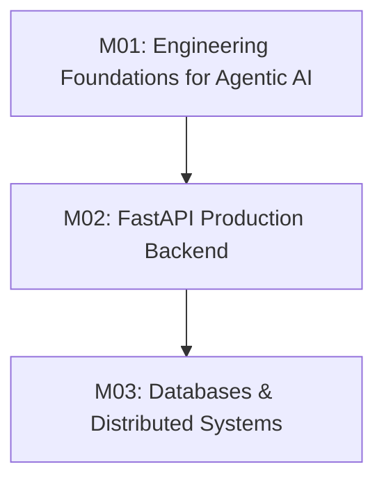

## Agent Intelligence

Domain map. Boxes link to the full module. Arrows indicate useful learning relationships within this domain; consult each module for prerequisites. Color: blue core, amber extension, purple specialty.

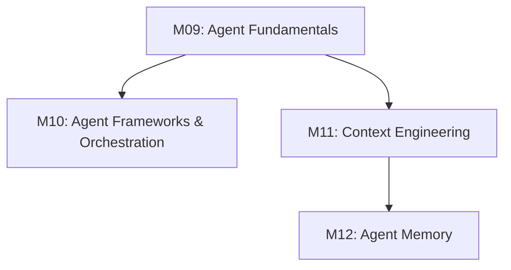

## Agent Infrastructure & Ecosystem

Domain map. Boxes link to the full module. Arrows indicate useful learning relationships within this domain; consult each module for prerequisites. Color: blue core, amber extension, purple specialty.

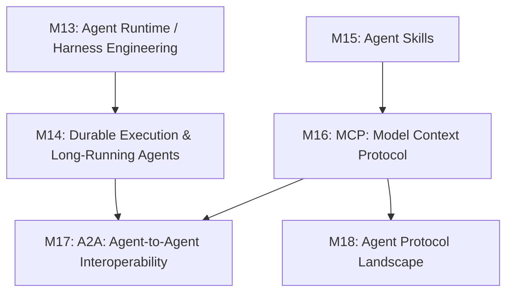

## Advanced Agent Capabilities

Domain map. Boxes link to the full module. Arrows indicate useful learning relationships within this domain; consult each module for prerequisites. Color: blue core, amber extension, purple specialty.

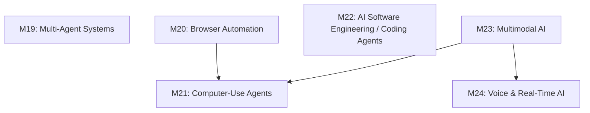

## Trust, Quality & Control

Domain map. Boxes link to the full module. Arrows indicate useful learning relationships within this domain; consult each module for prerequisites. Color: blue core, amber extension, purple specialty.

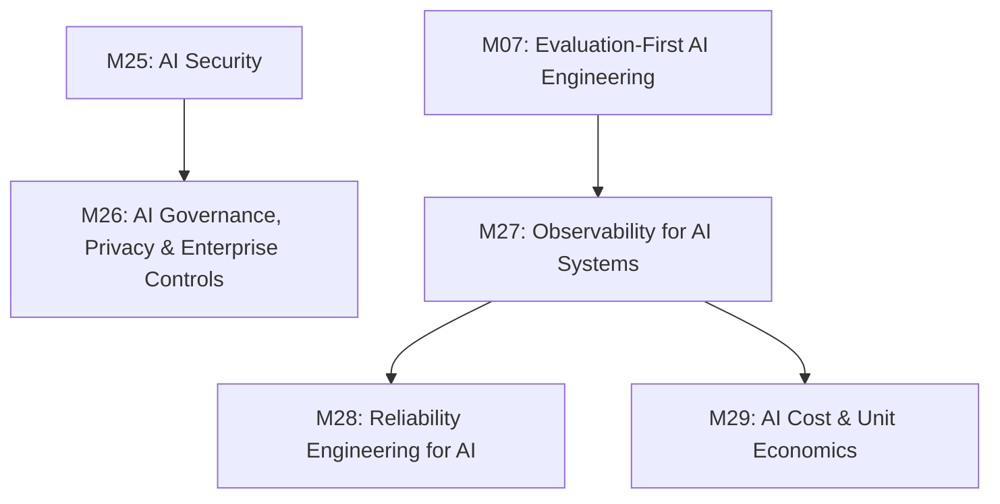

## AI Platform & Infrastructure

Domain map. Boxes link to the full module. Arrows indicate useful learning relationships within this domain; consult each module for prerequisites. Color: blue core, amber extension, purple specialty.

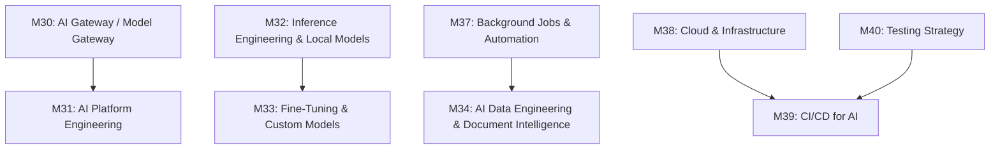

## Product & Commercialization

Domain map. Boxes link to the full module. Arrows indicate useful learning relationships within this domain; consult each module for prerequisites. Color: blue core, amber extension, purple specialty.

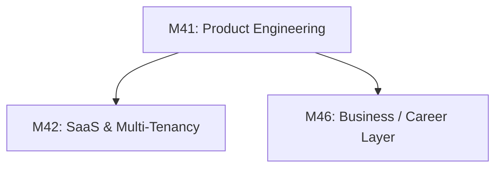

## Model lifecycle: training and release choices

Conceptual lifecycle, not a mandatory recipe. Distillation can be applied at different stages. Training objectives and parameter-update methods are classified separately in M33.

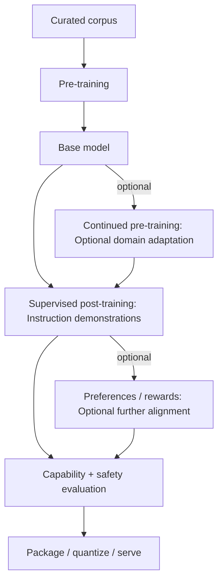

## RAG: preparation, retrieval and evidence

Evaluate extraction, retrieval and answer quality separately. Every retrieval checks access; maintenance propagates changes and deletion.

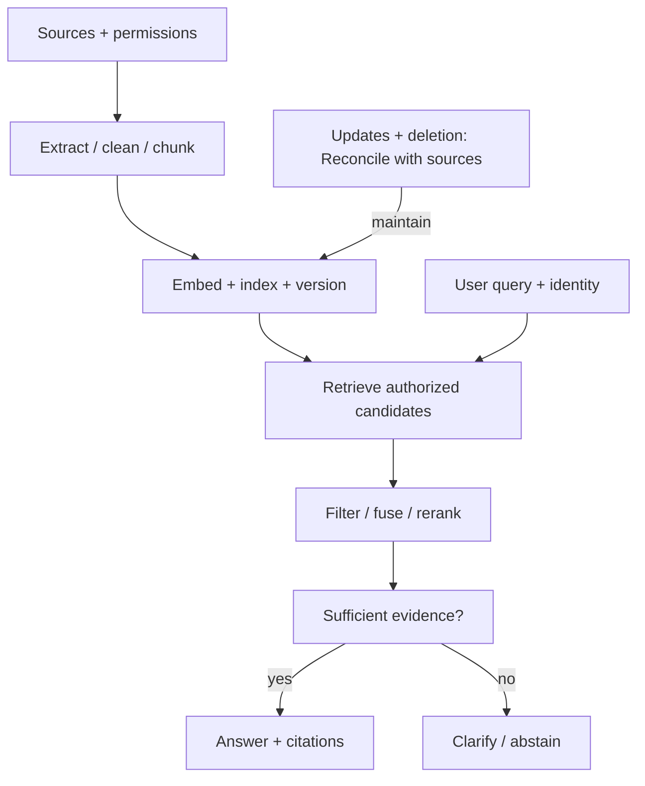

## Runtime loop with controlled actions

The runtime hosts the loop. Policy checks precede actions; verification follows them. MCP/A2A are optional adapters at integration boundaries. Tracing and resource controls cover the entire run.

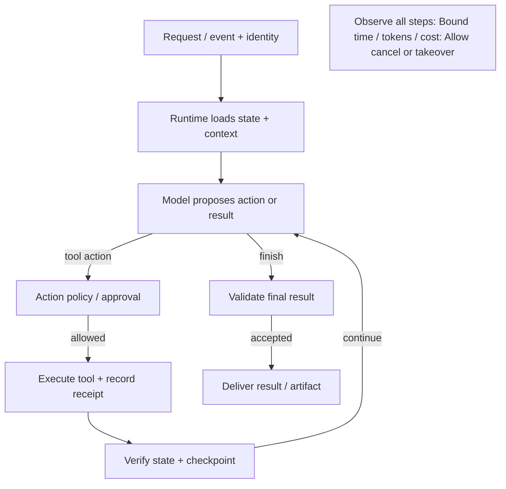

# Module index and source crosswalk

One stable M-number is used throughout the revised roadmap. Original layer numbers appear only in this crosswalk.

| Module | Topic | Path | Original layer |
|---|---|---|---|
| M01 | Engineering Foundations for Agentic AI | Core | 0 |
| M02 | FastAPI Production Backend | Core | 1 |
| M03 | Databases & Distributed Systems | Core | 2 |
| M04 | LLM & Foundation Model Fundamentals | Core | 3 |
| M05 | LLM Application Fundamentals | Core | 4 |
| M06 | Embeddings, Search & RAG | Core | 5 |
| M07 | Evaluation-First AI Engineering | Core | 6 |
| M08 | Tool Calling & Action Systems | Core | 7 |
| M09 | Agent Fundamentals | Core | 8 |
| M10 | Agent Frameworks & Orchestration | Core | 9 |
| M11 | Context Engineering | Core | 10 |
| M12 | Agent Memory | Production extension | 11 |
| M13 | Agent Runtime / Harness Engineering | Production extension | 12 |
| M14 | Durable Execution & Long-Running Agents | Production extension | 13 |
| M15 | Agent Skills | Production extension | 14 |
| M16 | MCP: Model Context Protocol | Production extension | 15 |
| M17 | A2A: Agent-to-Agent Interoperability | Specialization | 16 |
| M18 | Agent Protocol Landscape | Production extension | 17 |
| M19 | Multi-Agent Systems | Specialization | 18 |
| M20 | Browser Automation | Specialization | 19 |
| M21 | Computer-Use Agents | Specialization | 20 |
| M22 | AI Software Engineering / Coding Agents | Specialization | 21 |
| M23 | Multimodal AI | Specialization | 22 |
| M24 | Voice & Real-Time AI | Specialization | 23 |
| M25 | AI Security | Core | 24 |
| M26 | AI Governance, Privacy & Enterprise Controls | Core | 25 |
| M27 | Observability for AI Systems | Core | 26 |
| M28 | Reliability Engineering for AI | Core | 27 |
| M29 | AI Cost & Unit Economics | Core | 28 |
| M30 | AI Gateway / Model Gateway | Production extension | 29 |
| M31 | AI Platform Engineering | Specialization | 30 |
| M32 | Inference Engineering & Local Models | Specialization | 31 |
| M33 | Fine-Tuning & Custom Models | Specialization | 32 |
| M34 | AI Data Engineering & Document Intelligence | Core | 33 |
| M35 | AI UX / Generative UI | Core | 34 |
| M36 | Bots, Messaging & Integrations | Production extension | 35 |
| M37 | Background Jobs & Automation | Core | 36 |
| M38 | Cloud & Infrastructure | Core | 37 |
| M39 | CI/CD for AI | Core | 38 |
| M40 | Testing Strategy | Core | 39 |
| M41 | Product Engineering | Core | 40 |
| M42 | SaaS & Multi-Tenancy | Production extension | 41 |
| M43 | Domain Specialization | Core | 42 |
| M44 | Specialized AI Opportunities | Specialization | 43 |
| M45 | Research Literacy | Core | 44 |
| M46 | Business / Career Layer | Specialization | 45 |

# Engineering Foundations

## M01 — Engineering Foundations for Agentic AI

**Path:** Core · **Depth:** L2 foundation; L3 through demonstrated project work

**Purpose:** Concurrent API client.

**Prerequisites:** No technical prerequisites.

**Completion evidence:** Handle a timeout, cancellation and partial failure; tests run from a clean environment.

This layer contains the engineering foundations you actually need before going deep into AI systems. The target is **deep Python**, **strong systems/networking**, and **working math/ML knowledge** — not research-level theory.

### M01.1 Language and project engineering

#### M01.1.1 Python Core

##### M01.1.1.1 Language fundamentals

- Python syntax and semantics
- Variables, objects, mutability
- Functions and arguments
- Scope and closures
- Iterators and generators
- List/set/dict comprehensions
- Exceptions
- Context managers
- Decorators
- Classes and dataclasses
- Abstract base classes
- Modules and packages

##### M01.1.1.2 Python project engineering

- Virtual environments
- Packaging basics
- `pip`, `uv` or equivalent package workflows
- Dependency pinning and lock files
- Environment variables
- Configuration management
- Logging basics
- Project structure

##### M01.1.1.3 Type system

- Type hints
- `typing`
- `TypeVar`
- Generics
- `Protocol`
- `Literal`
- `TypedDict`
- `Annotated`
- Unions
- Optionality
- Structural typing
- Static checking with mypy/pyright

#### M01.1.2 Git & Development Workflow

##### M01.1.2.1 Core Git

- Clone
- Branch
- Commit
- Merge
- Rebase basics
- Pull requests
- Tags
- `.gitignore`
- Conflict resolution

##### M01.1.2.2 Production workflow

- Feature branches
- Code review
- Commit hygiene
- Release tags
- Reverting changes
- Bisect awareness
- GitHub/GitLab CI awareness

##### M01.1.2.3 Mastery checkpoint

Build an async Python service that calls multiple external APIs concurrently, handles timeouts and failures, exposes metrics, runs cleanly on Linux, and can be tested/debugged from the command line.

### M01.2 Data and external services

#### M01.2.1 Python for AI

##### M01.2.1.1 Data handling

- NumPy fundamentals
- Pandas fundamentals
- JSON / JSONL
- CSV
- Regular expressions
- pathlib
- Serialization
- File processing
- PDF/document handling
- Data cleaning

##### M01.2.1.2 HTTP and external services

- HTTP clients
- Request/response handling
- Timeouts
- Retries
- Authentication headers
- Pagination
- Rate-limit handling

### M01.3 Concurrency and operating systems

#### M01.3.1 Async Python

##### M01.3.1.1 Core async concepts

- Event loop
- Coroutines
- `async` / `await`
- Tasks
- Futures
- Concurrency vs parallelism

##### M01.3.1.2 Production async patterns

- Async HTTP clients
- Async database drivers
- Timeouts
- Cancellation
- Retries
- Backpressure
- Connection pools
- Blocking-code hazards
- Thread/process offloading
- Graceful shutdown

#### M01.3.2 Linux & Shell Fundamentals

##### M01.3.2.1 Linux essentials

- Files and directories
- Filesystem paths
- Permissions
- Users/groups awareness
- Environment variables
- Processes
- Threads awareness
- Signals
- File descriptors
- stdout / stderr
- Process exit codes
- Resource limits

##### M01.3.2.2 Shell workflow

- Bash fundamentals
- Pipes and redirection
- `grep`, `find`, `sed`, `awk` awareness
- `curl`
- `ps`, `top` / `htop`
- `kill`
- Logs
- SSH basics
- Environment debugging

##### M01.3.2.3 Why this matters for agents

- Agent runtimes often execute shell commands.
- Sandboxes expose filesystems, processes, network access, and environment variables.
- Production debugging frequently happens at the OS/process level.

### M01.4 Networking and communication

#### M01.4.1 Networking, HTTP & Realtime Fundamentals

##### M01.4.1.1 Networking basics

- IP addresses
- TCP vs UDP
- Ports
- DNS
- NAT concepts
- Firewalls
- TLS / HTTPS
- Certificates

##### M01.4.1.2 HTTP

- HTTP methods
- Status codes
- Headers
- Request/response lifecycle
- Keep-alive
- Compression
- Caching
- Cookies
- CORS
- HTTP/1.1 vs HTTP/2 awareness
- HTTP/3 awareness

##### M01.4.1.3 Realtime and service communication

- Server-Sent Events (SSE)
- WebSockets
- Streaming HTTP
- Webhooks
- gRPC / Protocol Buffers awareness
- Reverse proxies
- Load balancers
- API gateways
- Connection pooling

### M01.5 Mathematical and ML reasoning

#### M01.5.1 Math, Statistics & ML Foundations for AI Engineers

##### M01.5.1.1 Linear algebra essentials

- Scalars
- Vectors
- Matrices
- Matrix multiplication intuition
- Dot product
- Vector norms
- Cosine similarity
- Euclidean distance

##### M01.5.1.2 Probability and statistics essentials

- Probability basics
- Conditional probability
- Distributions intuition
- Mean / median
- Variance / standard deviation
- Sampling
- Confidence intervals intuition
- Correlation vs causation

##### M01.5.1.3 Information theory essentials

- Entropy intuition
- Cross entropy
- KL divergence intuition
- Perplexity

##### M01.5.1.4 Machine-learning essentials

- Supervised vs unsupervised learning
- Classification vs regression
- Clustering concepts
- Train / validation / test split
- Overfitting and underfitting
- Data leakage
- Loss functions
- Gradient descent intuition
- Backpropagation intuition
- Regularization awareness

##### M01.5.1.5 Evaluation metrics

- Confusion matrix
- Accuracy
- Precision
- Recall
- F1 score
- ROC-AUC awareness
- Calibration intuition

##### M01.5.1.6 Depth boundary

You do **not** need advanced calculus proofs, measure theory, advanced optimization, or research-level statistics for the core Agentic AI Engineer path.

### M01.6 Structured concurrency and debugging

#### M01.6.1 Task lifecycle

- Task groups.
- bounded concurrency.
- cancellation propagation.
- race-condition debugging.
- CPU-bound vs I/O-bound profiling.

### M01.7 Entry assessment

#### M01.7.1 Foundation checkpoint

- Read and modify an existing Python service.
- write a database query.
- explain HTTP errors.
- run tests and inspect logs.

## M02 — FastAPI Production Backend

**Path:** Core · **Depth:** L2 foundation; L3 through demonstrated project work

**Purpose:** Authenticated backend.

**Prerequisites:** M01

**Completion evidence:** Validate input, enforce access, persist data, run tests and deploy a container.

FastAPI is the primary API layer for this roadmap.

### M02.1 API contracts and validation

#### M02.1.1 FastAPI fundamentals

- Application lifecycle
- Routers
- Path/query/header/cookie parameters
- Request bodies
- Pydantic models
- Response models
- Status codes
- Dependency injection
- Middleware
- Exception handlers
- OpenAPI
- Swagger UI
- ReDoc
- API tags
- Security schemes

#### M02.1.2 Pydantic

- Pydantic v2 concepts
- Models
- Field constraints
- Nested models
- Validators
- Serialization
- JSON schema
- Discriminated unions
- Model composition
- Settings management
- Validation of untrusted model output

### M02.2 Application architecture

#### M02.2.1 API architecture

Use a maintainable structure such as:

**Architecture or workflow concepts:**

- app
- main.py
- api
- dependencies.py
- middleware.py
- routes
- schemas
- models
- repositories
- services
- agents
- tools
- rag
- workers
- core
- config.py
- logging.py
- security.py
- observability.py
- tests

Learn the separation between:

- Route layer
- Schema layer
- Service layer
- Repository layer
- Domain logic
- Agent orchestration
- Infrastructure adapters

### M02.3 Asynchronous request lifecycle

#### M02.3.1 FastAPI async patterns

- Async endpoints
- Streaming responses
- SSE
- WebSockets
- Webhooks
- File uploads
- Background work
- Lifespan hooks
- Graceful shutdown
- Connection management
- Cancellation handling

### M02.4 Identity and access

#### M02.4.1 Authentication and authorization

- JWT
- OAuth2
- API keys
- Session concepts
- Role-based access control
- Attribute-based access control
- Tenant isolation
- Service-to-service auth
- Token scopes

### M02.5 Verification and deployment

#### M02.5.1 FastAPI testing

- pytest
- Async test clients
- Unit tests
- Integration tests
- Contract tests
- Mocking external providers
- Database test isolation
- WebSocket tests
- Streaming tests
- Security tests

#### M02.5.2 FastAPI production deployment

- Uvicorn
- Gunicorn/process management concepts
- Docker
- Reverse proxies
- Health endpoints
- Readiness probes
- Liveness probes
- Graceful termination
- Horizontal scaling
- Configuration separation
- Secrets
- Rate limiting
- Request IDs
- Correlation IDs

##### M02.5.2.1 Optional gateway extension

Optional later extension, after model integration: build an **AI API Gateway** with:

- authentication
- streaming
- request validation
- provider abstraction
- structured logging
- metrics
- rate limits
- retries
- test suite
- Docker deployment

### M02.6 First application milestone

#### M02.6.1 Backend before AI integration

- Build an authenticated CRUD API.
- typed request and response models.
- database integration.
- test isolation.
- container deployment.

### M02.7 Lifecycle boundaries

#### M02.7.1 Requests and jobs

- Request deadlines.
- disconnect propagation.
- avoid blocking endpoints.
- move durable work to workers.

## M03 — Databases & Distributed Systems

**Path:** Core · **Depth:** L2 foundation; L3 through demonstrated project work

**Purpose:** Ingestion job service.

**Prerequisites:** M01, M02

**Completion evidence:** Persist job state, retry safely and demonstrate one completed result per job.

### M03.1 Relational persistence

#### M03.1.1 PostgreSQL

##### M03.1.1.1 Core relational concepts

- Relational modeling
- Primary / foreign keys
- Constraints
- Transactions
- Isolation levels
- Normalization / denormalization tradeoffs

##### M03.1.1.2 Query performance

- Indexes
- B-tree
- GIN
- BRIN
- Partial indexes
- Covering indexes
- `EXPLAIN ANALYZE`
- Query planning
- Connection pooling
- PgBouncer
- Table partitioning
- Full-text search
- JSONB

#### M03.1.2 SQLAlchemy

- SQLAlchemy 2.x patterns
- Async sessions
- Transactions
- Relationship loading
- Connection pooling
- Repository patterns

#### M03.1.3 Alembic

- Migrations
- Migration safety
- Roll-forward / rollback strategy
- Production schema changes
- Backward-compatible migrations

### M03.2 Caching and alternative storage

#### M03.2.1 Redis

##### M03.2.1.1 Core usage

- Key/value operations
- TTL
- Caching
- Sorted sets
- Pub/Sub
- Streams

##### M03.2.1.2 Production usage

- Distributed locks
- Rate limiting
- Deduplication
- Job queues
- Event coordination
- Cache invalidation concepts

#### M03.2.2 MongoDB

Learn enough to understand document-oriented workloads:

- Document modeling
- Indexes
- Aggregation pipelines
- Conversation/event storage
- Flexible schemas
- Tradeoffs vs PostgreSQL

#### M03.2.3 Vector Storage

- pgvector
- Vector columns
- HNSW
- IVFFlat
- Similarity search
- Metadata filtering
- Hybrid search
- Index build/update tradeoffs

### M03.3 Distributed correctness

#### M03.3.1 Distributed Systems

##### M03.3.1.1 Core concepts

- CAP theorem
- Availability
- Consistency
- Partition tolerance
- At-least-once delivery
- Exactly-once semantics at the business level
- Idempotency
- Deduplication

##### M03.3.1.2 Reliability patterns

- Outbox pattern
- Saga pattern
- Compensating actions
- Backpressure
- Load shedding
- Queue depth
- Dead-letter queues
- Retry storms
- Distributed locks

### M03.4 Events and streaming

#### M03.4.1 Event-Driven AI Systems

**Architecture or workflow concepts:**

- API
- Event / Job
- Queue
- Worker
- LLM / Agent / RAG
- DB / External Tool
- Event
- Notification / UI update

##### M03.4.1.1 Event design

- Events vs commands
- Event schemas
- Correlation IDs
- Idempotent consumers
- Replay awareness
- Ordering awareness

#### M03.4.2 Streaming Data, Kafka & CDC

##### M03.4.2.1 Kafka concepts

- Producer
- Consumer
- Topic
- Partition
- Consumer group
- Offset
- Ordering guarantees
- Retention
- Replay

##### M03.4.2.2 Change Data Capture

- CDC purpose
- Database change streams
- Source-of-truth changes → downstream events
- Incremental synchronization
- Event-driven index updates
- RAG freshness use cases

##### M03.4.2.3 Data contracts

- Event schema versioning
- Backward/forward compatibility
- Schema registry concepts
- Breaking-change detection

### M03.5 Structured retrieval extension

#### M03.5.1 Structured Data Retrieval & Text-to-SQL

A production AI system often needs structured data in addition to documents.

##### M03.5.1.1 Text-to-SQL fundamentals

- Natural language → SQL
- Schema discovery
- Schema linking
- Table selection
- Column selection
- Join selection
- Query generation

##### M03.5.1.2 Safe execution

- Read-only database roles
- SQL parsing/validation
- Query allowlists/denylists
- Row-level authorization
- Column-level authorization
- Query timeout
- Result limits
- Cost limits
- SQL injection boundaries

##### M03.5.1.3 Grounding structured answers

- Explain which query produced the answer
- Preserve database/source provenance
- Validate empty/ambiguous results
- Numeric aggregation checks
- Result summarization

##### M03.5.1.4 Multi-source retrieval routing

**Architecture or workflow concepts:**

- User Query
- Retriever / Data Router
- Vector Search
- BM25 / Search Index
- SQL
- Knowledge Graph
- API / Tool
- Web Search

##### M03.5.1.5 Optional extension brief

Foundation lab: build uploads, queueing, persistence, retries, DLQ, status tracking, and notifications. After M05–M07, extend this service with extraction, embeddings, indexing, and structured SQL retrieval.

### M03.6 Foundation versus later AI extension

#### M03.6.1 Prerequisite boundary

- First build persistence, uploads and job status.
- defer embeddings and generated SQL until model and retrieval modules.

### M03.7 Structured query trust

#### M03.7.1 Execution validation

- Database-enforced read permissions.
- semantic checks for joins and aggregates.
- schema drift.
- ambiguous query clarification.
- verify SQL against trusted test queries.

# AI & Model Foundations

## M04 — LLM & Foundation Model Fundamentals

**Path:** Core · **Depth:** L2 foundation; L3 through demonstrated project work

**Purpose:** Model comparison worksheet.

**Prerequisites:** M01

**Completion evidence:** Explain lifecycle stages and compare two models on a representative task set.

Learn this at **strong conceptual depth**. You should understand model behavior well enough to make engineering decisions, but you do not need to become a transformer researcher.

### M04.1 Representation, architecture and generation

#### M04.1.1 What an LLM Is

##### M04.1.1.1 Tokens and tokenization

- Tokens
- Vocabulary
- Tokenization
- BPE / subword-tokenization intuition
- Token counts and cost implications

##### M04.1.1.2 Transformer Architecture
│
├── A. Input Representation
│   ├── A.1 Token Embeddings
│   └── A.2 Positional Mechanisms
│       └── A.2.1 RoPE Awareness
│
├── B. Attention Mechanisms
│   ├── B.1 Self-Attention
│   ├── B.2 Multi-Head Attention
│   └── B.3 Causal Masking
│
├── C. Transformer Block Components
│   ├── C.1 Feed-Forward Networks
│   ├── C.2 Residual Connections
│   └── C.3 Layer Normalization / RMSNorm Awareness
│
├── D. Transformer Blocks
│   ├── D.1 Encoder Block
│   ├── D.2 Decoder Block
│   └── D.3 Repeated Transformer Blocks
│
├── E. Transformer Architecture Types
│   ├── E.1 Encoder-Only
│   ├── E.2 Decoder-Only
│   └── E.3 Encoder-Decoder
│       └── E.3.1 Mixed / Seq2Seq Architecture
│
└── F. LLM-Focused Architecture
    ├── F.1 Decoder-Only Transformer
    ├── F.2 Autoregressive Generation
    └── F.3 Causal Attention

##### M04.1.1.3 Inference behavior

- Context windows
- KV cache
- Prefill vs decode intuition
- Logits
- Log probabilities
- Autoregressive generation
- Stop sequences
- Constrained decoding concepts

##### M04.1.1.4 Sampling

- Temperature
- Top-p
- Greedy decoding
- Sampling tradeoffs
- Determinism limitations

### M04.2 Training and model lifecycle

#### M04.2.1 Model Lifecycle

##### M04.2.1.1 Training stages

###### M04.2.1.1.1 Pre-training

- Pretraining

###### M04.2.1.1.2 Supervised post-training

- Instruction tuning
- Supervised fine-tuning

###### M04.2.1.1.3 Preference and reward-based post-training

- Preference optimization
- RLHF concepts
- DPO concepts

###### M04.2.1.1.4 Knowledge transfer and dataset generation

- Distillation
- Synthetic data

##### M04.2.1.2 Deployment stages

- Quantization
- Model packaging
- Serving
- Versioning
- Evaluation before rollout

### M04.3 Model families and architectural choices

#### M04.3.1 Modern Model Families and Capabilities

Understand differences between:

- General-purpose language models
- Reasoning-oriented models
- Vision-language models
- Audio-language models
- Embedding models
- Rerankers
- Speech models
- Image/video generation models
- Small/local models
- Mixture-of-Experts models

##### M04.3.1.1 Architecture concepts worth knowing

- Dense vs Mixture-of-Experts models
- MHA vs MQA vs GQA awareness
- Long-context tradeoffs
- Model size vs latency/cost tradeoffs

### M04.4 Task-based model selection

#### M04.4.1 Model Selection

Evaluate models on:

- Quality
- Reasoning
- Tool use
- Structured output reliability
- Context handling
- Vision
- Coding
- Latency
- Cost
- Availability
- Privacy
- Regional requirements
- Safety characteristics
- Provider reliability

The correct question is not “Which model is best?” but “Which model is best for this task under our quality, latency, reliability, privacy, and cost constraints?”

### M04.5 Training stages in detail

#### M04.5.1 Pre-training

- Corpus collection and filtering.
- deduplication.
- tokenization.
- self-supervised objectives.
- base-model evaluation.

#### M04.5.2 Continued pre-training

- Domain-adaptive corpora.
- additional language exposure.
- retained capabilities.
- catastrophic forgetting.

#### M04.5.3 Post-training: supervised learning

- Instruction-response datasets.
- demonstrations.
- supervised fine-tuning.
- instruction-following evaluation.

#### M04.5.4 Post-training: preferences and rewards

- Preference datasets.
- preference optimization.
- RLHF.
- reward-model concepts.
- reinforcement learning with verifiable rewards awareness.

### M04.6 Compression and knowledge transfer

#### M04.6.1 Distillation

- Teacher-student learning.
- response distillation.
- capability transfer.
- evaluation after compression.
- distillation may occur at multiple lifecycle stages.

### M04.7 Release lifecycle

#### M04.7.1 Preparation and validation

- Model packaging.
- quantization.
- serving compatibility.
- capability and safety regression.
- versioned release.

## M05 — LLM Application Fundamentals

**Path:** Core · **Depth:** L2 foundation; L3 through demonstrated project work

**Purpose:** Typed AI endpoint.

**Prerequisites:** M02, M04

**Completion evidence:** Handle valid, refused, truncated and invalid responses; report cost and latency.

### M05.1 Provider integration and requests

#### M05.1.1 Provider integration

##### M05.1.1.1 Provider options

- OpenAI
- Anthropic
- Google
- Other major providers

##### M05.1.1.2 Access and usage controls

- API key/project management
- Usage limits
- Rate limits

##### M05.1.1.3 Integration behavior

- Error handling
- Provider-specific capabilities

Do not memorize provider APIs. Learn the common abstraction and the important provider differences.

#### M05.1.2 Prompt engineering

- Zero-shot
- One-shot
- Few-shot
- Instruction design
- Role definition
- Delimiters
- Output constraints
- Examples
- Prompt decomposition
- Task decomposition
- Prompt versioning
- Prompt testing

##### M05.1.2.1 Depth boundary

Do not spend excessive time memorizing prompt tricks. Prompting is foundational, but production performance increasingly depends on context, tools, state, retrieval, runtime, and evaluation.

### M05.2 Response contracts and validation

#### M05.2.1 Structured outputs

##### M05.2.1.1 Schema contracts

- JSON Schema
- Pydantic validation
- Function/tool schemas
- Schema evolution

##### M05.2.1.2 Output handling

- Structured output APIs
- Parse validation
- Repair loops
- Retry strategies

### M05.3 Streaming response lifecycle

#### M05.3.1 Streaming

- SSE
- WebSockets
- Streaming text
- Streaming structured events
- Progress events
- Backpressure
- Disconnect handling
- Reconnect strategy

### M05.4 Usage and efficiency

#### M05.4.1 Cost optimization

- Token budgeting
- Prompt caching
- Response caching
- Semantic caching
- Batch processing
- Model routing
- Output limits
- Context reduction
- Request deduplication

### M05.5 Request and response lifecycle

#### M05.5.1 Request assembly

- Instruction boundaries.
- message construction.
- model capability checks.
- prompt versions.
- task baseline.

#### M05.5.2 Response outcomes

- Valid output.
- refusal.
- incomplete output.
- truncation.
- parsing failure.
- bounded repair attempts.
- do not treat schema validity as factual correctness.

### M05.6 Early evaluation

#### M05.6.1 First model integration

- Version a small representative dataset.
- measure correctness, latency and cost.
- record failure cases from the first implementation.

# Knowledge & Action

## M06 — Embeddings, Search & RAG

**Path:** Core · **Depth:** L2 foundation; L3 through demonstrated project work

**Purpose:** Knowledge application.

**Prerequisites:** M03, M05, M07

**Completion evidence:** Compare retrieval baselines; cite evidence; verify permissions and source deletion.

### M06.1 Knowledge preparation and representation

#### M06.1.1 Document Ingestion

##### M06.1.1.1 File and content handling

- File uploads
- MIME/type detection
- PDF processing
- HTML
- Markdown
- Office documents
- Images
- Tables
- Scanned documents
- OCR

##### M06.1.1.2 Data quality and traceability

- Cleaning
- Metadata extraction
- Deduplication
- Versioning
- Provenance
- Document IDs
- Permission metadata

#### M06.1.2 Chunking

##### M06.1.2.1 Chunking strategies

- Fixed-size
- Recursive
- Sentence-based
- Semantic
- Token-aware
- Structure-aware

##### M06.1.2.2 Context-preserving strategies

- Parent-child
- Hierarchical
- Sentence-window
- Small-to-big retrieval
- Chunk overlap
- Chunk boundary quality
- Chunk metadata

#### M06.1.3 Embeddings

##### M06.1.3.1 Representation fundamentals

- Dense representations
- Similarity
- Cosine similarity
- Dot product
- Euclidean distance
- Embedding dimensionality

##### M06.1.3.2 Embedding engineering

- Embedding model choice
- Domain/language fit
- Query/document embedding compatibility
- Batch generation
- Embedding caching
- Re-embedding strategy

### M06.2 Candidate retrieval and query processing

#### M06.2.1 Retrieval & Information Retrieval Fundamentals

##### M06.2.1.1 Classical search concepts

- Inverted indexes
- Posting lists
- Term frequency / inverse document frequency
- Tokenization
- Stop-word handling awareness
- Stemming / lemmatization awareness
- Boolean retrieval
- Phrase search
- Fuzzy / typo-tolerant matching awareness
- Field boosting
- Faceted/filter search
- BM25

##### M06.2.1.2 First-stage retrieval

- Top-k
- Metadata filters
- Dense search
- Sparse search
- Hybrid search
- Search index + vector index combinations

##### M06.2.1.3 Fusion and query improvement

- Reciprocal Rank Fusion
- Query expansion
- Multi-query retrieval
- Self-querying
- Query rewriting

#### M06.2.2 Vector Databases & Approximate Nearest Neighbor Search

##### M06.2.2.1 Search strategies

- Exact search vs ANN
- Recall vs latency tradeoff
- Candidate generation

##### M06.2.2.2 ANN indexes

- HNSW
- IVF / IVFFlat
- Product quantization concepts
- Scalar quantization concepts
- Index construction
- Index tuning

##### M06.2.2.3 Production vector storage

- Metadata filtering + vector search
- Collections / namespaces
- Sharding concepts
- Replication concepts
- Updates
- Deletes / tombstones
- Compaction awareness
- Scaling tradeoffs

#### M06.2.3 Query Processing & Retrieval Routing

##### M06.2.3.1 Query understanding

- Intent detection
- Query classification
- Query normalization
- Query rewriting
- Query expansion
- Query decomposition

##### M06.2.3.2 Retrieval router

**Architecture or workflow concepts:**

- Query
- Router
- Dense Vector Search
- BM25 / Sparse Search
- Knowledge Graph
- SQL
- Metadata Search
- API / Tool
- Web Search

##### M06.2.3.3 Routing decisions

- Query type
- Source authority
- Freshness requirement
- Exact-term requirement
- Cost/latency budget
- Security boundary

### M06.3 Retrieval refinement and advanced methods

#### M06.3.1 Advanced RAG

##### M06.3.1.1 Retrieval enhancement

- HyDE
- Reranking
- Bi-encoder vs cross-encoder
- Late interaction / ColBERT concepts
- Multi-vector retrieval
- Fusion retrieval

##### M06.3.1.2 Context-focused retrieval

- Contextual compression
- Parent-child retrieval
- Contextual retrieval
- Sentence-window retrieval
- Small-to-big retrieval

##### M06.3.1.3 Reasoning-oriented RAG

- Query decomposition
- Multi-hop retrieval
- Iterative retrieval
- Self-RAG
- Corrective RAG (CRAG)
- Reflective RAG
- Adaptive RAG
- RAPTOR concepts

##### M06.3.1.4 Agentic and specialized RAG

- Agentic RAG
- Graph RAG
- Multimodal RAG
- Table RAG
- Multilingual RAG

##### M06.3.1.5 Evidence quality

- Source verification
- Citation generation
- Citation validation
- Contradiction detection

#### M06.3.2 Knowledge Graphs

##### M06.3.2.1 Graph fundamentals

- Entities
- Relationships
- Graph modeling
- Cypher concepts
- Entity extraction
- Relationship extraction

##### M06.3.2.2 Graph retrieval

- Graph traversal
- Graph-augmented retrieval
- Multi-hop reasoning
- Entity resolution
- Entity disambiguation
- Graph provenance
- Graph + vector hybrid retrieval

### M06.4 Evidence assembly and answer quality

#### M06.4.1 Context Engineering for RAG

RAG-specific application of the broader Context Engineering layer.

##### M06.4.1.1 Context assembly

- Context selection
- Context ordering
- Context prioritization
- Token budgeting
- Deduplication
- Metadata injection
- Source provenance

##### M06.4.1.2 Long-context quality

- Lost-in-the-middle problem
- Irrelevant context
- Contradictory context
- Repeated evidence
- Context compression
- Abstain when evidence is insufficient

#### M06.4.2 RAG Evaluation

RAG-specific application of the Evaluation layer.

##### M06.4.2.1 Retrieval metrics

- Recall@K
- Precision@K
- Hit Rate
- MRR
- nDCG

##### M06.4.2.2 Context metrics

- Context precision
- Context recall
- Context relevance

##### M06.4.2.3 Generation metrics

- Faithfulness / groundedness
- Answer relevance
- Correctness
- Completeness
- Citation correctness
- Citation completeness

##### M06.4.2.4 Evaluation workflow

- Golden datasets
- Hard negatives
- LLM-as-judge
- Human evaluation
- Regression testing
- Online evaluation / A-B tests

### M06.5 Failures, access and content security

#### M06.5.1 RAG Failure Modes

##### M06.5.1.1 Retrieval failures

- Retrieval misses
- Wrong chunks
- Low recall
- Low precision
- Bad filters
- Query drift

##### M06.5.1.2 Knowledge failures

- Contradictory chunks
- Stale data
- Missing data
- Wrong versions
- Bad chunk boundaries

##### M06.5.1.3 Generation failures

- Hallucination despite relevant evidence
- Evidence ignored
- Unsupported synthesis
- Citation mismatch
- Context overflow

#### M06.5.2 RAG Security

##### M06.5.2.1 Retrieval security

- Tenant isolation
- Authorization / ACL propagation
- Document-level permissions
- Chunk-level permissions
- Retrieval-time authorization
- Cache isolation

##### M06.5.2.2 Content security

- Prompt injection
- Indirect prompt injection
- Malicious documents
- Data poisoning
- PII leakage
- Metadata leakage
- Secret leakage

##### M06.5.2.3 Auditability

- Source identity
- Access decision logs
- Retrieval trace
- Citation trace

### M06.6 Knowledge maintenance and operations

#### M06.6.1 Incremental Indexing

##### M06.6.1.1 Change management

- Change detection
- Content hashing
- Diff-based re-indexing
- Freshness policies
- Deletion handling
- Version tracking
- Event-driven re-indexing

##### M06.6.1.2 Operational correctness

- Idempotent updates
- Failed update recovery
- Index/source reconciliation
- Freshness monitoring

#### M06.6.2 Production RAG

##### M06.6.2.1 Performance

- Embedding batching
- Retrieval latency
- Reranker latency
- Parallel retrieval
- Async pipelines
- Connection pooling
- Index tuning

##### M06.6.2.2 Caching

- Query cache
- Embedding cache
- Retrieval cache
- Cache invalidation
- Tenant-safe cache keys

##### M06.6.2.3 Operations

- Cost optimization
- Token optimization
- Observability / tracing
- Freshness SLOs
- Quality gates
- Rollback / re-index strategy

### M06.7 Architecture selection

#### M06.7.1 Knowledge Architecture Comparison

Know when to use each approach rather than forcing everything into vector search.

##### M06.7.1.1 Compare

- RAG
- Fine-tuning
- Long-context prompting
- Knowledge graphs
- SQL / structured retrieval
- Search engines
- Agent + tools

##### M06.7.1.2 Optional extension brief

Build an **Enterprise Knowledge Platform** that supports:

- PDFs and web pages
- OCR and tables
- structured metadata
- vector + sparse indexes
- ANN/vector database tuning
- hybrid retrieval
- reranking
- query routing
- SQL/structured retrieval
- citations
- incremental updates
- authorization-aware retrieval
- multi-tenant isolation
- evaluation datasets
- RAG metrics
- observability
- security tests

### M06.8 Practical retrieval baseline

#### M06.8.1 Candidate refinement

- Basic reranking belongs in the main pipeline.
- candidate generation versus reranking.
- compare lexical, dense and hybrid baselines.

#### M06.8.2 Offline versus online

- Offline: ingest, extract, chunk, embed, index.
- online: understand query, retrieve, filter, rerank, assemble evidence, answer.

### M06.9 Advanced method selection

#### M06.9.1 Evidence-based adoption

- Treat HyDE, RAPTOR, Self-RAG, CRAG and graph methods as electives.
- measure improvement over the baseline before adopting.

### M06.10 Worked example

#### M06.10.1 Permission-aware document answer

- Ingest a revised manual.
- index document version and ACL.
- retrieve only authorized evidence.
- cite the current source.
- test removal after deletion.

## M08 — Tool Calling & Action Systems

**Path:** Core · **Depth:** L2 foundation; L3 through demonstrated project work

**Purpose:** Verified action workflow.

**Prerequisites:** M02, M05, M25

**Completion evidence:** Block unauthorized calls, survive an ambiguous timeout and verify no duplicate write.

### M08.1 Tool interfaces and discovery

#### M08.1.1 Tool Basics

##### M08.1.1.1 Schema design

- Tool schema design
- Required vs optional parameters
- Typed inputs
- Typed outputs
- Tool descriptions
- Examples inside tool definitions
- Tool constraints
- Tool result normalization

#### M08.1.2 Tool Routing

##### M08.1.2.1 Catalog organization

- Tool namespacing
- Tool grouping
- Tool catalogs

##### M08.1.2.2 Discovery and selection

- Selecting among tools
- Dynamic tool loading
- Tool discovery
- Tool relevance filtering

### M08.2 Authorization and safe action boundaries

#### M08.2.1 Tool Permissions

Classify tools as:

**Architecture or workflow concepts:**

- Read-only
- Low-risk write
- High-risk write
- Irreversible / financial / sensitive

Add explicit authorization and approval requirements based on risk.

### M08.3 Execution and reliability

#### M08.3.1 Execution Models

##### M08.3.1.1 Call scheduling

- Single tool calls
- Sequential tool calls
- Parallel tool calls
- Dependent calls
- Fan-out / fan-in

##### M08.3.1.2 Failure coordination

- Partial failure
- Compensation

#### M08.3.2 Tool Reliability

- Validation
- Retries
- Timeout
- Circuit breakers
- Fallbacks
- Idempotency
- Result verification
- Side-effect classification

### M08.4 Verification and recovery

#### M08.4.1 Action Verification & Safe Side Effects

A tool result saying “success” is not always enough. Verify the resulting environment state when the action matters.

##### M08.4.1.1 Before execution

- Preconditions
- Authorization check
- Input validation
- Risk classification
- Dry-run where possible
- Idempotency key

##### M08.4.1.2 After execution

- Tool result validation
- Postcondition checks
- Environment-state verification
- Action receipts / identifiers
- Side-effect verification

##### M08.4.1.3 Failure and recovery

- Retry only when safe
- Duplicate-action prevention
- Compensation
- Undo/reversal where supported
- Escalation
- Human approval for ambiguous state

### M08.5 Approval validity

#### M08.5.1 Before executing an approved action

- Bind approval to action parameters and target version.
- expire stale approvals.
- recheck permissions.
- detect changed external state.

### M08.6 Action lifecycle

#### M08.6.1 Worked example

- Create a task with an idempotency key.
- retry after timeout.
- look up the receipt.
- verify one resulting task.
- escalate ambiguous state.

# Agent Intelligence

## M09 — Agent Fundamentals

**Path:** Core · **Depth:** L2 foundation; L3 through demonstrated project work

**Purpose:** Bounded single agent.

**Prerequisites:** M08, M07

**Completion evidence:** Persist task state, enforce stop criteria, report failures and demonstrate human intervention.

### M09.1 Architecture selection and agent components

#### M09.1.1 What Is an Agent?

Understand the spectrum:

**Architecture or workflow concepts:**

- Static response
- Structured workflow
- Conditional workflow
- Single tool-using agent
- Stateful agent
- Long-running agent
- Multi-agent system
- Agent ecosystem

#### M09.1.2 Agent Anatomy

- Model
- Instructions
- Context
- State
- Tools
- Memory
- Planner
- Executor
- Environment
- Feedback loop
- Guardrails
- Evaluator
- Runtime

### M09.2 Task reasoning and planning

#### M09.2.1 Planning and Reasoning

##### M09.2.1.1 Planning and decomposition

- Plan-and-execute
- Task decomposition
- Least-to-most

##### M09.2.1.2 Exploration and revision

- Reflection
- Self-critique
- Retry with alternate strategies
- Search-based reasoning
- Branching and backtracking

##### M09.2.1.3 Execution and termination

- ReAct
- Stop criteria

### M09.3 State and execution failures

#### M09.3.1 Agent State

##### M09.3.1.1 State categories

- Conversation state
- Task state
- Tool state
- External state

##### M09.3.1.2 Persistence and transitions

- State machine concepts
- Workflow state
- Checkpoints
- Resumability

#### M09.3.2 Failure Modes

- Infinite loops
- Wrong tool
- Wrong arguments
- Hallucinated actions
- Error compounding
- Stale context
- Context overflow
- Deadlocks
- Duplicate actions
- Unbounded cost
- Tool timeout
- Partial completion
- State corruption

### M09.4 Human control and event triggers

#### M09.4.1 Human-in-the-Loop

- Approval checkpoints
- Rejection handling
- Escalation
- Async approval
- Human takeover
- Confidence/risk-based escalation
- High-risk action confirmation

#### M09.4.2 Proactive & Event-Driven Agents

Not every agent starts from a chat message.

##### M09.4.2.1 Trigger types

- Scheduled agents
- Webhook-triggered agents
- Email/message-triggered agents
- Database-change agents
- Monitoring agents
- Conditional watchers
- Event-driven agents

##### M09.4.2.2 Event-driven pattern

**Architecture or workflow concepts:**

- Event / Schedule
- Trigger
- Agent / Workflow
- Evaluate State / Condition
- Action or No Action
- Record Outcome

##### M09.4.2.3 Production concerns

- Deduplication
- Idempotency
- Event ordering awareness
- Missed-event recovery
- Scheduling drift
- Notification suppression
- Safe repeated execution

##### M09.4.2.4 Optional extension brief

Build a **Research / Monitoring Agent** that searches the web, gathers sources, performs iterative retrieval, checks evidence, writes a cited report, exposes progress, pauses for approval, resumes after approval, records a trace, and can also run from a schedule or external event.

### M09.5 Architecture decision

#### M09.5.1 Autonomy is optional

- Compare deterministic code, structured workflows and agents.
- choose the simplest architecture meeting the task criteria.
- multi-agent is an option, not a graduation level.

### M09.6 Minimal agent loop

#### M09.6.1 Before adopting a framework

- Model request.
- typed tool call.
- authorization.
- execution.
- observation.
- updated state.
- termination condition.
- bounded steps.

## M10 — Agent Frameworks & Orchestration

**Path:** Core · **Depth:** L2 foundation; L3 through demonstrated project work

**Purpose:** Framework comparison.

**Prerequisites:** M09, M11

**Completion evidence:** Implement one workflow and explain framework state, retry and debugging tradeoffs.

### M10.1 Framework selection and implementation depth

#### M10.1.1 What to learn deeply

Choose one primary framework deeply. For this roadmap, use **LangGraph** as the primary orchestration framework.

Learn provider-native agent SDKs enough to understand their architecture and tradeoffs.

### M10.2 Framework landscape and tradeoffs

#### M10.2.1 Frameworks to know

##### M10.2.1.1 Primary implementation options (choose one)

- LangGraph
- Provider-native agent APIs/SDKs
- FastAPI integration patterns

##### M10.2.1.2 Other frameworks (L1 awareness unless selected)

- LangChain
- LlamaIndex
- Google ADK
- Semantic Kernel
- CrewAI
- AG2 / AutoGen family
- Vercel AI SDK concepts

##### M10.2.1.3 Comparison criteria

- Control
- State management
- Debuggability
- Durable execution
- Tool ecosystem
- Deployment model
- Lock-in
- Observability
- Performance
- Community

##### M10.2.1.4 Principle

Frameworks are replaceable. Agent architecture is the durable skill.

### M10.3 Framework learning policy

#### M10.3.1 One deep implementation

- Implement a minimal loop first.
- learn one orchestration framework to L3.
- compare one alternative when needed.
- other named frameworks remain L1 awareness.

### M10.4 Adoption decision

#### M10.4.1 Architecture before dependencies

- Measure portability.
- inspect state and failure semantics.
- understand default retries and persistence.
- test framework upgrades.

## M11 — Context Engineering

**Path:** Core · **Depth:** L2 foundation; L3 through demonstrated project work

**Purpose:** Context manager.

**Prerequisites:** M05

**Completion evidence:** Meet a token budget while retaining constraints, authority boundaries and source evidence.

This is one of the most important modern AI engineering disciplines.

### M11.1 Context sources and assembly

#### M11.1.1 Context as a system

Treat context as a scarce runtime resource.

Learn:

##### M11.1.1.1 Selection and assembly

- Context assembly
- Context selection
- Context prioritization
- Context routing

##### M11.1.1.2 Reduction and budgeting

- Context compression
- Context compaction
- Context eviction
- Context summarization

##### M11.1.1.3 Reuse and integrity

- Context caching
- Context provenance
- Context isolation

#### M11.1.2 Context components

**Architecture or workflow concepts:**

- System instructions
- task state
- user request
- selected memory
- retrieved knowledge
- tool definitions
- tool results
- previous execution state
- environment state

### M11.2 Selection and budget management

#### M11.2.1 Context optimization

- Remove irrelevant history
- Compress repeated tool output
- Summarize completed work
- Keep critical constraints persistent
- Preserve source provenance
- Separate transient state from durable state
- Budget tokens by component

### M11.3 Context integrity and failure analysis

#### M11.3.1 Long-context failure modes

- Lost-in-the-middle
- Context poisoning
- Stale instructions
- Contradictory state
- Tool-result bloat
- Repeated context
- Irrelevant retrieval
- Context over-trust

### M11.4 Context, memory and durable state

#### M11.4.1 Context and memory

Understand the distinction:

**Architecture or workflow concepts:**

- Context = what the model receives now
- Memory  = what can be retrieved later
- State / = what the application must persist to continue correctly

##### M11.4.1.1 Optional extension brief

Build a **Context Manager** that dynamically assembles instructions, memory, RAG results, tool descriptions, task state, and history under a configurable token budget.

### M11.5 Context lifecycle

#### M11.5.1 Sources and authority

- Separate trusted instructions, user requests and untrusted retrieved content.
- preserve provenance.
- choose relevant and current evidence.

#### M11.5.2 Assembly and evaluation

- Allocate budget by component.
- order evidence.
- preserve critical constraints during compaction.
- test constraint retention and answer quality.

## M12 — Agent Memory

**Path:** Production extension · **Depth:** L1–L2 initially; L3 when required

**Purpose:** Memory lifecycle.

**Prerequisites:** M03, M11, M26

**Completion evidence:** Demonstrate write, correction, stale recall prevention and deletion.

### M12.1 Memory categories and persistence

#### M12.1.1 Memory types

##### M12.1.1.1 Temporal scope

- Working memory
- Short-term memory
- Episodic memory

##### M12.1.1.2 Knowledge and procedure

- Semantic memory
- Procedural memory

##### M12.1.1.3 Ownership and purpose

- User profile memory
- Task memory
- Organizational memory

#### M12.1.2 Storage choices

- Relational database
- Document store
- Vector store
- Knowledge graph
- Event log
- Object storage

### M12.2 Write, correction and retention policies

#### M12.2.1 Memory policies

##### M12.2.1.1 Write decisions and evidence

- What to write
- What not to write
- Confidence
- Source attribution

##### M12.2.1.2 Freshness and correction

- Freshness
- Staleness
- Conflict resolution
- User correction

##### M12.2.1.3 Retention and deletion

- Forgetting
- Deletion

### M12.3 Access, privacy and poisoning controls

#### M12.3.1 Memory security

- Tenant isolation
- Access control
- PII
- Retention
- Deletion requests
- Memory poisoning
- Sensitive facts
- Auditability

### M12.4 Read-time ranking and optimization

#### M12.4.1 Memory optimization

- Summarization
- Compression
- Retrieval scoring
- Relevance filtering
- Recency
- Importance
- Temporal decay

##### M12.4.1.1 Optional extension brief

Build a **Persistent Personal Assistant Memory Layer** with explicit write/read/delete policies, provenance, freshness, and user-visible memory controls.

### M12.5 Memory lifecycle

#### M12.5.1 Write and correction

- Candidate fact.
- source and confidence.
- write decision.
- user correction.
- conflict resolution.
- versioned update.

#### M12.5.2 Read and maintenance

- Retrieve.
- rank.
- check freshness and permissions.
- insert into context.
- expire.
- delete and reconcile downstream copies.

### M12.6 Memory quality

#### M12.6.1 Evaluation

- Test incorrect writes, stale recall, correction propagation and cross-user isolation.
- compare the system with and without memory.

# Agent Infrastructure & Ecosystem

## M13 — Agent Runtime / Harness Engineering

**Path:** Production extension · **Depth:** L1–L2 initially; L3 when required

**Purpose:** Isolated execution workspace.

**Prerequisites:** M01, M08, M25

**Completion evidence:** Enforce resource/egress limits, cancellation and artifact persistence.

This layer is critical for modern long-running agents.

### M13.1 Execution environment

#### M13.1.1 Runtime concepts

##### M13.1.1.1 Workspace and capabilities

- Execution environment
- Workspace
- Filesystem
- Shell
- Network access
- Environment variables

##### M13.1.1.2 Execution and persistence

- Agent loop
- Secrets
- Artifact storage
- Process management

### M13.2 Isolation and resource boundaries

#### M13.2.1 Sandboxing

##### M13.2.1.1 Isolation boundaries

- Containers
- Process isolation
- Filesystem isolation
- Network restrictions
- Workspace boundaries

##### M13.2.1.2 Resource ceilings

- CPU limits
- Memory limits
- Time limits

##### M13.2.1.3 Capability allowlists

- Tool allowlists
- Domain allowlists

### M13.3 Provisioning and task lifecycle

#### M13.3.1 Runtime lifecycle

**Architecture or workflow concepts:**

- Create task
- Provision environment
- Load context / skills
- Execute agent
- Checkpoint
- Continue / pause / approve
- Persist artifacts
- Complete / fail / cancel
- Destroy or retain environment

### M13.4 Execution control

#### M13.4.1 Runtime control

##### M13.4.1.1 Task control

- Cancellation
- Interruptibility
- Timeouts
- Emergency stop
- Human takeover

##### M13.4.1.2 Resource and spend limits

- Concurrency
- Quotas
- Max steps
- Max tokens
- Max cost

### M13.5 Artifact persistence

#### M13.5.1 Artifacts

- Files
- Reports
- Images
- Generated code
- Logs
- Datasets
- Test results
- Build outputs

##### M13.5.1.1 Optional extension brief

Build a **sandboxed agent runtime** capable of executing shell tools inside isolated workspaces with time, memory, network, and permission controls.

### M13.6 Runtime controls in practice

#### M13.6.1 Environment boundaries

- Provision workspace.
- install pinned dependencies.
- inject scoped credentials.
- enforce egress.
- persist approved artifacts.
- clean up.

### M13.7 Sandbox selection

#### M13.7.1 Isolation strength

- Choose isolation based on threat model.
- containers alone are not a universal security boundary.
- distinguish trusted jobs from untrusted code execution.

## M14 — Durable Execution & Long-Running Agents

**Path:** Production extension · **Depth:** L1–L2 initially; L3 when required

**Purpose:** Restart-safe workflow.

**Prerequisites:** M03, M09, M13, M37

**Completion evidence:** Recover after a crash at an action boundary without duplicating external changes.

### M14.1 Durability requirements

#### M14.1.1 Why durable execution matters

A production agent may run for minutes, hours, or days and can encounter failures, human waits, retries, provider outages, or environment restarts.

### M14.2 State, waiting and recovery

#### M14.2.1 Lifecycle concepts

##### M14.2.1.1 State and persistence

- Durable workflows
- Checkpointing
- Workflow state
- Event sourcing concepts
- Human waiting states

##### M14.2.1.2 Waiting and control

- Resume
- Pause
- Signals
- Timers

##### M14.2.1.3 Failure and recovery

- Retry policies
- Compensation
- Crash recovery
- Idempotent activities

### M14.3 Workflow infrastructure

#### M14.3.1 Workflow orchestration

Understand tools and concepts such as:

- Temporal-style durable execution
- Queue workers
- Event-driven workflows
- Workflow engines
- Scheduled jobs

### M14.4 Long-horizon task management

#### M14.4.1 Long-horizon agent design

- Decompose long tasks
- Save progress
- Rebuild context
- Validate intermediate artifacts
- Recover from partial failure
- Re-plan when assumptions change

##### M14.4.1.1 Optional extension brief

Build a **multi-hour research/workflow agent** that survives process restarts and resumes from checkpoints.

### M14.5 Replay and evolution

#### M14.5.1 Deterministic orchestration

- Record nondeterministic model and external activity results.
- deterministic workflow replay.
- separate orchestration from side effects.

#### M14.5.2 Compatibility over time

- Workflow versioning.
- state-schema migrations.
- replay compatibility tests.
- recovery across application upgrades.

### M14.6 Recovery drill

#### M14.6.1 Failure at the action boundary

- Crash before action.
- crash after action before checkpoint.
- recover using receipts and idempotency.
- verify no duplicate writes.

## M15 — Agent Skills

**Path:** Production extension · **Depth:** L1–L2 initially; L3 when required

**Purpose:** Versioned skill pack.

**Prerequisites:** M08, M11

**Completion evidence:** Demonstrate discovery, permission checks, execution and output validation.

Agent Skills are reusable procedural capabilities that can be discovered and loaded by agents.

### M15.1 Capability definition and boundaries

#### M15.1.1 Skills architecture

##### M15.1.1.1 Definition and resources

- Skill metadata
- Skill instructions
- Resources
- Scripts
- Examples

##### M15.1.1.2 Packaging and discovery

- Dependencies
- Versioning
- Discovery
- Progressive loading

#### M15.1.2 Skills vs tools vs MCP

Understand the conceptual distinction:

**Architecture or workflow concepts:**

- Prompt / = instructions
- Skill / = reusable procedure/capability
- Tool / = executable action/interface
- MCP / = protocol for connecting model hosts/agents to tools/data/context
- A2A / = protocol for agent-to-agent interaction

##### M15.1.2.1 Optional extension brief

Create a reusable **Agent Skill Pack** for research, document analysis, coding, and data extraction.

### M15.2 Discovery and execution lifecycle

#### M15.2.1 Skill lifecycle

**Architecture or workflow concepts:**

- Discover
- Select
- Authorize
- Load
- Execute
- Validate
- Record outcome

### M15.3 Composition, validation and evolution

#### M15.3.1 Skills engineering

- Skill composition
- Skill conflicts
- Skill permissions
- Skill testing
- Skill portability
- Skill deprecation
- Skill version migration

### M15.4 Skill validation

#### M15.4.1 Reusable procedure quality

- Declare required tools and permissions.
- test discovery and selection.
- validate outputs.
- evaluate conflicting instructions.
- record supported runtime versions.

## M16 — MCP: Model Context Protocol

**Path:** Production extension · **Depth:** L1–L2 initially; L3 when required

**Purpose:** Remote MCP integration.

**Prerequisites:** M08, M25

**Completion evidence:** Test supported protocol capabilities, authorization and tool results.

Learn modern MCP as a protocol, not merely a local desktop integration.

### M16.1 Protocol entities and operations

#### M16.1.1 MCP fundamentals

- Hosts
- Clients
- Servers
- Tools
- Resources
- Prompts
- Discovery
- Schemas

#### M16.1.2 MCP operations

- List tools
- Call tools
- List resources
- Read resources
- Prompt discovery
- Capability negotiation
- Error handling

### M16.2 Remote transport and scaling

#### M16.2.1 Remote MCP

- HTTP-native architecture
- Stateless design
- Horizontal scaling
- Load balancers
- Routing
- Caching
- Authorization
- Observability

### M16.3 Identity and authorization

#### M16.3.1 Production MCP

##### M16.3.1.1 Identity and permissions

- Authentication
- Authorization
- OAuth concepts
- Client identity
- Permission scopes
- Tool authorization
- Resource authorization

##### M16.3.1.2 Operations and compatibility

- Rate limiting
- Audit logging
- Versioning
- Deprecation

### M16.4 Core capabilities and extensions

#### M16.4.1 Modern MCP capabilities to know

- Stateless protocol core
- Multi-round-trip request patterns
- Header-based routing
- Cacheable list results
- Tasks
- Extensions
- MCP Apps
- Enterprise authorization concepts

### M16.5 Integration architecture

#### M16.5.1 MCP gateway architecture

**Architecture or workflow concepts:**

- Agent
- MCP Gateway
- Internal tools
- SaaS APIs
- Databases
- File systems
- Enterprise systems
- Third-party MCP servers

##### M16.5.1.1 Optional extension brief

Build a **production remote MCP server with FastAPI/Python integration**, OAuth-aware authorization, tool permissions, observability, and tests.

### M16.6 Version discipline

#### M16.6.1 Core versus extensions

- Record protocol and SDK versions.
- distinguish core behavior from Tasks and MCP Apps extensions.
- test supported capabilities.
- document migration compatibility.

### M16.7 Protocol security testing

#### M16.7.1 Integration boundaries

- Verify client identity and delegated scope.
- authorize each tool/resource.
- redact telemetry.
- test unsupported capabilities and expired credentials.

## M17 — A2A: Agent-to-Agent Interoperability

**Path:** Specialization · **Depth:** L1 awareness; L2–L3 in the selected track

**Purpose:** Federated task demo.

**Prerequisites:** M09, M14, M16

**Completion evidence:** Delegate a task across independent agents with cancellation and artifact verification.

### M17.1 Interoperability scope

#### M17.1.1 Why A2A exists

MCP connects agents to capabilities and data. A2A addresses communication and interoperability between agents.

### M17.2 Discovery, messages and tasks

#### M17.2.1 Lifecycle concepts

##### M17.2.1.1 Discovery and identity

- Agent discovery
- Agent identity
- Agent capabilities
- Agent cards / capability descriptions

##### M17.2.1.2 Task exchange

- Tasks
- Messages
- Artifacts
- Long-running agent interactions
- Remote agents

##### M17.2.1.3 Trust and compatibility

- Authentication
- Authorization
- Version negotiation
- Cross-vendor interoperability

### M17.3 Federation and delegation

#### M17.3.1 Multi-agent ecosystem

**Architecture or workflow concepts:**

- User Agent
- MCP → tools/data
- A2A → research agent
- A2A → payment agent
- A2A → coding agent

#### M17.3.2 A2A engineering

- Agent registry
- Discovery
- Capability matching
- Delegation
- Agent trust
- Timeouts
- Partial completion
- Artifact exchange
- Protocol compatibility testing

##### M17.3.2.1 Optional extension brief

Build a **federated multi-agent system** in which a FastAPI orchestrator delegates work to independent agents over an A2A-style interface.

### M17.4 Task lifecycle

#### M17.4.1 Federated execution

- Discovery.
- capability matching.
- authenticated delegation.
- task status.
- cancellation.
- artifact transfer.
- completion verification.

### M17.5 Conformance

#### M17.5.1 Actual protocol implementation

- Use a versioned protocol and SDK for a conformance claim.
- an A2A-style custom interface is only a design exercise.
- test cross-agent authorization and compatibility.

## M18 — Agent Protocol Landscape

**Path:** Production extension · **Depth:** L1–L2 initially; L3 when required

**Purpose:** Protocol boundary design.

**Prerequisites:** M08, M25

**Completion evidence:** Explain integration and trust boundaries; optionally run a simulated payment with an audit trail.

Understand the roles of major protocol families.

| Protocol / Concept | Main problem |
|---|---|
| MCP | Agent/model ↔ tools/data/context |
| A2A | Agent ↔ agent interoperability |
| A2UI | Agent ↔ dynamically generated UI |
| AG-UI concepts | Agent ↔ user-interface event streaming |
| Commerce protocols | Agent ↔ commerce/catalog/checkout workflows |
| Payment protocols | Agent-authorized payment interactions |

You do not need deep expertise in every protocol. You need architectural literacy and the ability to recognize where each fits.

### M18.1 Identity and delegated trust

#### M18.1.1 Agent Identity & Trust

Agent interoperability requires more than protocol compatibility. Production systems need mechanisms for identifying clients and agents, binding authority, establishing trust, and verifying who is acting on whose behalf.

##### M18.1.1.1 Core concepts

- User identity vs agent identity vs client identity
- Agent identity vs workload/service identity
- Delegated authority
- Credential binding
- Agent provenance
- Authentication vs authorization
- Trust chains
- Capability-based authorization
- Credential rotation and revocation
- Identity discovery and metadata
- Merchant-side agent verification
- Cross-system identity propagation
- Identity and authorization audit trails

##### M18.1.1.2 Emerging implementation-layer standards to track

- Client ID Metadata Documents (CIMD) — concrete client identity metadata/discovery mechanisms relevant to modern authorization and MCP deployments
- Web Bot Auth — emerging mechanisms for cryptographically verifiable agent/bot identity at the web or merchant edge

Treat these as evolving standards. Learn the identity architecture first, then track current specifications and adoption.

### M18.2 Commerce and payment lifecycle

#### M18.2.1 Agentic Commerce & Payments

This is the bridge between an autonomous agent's reasoning and real-world commercial action. The architecture must distinguish intent, authorization, transaction construction, execution, confirmation, and settlement.

##### M18.2.1.1 Core concepts

- Agentic commerce lifecycle
- Product/catalog discovery
- Merchant and agent discovery
- Offer and pricing retrieval
- Cart construction
- Checkout orchestration
- Purchase authorization
- Delegated payment authority
- Mandates and pre-authorization
- Spending limits and budgets
- Per-transaction and cumulative limits
- User consent and revocation
- Payment intent vs payment execution
- Merchant-side agent verification
- Transaction confirmation
- Idempotency for financial actions
- Fraud and abuse controls
- Payment risk classification
- Refunds and reversals
- Disputes and reconciliation
- Settlement concepts
- Payment auditability
- Human approval for high-risk transactions
- Safe fallback for failed or ambiguous transactions
- Privacy and data minimization

##### M18.2.1.2 Current protocol / ecosystem examples to track

These names are implementation-layer examples, not durable architectural primitives:

- **AP2 (Agent Payments Protocol)** — agent-authorized payment flows built around cryptographic mandates and authorization concepts
- **ACP (Agentic Commerce Protocol)** — agent-commerce / checkout integration patterns associated with the OpenAI + Stripe ecosystem
- **x402** — HTTP-native payment signaling and stablecoin-oriented payment flows built around the HTTP 402 concept
- **MPP (Machine Payments Protocol)** — machine/session-oriented payment authorization and spending patterns associated with Stripe/Tempo
- **Visa TAP** — network-level agent identity/authentication and payment-oriented infrastructure to track
- **Mastercard Agent Pay** — network-level agentic commerce and payment infrastructure to track

##### M18.2.1.3 Architecture

**Architecture or workflow concepts:**

- User
- Agent
- Intent / Purchase Request
- Identity + Delegated Authority
- Policy / Spending Controls
- Commerce Discovery / Checkout
- Payment Protocol / Network
- Transaction Authorization
- Payment Execution
- Confirmation / Settlement
- Audit / Reconciliation

##### M18.2.1.4 Security requirements

- Explicit transaction authorization
- Least-privilege payment authority
- Spending ceilings
- Merchant / recipient verification
- Replay protection
- Idempotency keys
- Transaction signing / mandate verification where applicable
- Credential isolation
- Strong audit records
- Human approval for defined risk tiers
- Emergency cancellation / kill switch

##### M18.2.1.5 Optional extension brief

Extend the autonomous business system with a **sandboxed agentic commerce and payment layer** that can discover a product/service, construct a transaction, request or verify delegated authority, enforce spending policies, execute a test payment through a selected protocol adapter, reconcile the result, and produce a complete audit trail.

### M18.3 Standards stewardship and compatibility

#### M18.3.1 Agentic AI Foundation (AAIF) & Protocol Governance

Understand the governance layer behind open agent protocols.

##### M18.3.1.1 Core concepts

- Agentic AI Foundation (AAIF)
- Linux Foundation governance context
- Neutral stewardship of shared agent infrastructure
- Specification ownership and contribution models
- Technical steering / working-group concepts
- Versioning and compatibility
- Interoperability testing
- Release cadence and ecosystem coordination
- Vendor-neutral standards vs vendor-specific APIs
- How governance affects production protocol adoption

The goal is governance literacy, not organizational specialization. Track AAIF because MCP and A2A are part of the broader shared agent-infrastructure ecosystem and can evolve under coordinated open governance.

##### M18.3.1.2 Why this matters

**Architecture or workflow concepts:**

- Protocol specification
- Governance / stewardship
- Release process
- Compatibility
- Ecosystem adoption
- Production stability

### M18.4 Protocol classification

#### M18.4.1 Boundaries and stewardship

- Tools/data.
- remote agents.
- UI description and events.
- identity and delegated authority.
- commerce and payments.
- keep architecture separate from vendor examples.

### M18.5 Track selection

#### M18.5.1 Core identity, elective commerce

- Identity and authorization are core.
- payment implementations are optional domain work.
- keep sandbox transactions as the default learning exercise.

# Advanced Agent Capabilities

## M19 — Multi-Agent Systems

**Path:** Specialization · **Depth:** L1 awareness; L2–L3 in the selected track

**Purpose:** Single versus multi-agent experiment.

**Prerequisites:** M09, M10, M14, M07

**Completion evidence:** Compare task quality, latency, coordination failures and total cost.

### M19.1 Architecture choices

#### M19.1.1 Patterns

- Supervisor
- Orchestrator-worker
- Hierarchical
- Peer-to-peer
- Swarm concepts
- Blackboard/shared-state
- Pipeline
- Debate / critic patterns

#### M19.1.2 When not to use multi-agent

Use a single structured workflow when it is simpler, more reliable, cheaper, and easier to test.

##### M19.1.2.1 Optional extension brief

Build a **research organization**:

**Architecture or workflow concepts:**

- Supervisor
- Search agent
- Retrieval agent
- Evidence checker
- Analyst
- Writer
- Critic

### M19.2 Coordination and ownership

#### M19.2.1 Coordination

##### M19.2.1.1 Task ownership and delegation

- Task decomposition
- Delegation
- Ownership
- Capability matching

##### M19.2.1.2 Communication and state

- Shared state
- Message passing

##### M19.2.1.3 Coordination failures

- Conflict resolution
- Coordination locks
- Deadlock handling

### M19.3 Parallel execution and budgets

#### M19.3.1 Parallelism

- Parallel agents
- Fan-out
- Fan-in
- Race-to-answer
- Specialist agents
- Budget allocation

### M19.4 Failure containment and team quality

#### M19.4.1 Multi-agent failure modes

- Duplication
- Conflicting actions
- Cascading errors
- Coordination deadlocks
- Infinite delegation
- Context fragmentation
- Cost explosion
- Trust boundary confusion

### M19.5 Team evaluation

#### M19.5.1 Compare architectures

- Single-workflow baseline.
- per-agent quality.
- end-to-end success.
- coordination overhead.
- duplicate work.
- shared budget.
- failure propagation.

### M19.6 Coordination contracts

#### M19.6.1 Ownership and messages

- Task identifiers.
- owner of each output.
- message schema.
- handoff criteria.
- shared-state write policy.
- cancellation propagation.

## M20 — Browser Automation

**Path:** Specialization · **Depth:** L1 awareness; L2–L3 in the selected track

**Purpose:** Browser task automation.

**Prerequisites:** M01, M08, M25

**Completion evidence:** Complete a controlled task and recover from a changed page or failed action.

### M20.1 Browser interaction foundations

#### M20.1.1 Browser control

##### M20.1.1.1 Interaction and navigation

- Playwright
- Form filling
- Navigation
- Downloads
- Uploads

##### M20.1.1.2 Sessions and identity

- Browser sessions
- Authentication states
- Cookies

##### M20.1.1.3 Observation and interception

- Screenshots
- DOM extraction
- Network interception

### M20.2 Deterministic and agent-directed control

#### M20.2.1 Browser-agent architecture

- Deterministic browser automation
- LLM-guided browser action
- Hybrid DOM + vision approach
- State verification
- Recovery after page changes

### M20.3 Sessions and browser infrastructure

#### M20.3.1 Browser infrastructure

- Browserbase-style managed browsers
- Session persistence
- Parallel sessions
- Resource limits
- Proxy architecture
- Anti-bot considerations

### M20.4 Access boundaries and responsible operation

#### M20.4.1 Ethics and compliance

- Terms of service
- robots.txt where relevant
- Rate limits
- Authentication boundaries
- CAPTCHA considerations
- Data handling

### M20.5 Browser foundations

#### M20.5.1 Locators and synchronization

- Stable locators.
- accessibility tree.
- navigation lifecycle.
- explicit waits.
- stale element recovery.
- frame and tab handling.

### M20.6 Verification

#### M20.6.1 Actions and external state

- Check form submission outcome.
- verify downloads.
- detect unintended navigation.
- recover from interface changes.
- preserve authenticated boundaries.

## M21 — Computer-Use Agents

**Path:** Specialization · **Depth:** L1 awareness; L2–L3 in the selected track

**Purpose:** Desktop task sandbox.

**Prerequisites:** M13, M20, M23

**Completion evidence:** Verify application state and demonstrate interruption and human takeover.

### M21.1 Perception, actions and state

#### M21.1.1 Lifecycle concepts

##### M21.1.1.1 Perception and grounding

- Screenshot perception
- GUI understanding
- Vision-based actions
- Coordinate grounding
- DOM vs screenshot reasoning

##### M21.1.1.2 Actions and verification

- Mouse/keyboard control
- Window/application state
- Action planning
- Post-action verification

### M21.2 Isolation and human control

#### M21.2.1 Safety

- Sandboxed desktops
- Isolated browser sessions
- Network restrictions
- Tool permissions
- Credentials isolation
- Human takeover
- Kill switch

### M21.3 Task verification and robustness

#### M21.3.1 Evaluation

- Environment-state verification
- Goal completion
- Recovery
- Navigation robustness
- UI change tolerance
- OSWorld/WebArena-style thinking

##### M21.3.1.1 Optional extension brief

Build a **computer-use agent sandbox** that performs safe GUI tasks in a controlled environment and verifies the resulting application state.

### M21.4 Perception-action loop

#### M21.4.1 GUI execution

- Observe screenshot and window state.
- ground target.
- act.
- wait.
- observe again.
- verify postcondition.
- stop or recover.

### M21.5 Evaluation dimensions

#### M21.5.1 Robustness

- Resolution changes.
- application focus.
- unexpected dialogs.
- partial completion.
- interruption and human takeover.

## M22 — AI Software Engineering / Coding Agents

**Path:** Specialization · **Depth:** L1 awareness; L2–L3 in the selected track

**Purpose:** Reviewable coding change.

**Prerequisites:** M01, M09, M13, M40

**Completion evidence:** Resolve a scoped issue with tests, diff review and an auditable proposed change.

Choose this specialization when coding automation matches the intended role.

### M22.1 Repository understanding

#### M22.1.1 Repository intelligence

- Repository structure
- Dependency graphs
- AST parsing
- Symbol indexing
- Semantic code search
- Code embeddings
- Test discovery
- Documentation discovery
- Build system understanding

### M22.2 Planning, implementation and verification

#### M22.2.1 Coding workflow

**Architecture or workflow concepts:**

- Issue
- Understand repository
- Plan
- Change files
- Run tests
- Inspect failures
- Repair
- Run lint/type checks
- Review diff
- Open PR

#### M22.2.2 Coding-agent capabilities

##### M22.2.2.1 Understanding and planning

- Issue triage
- Planning
- Code review agents

##### M22.2.2.2 Implementation and maintenance

- Code generation
- Refactoring
- Bug fixing
- Test generation
- Dependency upgrades
- Migration agents
- Documentation agents

##### M22.2.2.3 Validation and delivery

- CI agents
- Deployment agents

### M22.3 Execution environment and repository policy

#### M22.3.1 Agent environment

- Git
- Branches
- Worktrees
- Shell
- Filesystem
- Containers
- CI
- Secrets brokering
- Build caches

#### M22.3.2 Project instructions

Learn project-level instructions such as:

- AGENTS.md-style instructions
- CLAUDE.md-style instructions
- Repository policies
- Build/test commands
- Code ownership
- Architectural constraints

### M22.4 Patch quality and delivery evidence

#### M22.4.1 Coding-agent evaluation

- Test pass rate
- Patch correctness
- Regression rate
- Build success
- Tool usage
- Step efficiency
- Cost
- Review acceptance

##### M22.4.1.1 Optional specialization brief

Build a **software-engineering agent** that accepts a GitHub issue, understands the repository, implements the fix, runs tests, repairs failures, and produces a PR with a machine-readable audit trail.

### M22.5 Patch validation

#### M22.5.1 Evidence beyond passing tests

- Verify requested behavior.
- inspect unintended changes.
- test relevant regressions.
- inspect generated test quality.
- document limitations.

### M22.6 Delivery workflow

#### M22.6.1 Reviewable change

- Isolated branch or worktree.
- scoped patch.
- test evidence.
- human review.
- CI results.
- controlled release.

## M23 — Multimodal AI

**Path:** Specialization · **Depth:** L1 awareness; L2–L3 in the selected track

**Purpose:** Multimodal evidence task.

**Prerequisites:** M04, M05, M07

**Completion evidence:** Validate grounded answers across text and visual evidence, including temporal evidence if used.

### M23.1 Visual and document understanding

#### M23.1.1 Vision

##### M23.1.1.1 Visual understanding

- Image understanding
- Multi-image comparison
- Visual grounding

##### M23.1.1.2 Document interpretation

- OCR
- Document vision
- Tables
- Forms
- Handwriting
- Charts

### M23.2 Temporal media understanding

#### M23.2.1 Video

##### M23.2.1.1 Temporal preparation

- Frame extraction
- Keyframe selection
- Temporal sampling
- Scene segmentation
- Audio/video alignment

##### M23.2.1.2 Video tasks

- Video summarization
- Event detection

### M23.3 Media generation and editing

#### M23.3.1 Image generation

- Text-to-image
- Image editing
- Inpainting
- Outpainting
- Style transformation
- Conditioning
- Control concepts

### M23.4 Cross-modal representation and retrieval

#### M23.4.1 Multimodal RAG

- Image embeddings
- Text-image alignment
- Cross-modal retrieval
- Image metadata
- Page-image indexing
- Mixed evidence ranking

### M23.5 Modalities and objectives

#### M23.5.1 Understanding versus generation

- Image, document, audio and video understanding.
- image/audio/video generation and editing.
- retain modality-specific evaluation.

### M23.6 Cross-modal quality

#### M23.6.1 Alignment and consistency

- Temporal grounding.
- audio/video synchronization.
- OCR and table accuracy.
- visual evidence attribution.
- cross-modal retrieval evaluation.
- generated media consistency.

## M24 — Voice & Real-Time AI

**Path:** Specialization · **Depth:** L1 awareness; L2–L3 in the selected track

**Purpose:** Voice task assistant.

**Prerequisites:** M05, M08, M35

**Completion evidence:** Measure turn latency and completion; test interruption, reconnection and handoff.

### M24.1 Speech input and output

#### M24.1.1 Speech-to-Text

- Transcription
- Streaming transcription
- Speaker diarization
- Language detection
- Voice activity detection

#### M24.1.2 Text-to-Speech

- Streaming speech
- Voice selection
- Voice cloning concepts
- Multiple speakers
- Prosody
- Latency optimization

### M24.2 Conversation control and architecture

#### M24.2.1 Realtime Systems

##### M24.2.1.1 Session and turn control

- Session state
- Turn detection
- Interruptions
- Barge-in

##### M24.2.1.2 Transport and latency

- WebSockets
- Audio buffering
- Jitter
- Latency budgets

#### M24.2.2 Realtime Architecture

**Architecture or workflow concepts:**

- Microphone
- Realtime transport
- STT / audio understanding
- Agent
- Tool calls
- TTS
- Speaker

### M24.3 Media transport and interaction quality

#### M24.3.1 WebRTC & Media Transport

##### M24.3.1.1 WebRTC concepts

- Peer connections
- Signaling concepts
- Media tracks
- ICE / NAT traversal awareness
- STUN / TURN awareness

##### M24.3.1.2 Audio transport quality

- RTP/media transport concepts
- Audio codecs
- Opus awareness
- Jitter buffers
- Packet loss
- Echo cancellation
- Noise suppression
- Automatic gain control

##### M24.3.1.3 Realtime-agent UX

- Duplex audio
- Barge-in
- End-to-end latency budget
- Reconnection
- Graceful degradation to text

##### M24.3.1.4 Optional extension brief

Build a **voice customer-service agent** that can interrupt naturally, call tools, hand off to a human, recover from reconnects, and produce a post-call summary.

### M24.4 Architecture choices

#### M24.4.1 Cascaded versus direct audio

- Compare STT-model-TTS pipelines with speech-to-speech systems.
- tool integration.
- session state.
- text fallback.

### M24.5 Conversation evaluation

#### M24.5.1 User experience and quality

- Task completion.
- speech recognition errors.
- end-of-turn latency.
- interruption recovery.
- human handoff.
- reconnect behavior.

# Trust, Quality & Control

## M07 — Evaluation-First AI Engineering

**Path:** Core · **Depth:** L2 foundation; L3 through demonstrated project work

**Purpose:** Versioned evaluation harness.

**Prerequisites:** M04, M05

**Completion evidence:** Reproduce a baseline, inspect slices and apply declared release thresholds.

Begin a small evaluation set during M05. Return here for deeper measurement; evaluation accompanies every subsequent module.

Evaluation should not be a final phase. Introduce it as soon as you have a meaningful AI behavior.

### M07.1 Success definitions and evaluation targets

#### M07.1.1 Evaluation Fundamentals

##### M07.1.1.1 Define success

- Define success before implementation
- Golden datasets
- Test cases
- Expected outcomes
- Rubrics
- Failure taxonomy

##### M07.1.1.2 Human and model judging

- Human labeling
- LLM-as-judge
- Judge calibration
- Agreement measurement
- Pairwise vs pointwise evaluation

#### M07.1.2 RAG Evaluation

- Faithfulness
- Answer relevance
- Context precision
- Context recall
- Retrieval hit rate
- Recall@K / Precision@K
- MRR / nDCG awareness
- Citation correctness
- Citation completeness

#### M07.1.3 Agent Evaluation

- Final answer quality
- Tool selection accuracy
- Tool argument correctness
- Plan quality
- Trajectory quality
- State transitions
- Task completion
- Environment-state verification
- Step count
- Cost per successful task
- Latency
- Recovery rate
- Human takeover rate

### M07.2 Methods and benchmark interpretation

#### M07.2.1 Evaluation Methods

- Deterministic tests
- Mocked LLM tests
- Dataset evaluation
- Simulation environments
- Shadow mode
- A/B testing
- Online evaluation
- Regression tests
- Red-team evaluation

#### M07.2.2 Benchmarks to Understand

- SWE-bench
- WebArena-style web-agent evaluation
- OSWorld-style computer-use evaluation
- GAIA-style general-agent evaluation
- Agent/tool benchmark concepts

Benchmarks are calibration tools, not substitutes for task-specific production evaluation.

### M07.3 Measurement, judges and datasets

#### M07.3.1 Evaluation Science & Statistical Reliability

##### M07.3.1.1 Measurement quality

- Sample size
- Confidence intervals
- Bootstrap evaluation concepts
- Statistical significance intuition
- Inter-rater agreement
- Evaluation noise

##### M07.3.1.2 Judge quality

- Judge calibration
- Judge bias
- Position bias
- Self-preference bias
- Pairwise comparison
- Judge ensembles awareness

##### M07.3.1.3 Dataset quality

- Slice-based evaluation
- Hard cases / hard negatives
- Eval dataset leakage
- Benchmark contamination
- Representative sampling
- Versioned eval datasets

### M07.4 Continuous improvement and release decisions

#### M07.4.1 Production Failure → Regression Evaluation Loop

**Architecture or workflow concepts:**

- Production Failure
- Trace Inspection
- Root Cause
- Create Regression Case
- Add to Eval Dataset
- CI Evaluation Gate
- Fix / Deploy

##### M07.4.1.1 What to capture

- User/task input
- Relevant context
- Retrieval results
- Tool trajectory
- Model/version
- Failure category
- Expected behavior
- Corrected outcome

##### M07.4.1.2 Optional extension brief

Build an **AI Evaluation Platform** that supports datasets, experiments, judges, score dashboards, statistical confidence, regressions, CI gates, and production drift/failure monitoring.

### M07.5 Evaluation dimensions

#### M07.5.1 What, how and when

- What: retrieval, response, action and final state.
- how: deterministic checks, humans and judges.
- when: development, release and operation.

### M07.6 Release decisions

#### M07.6.1 Repeatability and thresholds

- Repeated-run success.
- task slices.
- abstention and escalation quality.
- predeclared acceptance thresholds.
- baseline comparisons.
- avoid optimizing only a single aggregate score.

### M07.7 Operational evidence

#### M07.7.1 Verified outcomes

- Evaluate persisted side effects.
- distinguish attempted action from successful completion.
- capture human correction cost.

## M25 — AI Security

**Path:** Core · **Depth:** L2 foundation; L3 through demonstrated project work

**Purpose:** Security test suite.

**Prerequisites:** M01, M02

**Completion evidence:** Exercise injection, authorization, credential and isolation failure cases.

Learn foundational controls before privileged tool actions. Security develops alongside the application.

Security must be designed before the agent receives write access.

### M25.1 Threat surfaces

#### M25.1.1 LLM Security

##### M25.1.1.1 Instruction and content attacks

- Prompt injection
- Indirect prompt injection
- Jailbreaks

##### M25.1.1.2 Data and output handling

- Data leakage
- Insecure output handling
- Sensitive information disclosure

##### M25.1.1.3 Abuse and resource exhaustion

- Model abuse
- Denial-of-wallet / token exhaustion

#### M25.1.2 Agent Security

##### M25.1.2.1 Action and authority attacks

- Excessive agency
- Tool abuse
- Unauthorized actions
- Goal hijacking
- Privilege escalation
- Action replay

##### M25.1.2.2 Trust and data attacks

- Cross-agent trust
- Cross-tenant leakage
- Tool-output injection
- Memory poisoning
- Credential theft

##### M25.1.2.3 Failure propagation

- Cascading failures

#### M25.1.3 Traditional Application Security

AI security does not replace normal application security.

##### M25.1.3.1 Web/API threats

- Broken access control
- SQL injection
- Command injection
- SSRF
- XSS awareness
- CSRF awareness
- Path traversal
- Unsafe file upload
- Insecure deserialization awareness

##### M25.1.3.2 Authentication and secrets

- Secure session/token handling
- Secret management
- Key rotation
- Password/hash fundamentals
- API key protection
- Service-to-service authentication

### M25.2 Identity, authorization and policy

#### M25.2.1 Identity

- User identity
- Agent identity
- Service/workload identity
- Delegated identity
- Scoped credentials
- Capability-based authorization
- OAuth
- Token exchange
- Delegation chains

##### M25.2.1.1 Concrete Agent Identity & Verification Standards

Learn the implementation details of emerging identity mechanisms without confusing them with the underlying identity architecture.

- Client ID Metadata Documents (CIMD)
- HTTPS-hosted client metadata and discovery concepts
- Client identity verification
- Web Bot Auth
- Agent/bot verification at the merchant or web edge
- Binding identity to delegated authority
- Credential provenance
- Identity revocation
- Cross-system trust validation
- Identity verification telemetry and auditability

Treat these as evolving implementation standards. Re-check current specifications before production use.

#### M25.2.2 Authorization & Least Privilege

##### M25.2.2.1 Authorization models

- RBAC
- ABAC
- Relationship-based authorization awareness
- Capability-based authorization
- Scoped tokens
- Just-in-time credentials

##### M25.2.2.2 Least privilege

Give an agent only the permissions needed for the current task.

**Architecture or workflow concepts:**

- User
- authorizes
- Agent
- scoped permissions
- Tools
- limited resources
- Systems

#### M25.2.3 Policy Engines & Policy-as-Code

##### M25.2.3.1 Central authorization pattern

**Architecture or workflow concepts:**

- Agent Action Request
- Policy Engine
- Identity
- Tenant
- Tool
- Resource
- Risk
- Spend
- Context
- Allow / Deny / Require Approval

##### M25.2.3.2 Learn

- Central policy decision points
- Policy-as-code concepts
- OPA-style policy engines awareness
- Cedar-style policy concepts awareness
- Approval policies
- Spend/risk policies
- Auditability of policy decisions

### M25.3 Runtime and supply-chain controls

#### M25.3.1 Runtime Security

- Sandboxing
- Network isolation
- Domain allowlists
- File restrictions
- Process isolation
- Secret brokering
- Credential expiry
- Command allowlists
- Resource limits
- Kill switches

#### M25.3.2 AI Supply-Chain Security

##### M25.3.2.1 Trusted components

- Model provenance
- Dataset provenance
- Tool/MCP server trust
- Agent-skill trust
- Python/package dependency security
- Container image provenance

##### M25.3.2.2 Supply-chain controls

- Dependency scanning
- Checksums/hashes
- SBOM concepts
- Artifact signing concepts
- Version pinning
- Vulnerability scanning
- Trusted registries

### M25.4 Evidence, testing and response

#### M25.4.1 Auditability

Record:

- Who requested the task
- Which agent acted
- Which model was used
- Which tools were called
- Parameters/results as policy permits
- Which authorization allowed the action
- Which resources changed
- Final outcome

For financial or commerce-capable agents, also record as policy permits:

- Transaction intent
- Authorized spending limit
- Authority / mandate reference
- Merchant / recipient identity
- Payment protocol used
- Transaction identifier
- Approval state
- Execution result
- Reconciliation state

#### M25.4.2 Red Teaming

- Adversarial prompts
- Malicious documents
- Poisoned web pages
- Malicious tool results
- Credential exfiltration tests
- Permission escalation tests
- Data boundary tests
- Memory poisoning tests
- Tool/MCP supply-chain tests
- Resource-exhaustion tests

##### M25.4.2.1 Optional extension brief

Build an **Agent Security Test Lab** with malicious tool output, prompt injection cases, least-privilege permissions, policy decisions, sandboxing, audit logs, AppSec checks, and automated red-team tests.

### M25.5 Threat modeling

#### M25.5.1 Assets and trust boundaries

- Identify protected data, privileged actions and credentials.
- map entry points.
- model malicious input and compromised tools.

### M25.6 Response operations

#### M25.6.1 Containment and learning

- Revoke credentials.
- disable affected tools.
- preserve evidence under policy.
- notify responsible operators.
- add adversarial regression cases.

## M26 — AI Governance, Privacy & Enterprise Controls

**Path:** Core · **Depth:** L2 foundation; L3 through demonstrated project work

**Purpose:** Governance and privacy exercise.

**Prerequisites:** M02, M25

**Completion evidence:** Assign ownership and risk tier; verify retention, deletion and access review.

### M26.1 Ownership, inventory and risk

#### M26.1.1 Governance

- AI inventory
- Model registry
- Agent registry
- Risk classification
- Human oversight
- Approval policies
- Vendor review
- Data policies
- Retention
- Auditability
- Change management

#### M26.1.2 Risk Tiers

Design different controls for:

- Read-only low-risk agents
- Internal productivity agents
- Customer-facing agents
- Financial/revenue-affecting agents
- Sensitive-data agents
- High-impact decision support
- Fully automated write-access agents

#### M26.1.3 Human Accountability

- Who owns the agent?
- Who approves risky actions?
- Who investigates incidents?
- Who can disable the agent?
- What evidence is retained?

### M26.2 Enterprise access and administration

#### M26.2.1 Enterprise Controls

- SSO
- RBAC
- SAML/OIDC concepts
- Data residency
- Encryption
- Tenant isolation
- Logging
- Compliance reporting
- Access reviews
- Policy enforcement

### M26.3 Privacy and data lifecycle

#### M26.3.1 Privacy Engineering

##### M26.3.1.1 Data handling

- Data classification
- Data minimization
- Purpose limitation
- Consent concepts
- PII detection
- PII redaction
- Pseudonymization/anonymization concepts

##### M26.3.1.2 Retention and deletion

- Retention policies
- User/tenant deletion requests
- Deletion propagation across:
  - primary databases
  - vector indexes
  - caches
  - agent memory
  - logs where policy permits
  - object storage
  - backups according to retention policy

##### M26.3.1.3 Privacy architecture

- Encryption at rest
- Encryption in transit
- Key management concepts
- Data residency
- Vendor data-handling review
- Privacy impact assessment concepts

### M26.4 Safety, fairness and accountability

#### M26.4.1 Responsible AI & Safety

##### M26.4.1.1 Safety controls

- Harmful-content handling
- Misuse prevention
- Content moderation concepts
- Safe fallback
- Refusal behavior
- Human oversight

##### M26.4.1.2 Quality and fairness

- Bias awareness
- Fairness awareness
- Representative evaluation
- Uncertainty communication
- Transparency
- Explainability expectations
- Accessibility

##### M26.4.1.3 High-impact decisions

- Keep humans accountable
- Avoid silent automated decisions where inappropriate
- Preserve evidence and audit trails
- Define escalation and appeal paths

### M26.5 Governance lifecycle

#### M26.5.1 Ownership and review

- Named owner.
- approved purpose.
- risk review.
- access review.
- change approval.
- incident escalation.
- periodic retirement review.

### M26.6 Privacy verification

#### M26.6.1 Deletion and minimization tests

- Verify actual downstream deletion.
- test export scope.
- limit telemetry content.
- validate retention and purpose boundaries.

## M27 — Observability for AI Systems

**Path:** Core · **Depth:** L2 foundation; L3 through demonstrated project work

**Purpose:** End-to-end tracing.

**Prerequisites:** M02, M05

**Completion evidence:** Trace one request through retrieval/model/tool paths without leaking restricted content.

### M27.1 Telemetry capture

#### M27.1.1 Traditional telemetry

- Logs
- Metrics
- Traces
- Alerts
- Dashboards

#### M27.1.2 AI telemetry

Capture as appropriate:

##### M27.1.2.1 Invocation identity

- Model
- Provider
- Prompt version

##### M27.1.2.2 Execution evidence

- Tool calls
- Retrieval queries
- Retrieved documents
- Agent steps

##### M27.1.2.3 Usage and quality

- Tokens
- Latency
- Costs
- Evaluation scores

### M27.2 Instrumentation and propagation

#### M27.2.1 OpenTelemetry concepts

- Trace propagation
- Spans
- Span attributes
- GenAI semantic conventions
- Tool-call spans
- Retrieval spans
- LLM spans
- Workflow spans

### M27.3 Diagnosis and operational decisions

#### M27.3.1 AI troubleshooting

When a response is bad, determine whether the cause was:

**Architecture or workflow concepts:**

- Bad input
- Bad context
- Bad retrieval
- Bad prompt
- Bad tool selection
- Bad tool result
- Bad state transition
- Bad model behavior

##### M27.3.1.1 Optional extension brief

Build an **Agent Observability Platform** with end-to-end traces from FastAPI → agent → retrieval → model → tool → database.

### M27.4 Telemetry governance

#### M27.4.1 Capture, sampling and retention

- Redaction before export.
- opt-in sensitive content.
- trace sampling.
- retention limits.
- access policy.
- telemetry cost.

### M27.5 Operational monitoring

#### M27.5.1 Quality and drift

- Link traces to task outcomes.
- alert on failure slices.
- instrument disconnects and cancellations.
- track model and prompt changes.

## M28 — Reliability Engineering for AI

**Path:** Core · **Depth:** L2 foundation; L3 through demonstrated project work

**Purpose:** Failure recovery drill.

**Prerequisites:** M03, M27, M37

**Completion evidence:** Inject a dependency failure; verify service objectives and documented recovery.

### M28.1 Fault handling and containment

#### M28.1.1 Failure Handling

- Timeouts
- Retries
- Exponential backoff
- Jitter
- Circuit breakers
- Bulkheads
- Fallback models
- Graceful degradation

#### M28.1.2 AI-Specific Reliability

- Max steps
- Max token budget
- Max cost
- Tool timeout
- Tool retries
- Provider fallback
- Context recovery
- Checkpoint recovery
- Duplicate action prevention
- Postcondition verification

### M28.2 Provider resilience and degraded modes

#### M28.2.1 Provider Resilience

**Architecture or workflow concepts:**

- Primary provider
- failure
- Secondary provider
- Local model / degraded path
- Human handoff / safe fallback

### M28.3 Service objectives

#### M28.3.1 SLOs

Track:

- Availability
- P50/P95/P99 latency
- Task success rate
- Tool success rate
- Retrieval success
- Cost per successful task
- Error rate
- Human takeover rate

### M28.4 Recovery and operational learning

#### M28.4.1 SRE & Operational Resilience

##### M28.4.1.1 Reliability management

- Service Level Indicators (SLIs)
- SLOs
- Error budgets
- Capacity planning
- Load shedding
- Brownout/degraded modes

##### M28.4.1.2 Reliability testing

- Load testing
- Stress testing
- Soak testing
- Dependency failure injection
- Chaos-testing concepts
- Queue saturation testing

##### M28.4.1.3 Recovery

- Backups
- Restore testing
- RTO
- RPO
- Failover concepts
- Multi-AZ awareness
- Multi-region awareness
- Disaster recovery plans

##### M28.4.1.4 Operations

- Runbooks
- Incident response
- On-call concepts
- Postmortems
- Production incident → regression test

### M28.5 Failure lifecycle

#### M28.5.1 Prevention to learning

- Prevent with validation and capacity limits.
- detect with signals.
- contain with boundaries.
- recover safely.
- degrade gracefully.
- learn from incidents.

### M28.6 Recovery acceptance

#### M28.6.1 Scenario-based drills

- Provider outage.
- saturated queue.
- database interruption.
- expired credentials.
- restart during action.
- verify bounded cost and no duplicate side effects.

## M29 — AI Cost & Unit Economics

**Path:** Core · **Depth:** L2 foundation; L3 through demonstrated project work

**Purpose:** Cost-per-outcome report.

**Prerequisites:** M05, M27

**Completion evidence:** Attribute all relevant costs and enforce a budget under retries and failures.

### M29.1 Cost components and attribution

#### M29.1.1 Cost categories

##### M29.1.1.1 Model and media usage

- Input tokens
- Output tokens
- Embeddings
- Reranking
- Voice minutes
- GPU time

##### M29.1.1.2 Tools and execution services

- Search
- Browser sessions
- External APIs

##### M29.1.1.3 Persistent infrastructure

- Storage
- Database
- Queue infrastructure
- Observability

### M29.2 Optimization and spending controls

#### M29.2.1 Cost controls

- Model routing
- Prompt caching
- Semantic caching
- Context trimming
- Batch processing
- Smaller models for simple tasks
- Local inference
- Request deduplication
- Budget enforcement

### M29.3 Business outcomes and unit economics

#### M29.3.1 Business metrics

**Architecture or workflow concepts:**

- Revenue
- AI inference
- infrastructure
- tool/API costs
- = gross contribution

Learn:

- Cost per request
- Cost per user
- Cost per task
- Cost per successful task
- Margin by feature
- Margin by tenant
- Human-equivalent cost

### M29.4 Outcome economics

#### M29.4.1 Full operating cost

- Human review and correction.
- support.
- failed attempts.
- retries.
- ongoing maintenance.
- amortized development where relevant.
- cost per accepted outcome.

### M29.5 Budget enforcement

#### M29.5.1 Hard and soft limits

- Per-request and per-tenant budgets.
- preflight estimates.
- runtime limits.
- spend alerts.
- fair-share controls.

# AI Platform & Infrastructure

## M30 — AI Gateway / Model Gateway

**Path:** Production extension · **Depth:** L1–L2 initially; L3 when required

**Purpose:** Compatible model routing.

**Prerequisites:** M05, M27, M28

**Completion evidence:** Show capability-aware routing and measured fallback behavior.

### M30.1 Gateway responsibilities

#### M30.1.1 Responsibilities

##### M30.1.1.1 Adapters and routing

- Provider abstraction
- Model routing
- Fallback
- Prompt transformation
- Response normalization

##### M30.1.1.2 Traffic and cost controls

- Rate limiting
- Quotas
- Cost attribution
- Caching

##### M30.1.1.3 Policy and telemetry

- Logging
- Policy enforcement

### M30.2 Routing decisions

#### M30.2.1 Routing policies

Route based on:

- Task complexity
- Quality requirement
- Latency requirement
- Cost budget
- Privacy requirement
- Provider availability

### M30.3 Provider boundaries and integration

#### M30.3.1 Multi-provider architecture

**Architecture or workflow concepts:**

- Provider A
- Provider B
- App → AI Gateway / Provider C
- Local model
- Specialized model

##### M30.3.1.1 Optional extension brief

Build an **AI Gateway** with routing, fallback, usage metering, quotas, caching, and observability.

### M30.4 Provider compatibility

#### M30.4.1 Behavioral contracts

- Structured-output compatibility.
- tool schemas.
- streaming events.
- refusal behavior.
- context limits.
- model-specific parameters.

### M30.5 Fallback verification

#### M30.5.1 Quality under degradation

- Test fallback on representative tasks.
- measure cost and quality.
- do not assume interchangeable behavior.
- report degraded service explicitly.

## M31 — AI Platform Engineering

**Path:** Specialization · **Depth:** L1 awareness; L2–L3 in the selected track

**Purpose:** Shared platform slice.

**Prerequisites:** M30, M39, M42

**Completion evidence:** Support two example applications with versioned interfaces and clear ownership.

This is the transition from “I can build an AI application” to “I can build infrastructure for many AI applications.”

### M31.1 Shared developer capabilities

#### M31.1.1 Platform Components

- Model gateway
- Prompt registry
- Tool registry
- Agent registry
- Skill registry
- Dataset registry
- Evaluation platform
- Observability platform
- Cost platform
- Policy engine
- Secret management

#### M31.1.2 Platform APIs

- Model invocation
- Agent execution
- Tool registration
- Skill registration
- Evaluation runs
- Trace access
- Usage reporting
- Tenant administration

### M31.2 Platform architecture and plane separation

#### M31.2.1 Platform Architecture

**Architecture or workflow concepts:**

- AI Platform
- Models / Agents / Data
- Gateway / Runtime/State / RAG
- Routing / Tools/Skills / ETL
- Fallback / Memory / Search
- Governance
- Security / Evals / Ops

#### M31.2.2 Control Plane vs Data Plane

##### M31.2.2.1 Control plane

Manages configuration and policy:

- Models
- Agents
- Tools
- Skills
- Tenants
- Quotas
- Policies
- Deployment configuration
- Registries

##### M31.2.2.2 Data plane

Executes runtime traffic:

- Model calls
- Agent runs
- Retrieval
- Tool execution
- Streaming
- Runtime/sandbox execution

##### M31.2.2.3 Why the separation matters

- Independent scaling
- Stronger security boundaries
- Clearer governance
- Easier multi-tenancy
- Safer configuration changes
- Better operational ownership

### M31.3 Experiments, registries and releases

#### M31.3.1 Experiment Management, Reproducibility & MLOps

##### M31.3.1.1 What must be versioned together

**Architecture or workflow concepts:**

- Code Version
- Dataset Version
- Prompt Version
- Model Version
- Tool / Agent Version
- Configuration
- Evaluation Dataset
- = Reproducible Experiment

##### M31.3.1.2 Experiment tracking

- Experiment IDs
- Parameters/configuration snapshots
- Model/provider version
- Prompt version
- Dataset/eval version
- Metrics
- Cost
- Latency
- Artifacts
- Trace links

##### M31.3.1.3 Registries and lineage

- Model registry
- Prompt registry
- Agent/tool/skill registry
- Dataset registry
- Evaluation dataset registry
- Artifact registry concepts
- Source/data lineage

##### M31.3.1.4 Release comparison

- Baseline vs candidate
- Champion/challenger concepts
- Regression comparison
- Reproducible environments
- Dependency lock files
- Rollback to known-good versions

### M31.4 Platform developer experience

#### M31.4.1 Internal adoption

- SDKs.
- templates.
- documentation.
- onboarding.
- self-service configuration.
- ownership boundaries.
- support and deprecation policy.

### M31.5 Platform scope

#### M31.5.1 Build only shared requirements

- Start with one working application.
- extract shared capabilities after repeated need.
- evaluate platform operational burden.

## M32 — Inference Engineering & Local Models

**Path:** Specialization · **Depth:** L1 awareness; L2–L3 in the selected track

**Purpose:** Serving benchmark.

**Prerequisites:** M01, M04, M38

**Completion evidence:** Compare quality, latency, throughput and memory under a declared workload.

You do not need to become a GPU/kernel engineer for the core Agentic AI path. Target **strong conceptual/working knowledge** so you can reason about serving, latency, cost, and deployment.

### M32.1 Deployment purpose and serving options

#### M32.1.1 Why Learn Inference

Understanding inference helps with:

- Cost
- Performance
- Privacy
- Capacity planning
- Model routing
- Local/offline deployments

#### M32.1.2 Model Serving

- Ollama
- vLLM
- Hugging Face serving concepts
- Managed endpoints
- Model gateways

#### M32.1.3 Local / Edge AI

- Privacy
- Offline operation
- Cost control
- Edge inference
- Browser inference
- Mobile inference

##### M32.1.3.1 Optional specialization

Only if you move toward inference/platform engineering:

- CUDA awareness
- NCCL awareness
- FlashAttention concepts
- TensorRT-LLM awareness
- GPU kernel optimization concepts

### M32.2 Precision, quantization and model artifacts

#### M32.2.1 Quantization

##### M32.2.1.1 Numerical precision

- FP32
- FP16/BF16
- INT8
- INT4

##### M32.2.1.2 Quantization methods

- GPTQ
- AWQ

##### M32.2.1.3 Artifact format

- GGUF

##### M32.2.1.4 Quality tradeoffs

- Quantization tradeoffs

### M32.3 Inference execution and scheduling

#### M32.3.1 Core Inference Internals

##### M32.3.1.1 Request lifecycle

- Prefill phase
- Decode phase
- KV cache
- KV-cache memory cost
- Prefix/prompt caching

##### M32.3.1.2 Batching and scheduling

- Continuous batching
- Dynamic batching concepts
- Request scheduling
- Admission control
- Request queues

##### M32.3.1.3 Faster generation

- Speculative decoding concepts
- Cache reuse
- Output-length control

### M32.4 Scaling and capacity

#### M32.4.1 Scaling

- GPU scheduling
- Autoscaling
- Tensor parallelism concepts
- Pipeline/model parallelism concepts
- Multi-GPU serving awareness
- Request queues
- Admission control

### M32.5 Benchmarking and performance

#### M32.5.1 Performance Metrics

- Time to first token
- Tokens/sec
- Throughput
- Concurrency
- GPU utilization
- GPU memory
- Queueing delay

### M32.6 Category boundaries

#### M32.6.1 Format versus method versus precision

- GGUF is an artifact format.
- INT4 is numerical precision.
- AWQ and GPTQ are quantization approaches.
- benchmark resulting task quality.

### M32.7 Local deployment

#### M32.7.1 Practical constraints

- Hardware memory fit.
- model license review.
- offline dependencies.
- cold starts.
- concurrency.
- upgrade and rollback.

## M33 — Fine-Tuning & Custom Models

**Path:** Specialization · **Depth:** L1 awareness; L2–L3 in the selected track

**Purpose:** Adaptation experiment.

**Prerequisites:** M04, M07, M34

**Completion evidence:** Improve a held-out task metric without unacceptable regression; document deployment cost.

Target depth for the core Agentic AI path: **Working-to-strong**. Go deep only if custom model training becomes part of your role.

### M33.1 Adaptation decision and baseline

#### M33.1.1 Decision Framework

Before tuning:

**Architecture or workflow concepts:**

- Prompting
- Better context
- RAG
- Tool design
- Workflow design
- Evaluation
- Fine-tuning

Fine-tune when consistent behavior cannot be achieved economically with the earlier layers.

### M33.2 Dataset preparation

#### M33.2.1 Dataset Engineering

##### M33.2.1.1 Dataset quality

- Dataset design
- Data curation
- Deduplication
- Quality filtering
- JSONL
- Train / validation / test split
- Contamination awareness
- Human validation

##### M33.2.1.2 Synthetic data

- Teacher-generated examples
- Self-instruct concepts
- Synthetic edge cases
- Synthetic tool trajectories
- Filtering synthetic data

### M33.3 Objectives and parameter update methods

#### M33.3.1 Fine-Tuning Methods

##### M33.3.1.1 Training objectives

- Supervised fine-tuning
- Preference optimization concepts
- DPO concepts

##### M33.3.1.2 Parameter update methods

- LoRA
- QLoRA
- PEFT
- Adapter concepts

##### M33.3.1.3 Continued pre-training

- Continued/domain-adaptive pretraining awareness

### M33.4 Training execution

#### M33.4.1 Practical Training Concepts

##### M33.4.1.1 Optimization configuration

- Hyperparameters
- Learning rate
- Batch size
- Gradient accumulation awareness
- Mixed precision awareness

##### M33.4.1.2 Training control and quality

- Checkpoints
- Early stopping
- Catastrophic forgetting

##### M33.4.1.3 Adapter configuration

- LoRA rank / alpha intuition
- Target modules
- Adapter merging concepts

### M33.5 Evaluation and deployment

#### M33.5.1 Evaluation & Serving

- Benchmark against the base model
- Behavior regression tests
- Safety regression tests
- Cost/quality comparison
- Managed endpoints
- Ollama / vLLM serving awareness
- Quantization
- Model/version registry

##### M33.5.1.1 Depth boundary

Distributed training internals, RLHF implementation, and deep optimizer research are specialization topics, not core Agentic AI requirements.

### M33.6 Adaptation taxonomy

#### M33.6.1 Objectives versus update methods

- Objectives: supervised fine-tuning, preference optimization and optional reinforcement learning.
- update methods: full fine-tuning and parameter-efficient methods.

### M33.7 Parameter-efficient adaptation

#### M33.7.1 LoRA family

- Adapters.
- LoRA.
- QLoRA.
- rank and target modules.
- memory tradeoffs.
- merge or separate serving.

### M33.8 Release verification

#### M33.8.1 Accepted improvement

- Hold out evaluation data.
- compare base model.
- assess capability and safety regressions.
- measure operating cost.
- validate adapter compatibility.
- rollback.

## M34 — AI Data Engineering & Document Intelligence

**Path:** Core · **Depth:** L2 foundation; L3 through demonstrated project work

**Purpose:** Document processing pipeline.

**Prerequisites:** M03, M37

**Completion evidence:** Preserve lineage and page references; recover a failed batch; propagate deletion.

### M34.1 Acquisition and extraction

#### M34.1.1 Ingestion

- Connectors
- Crawling
- File uploads
- API ingestion
- Change detection
- Incremental updates
- Webhooks/events

#### M34.1.2 Document Intelligence

- OCR
- Layout understanding
- Tables
- Forms
- Invoices
- Receipts
- Charts
- Handwriting
- Multi-column documents
- Document classification

### M34.2 Validation and data contracts

#### M34.2.1 Data Quality

- Schema validation
- Contract-first ingestion
- Deduplication
- Source lineage
- Provenance
- Freshness
- Drift detection
- Silent schema changes
- Data validation checks

#### M34.2.2 Data Contracts, Formats & Storage

##### M34.2.2.1 Contracts and versioning

- Schema contracts
- Backward compatibility
- Breaking-change detection
- Dataset versioning

##### M34.2.2.2 Formats

- JSON / JSONL
- CSV
- Parquet awareness
- Arrow awareness

##### M34.2.2.3 Analytical storage awareness

- Object storage
- Data lakes
- Data warehouses
- Lakehouse concepts

### M34.3 Pipeline execution

#### M34.3.1 Data Pipelines

- Batch pipelines
- Streaming pipelines
- ETL vs ELT awareness
- Airflow concepts
- Prefect concepts
- Dagster concepts
- n8n
- Code-first workflows
- Job queues
- Retries
- DLQs
- Self-healing strategies

### M34.4 Lineage and lifecycle

#### M34.4.1 Lineage & AI Data Lifecycle

- Source → transformation → index/model lineage
- Data retention
- Data deletion propagation
- Reprocessing/rebuild strategy
- Training/evaluation dataset lineage
- Data ownership

##### M34.4.1.1 Note

Kafka/CDC fundamentals belong in M03. This layer focuses on how those patterns support AI/document/data pipelines.

### M34.5 Document pipeline

#### M34.5.1 Extraction to validation

- Detect file type.
- extract text and layout.
- preserve page and table references.
- validate fields.
- normalize.
- route low-confidence cases to review.

### M34.6 Pipeline lifecycle

#### M34.6.1 Reprocessing and ownership

- Version transformation code.
- track source lineage.
- recover partial batches.
- replay changes.
- propagate updates and deletions.

## M37 — Background Jobs & Automation

**Path:** Core · **Depth:** L2 foundation; L3 through demonstrated project work

**Purpose:** Worker lifecycle.

**Prerequisites:** M02, M03

**Completion evidence:** Demonstrate retries, cancellation, dead-letter handling and safe replay.

### M37.1 Job lifecycle and correctness

#### M37.1.1 Lifecycle concepts

##### M37.1.1.1 Scheduling and dispatch

- Queues
- Scheduled jobs
- Event-driven jobs
- Dead-letter queues
- Priority queues

##### M37.1.1.2 Execution and coordination

- Workers
- Long-running tasks
- Webhook orchestration

##### M37.1.1.3 Recovery and correctness

- Retry policies
- Job deduplication
- Idempotency

### M37.2 Worker and queue implementations

#### M37.2.1 Python ecosystem awareness

Understand options such as:

- Celery
- ARQ
- Dramatiq
- Redis-based workers
- Cloud queues
- Workflow engines

Choose one deeply enough for production work; understand the tradeoffs of the others.

### M37.3 Job lifecycle

#### M37.3.1 State and cancellation

- Queued.
- running.
- waiting.
- retrying.
- failed.
- completed.
- cancelled.
- consistent status transitions.
- propagate cancellation.

### M37.4 Queue operations

#### M37.4.1 Fairness and recovery

- Priority and tenant fairness.
- visibility timeouts or leases.
- stuck-job detection.
- DLQ review.
- safe replay.
- worker draining.

## M38 — Cloud & Infrastructure

**Path:** Core · **Depth:** L2 foundation; L3 through demonstrated project work

**Purpose:** Reproducible deployment.

**Prerequisites:** M01, M02

**Completion evidence:** Recreate the environment and restore a backup using the runbook.

### M38.1 Packaging and compute

#### M38.1.1 Docker

- Images
- Multi-stage builds
- Layers
- Volumes
- Networks
- Health checks
- Resource limits
- Container registries

#### M38.1.2 Cloud Fundamentals

Understand:

##### M38.1.2.1 Compute and connectivity

- Compute
- Load balancers
- Autoscaling
- Managed container services
- Serverless awareness

##### M38.1.2.2 Data and messaging services

- Object storage
- Managed databases
- Queues

##### M38.1.2.3 Identity and operations

- Secrets
- IAM
- Monitoring

AWS is a useful primary cloud to learn deeply, but the architectural concepts should transfer across clouds.

#### M38.1.3 Kubernetes

Awareness to working knowledge:

- Pods
- Deployments
- Services
- ConfigMaps
- Secrets
- Autoscaling
- Ingress
- Jobs
- CronJobs
- Resource requests/limits

Do not start with Kubernetes before you can already deploy with Docker.

### M38.2 Networking, identity and secrets

#### M38.2.1 Cloud Networking & Security

##### M38.2.1.1 Networking

- VPC concepts
- Public/private subnets
- Route tables
- NAT
- Internet gateways
- Security groups/firewall rules
- Private endpoints awareness
- DNS
- Load balancers

##### M38.2.1.2 Identity and secrets

- IAM
- Workload/service identity
- Least privilege
- KMS concepts
- Secret managers
- Certificate management
- WAF awareness

### M38.3 Infrastructure provisioning

#### M38.3.1 Infrastructure as Code

##### M38.3.1.1 Terraform / OpenTofu concepts

- Providers
- Resources
- Variables
- Outputs
- Modules
- State
- Remote state
- Environment separation
- Plan vs apply
- Drift

##### M38.3.1.2 IaC safety

- Review plans
- Secret handling
- State security
- Version pinning
- CI checks
- Destructive-change review

### M38.4 Availability and recovery

#### M38.4.1 Resilience & Disaster Recovery

##### M38.4.1.1 Data protection

- Backups
- Restore testing
- Snapshot concepts
- Backup retention

##### M38.4.1.2 Availability

- Multi-AZ concepts
- Failover
- Multi-region awareness
- Health checks

##### M38.4.1.3 Recovery objectives

- RTO
- RPO
- Disaster-recovery runbooks
- Recovery testing

### M38.5 Deployment progression

#### M38.5.1 Start small

- One containerized service.
- managed database and worker.
- infrastructure as code.
- add Kubernetes only for justified orchestration needs.

### M38.6 Operational readiness

#### M38.6.1 Restore before graduation

- Recreate environment from configuration.
- rotate secrets.
- restore a backup.
- validate recovery objectives.
- document runbook.

## M39 — CI/CD for AI

**Path:** Core · **Depth:** L2 foundation; L3 through demonstrated project work

**Purpose:** AI release pipeline.

**Prerequisites:** M38, M40, M07

**Completion evidence:** Run tests/evals, stage a release and roll back to a known-good version.

### M39.1 Change validation and release flow

#### M39.1.1 Delivery Pipeline

**Architecture or workflow concepts:**

- Lint
- Type check
- Unit tests
- Integration tests
- Security scans
- Evaluation suite
- Cost checks
- Build
- Staging
- Smoke tests
- Canary
- Monitor
- Full rollout / rollback

### M39.2 AI behavior and artifact versioning

#### M39.2.1 AI-Specific CI/CD

- Prompt versioning
- Model version tracking
- Tool schema versioning
- Agent/skill versioning
- Eval gates
- Regression datasets
- Cost regression tests
- Security tests
- Shadow deployments
- A/B testing
- Feature flags

### M39.3 Supply-chain verification

#### M39.3.1 Software & AI Supply-Chain Checks

##### M39.3.1.1 Code and dependency checks

- Dependency scanning
- Secret scanning
- SAST concepts
- DAST awareness
- Container scanning
- License checks awareness

##### M39.3.1.2 Build provenance

- SBOM generation concepts
- Artifact signing concepts
- Image signing concepts
- Build provenance
- Trusted registries

##### M39.3.1.3 AI artifact checks

- Model checksum/version verification
- Dataset schema validation
- Eval dataset versioning
- Prompt/agent/tool version capture
- Migration safety checks

### M39.4 Change and release lifecycle

#### M39.4.1 Compatibility and rollback

- Validate prompt, schema, tool and data changes.
- migration compatibility.
- signed build.
- staged rollout.
- monitor quality and cost.
- rollback known-good artifacts.

## M40 — Testing Strategy

**Path:** Core · **Depth:** L2 foundation; L3 through demonstrated project work

**Purpose:** Risk-based test suite.

**Prerequisites:** M01, M02

**Completion evidence:** Cover software behavior, model quality and relevant action/recovery risks separately.

Use multiple testing layers. AI evals complement normal software testing; they do not replace it.

### M40.1 Deterministic software verification

#### M40.1.1 Deterministic Tests

- Business logic
- Validation
- Permissions
- Parsing
- Tool wrappers
- Data transformations

### M40.2 Controlled model substitutes

#### M40.2.1 Mocked AI Tests

- Tool routing
- Workflow transitions
- Error handling
- State persistence
- Retry behavior

### M40.3 Behavioral quality evaluation

#### M40.3.1 Evaluation Tests

- Quality datasets
- LLM judges
- RAG metrics
- Agent success metrics
- Regression suites

### M40.4 Adversarial verification

#### M40.4.1 Adversarial Tests

- Prompt injection
- Malicious documents
- Tool abuse
- Data leakage
- Permission bypass
- Resource exhaustion

### M40.5 Live release verification

#### M40.5.1 Production / Shadow Tests

- Canary traffic
- Shadow model
- Shadow prompt
- Quality monitoring
- Drift detection

### M40.6 Integration, robustness and resilience

#### M40.6.1 Systems & Resilience Tests

##### M40.6.1.1 API / integration

- Contract testing
- Consumer-driven contract awareness
- Database migration tests
- Webhook signature/replay tests

##### M40.6.1.2 Robustness

- Property-based testing awareness
- Fuzz testing awareness
- Concurrency/race-condition tests
- Browser end-to-end tests

##### M40.6.1.3 Performance and failure

- Load testing
- Stress testing
- Soak testing
- Dependency failure tests
- Queue saturation tests
- Backup/restore tests
- Protocol compatibility tests

### M40.7 Testing dimensions

#### M40.7.1 Independent classification axes

- Scope: unit, integration, system.
- environment: mocked, sandbox, live.
- objective: correctness, security, performance, resilience.
- stage: local, CI, staging, operation.

### M40.8 Test design

#### M40.8.1 Evidence of behavior

- Avoid equating a mocked response with model quality.
- verify external state for important actions.
- select test depth based on concrete failure risks.

# AI Experience & Application Delivery

## M35 — AI UX / Generative UI

**Path:** Core · **Depth:** L2 foundation; L3 through demonstrated project work

**Purpose:** Agent workspace interface.

**Prerequisites:** M05, M08

**Completion evidence:** Test approvals, cancellation, reconnection, evidence inspection and keyboard access.

For React developers this is an especially valuable specialization.

### M35.1 Task interaction and user control

#### M35.1.1 Modern AI UX

##### M35.1.1.1 Progress and evidence

- Streaming UI
- Agent status
- Progress
- Citations
- Evidence
- Tool activity
- Background task notifications

##### M35.1.1.2 Control and recovery

- Approval requests
- Error recovery
- Human takeover
- Interruptibility
- Pause/resume

### M35.2 Generated interface rendering

#### M35.2.1 Generative UI

- Agent-generated interfaces
- Declarative UI
- Trusted component catalogs
- Dynamic forms
- Adaptive dashboards
- Interactive cards
- Tool result rendering
- Agent-generated workflows

#### M35.2.2 Protocol-aware UI

- A2UI concepts
- MCP Apps concepts
- AG-UI concepts

### M35.3 Evidence, trust and usability

#### M35.3.1 Trust design

- Explain what the agent is doing
- Show what needs approval
- Distinguish facts from guesses
- Provide evidence
- Provide undo/retry
- Make permissions visible

##### M35.3.1.1 Optional extension brief

Build an **Agent Workspace UI** with streaming events, tool activity, approvals, citations, generated forms, task history, and recovery controls.

### M35.4 Interaction lifecycle

#### M35.4.1 Task and execution control

- Intent and constraints.
- clarification.
- progress.
- approve or edit.
- cancel.
- pause or resume.
- inspect evidence.
- retry or undo.

### M35.5 Frontend integration

#### M35.5.1 Event contracts

- Versioned event schemas.
- ordered event identifiers.
- duplicate-event handling.
- reconnect and resume.
- explicit cancellation states.

### M35.6 Accessibility and usability

#### M35.6.1 Human testing

- Keyboard navigation.
- screen-reader announcements.
- focus management.
- reduced motion.
- approval comprehension.
- uncertainty comprehension.
- task-based user testing.

## M36 — Bots, Messaging & Integrations

**Path:** Production extension · **Depth:** L1–L2 initially; L3 when required

**Purpose:** Messaging integration.

**Prerequisites:** M02, M08, M37

**Completion evidence:** Verify event signatures, deduplication, delivery state and handoff.

Learn enough to deploy AI where users already work.

### M36.1 Channel adapters

#### M36.1.1 Platforms

- Telegram
- Slack
- Discord
- WhatsApp
- Email
- SMS
- Calendar
- CRM systems
- Ticketing systems

### M36.2 Inbound events, conversations and delivery

#### M36.2.1 Integration behavior

##### M36.2.1.1 Inbound event verification

- Webhooks
- Signature validation
- Replay prevention

##### M36.2.1.2 Conversation and execution state

- Conversation state
- Rate limiting
- Queueing

##### M36.2.1.3 Delivery and workflow integration

- Human handoff
- Proactive notifications
- Scheduled workflows
- Payment flows

This is an application channel, not the center of your long-term architecture. Keep the underlying agent stack platform-independent.

### M36.3 Channel lifecycle

#### M36.3.1 Inbound and outbound

- Validate signed inbound events.
- normalize identity and threads.
- deduplicate.
- persist state.
- queue responses.
- track outbound delivery.
- retry safely.

### M36.4 Human handoff

#### M36.4.1 Context transfer

- Preserve conversation context.
- assign ownership.
- avoid duplicate notifications.
- route escalation.
- record resolution.

# Product & Commercialization

## M41 — Product Engineering

**Path:** Core · **Depth:** L2 foundation; L3 through demonstrated project work

**Purpose:** Problem and outcome brief.

**Prerequisites:** No technical prerequisites.

**Completion evidence:** State baseline, user need, acceptance criteria, adoption test and economics.

### M41.1 Problem discovery and scope

#### M41.1.1 AI Product Fundamentals

##### M41.1.1.1 Problem and scope

- User problem definition
- Workflow mapping
- AI fit vs deterministic fit
- MVP scope

##### M41.1.1.2 Adoption and feedback

- Human-in-loop decisions
- Feedback loops
- User trust
- Retention

#### M41.1.2 Product Design Rule

Do not ask:

> “Where can I add AI?”

Ask:

> “Which expensive, repetitive, uncertain, or knowledge-heavy workflow can AI reliably improve?”

### M41.2 Outcome measurement

#### M41.2.1 AI ROI

Measure:

- Hours saved
- Cost avoided
- Throughput increase
- Error reduction
- Revenue impact
- Response time reduction
- Conversion improvement

### M41.3 Feedback, annotation and improvement

#### M41.3.1 Feedback, Annotation & AI Data Flywheel

Production feedback should become structured improvement data.

##### M41.3.1.1 Feedback sources

- Explicit user feedback
- Implicit behavior signals
- Human review
- Support/escalation outcomes
- Production trace failures

##### M41.3.1.2 Annotation

- Annotation guidelines
- Label quality
- Inter-annotator agreement awareness
- Error categorization
- Human review queues
- Hard-example mining

##### M41.3.1.3 Improvement loop

**Architecture or workflow concepts:**

- Users / Production
- Feedback + Traces
- Failure Classification
- Annotation / Review
- Eval Dataset
- Prompt / RAG / Tool / Model Improvement
- Re-evaluation
- Deployment

##### M41.3.1.4 Data-flywheel controls

- Do not automatically train on all user data
- Preserve consent/privacy requirements
- Remove sensitive data where required
- Track provenance
- Keep evaluation and training datasets versioned

### M41.4 Product lifecycle

#### M41.4.1 Discovery through improvement

- Map workflow.
- establish non-AI baseline.
- test feasibility.
- define scope and autonomy.
- run user trials.
- measure outcomes.
- launch.
- iterate.

### M41.5 Feasibility decisions

#### M41.5.1 Data and operational fit

- Data access.
- quality threshold.
- integration effort.
- latency tolerance.
- review burden.
- error consequences.
- total cost.

## M42 — SaaS & Multi-Tenancy

**Path:** Production extension · **Depth:** L1–L2 initially; L3 when required

**Purpose:** Tenant lifecycle demo.

**Prerequisites:** M02, M03, M25

**Completion evidence:** Verify isolation, entitlements, metering, export and deletion.

### M42.1 Tenant architecture and isolation

#### M42.1.1 Multi-Tenant Architecture

##### M42.1.1.1 Isolation boundaries

- Tenant isolation
- Database isolation
- Vector namespace isolation
- Row-level security

##### M42.1.1.2 Per-tenant configuration

- Per-tenant configuration
- Tenant-specific prompts
- Tenant-specific models
- Tenant-specific tools

##### M42.1.1.3 Usage controls

- Usage metering
- Quotas
- Rate limiting

### M42.2 Provisioning and data lifecycle

#### M42.2.1 Tenant Lifecycle

##### M42.2.1.1 Provisioning and operation

- Tenant creation
- Default configuration
- Entitlements
- Feature flags
- Plan enforcement
- Per-tenant resource limits
- Noisy-neighbor prevention

##### M42.2.1.2 Data lifecycle

- Tenant export
- Tenant deletion
- Deletion propagation
- Tenant migrations
- Per-tenant encryption/key concepts
- Per-tenant observability

### M42.3 Metering, plans and billing

#### M42.3.1 Billing

- Subscription
- Usage-based billing
- Credits
- Metering
- Overages
- Cost attribution
- Billing-webhook idempotency
- Usage reconciliation

### M42.4 Enterprise administration

#### M42.4.1 Enterprise

- SSO
- Audit logs
- Admin controls
- Data retention
- Data residency
- Security review
- Access reviews

### M42.5 Tenant controls

#### M42.5.1 Isolation verification

- Test row and vector access boundaries.
- scope caches and jobs.
- constrain tools and secrets.
- tenant-specific audit.
- noisy-neighbor tests.

### M42.6 Commercial lifecycle

#### M42.6.1 Entitlements and metering

- Plan entitlement checks.
- accurate usage events.
- idempotent billing.
- credits and overages.
- usage reconciliation.
- deletion and export.

## M46 — Business / Career Layer

**Path:** Specialization · **Depth:** L1 awareness; L2–L3 in the selected track

**Purpose:** Portfolio case study.

**Prerequisites:** M41, M43

**Completion evidence:** Explain the problem, architecture, measured outcomes, failures and operating tradeoffs.

### M46.1 Independent services

#### M46.1.1 Freelancing

##### M46.1.1.1 Discovery and scoping

- Problem-first proposals
- Discovery calls
- Architecture scoping
- Statement of work

##### M46.1.1.2 Pricing and ongoing services

- Pricing
- Retainers
- AI optimization services

#### M46.1.2 Consulting

- AI opportunity assessment
- Workflow analysis
- Proof of concept
- Architecture reviews
- Production readiness reviews
- AI cost optimization
- AI security reviews

### M46.2 Portfolio and career evidence

#### M46.2.1 Portfolio

A strong portfolio should prove:

- Production architecture
- Real evaluation
- Real observability
- Security controls
- Reliability
- Business impact

Three excellent projects are better than twenty tutorial clones.

### M46.3 Career routes

#### M46.3.1 Employment

- Role selection.
- gap assessment.
- system-design explanation.
- debugging demonstrations.
- project evidence.
- interviews.

#### M46.3.2 Consulting and freelancing

- Discovery.
- scoped proposal.
- statement of work.
- delivery milestones.
- pricing.
- support and retainers.

#### M46.3.3 Product entrepreneurship

- Problem validation.
- distribution.
- packaging.
- pricing.
- onboarding.
- support.
- retention and unit economics.

# Domain & Specialization

## M43 — Domain Specialization

**Path:** Core · **Depth:** L2 foundation; L3 through demonstrated project work

**Purpose:** Domain evaluation pack.

**Prerequisites:** M41

**Completion evidence:** Use domain tasks and reviewers to validate operational usefulness.

### M43.1 Domain selection and workflow expertise

#### M43.1.1 Domain selection and expertise

Once your technical base is strong, choose one domain for depth.

Potential verticals:

- Legal
- Healthcare
- Finance
- E-commerce
- SaaS operations
- Customer support
- Sales
- Logistics
- Real estate
- Developer tooling
- Enterprise knowledge management

Your moat is often:

**Architecture or workflow concepts:**

- Domain expertise
- AI capability
- Workflow integration
- Production reliability

not a generic “AI chatbot.”

### M43.2 Domain analysis template

#### M43.2.1 Workflow and evidence

- Actors and goals.
- vocabulary.
- authoritative data.
- constraints.
- exception paths.
- domain task set.
- reviewer expertise.
- integration boundaries.

### M43.3 Domain adoption

#### M43.3.1 Validation and ownership

- Select one domain.
- define accepted outcomes.
- document operational owner.
- test with domain users.
- retain human accountability.

## M44 — Specialized AI Opportunities

**Path:** Specialization · **Depth:** L1 awareness; L2–L3 in the selected track

**Purpose:** Specialization decision.

**Prerequisites:** M04, M41, M43

**Completion evidence:** Select a track using data, feasibility, value and evaluation evidence.

Choose selectively.

### M44.1 Document and knowledge applications

#### M44.1.1 Document AI

- Extraction
- Classification
- Validation
- Forms
- Invoices
- Contracts

#### M44.1.2 Multimodal RAG

- Image embeddings
- Cross-modal search
- Mixed evidence

### M44.2 Software engineering applications

#### M44.2.1 AI for code

- AST
- Repository graphs
- Code search
- Testing
- Refactoring

### M44.3 Speech and audio applications

#### M44.3.1 Audio AI

- Speech analytics
- Call intelligence
- Voice-agent systems
- Audio classification

### M44.4 Spatial and accessibility applications

#### M44.4.1 Geospatial AI

- Location context
- Routing
- Maps
- Spatial search

#### M44.4.2 Accessibility AI

- Captions
- Alt text
- Simplification
- Assistive interfaces

### M44.5 Opportunity selection

#### M44.5.1 Compare candidate tracks

- User need.
- accessible data.
- integration feasibility.
- measurable benefit.
- evaluation effort.
- operating cost.
- personal domain advantage.

### M44.6 Track prerequisites

#### M44.6.1 Reuse existing modules

- Document AI uses ingestion and extraction.
- code uses repository/runtime skills.
- audio uses voice transport.
- geospatial uses spatial data.
- accessibility requires user evaluation.

# Research & Continuous Development

## M45 — Research Literacy

**Path:** Core · **Depth:** L2 foundation; L3 through demonstrated project work

**Purpose:** Technical claim review.

**Prerequisites:** M01

**Completion evidence:** Check a primary source, reproduce a small claim and record limitations.

You do not need to become a research scientist, but you need to understand how to read technical developments.

### M45.1 Source literacy

#### M45.1.1 Learn to read

- Model cards
- Technical reports
- Benchmark papers
- Architecture papers
- Evaluation papers
- Security reports
- Protocol specifications

### M45.2 Evidence assessment and reproducibility

#### M45.2.1 Fundamental concepts

- Experimental design
- Baselines
- Ablations
- Reproducibility
- Dataset contamination
- Evaluation leakage
- Statistical significance
- Confidence intervals
- Error analysis

### M45.3 Research workflow

#### M45.3.1 From source to adoption

- Select primary sources.
- identify claims and baselines.
- inspect methods and limitations.
- reproduce a small result.
- test on own workload.
- record adoption decision.

### M45.4 Source maintenance

#### M45.4.1 Version and freshness

- Record exact source URL, specification version, status and last-checked date.
- separate verified claims from a watchlist.

# Study plans and milestones

## Timing assumptions

Schedules are planning estimates, not promises of expertise. They assume prior backend/web development experience. Adjust after the entry assessment and a first project. Completing reading does not establish L3 capability.

The original broad sequence totals **35–56 weeks before optional model specialization**. Keep that as the full-reference path; the 90-day and six-month plans below deliberately select a smaller scope.

## 90-day focused path

Assumption: approximately **15–20 focused hours per week**, established backend fundamentals, one domain and one primary model integration. Approximately 195–260 hours across 13 weeks. Spend longer on foundations when needed.

| Weeks | Focus | Deliverable and gate |
|---|---|---|
| 1–2 | Problem scope, Python refresh, API, database, auth, tests, containers | Tested backend; deployment; baseline success definition. |
| 3–4 | Model fundamentals, structured output, streaming, first evaluations | Working AI endpoint with versioned eval cases, traces and cost limits. |
| 5–6 | Ingestion, retrieval, reranking, evidence and permissions | Knowledge application; measured baseline; no unauthorized retrieval in the test suite. |
| 7–8 | Typed tools, bounded workflow, approvals, state | Action-taking workflow with verified postconditions and safe retries. |
| 9–10 | Context, workers, persistence, recovery; memory only if justified | Demonstrate interruption recovery and no duplicate writes in tested scenarios. |
| 11–12 | Deployment, regression gates, isolation tests, UX and economics | Staged release, rollback, runbook, usable controls and accepted cost/quality tradeoff. |
| 13 | Failure drills, documentation and review | Reproduce results from a clean environment; document limitations and next specialty. |

This path does not require A2A, multi-agent orchestration, payments, coding agents, desktop use or voice. Those remain available in the complete reference.

## Six-month production path

Assumption: roughly 15–20 hours per week for about 26 weeks, or 390–520 hours, with prerequisite experience. Continue using one application as the integration backbone.

| Period | Main work | Evidence |
|---|---|---|
| Months 1–2 | Backend, first AI integration and evaluated knowledge application | Core project 1, traceable failures, access controls, deployed service. |
| Months 3–4 | Verified actions, state, recovery, user controls and required integrations | Core project 2, recovery drills, user trials and regression tests. |
| Months 5–6 | One specialty, production hardening, outcomes and portfolio | Project 3, comparative evaluation, release evidence and documented operating costs. |

## Full reference sequence

The original breadth is retained as an optional longer path. Each range is a planning envelope under comparable study intensity; assess before beginning each stage.

| Stage | Scope | Planning range |
|---|---|---|
| 1 | Engineering and backend foundation | 5–8 weeks |
| 2 | AI application foundation and initial evaluation | 3–5 weeks |
| 3 | Search, structured retrieval and RAG | 5–7 weeks |
| 4 | Tool calling and agents | 4–6 weeks |
| 5 | Context, memory where useful, runtime and durable execution | 4–6 weeks |
| 6 | Selected agent ecosystem integrations | 4–6 weeks |
| 7 | Selected advanced agent capabilities | 4–8 weeks |
| 8 | Production platform and operating depth | 6–10 weeks |
| Total | Stages 1–8; select depth and electives explicitly | 35–56 weeks |
| Optional | Model engineering specialization | Scope after hardware, data and baseline assessment |

## Three required portfolio projects

### Project A — Knowledge application

- Typed API; ingestion and source provenance; lexical/dense retrieval baseline; reranking where justified.
- Authorized evidence, citations, current versions and deletion behavior.
- Representative eval set including ambiguous, unsupported, stale and unauthorized requests.
- User interface, deployment, traces and cost/latency report.
- Exit evidence: compare baseline and candidate on fixed task slices; verify access boundaries; document remaining failures.

### Project B — Action-taking workflow

- Typed tools, explicit permissions, bounded autonomy and state.
- Approval bound to the actual action where required; postcondition verification.
- Idempotency, receipts, timeout recovery and human escalation.
- Context budgeting, worker execution and checkpointing where tasks require them.
- Exit evidence: injected failure and restart drills; no duplicate writes in tested cases; explain exactly what was verified.

### Project C — One specialization

- Choose coding, desktop/browser automation, voice, multimodal/document intelligence, interoperability, shared platform or model engineering.
- Define a task-specific baseline and compare quality, operating cost and latency.
- Add only the infrastructure needed for the selected track.
- Exit evidence: a reproducible task benchmark, user or domain review, meaningful failure analysis and integration with an operational application.

## Acceptance rubric for every project

| Dimension | Required evidence |
|---|---|
| User outcome | Defined task, workflow baseline and observed benefit. |
| Quality | Representative task set, declared thresholds, important slices and uncertainty about measurements. |
| Security | Verified authorization and relevant adversarial cases; scoped credentials and data access. |
| Reliability | Bounded execution, failure handling, safe retries, recovery drill. |
| Observability | Linked execution trace, version information, outcome and redacted diagnostics. |
| UX | Understandable state, evidence, cancellation and recovery; accessibility checks. |
| Economics | Cost per accepted outcome including failed attempts and human review where relevant. |
| Delivery | Reproducible environment, release gate, rollback and runbook. |

Choose numeric thresholds before evaluation for the specific task and risk. There is no universal task-success percentage or latency target that proves production readiness.

## Graduation criteria

Core graduation means independently explaining, building and demonstrating the relevant capabilities: typed APIs, sound persistence, evaluated model behavior, grounded retrieval when needed, controlled tool actions, explicit state, context management, permissions, observability, recovery, deployment and acceptable operating cost. Demonstrate these across the three projects above, which may share infrastructure.

Track-specific evidence is additional: A2A interoperability for a federation track; desktop/coding sandbox evidence for those tracks; audio latency and interruption tests for voice; held-out improvements and regression checks for fine-tuning. These are not universal prerequisites for every production AI role.

L3 is demonstrated within the tested scope; it does not imply expertise in every module or every production environment.

# Optional project catalog

All twelve original project ideas are retained below as options. Select them according to the chosen track; they are not twelve mandatory platforms.

## Project 1 — FastAPI AI Gateway

Skills:

- FastAPI
- Pydantic
- Auth
- Streaming
- Provider abstraction
- Redis
- PostgreSQL
- Observability

## Project 2 — Enterprise RAG Platform

Skills:

- ingestion
- OCR
- chunking
- embeddings
- hybrid search
- reranking
- citations
- evaluation

## Project 3 — Tool-Using Business Agent

Skills:

- tools
- workflows
- approvals
- state
- retries
- audit

## Project 4 — Research Agent

Skills:

- web search
- iterative retrieval
- evidence checking
- citations
- agent evaluation

## Project 5 — Persistent Personal Agent

Skills:

- memory
- context engineering
- user control
- privacy

## Project 6 — MCP Platform

Skills:

- remote MCP
- auth
- tools
- resources
- permissions
- observability

## Project 7 — Multi-Agent Research Organization

Skills:

- delegation
- orchestration
- agent evaluation
- A2A concepts

## Project 8 — Coding Agent

Skills:

- repository intelligence
- shell
- testing
- sandboxing
- PR generation

## Project 9 — Computer-Use Agent

Skills:

- browser/desktop control
- vision
- runtime isolation
- state verification

## Project 10 — Voice Agent

Skills:

- STT
- TTS
- realtime
- interruption
- tool calls

## Project 11 — AI Platform

Skills:

- gateway
- agents
- skills
- evaluation
- observability
- security
- multi-tenancy

## Project 12 — End-to-End Autonomous Business System

Example:

**Architecture or workflow concepts:**

- Customer request
- Supervisor agent
- Research / CRM / email / document agents
- MCP tools
- A2A delegation
- Human approval when required
- Transactional action
- Audit trail
- Evaluation / monitoring

Optional advanced capstone. A narrower evaluated workflow is sufficient for the core portfolio.

### Recommended transactional extension

Optional commerce specialization: extend **Transactional action** with a sandbox payment capability:

**Architecture or workflow concepts:**

- Customer request
- Supervisor agent
- Research / CRM / email / document agents
- MCP tools
- A2A delegation
- Identity + delegated authority
- Commerce discovery / checkout
- Policy / spending controls
- Payment protocol adapter
- Human approval when required
- Test / sandbox transaction
- Confirmation / reconciliation
- Audit trail
- Evaluation / monitoring

The payment layer should initially use a **sandbox or simulated transaction environment**. Production financial integrations require provider-specific compliance, authorization, and risk controls.

# Complete capability checklist

Use this as a coverage reference. Mark concepts at L1–L4; a tick records demonstrated evidence at the chosen depth, not universal mastery.

## Engineering Foundations

- [ ] Python fundamentals
- [ ] Type hints
- [ ] AsyncIO
- [ ] Linux / shell
- [ ] Git
- [ ] HTTP / HTTPS
- [ ] DNS / TCP basics
- [ ] SSE / WebSockets
- [ ] Reverse proxy / load balancer concepts
- [ ] Basic linear algebra for embeddings
- [ ] Basic probability/statistics
- [ ] Core ML concepts and metrics

## Backend / Data

- [ ] FastAPI
- [ ] Pydantic
- [ ] SQLAlchemy
- [ ] Alembic
- [ ] PostgreSQL
- [ ] Redis
- [ ] Docker
- [ ] API security
- [ ] Structured retrieval / Text-to-SQL

## Distributed Systems

- [ ] Idempotency
- [ ] Retries
- [ ] Backpressure
- [ ] Queues
- [ ] DLQs
- [ ] Outbox
- [ ] Saga
- [ ] Circuit breakers
- [ ] Graceful degradation
- [ ] Kafka concepts
- [ ] CDC concepts

## LLM

- [ ] Tokens/tokenization
- [ ] Transformer architecture intuition
- [ ] Attention
- [ ] Context windows
- [ ] KV cache
- [ ] Sampling
- [ ] Structured outputs
- [ ] Streaming
- [ ] Model selection
- [ ] Cost optimization

## RAG / Search

- [ ] Embeddings
- [ ] Classical search / BM25
- [ ] pgvector / vector DB
- [ ] HNSW / IVF / ANN concepts
- [ ] Chunking
- [ ] Hybrid search
- [ ] Reranking
- [ ] Query processing / routing
- [ ] Multi-query
- [ ] HyDE
- [ ] Self-RAG / CRAG concepts
- [ ] Graph RAG
- [ ] Multimodal RAG
- [ ] Context engineering for RAG
- [ ] Incremental indexing
- [ ] Citation verification
- [ ] RAG evaluation
- [ ] RAG security

## Agents

- [ ] Agent anatomy
- [ ] ReAct
- [ ] Planning
- [ ] Tool calling
- [ ] Tool permissions
- [ ] Action verification
- [ ] State
- [ ] Memory
- [ ] Human-in-the-loop
- [ ] Failure handling
- [ ] Proactive/event-driven agents
- [ ] Multi-agent orchestration

## Context

- [ ] Context assembly
- [ ] Context selection
- [ ] Context compression
- [ ] Context compaction
- [ ] Context caching
- [ ] Context provenance
- [ ] Context isolation

## Runtime

- [ ] Agent loop
- [ ] Sandbox
- [ ] Containers
- [ ] Shell
- [ ] Filesystem
- [ ] Network policy
- [ ] Resource limits
- [ ] Checkpoints
- [ ] Durable execution

## Protocols

- [ ] MCP fundamentals
- [ ] Remote MCP
- [ ] MCP security
- [ ] MCP Apps awareness
- [ ] Agent Skills
- [ ] A2A
- [ ] Agent identity
- [ ] Protocol interoperability
- [ ] Agent identity architecture
- [ ] Current identity/protocol implementation awareness
- [ ] Agentic commerce architecture
- [ ] Agentic payment architecture
- [ ] Delegated payment authority
- [ ] Spending controls
- [ ] Transaction verification
- [ ] Protocol governance awareness

## Advanced Agents

- [ ] Browser automation
- [ ] Computer use
- [ ] Coding agents
- [ ] Long-running agents
- [ ] Agentic RAG
- [ ] Generative UI
- [ ] Multimodal agents
- [ ] Voice agents
- [ ] WebRTC fundamentals

## Evaluation

- [ ] Golden datasets
- [ ] LLM judges
- [ ] Judge calibration
- [ ] Confidence/statistical reliability basics
- [ ] RAG evaluation
- [ ] Tool-call evaluation
- [ ] Trajectory evaluation
- [ ] Environment-state evaluation
- [ ] Regression testing
- [ ] Shadow mode
- [ ] Production failure → regression case
- [ ] Production evaluation

## Security / Privacy / Safety

- [ ] Prompt injection
- [ ] Indirect injection
- [ ] Least privilege
- [ ] Agent authorization
- [ ] Policy engine concepts
- [ ] Agent identity
- [ ] Traditional AppSec fundamentals
- [ ] Supply-chain security
- [ ] Sandbox security
- [ ] Credential isolation
- [ ] Audit logs
- [ ] Kill switch
- [ ] Red teaming
- [ ] PII/data minimization
- [ ] Retention/deletion
- [ ] Responsible AI / human oversight

## Production / Platform

- [ ] Observability
- [ ] OpenTelemetry
- [ ] AI gateway
- [ ] Control plane vs data plane
- [ ] Cost tracking
- [ ] Multi-tenancy
- [ ] Tenant lifecycle
- [ ] CI/CD
- [ ] Supply-chain CI checks
- [ ] Canary releases
- [ ] Feature flags
- [ ] Cloud deployment
- [ ] Cloud networking
- [ ] Terraform/OpenTofu basics
- [ ] Backups / restore tests
- [ ] RTO / RPO awareness
- [ ] Experiment tracking
- [ ] Prompt/model/dataset/eval versioning
- [ ] Reproducible experiment configuration
- [ ] Artifact/model/dataset registry concepts

## AI Data Engineering

- [ ] Ingestion/connectors
- [ ] OCR/document intelligence
- [ ] Batch vs streaming
- [ ] Data contracts
- [ ] Schema/version handling
- [ ] Provenance/lineage
- [ ] Parquet/Arrow awareness
- [ ] Data retention/deletion propagation

## Model Engineering

- [ ] Fine-tuning decision framework
- [ ] LoRA / QLoRA
- [ ] Synthetic data
- [ ] Training/validation/test split
- [ ] Fine-tune regression evaluation
- [ ] Quantization
- [ ] Ollama
- [ ] vLLM
- [ ] Prefill/decode concepts
- [ ] KV cache / continuous batching
- [ ] Inference performance

## Product / Business

- [ ] AI ROI
- [ ] Workflow analysis
- [ ] MVP scoping
- [ ] User feedback capture
- [ ] Annotation/review workflow
- [ ] Feedback → eval data flywheel
- [ ] Multi-tenant SaaS
- [ ] Billing
- [ ] Enterprise controls
- [ ] Domain specialization
- [ ] Portfolio proof-of-work

# Engineering principles and continuing development

## Pitfalls to avoid

- Do not memorize dozens of AI libraries.
- Do not build basic chatbot clones as your primary portfolio.
- Do not skip evaluation.
- Do not let an agent perform privileged actions without authorization.
- Do not treat prompts as the entire AI engineering discipline.
- Do not put massive undifferentiated context into every call.
- Do not use multi-agent systems simply because they look impressive.
- Do not fine-tune before exhausting better data/context/tool/workflow options.
- Do not ignore asynchronous architecture for expensive workloads.
- Do not deploy without observability.
- Do not store secrets in prompts or source code.
- Do not confuse tool availability with tool safety.
- Do not trust an agent because its final response sounds convincing.
- Do not ship an AI feature without a measurable success definition.

## Durable concepts and quarterly review

The AI ecosystem changes too quickly for a roadmap based entirely on product names.

Prioritize durable concepts:

**Architecture or workflow concepts:**

- Tool use
- Context
- State
- Memory
- Retrieval
- Runtime
- Security
- Evaluation
- Interoperability
- Observability
- Inference

Then map current tools onto those concepts.

When a framework is replaced, the architecture remains understandable.

## Quarterly review checklist

Every 3 months review:

- New model capabilities
- New agent SDKs
- MCP specification changes
- A2A specification changes
- New agent security guidance
- New evaluation benchmarks
- New inference techniques
- New context/memory patterns
- New multimodal capabilities
- New enterprise governance requirements
- New agentic commerce protocols
- New payment and transaction authorization standards
- New agent identity and merchant-verification standards
- AAIF governance and ecosystem changes

## Ecosystem watchlist

The items below preserve the source watchlist. Priority is role-dependent: assess relevance before investing implementation time.

These are the areas most worth tracking as the market develops:

### Core-agent track watchlist

1. Agentic software engineering
2. Long-running agents
3. Context engineering
4. Agent runtimes / harnesses
5. Agent evaluation
6. Agent security
7. MCP
8. A2A / agent interoperability
9. Computer-use agents
10. Agent skills
11. AI platform engineering

### Additional application and interoperability watchlist

12. Generative UI
13. Multimodal agents
14. Voice/realtime agents
15. Agentic RAG
16. Durable execution
17. Agent identity
18. Agentic commerce & payments
19. Payment / commerce protocols
20. AAIF and protocol governance
21. Local/open-model inference
22. AI gateways
23. Synthetic data

### Specialization watchlist

24. Fine-tuning
25. Knowledge graphs
26. Edge/on-device AI
27. Geospatial AI
28. Audio-specialized AI
29. Advanced computer vision
30. Deep model architecture research

# Reference stack and source management

## Reference implementation choices

These are examples. A minimal application can use Python, FastAPI, Pydantic, PostgreSQL, one provider, a test runner and a deployment target. Add workers, Redis, frameworks and protocols when the workload warrants them.

## Core

- Python
- FastAPI
- Pydantic
- AsyncIO
- PostgreSQL
- SQLAlchemy
- Alembic
- Redis
- Docker

## AI

- OpenAI / Anthropic / Gemini-class providers
- Embedding models
- Rerankers
- pgvector
- LangGraph
- MCP
- A2A
- Agent Skills

## Agent infrastructure

- Playwright
- Queue workers
- Durable workflow engine concepts
- Sandboxed execution
- OpenTelemetry

## Evaluation

- RAG evaluation framework
- Prompt/eval runner
- LLM-as-judge
- Custom task evaluators

## Production

- Cloud platform
- CI/CD
- Metrics
- Logs
- Traces
- Secrets management
- Feature flags

## Optional specialization

- PyTorch
- Transformers
- LoRA/QLoRA
- Unsloth
- vLLM
- Ollama
- Quantization

## Questions to answer before release

Do not optimize for knowing the most AI tools.

Optimize for being able to answer these questions:

**Architecture or workflow concepts:**

- What should the system do?
- Why should it be an agent at all?
- What context does it need?
- What state must persist?
- What tools can it use?
- What permissions should it have?
- How can it fail?
- How do we recover?
- How do we evaluate it?
- How do we observe it?
- How much does it cost?
- How do we scale it?
- How do we secure it?
- How do we prove that it actually works?

When you can consistently answer those questions and implement the answers with Python + FastAPI and the surrounding AI stack, you are operating at the **Production AI Engineer / Agent Systems Engineer** level rather than merely integrating an LLM API.

# Reference A — Suggested Reference Technologies

These are examples, not mandatory dependencies.

| Capability | Examples |
|---|---|
| API | FastAPI |
| Validation | Pydantic |
| ORM | SQLAlchemy |
| Migrations | Alembic |
| DB | PostgreSQL |
| Cache/queue | Redis |
| Background jobs | Celery / ARQ / Dramatiq |
| Vector | pgvector / Qdrant / Pinecone |
| Agent orchestration | LangGraph |
| Search | BM25 / hybrid / search APIs |
| Browser | Playwright |
| Observability | OpenTelemetry + AI tracing |
| Evaluation | RAGAS + custom evals + judges |
| Model gateway | LiteLLM-style gateway / custom gateway |
| Local models | Ollama |
| High-performance serving | vLLM |
| Containers | Docker |
| Cloud | AWS / major cloud equivalent |
| Agent commerce/payment | AP2 / ACP / x402 / MPP / network initiatives |
| Agent identity | CIMD / Web Bot Auth and related emerging standards |
| Agent governance | AAIF / Linux Foundation ecosystem |

# Reference B — What Changes Fast

Expect these to change rapidly:

- Model names
- Model pricing
- Agent SDK APIs
- Provider-specific tool APIs
- Framework abstractions
- MCP revisions
- A2A revisions
- Browser automation libraries
- Voice APIs
- Image/video models
- Eval tooling
- UI protocol tooling
- Agentic commerce protocol implementations
- Payment authorization standards
- Agent identity mechanisms
- Merchant-side agent verification technologies
- Agent governance structures and release processes

Keep your knowledge hierarchy as:

**Architecture or workflow concepts:**

- Concept
- Architecture
- Protocol
- Implementation pattern
- Current tool

That ordering makes your skillset durable.

# Reference C — Current Official Sources to Re-check

- OpenAI agent environment / Responses API: https://openai.com/index/equip-responses-api-computer-environment/
- MCP current specification release: https://blog.modelcontextprotocol.io/posts/2026-07-28/
- MCP roadmap: https://blog.modelcontextprotocol.io/posts/mcp-roadmap/
- A2A protocol: https://a2a-protocol.org/v1.0.0/
- A2A roadmap: https://a2a-protocol.org/latest/roadmap/
- Google A2UI: https://developers.googleblog.com/introducing-a2ui-an-open-project-for-agent-driven-interfaces/
- OWASP Agentic Applications 2026: https://genai.owasp.org/resource/owasp-top-10-for-agentic-applications-for-2026/
- OWASP LLM Applications 2026: https://genai.owasp.org/resource/owasp-genai-llm-top-10-2026/
- OpenTelemetry GenAI observability: https://opentelemetry.io/blog/2026/genai-observability/
- FastAPI documentation: https://fastapi.tiangolo.com/
- AAIF / Linux Foundation ecosystem information
- AP2 protocol documentation
- ACP documentation / implementation references
- x402 protocol documentation
- MPP documentation / implementation references
- Visa TAP documentation / official network materials
- Mastercard Agent Pay documentation / official network materials
- MCP authorization documentation covering client identity / metadata mechanisms
- Web Bot Auth documentation / standards references

# Version-sensitive ecosystem notes

The supplied roadmap contains date-sensitive claims and named initiatives. This edition separates checked release notes from retained research topics. It does not certify every vendor or standards claim.

| Reference | Status in this review | Source and next action |
|---|---|---|
| MCP 2026-07-28 | Release note checked on 27 September 2026: stateless core and extensions described. | https://blog.modelcontextprotocol.io/posts/2026-07-28/ — pin implementation/SDK versions and distinguish Tasks/MCP Apps extensions from the core. |
| A2A v1.0 | Official v1.0 change documentation checked on 27 September 2026. | https://a2a-protocol.org/latest/whats-new-v1/ — select an explicit version and test compatibility. |
| OpenTelemetry GenAI | Official engineering article checked on 27 September 2026; conventions described as evolving. | https://opentelemetry.io/blog/2026/genai-observability/ — record convention and instrumentation versions. |
| A2UI, AG-UI, Agent Skills, provider agent runtimes | Retained study topics; detailed current behavior not independently audited here. | Use official specifications and record version, maturity and supported implementations. |
| OWASP guidance | Retained source references. | Verify the cited edition and publication status before using it as a control baseline. |
| AAIF and standards governance | Retained governance-literacy topic. | Verify each project's current governance independently; do not infer membership or stewardship from adjacency in this roadmap. |
| AP2, ACP, x402, MPP, Visa TAP, Mastercard Agent Pay | Retained elective implementation examples, not universal requirements. | Resolve current official documentation, status, region and implementation requirements before selection. |
| CIMD and Web Bot Auth | Retained identity/verification topics. | Verify current specification status and supported authorization flows. |

For each adopted dependency keep: official URL, exact version or commit, stable/draft/experimental status, last-checked date, supported capabilities, compatibility tests, migration notes and an owner. Unchecked references remain a reading queue.

# Coverage and editorial audit

- All **46 original modules** are retained and mapped to stable M01–M46 identifiers.
- All **230 original section blocks** are assigned exactly once to the revised hierarchy.
- All **2296 original module bullet occurrences** were checked for retention in their corresponding revised module.
- All **12 original flagship project options** and the complete original capability checklist remain available.
- Added lifecycle divisions, implementation details, module prerequisites and completion evidence.
- Replaced competing numbering, excessive universal depth targets, contradictory timelines and universal specialty graduation requirements.
- Preserved advanced topics as explicit options; source recommendations are superseded by the priority and depth rules in this edition.
- Diagrams cover the core learning path, domain groupings, model lifecycle, RAG and the runtime loop. The complete module map below includes all 46 modules, including small domains represented as reference cards.

This is a completeness and structural review, not a guarantee that every optional technology is current or that following the document alone establishes production expertise. Version-sensitive claims have separate verification status.

## Original section crosswalk

| Module | Original section | Revised subsection |
|---|---|---|
| M01 | Python Core | M01.1.1 |
| M01 | Git & Development Workflow | M01.1.2 |
| M01 | Python for AI | M01.2.1 |
| M01 | Async Python | M01.3.1 |
| M01 | Linux & Shell Fundamentals | M01.3.2 |
| M01 | Networking, HTTP & Realtime Fundamentals | M01.4.1 |
| M01 | Math, Statistics & ML Foundations for AI Engineers | M01.5.1 |
| M02 | FastAPI fundamentals | M02.1.1 |
| M02 | Pydantic | M02.1.2 |
| M02 | API architecture | M02.2.1 |
| M02 | FastAPI async patterns | M02.3.1 |
| M02 | Authentication and authorization | M02.4.1 |
| M02 | FastAPI testing | M02.5.1 |
| M02 | FastAPI production deployment | M02.5.2 |
| M03 | PostgreSQL | M03.1.1 |
| M03 | SQLAlchemy | M03.1.2 |
| M03 | Alembic | M03.1.3 |
| M03 | Redis | M03.2.1 |
| M03 | MongoDB | M03.2.2 |
| M03 | Vector Storage | M03.2.3 |
| M03 | Distributed Systems | M03.3.1 |
| M03 | Event-Driven AI Systems | M03.4.1 |
| M03 | Streaming Data, Kafka & CDC | M03.4.2 |
| M03 | Structured Data Retrieval & Text-to-SQL | M03.5.1 |
| M04 | What an LLM Is | M04.1.1 |
| M04 | Model Lifecycle | M04.2.1 |
| M04 | Modern Model Families and Capabilities | M04.3.1 |
| M04 | Model Selection | M04.4.1 |
| M05 | Provider integration | M05.1.1 |
| M05 | Prompt engineering | M05.1.2 |
| M05 | Structured outputs | M05.2.1 |
| M05 | Streaming | M05.3.1 |
| M05 | Cost optimization | M05.4.1 |
| M06 | Document Ingestion | M06.1.1 |
| M06 | Chunking | M06.1.2 |
| M06 | Embeddings | M06.1.3 |
| M06 | Retrieval & Information Retrieval Fundamentals | M06.2.1 |
| M06 | Vector Databases & Approximate Nearest Neighbor Search | M06.2.2 |
| M06 | Query Processing & Retrieval Routing | M06.2.3 |
| M06 | Advanced RAG | M06.3.1 |
| M06 | Knowledge Graphs | M06.3.2 |
| M06 | Context Engineering for RAG | M06.4.1 |
| M06 | RAG Evaluation | M06.4.2 |
| M06 | RAG Failure Modes | M06.5.1 |
| M06 | RAG Security | M06.5.2 |
| M06 | Incremental Indexing | M06.6.1 |
| M06 | Production RAG | M06.6.2 |
| M06 | Knowledge Architecture Comparison | M06.7.1 |
| M07 | Evaluation Fundamentals | M07.1.1 |
| M07 | RAG Evaluation | M07.1.2 |
| M07 | Agent Evaluation | M07.1.3 |
| M07 | Evaluation Methods | M07.2.1 |
| M07 | Benchmarks to Understand | M07.2.2 |
| M07 | Evaluation Science & Statistical Reliability | M07.3.1 |
| M07 | Production Failure → Regression Evaluation Loop | M07.4.1 |
| M08 | Tool Basics | M08.1.1 |
| M08 | Tool Routing | M08.1.2 |
| M08 | Tool Permissions | M08.2.1 |
| M08 | Execution Models | M08.3.1 |
| M08 | Tool Reliability | M08.3.2 |
| M08 | Action Verification & Safe Side Effects | M08.4.1 |
| M09 | What Is an Agent? | M09.1.1 |
| M09 | Agent Anatomy | M09.1.2 |
| M09 | Planning and Reasoning | M09.2.1 |
| M09 | Agent State | M09.3.1 |
| M09 | Failure Modes | M09.3.2 |
| M09 | Human-in-the-Loop | M09.4.1 |
| M09 | Proactive & Event-Driven Agents | M09.4.2 |
| M10 | What to learn deeply | M10.1.1 |
| M10 | Frameworks to know | M10.2.1 |
| M11 | Context as a system | M11.1.1 |
| M11 | Context components | M11.1.2 |
| M11 | Context optimization | M11.2.1 |
| M11 | Long-context failure modes | M11.3.1 |
| M11 | Context and memory | M11.4.1 |
| M12 | Memory types | M12.1.1 |
| M12 | Storage choices | M12.1.2 |
| M12 | Memory policies | M12.2.1 |
| M12 | Memory security | M12.3.1 |
| M12 | Memory optimization | M12.4.1 |
| M13 | Runtime concepts | M13.1.1 |
| M13 | Sandboxing | M13.2.1 |
| M13 | Runtime lifecycle | M13.3.1 |
| M13 | Runtime control | M13.4.1 |
| M13 | Artifacts | M13.5.1 |
| M14 | Why durable execution matters | M14.1.1 |
| M14 | Learn | M14.2.1 |
| M14 | Workflow orchestration | M14.3.1 |
| M14 | Long-horizon agent design | M14.4.1 |
| M15 | Skills architecture | M15.1.1 |
| M15 | Skills vs tools vs MCP | M15.1.2 |
| M15 | Skill lifecycle | M15.2.1 |
| M15 | Skills engineering | M15.3.1 |
| M16 | MCP fundamentals | M16.1.1 |
| M16 | MCP operations | M16.1.2 |
| M16 | Remote MCP | M16.2.1 |
| M16 | Production MCP | M16.3.1 |
| M16 | Modern MCP capabilities to know | M16.4.1 |
| M16 | MCP gateway architecture | M16.5.1 |
| M17 | Why A2A exists | M17.1.1 |
| M17 | Learn | M17.2.1 |
| M17 | Multi-agent ecosystem | M17.3.1 |
| M17 | A2A engineering | M17.3.2 |
| M18 | Agent Identity & Trust | M18.1.1 |
| M18 | Agentic Commerce & Payments | M18.2.1 |
| M18 | Agentic AI Foundation (AAIF) & Protocol Governance | M18.3.1 |
| M19 | Patterns | M19.1.1 |
| M19 | When not to use multi-agent | M19.1.2 |
| M19 | Coordination | M19.2.1 |
| M19 | Parallelism | M19.3.1 |
| M19 | Multi-agent failure modes | M19.4.1 |
| M20 | Browser control | M20.1.1 |
| M20 | Browser-agent architecture | M20.2.1 |
| M20 | Browser infrastructure | M20.3.1 |
| M20 | Ethics and compliance | M20.4.1 |
| M21 | Learn | M21.1.1 |
| M21 | Safety | M21.2.1 |
| M21 | Evaluation | M21.3.1 |
| M22 | Repository intelligence | M22.1.1 |
| M22 | Coding workflow | M22.2.1 |
| M22 | Coding-agent capabilities | M22.2.2 |
| M22 | Agent environment | M22.3.1 |
| M22 | Project instructions | M22.3.2 |
| M22 | Coding-agent evaluation | M22.4.1 |
| M23 | Vision | M23.1.1 |
| M23 | Video | M23.2.1 |
| M23 | Image generation | M23.3.1 |
| M23 | Multimodal RAG | M23.4.1 |
| M24 | Speech-to-Text | M24.1.1 |
| M24 | Text-to-Speech | M24.1.2 |
| M24 | Realtime Systems | M24.2.1 |
| M24 | Realtime Architecture | M24.2.2 |
| M24 | WebRTC & Media Transport | M24.3.1 |
| M25 | LLM Security | M25.1.1 |
| M25 | Agent Security | M25.1.2 |
| M25 | Traditional Application Security | M25.1.3 |
| M25 | Identity | M25.2.1 |
| M25 | Authorization & Least Privilege | M25.2.2 |
| M25 | Policy Engines & Policy-as-Code | M25.2.3 |
| M25 | Runtime Security | M25.3.1 |
| M25 | AI Supply-Chain Security | M25.3.2 |
| M25 | Auditability | M25.4.1 |
| M25 | Red Teaming | M25.4.2 |
| M26 | Governance | M26.1.1 |
| M26 | Risk Tiers | M26.1.2 |
| M26 | Human Accountability | M26.1.3 |
| M26 | Enterprise Controls | M26.2.1 |
| M26 | Privacy Engineering | M26.3.1 |
| M26 | Responsible AI & Safety | M26.4.1 |
| M27 | Traditional telemetry | M27.1.1 |
| M27 | AI telemetry | M27.1.2 |
| M27 | OpenTelemetry concepts | M27.2.1 |
| M27 | AI troubleshooting | M27.3.1 |
| M28 | Failure Handling | M28.1.1 |
| M28 | AI-Specific Reliability | M28.1.2 |
| M28 | Provider Resilience | M28.2.1 |
| M28 | SLOs | M28.3.1 |
| M28 | SRE & Operational Resilience | M28.4.1 |
| M29 | Cost categories | M29.1.1 |
| M29 | Cost controls | M29.2.1 |
| M29 | Business metrics | M29.3.1 |
| M30 | Responsibilities | M30.1.1 |
| M30 | Routing policies | M30.2.1 |
| M30 | Multi-provider architecture | M30.3.1 |
| M31 | Platform Components | M31.1.1 |
| M31 | Platform APIs | M31.1.2 |
| M31 | Platform Architecture | M31.2.1 |
| M31 | Control Plane vs Data Plane | M31.2.2 |
| M31 | Experiment Management, Reproducibility & MLOps | M31.3.1 |
| M32 | Why Learn Inference | M32.1.1 |
| M32 | Model Serving | M32.1.2 |
| M32 | Local / Edge AI | M32.1.3 |
| M32 | Quantization | M32.2.1 |
| M32 | Core Inference Internals | M32.3.1 |
| M32 | Scaling | M32.4.1 |
| M32 | Performance Metrics | M32.5.1 |
| M33 | Decision Framework | M33.1.1 |
| M33 | Dataset Engineering | M33.2.1 |
| M33 | Fine-Tuning Methods | M33.3.1 |
| M33 | Practical Training Concepts | M33.4.1 |
| M33 | Evaluation & Serving | M33.5.1 |
| M34 | Ingestion | M34.1.1 |
| M34 | Document Intelligence | M34.1.2 |
| M34 | Data Quality | M34.2.1 |
| M34 | Data Contracts, Formats & Storage | M34.2.2 |
| M34 | Data Pipelines | M34.3.1 |
| M34 | Lineage & AI Data Lifecycle | M34.4.1 |
| M35 | Modern AI UX | M35.1.1 |
| M35 | Generative UI | M35.2.1 |
| M35 | Protocol-aware UI | M35.2.2 |
| M35 | Trust design | M35.3.1 |
| M36 | Platforms | M36.1.1 |
| M36 | Core patterns | M36.2.1 |
| M37 | Learn | M37.1.1 |
| M37 | Python ecosystem awareness | M37.2.1 |
| M38 | Docker | M38.1.1 |
| M38 | Cloud Fundamentals | M38.1.2 |
| M38 | Kubernetes | M38.1.3 |
| M38 | Cloud Networking & Security | M38.2.1 |
| M38 | Infrastructure as Code | M38.3.1 |
| M38 | Resilience & Disaster Recovery | M38.4.1 |
| M39 | Delivery Pipeline | M39.1.1 |
| M39 | AI-Specific CI/CD | M39.2.1 |
| M39 | Software & AI Supply-Chain Checks | M39.3.1 |
| M40 | Deterministic Tests | M40.1.1 |
| M40 | Mocked AI Tests | M40.2.1 |
| M40 | Evaluation Tests | M40.3.1 |
| M40 | Adversarial Tests | M40.4.1 |
| M40 | Production / Shadow Tests | M40.5.1 |
| M40 | Systems & Resilience Tests | M40.6.1 |
| M41 | AI Product Fundamentals | M41.1.1 |
| M41 | Product Design Rule | M41.1.2 |
| M41 | AI ROI | M41.2.1 |
| M41 | Feedback, Annotation & AI Data Flywheel | M41.3.1 |
| M42 | Multi-Tenant Architecture | M42.1.1 |
| M42 | Tenant Lifecycle | M42.2.1 |
| M42 | Billing | M42.3.1 |
| M42 | Enterprise | M42.4.1 |
| M43 | Domain selection and expertise | M43.1.1 |
| M44 | Document AI | M44.1.1 |
| M44 | Multimodal RAG | M44.1.2 |
| M44 | AI for code | M44.2.1 |
| M44 | Audio AI | M44.3.1 |
| M44 | Geospatial AI | M44.4.1 |
| M44 | Accessibility AI | M44.4.2 |
| M45 | Learn to read | M45.1.1 |
| M45 | Fundamental concepts | M45.2.1 |
| M46 | Freelancing | M46.1.1 |
| M46 | Consulting | M46.1.2 |
| M46 | Portfolio | M46.2.1 |
